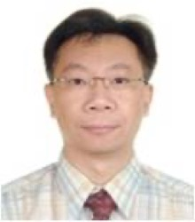
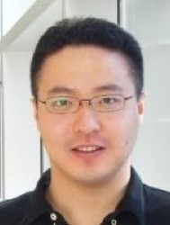
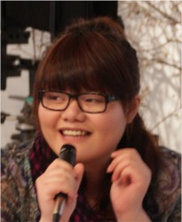
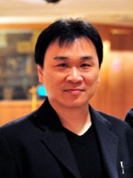
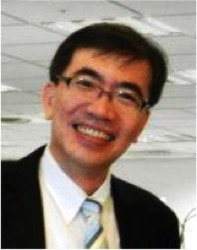
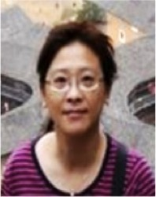
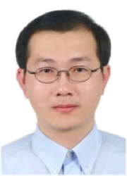

## 源起

產官學都投入大量資源在人才培育，但在校所學與產業所需依然相差甚遠。生技人都知道各式各樣的職涯相關課程與實習機會，但因規模與資源有限，這類訓練可能無法讓參與者得到更廣且深的視野與思維。Connectome 相信最好的教練絕對來自產業第一線。

## 目的

Connectome 菁英育成計劃，是為了生技產業人才培育所設計的最新計畫，期待引入更完整產業先前輩們的見解與經驗，為台灣生技產業培育具有跨界能力視野的潛力領袖！藉由 Connectome 菁英育成計劃我們期待成為一個起點，協助培養業界所需人才，透過長期經營，成為改善台灣生技環境的推手。

## 簡介

生技產業的發展漸漸成熟，業者對於人才培育的投入也日漸提高，Connectome 有幸在這段時間內得到多位充滿指導熱誠的前輩認同，藉由菁英育成計畫，Connectome 團隊成員能夠與這些前輩近距離接觸，藉由產業工作坊與專案執行、實例探討讓團隊成員得以面對面地請教並吸收業界第一手資訊與經驗分享，也連帶建立雙方的認識與互信，讓育成計畫不只是學習的平台，更是展現自我的舞台！ Connectome 菁英育成計畫，是我們為了培育生技人才而創造的計畫。第一屆活動的試辦將限定於團隊成員，若您也希望從現有學習環境與資源中突破，並積極的投入改變現況，敬請您注意 Connectome 招募訊息，成為我們的一員與 Connectome 一夥努力，一同分享，一起成長！

## 業師名單

**Connectome 感謝以下諸位業師們的用心 及 熱情！**

****

**張志榮先生**(CJ Chang)，台大有機化學博士，台大藥學所博士後研究，美國華盛頓大學商學院修習智財技轉及投資課程結業。累積近20年生技製藥領域研發及商務技轉授權與專案管理經驗，曾任中化合成生技公司合成研究所主任，太景生物科技公司專案經理，台灣東洋製藥協理，現任台康生技副總。專長為癌症領域新產品評估開發、生技藥物發展策略規畫與價值鏈的連結、商務技轉與新產品與技術之市場趨勢分析。工作及生活皆秉持：「相信， 盼望，堅持及努力」。人生座右銘：「愛是一輩子最重要的動力，光和鹽使人生更有味。」

. ****

**馬達偉先生** (David Ma)，熱情率真的生物醫學博士。在美讀書時與同學共同創立了 Bio-Entrepreneurship  Core 學生社團 (BEC)，從此開展生物創業的旅程。之前任職於中研院育成中心，致力於推動年輕人科技創業與人才價值提升培訓。除了創立、策劃與執行 ASCENT 系列活動與訓練外，更努力地與其他領域的創業青年架構台灣的創業生態系。2012 年間，協同許多跨領域的優秀伙伴，共同創立 Startup    Leadership Program (SLP) Taipei 與執行相關的培訓課程。目前任職於基亞生技，負責商業開發、投資評估與國際合作。夢想之一就是建構出一個能讓台灣青年勇於作夢、逐夢的環境。

. 

**黃嬿倫小姐**，陽明生化所碩士，全福生物科技（BRIM Biotechnology Inc.）營運暨專案管理處長。「總跟著自己的心走，不盲從。在人生重要階段做出對的選擇。」紮實的實驗室訓練以及智財專業，配合絕佳的整合溝通能力，協助團隊執行多個新藥與學名藥研發專案。抱持著人生要不斷為自己找樂子的座右銘，走遍世界各地，看遍美景，吃遍美食，集滿所有的世界文化遺產與古蹟是也人生目標之一。

. 

**何愈先生**，成大化學所博士，現任藥華醫藥品管及分析部門處長。曾在中研院分生所及化學所擔任博士後研究工作，之後加入國科會千里馬計畫，在法國IGBMC institute進行重組蛋白質用之細菌發酵系統的改良及 NMR 在系統生物學上的研究。何博士專精於蛋白質工程，回國後隨即在藥華醫藥擔任資深研究員，負責蛋白質生產工廠之籌設，並順利於今年內進入營運生產階段。何博士座右銘: " Maintain flexibility and focus on reaching goal; Keep your undying passion on your interest, possibly fueled by updated knowledge and successful cases; Determined mindset."

. 

**鄢澤生先生**，台大藥學系畢，後獲得台大藥理所碩士、台大 EMBA 碩士，現任美商默沙東新產品暨藥價策略經理。曾任職國產開發藥廠及外商新藥研發及策略規畫工作。專長為新產品評估，臨床試驗規畫及藥價策略。

. 

**江雅鈴小姐**，台大農化系、台大農化所畢業，喜歡於實務中研究，於研究中應用。利用工作之餘進修取得政大智財所碩士、輔大學士後法律系學士，現任基亞生技智財暨法務經理。曾於生技公司從事研發工作三年，於基亞公司從事智慧財產與法務工作九年，參與過基亞公司上櫃法律事務、多件訴訟案與合作案，專長為生技產業的智慧財產分析、規劃、管理與法律實務。

.. 

**吳啟裕先生**，台灣大學化學系學士、台灣大學生化科學所碩士、陽明大學生物化學所博士，前中央研究院研究人員 (10年) 。歷經國內中小企業生技公司產品經理、技術長、董事長特助、顧問、總經理、董事長等職位，具備產品行銷、銷售、研發、品質系統、實驗室認證、公開募資等跨領域豐富實務經驗。個性喜好挑戰，特別有興趣於有心要走入國際生技產業的台灣生技中小企業，將具有高潛力的台灣生技中小企業的灰姑娘本質發揮出來，進而蛻變為受人注目的白雪公主，實現台灣生技產業『立足台灣、走向國際』的心願。 .

Connectome 菁英育成計畫專案小組 敬上
