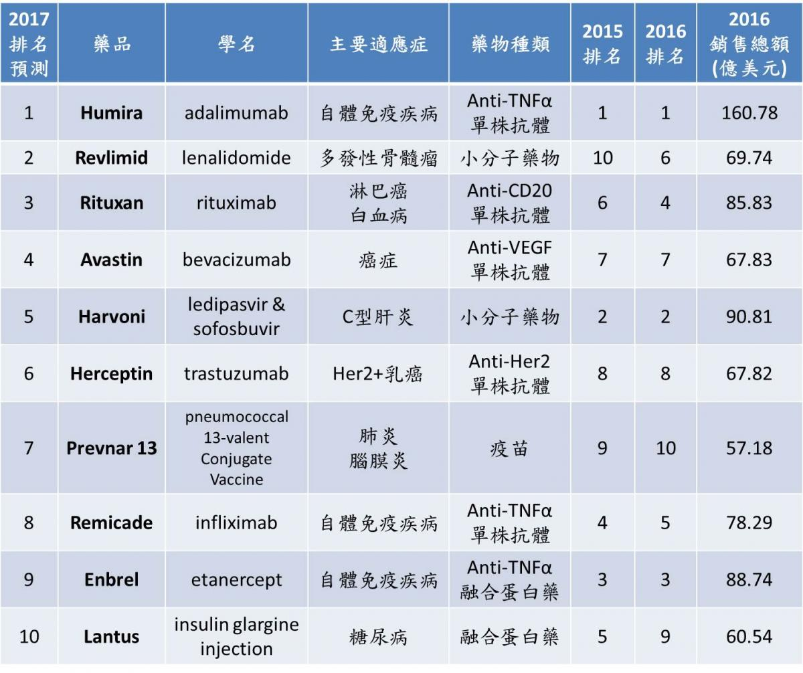

首先看到 Avastin、Herceptin 及 Prevnar13 的排名較2016年上升，倒不是因為的銷售額的增長，而是受到原本排名3-5名的Remicade、Enbrel 及 Lantus皆藥品專利到期、新藥、相似藥的陸續出現被預期競爭力不如以往所致。排名第五的 Harvoni 也在新藥和其他 C 肝藥物的競爭下被預期銷售總額將會降低 20 億美元。接下就由 Connectome 繼續來介紹這些暢銷藥物的藥效與藥物市場變化趨勢。

**4. Avastin**

學名：bevacizumab

公司：Roche (Genentech)

適應症：卵巢癌、子宮頸癌、結腸直腸癌、Her2- 乳癌、腎細胞癌、膠質母細胞瘤、非小細胞肺癌 (NSCLC)

2004 年 Avastin 經美國 FDA 批准做為轉移性結腸直腸癌的第一線用藥，也是第一個預防血管新生的藥物。於 2005 年通過 TFDA核准在台灣上市，健保於 2012 年開始給付結腸直腸癌及神經膠母細胞瘤。Avastin 主要是透過與血管內皮生長因子 (VEGF) 結合抑制血管新生，使癌細胞無法經由血管增生獲取生長必須的養分，達到抑制癌細胞生長的效果，且能有效抑制腫瘤透過新生的血管轉移至其他器官。同時，Avastin 能使血管正常化增加化療藥物毒殺腫瘤的能力，在臨床 Avastin 能搭配化療藥物治療多種癌症，並有效增加病患的整體存活率、中位無病存活率。

Avastin 的適應症種類廣泛，從 2013 年開始每年銷售額均可達 60 億美元以上。Avastin 的 2016 銷售總額為 67.83 億美元，年增率 1 %。根據 EP Vantage 預測，2017 年 Avastin 的銷售依舊能穩定。然而，近年來新藥及免疫療法的迅速發展勢必會對未來的銷售量造成一定的影響。Avastin 在美國的專利將於 2019 年到期，歐洲專利亦將於 2020 年到期。目前已經有六間廠商在進行Phase III的臨床試驗，台灣的永昕醫藥也有Avastin相似藥的計畫，目前由 Roche 所獨佔 Avastin 的 67 億美元市場大餅即將面臨眾家廠商的瓜分。

**5. Harvoni**

學名：Ledipasvir + Ledipasvir

公司：Gilead

適應症：C 型肝炎 (HCV) 1.4.5.6 基因型

2014 年美國 FDA 核准 Harvoni 上市，2015 年底通過台灣 TFDA 核准，但僅核准 C 型肝炎第 1 型病患使用，且無健保給付。Harvoni 為固定劑量的複方口服藥物內含 Ledipasvir 90 mg + Ledipasvir 400 mg 的抗病毒藥物 (direct-acting antiviral, DAA)，相較於傳統的干擾素 (Interferon) 療法，Harvoni 不但有更好的療效，還有較低的副作用及不需至醫院注射的優點。Harvoni 中的 Ledipasvir 為HCV NS5A蛋白抑制劑，可以抑制病毒複製中必須的 NS5A 磷蛋白；Sofosbuvir 為一種前驅藥物 (prodrug)，經過肝臟代謝成為 NS5B RNA 聚合酶抑制劑，進而影響病毒複製過程，兩種藥物共同作用達到減低病毒量的效果。在臨床三期的治療中，初次接受藥物治療的病患接受治療 8 至 12 週後，停藥後 12 週病患的持續病毒學反應 (SVR 12) (註) 可達到超過95%的良好療效，且沒有嚴重的副作用出現。

Harvoni 在 C 肝的治療中有著良好的療效及低副作用的優點，但也伴隨著高額的藥價，一顆藥錠要價台幣 3.4 萬，12 周療程治療高達接近 300 萬。Harvoni 在 2016 年有著 90.81 億美元的銷售，但相對於 2015 年的 138.64 億美元銷售額下降了 65%，根據 EP Vantge 預測，2017 年的銷售額將會再降至 70 億美元。主要原因是 Gilead 公司在 2016 年中推出了一款可應用於 C 型肝炎基因型 1-6 型的新藥，其次是受到 AbbVie 及 Merck 所打出的價格戰影響。 Harvoni 相關的專利最晚至 2030 年才會全數到期，短期內不會受到學名藥的影響。

(註) SVR12/24 (sustained virological response12/24)：治療結束後，第 12/24 周 HCV RNA 無法測得病毒反應（高精度檢測），持續病毒學反應達到 SVR24 後，那麼遠期復發率極低 (<1%)。

**6. Herceptin**

學名：Trastuzumab

公司：Roche (Genentech)

適應症：Her2+乳癌、Her2+ 胃癌 (GC)、Her2+ 胃食管結腺癌 (GE)

1998 年 Herceptin 經美國 FDA 核准上市，被視為 Her2+ 乳癌治療的重大突破，並成為 Her2+ 乳癌的第一線治療藥物。2000年底，TFDA核准在台灣上市，台灣健保於2006年開始給付。Herceptin 為人類上皮生長因子接受器第 2 蛋白 (Her2) 的抑制劑，透過結合乳癌細胞上過度表現的 Her2 蛋白來抑制腫瘤生長，並透過啟動抗體依賴性的細胞毒性反應 (Antibody-dependent cell-mediated cytotoxicity, ADCC) 來毒殺腫瘤細胞達到抗癌的效果。Herceptin經過臨床試驗證實能延緩腫瘤復發、增加無病存活率及整體存活率。

在乳癌的病人中有 20-25% 屬於 Her2+，Herceptin 的良好療效在 2016 年為 Roche 帶來了 67.82 億美元的商機，年增率 4%。根據 EP Vantge 預測，2017 年銷售依舊能有小幅成長至 69 億美元左右，但 Herceptin 的市場已經過了巔峰期，並且也受到 Roche 公司的 Perjeta 和 Kadcyla (進階版的 Herceptin) 上市影響。Herceptin 的專利在美國已於 2015 年到期。目前已有許多廠商完成 Trastuzumab 生物相似藥 Phase III 臨床試驗的相似藥在世界各國上市。台灣的台康生技也在進行 Phase I 的臨床試驗。Trastuzumab 生物相似藥的競爭將會十分精采。

**7. Prevnar13**

學名：Pneumococcal 13-valent conjugate vaccine

公司：Pfizer

適應症：預防 13 種肺炎鏈球菌血清型造成的感染 (1, 3, 4, 5, 6A, 6B, 7F, 9V, 14, 18C, 19A, 19F, and 23F)

2010 年 Prevnar13 經美國 FDA 核准上市，2011 年通過 TFDA 核准在台灣上市，並於 2013 年開始提供幼兒施打公費疫苗。Prevnar13 含有肺炎鏈球菌的莢膜多醣抗原，透過 T 淋巴球的免疫反應刺激 B 淋巴球成熟產生抗體及記憶性 B 淋巴球。Prevnar13 可以大幅降低因肺炎侵襲感染的比率，並提供 95% 以上的保護力。

Prevnar13 是世界上使用最廣泛的肺炎鏈球菌結合疫苗、並被納入 102 個國家的兒科國家免疫計畫，更在 2016 年成為唯一批准用在 18-49 歲的成人肺炎鏈球菌疫苗，如此廣大的市場使的 Prevnar13 在 2016 年創造了 57.18 億美元的銷售額，但相較於 2015 下降了9%，被認為主要原因是 2014 年底美國 CDC 建議 65 歲以上成人施打，多數的老年民眾於 2015 年已經施打完畢以及政府採購數量減少，導致今年的銷售下降。根據 EP Vantge 預測，2017 年銷售額依舊能維持高檔，且隨著高齡人口增加，相信 Prevnar13 的未來依舊能提供 Pfizer 穩定的銷售保證。

**下集預告**

下集將會看到專利過期對於藥物市場造成的衝擊。讓我們一起來看第8.9名的自體免疫疾病用藥 Remicade 及 Enbrel 過去的輝煌紀錄及胰島素藥物 Lantus 如何在競爭激烈的糖尿病藥物市場稱霸並長期占據十大暢銷藥物。敬請期待下回分曉。

以上資料接透過網路搜尋整理，如果有任何問題，還請不吝告知。
