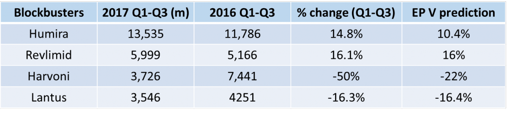

參考資料： GEN The Top 15 Best-Selling Drugs of 2016

<http://www.genengnews.com/the-lists/the-top-15-best-selling-drugs-of-2016/77900868>

（註）根據 EP Vantage 做的 2017 排名預測中，Remicade 與 Enbrel 的銷售額僅針對 “原公司 (J&J 及 Amgen)” 的銷售額預測排名；而2015、2016 的排名是依照 J&J 加 Merck、Amgen 加 Pfizer 的全球藥物銷售總額做評比，因此 Remicade 與 Enbrel 才會掉至第 8、9名。

**8. Remicade**

學名：Infiliximab

公司：Johnson & Johnson, Merck

適應症： 類風溼性關節炎 (RA), 牛皮癬關節炎 (PA), 潰瘍性結腸癌 (UC), 克隆式症 (CD), 僵直性脊椎炎 (AS)。

     1998 年 Remicade 經美國 FDA 批准為克隆式症用藥，而後陸續批准應用於多種自體免疫疾病，是最早上市的 TNFα 抗體藥物 (台灣並未核准上市)。Remicade 是腫瘤壞死因子α (Tumor Necrosis Factor α；TNFα ) 抑制劑，透過中和疾病區過度的發炎反應來治療疾病，且經過治療的病患能迅速緩解發炎反應。臨床上與 methotrexate 合併使用，可達到最好的治療效果與最低的副作用。TNFα 抑制劑藥物為已上市藥物中治療自體免疫疾病最成功的例子。

    Remicade適應症種類多，加上病患多需長期治療，因此市場廣大。從上市以來一直有著極高的銷售額僅次於 Humira，並與 Enbrel 不相上下。在 2014 年達銷售高峰 92.4 億美元。然而，隨著歐洲專利在 2014 年到期，目前已經有三種 Remicade 生物相似藥在歐洲上市。Remicade 銷售總額逐年下降到 2016 年的 $78.29 億美元 (J&J+Merck)。2017 年從 J&J 第三季報告中，Remicade Q1-Q3 總銷售額與去年相比，在全球市場僅降低 5.9% 的銷售額，但 Merck 的銷售市場在歐洲受到生物相似藥的影響 2017 Q1-Q3下降了34% 銷售額。

    美國 FDA 於 2016 年批准輝瑞子公司 Hospira 的 Inflectra。在 2017 年批准 Bioepis（三星生物技術公司）所開發的相似藥 Renflexis。隨著 Remicade 在美國的專利在 2018 即將到期，其市占率將會隨著生物相似藥的出現逐年降低。J&J 透過與專利訴訟與降價策略維持市場銷售，加上其認為穩定的病人不會輕易轉換，因此對美國 Remicade 的市場份額有信心。

*Remicade 2016 sales: $7.829 billion ($6.561 billion J&J + $1.268 billion Merck)

**9. Enbrel**

學名：Etanercept

公司：Amgen and Pfizer

### 適應症：類風溼性關節炎(RA), 幼年型特發性關節炎(Polyarticular JIA)、 牛皮癬關節炎(PA)、僵直性脊椎炎(AS)、 斑塊性牛皮癬(PP)

    1998 年 Etanercept 經美國 FDA 批准治療類風溼性關節炎，而後陸續批准多種自體免疫疾病，是緊接著 Remiacade 之後上市的腫瘤壞死因子 (TNFα) 抑制劑。台灣健保 2002 年通過衛生署許可，2003 年，健保有條件給付，為台灣第一個上市的生物製劑。Etanercept（Enbrel）為第二型腫瘤壞死因子受器（Tumor Necrosis Factor Receptor 2；TNFR2）與人類免疫球蛋白G1 (IgG1)之 Fc 部份，組合而成的融合蛋白。透過腫瘤壞死因子受器 (TNFR2) 結合疾病區域過度表現的發炎因子 TNFα 與 TNFβ 降低發炎反應，有效的治療自體免疫疾病。

    Enbrel 與 Humira 和 Remicade 同為 TNFα 抑制劑，三者瓜分了大部分的自體免疫疾病市場。2016 年三個藥物總銷售額高達 327.8 億美元。而 Enbrel 從 2012 年開始銷售額維持在 80 億美元以上且不斷成長，即便 2015 年歐洲的專利過期，2015 到 2016 年銷售額還有 1% 的增長至 88.7 億美元銷售額。直到 2017Q1 開始衰退，Q1-Q3 Enbrel 在 Amgen 的銷售額平均下降了 7.7%，Pfizer 受歐洲市場上的生物相似藥影響下降了 13%。在 2016 年Bioepis（三星生物技術公司）的Enbrel的相似藥 Benepali 在歐洲的上市，2017 年諾華底下 Sandoz 生物相似藥廠開發的相似藥 Erelzi 上市，且市場上還有相同適應症的 Infliximab 生物相似藥，Enbrel 專利過期的衝擊正在影響的歐洲市場；Enbrel 在美國的專利在 Amgen 的努力下延長至 2028 年，即便如此 Sandoz 的 Erelzi 早在 2016 年就獲的美國 FDA 批准，等到專利時間或官司結束就會進入市場，屆時將會是生物相似藥的天下。

* $8.874 billion ($5.965 billion Amgen + $2.909 billion Pfizer)

**10. Lantus **

學名：Insulin glargine

公司：Sanofi

適應症：第1型糖尿病、第2型糖尿病

    2000 年 Lantus 獲美國 FDA 許可治療對於患有1型糖尿病的成年人和兒童，或必須使用胰島素控制高血糖的2型糖尿病的成人，2002 年在台灣上市。長效型胰島素 (insulin glargine) 是一種透過基因重組技術的製造的長效型人體胰島素類似物，使其經注射入人體皮下組織後，在注射部位維持平穩的吸收速率，作用時間可持續 24 小時，因此符合人體基礎胰島素之需求。Lantus 應用在無法分泌足夠胰島素的1型糖尿病患者或第2型糖尿病中無法透過口服藥物有效控制細胞對胰島素產生抗性 (insulin resistance) 的時合併 Lantus 使用，透過緩慢釋放胰島素穩定病患血糖濃度。

    糖尿病是現代的流行病，國際糖尿病聯盟 (International Diabetes Federation, IDF)的統計，2015年全球約有四億一千五百萬人，台灣國民健康署統計，全國約有 200 多萬名糖尿病的病友，糖尿病及其所引發的併發症嚴重影響病患生活並且需要龐大的醫療費用。長效胰島素 Lantus 一天僅需施打一次提供病患更加的升品質，Lantus 幾乎是全球市佔率與銷售額最高的胰島素藥物，在 2003 年銷售額就高達 5.51 億美元，在 2014 年達銷售高峰 8.5 億美元。Lantus 在 2016 年 (-10.6%) 及 2017年 (前半年-15.3%) 市場萎縮主要的兩個原因：(1) Lantus 美國專利在 2015 年到期，從 2015 開始 Sanofi 開始推行 Lantus 高劑量版本「Toujeo」。相較於傳統胰島素，其低血糖發生率略低，也因注射體積減少 1/3 比較不容易發生注射時的不適問題，在 2015 Q4 就達到 9 千 8 百萬歐元的成績。2016 全年成長 295.7%。2017 前半年又比 2016增加 64.8%。這款新藥也在 2016 取得台灣的許可。(2) 在 2015 年 12 月美國 FDA 批准 Eli Lilly 推出與 Lantus 相似的藥物 Basaglar，另外三星生物技術公司（Bioepis）也在開發 Lantus 生物仿製藥。即便 Sanofi 推出新藥 Toujeo，仍然不足以彌補相似藥造成的影響，龐大的長效胰島素市場也開始進入生物相似藥的時代。

**點評EP Vantage預測與現況**

根據 EP Vantage 預測 2017 年 Humira 與 Relimid 在 2017 年銷售額仍然會繼續上漲，Harvoni 與 Lantus 將會有明顯的衰退，其餘藥物皆不會有太大變動。可以從以下表格中看到2017 Q1-Q3 累積的銷售額與 EP Vantage 預測變化做比較。

**結語**

    越來越多的暢銷藥物開始面臨專利懸崖，許多生物相似藥已經蓄勢待發，對於藥商生物相似藥造成的影響將會越來越巨大，尤其是生物相似藥法規發展快速的歐洲及專利法較不嚴格的國家，但另一方面透過生物相似藥的上市可為各個國家節省非常多的醫療資源，提供病人相對低價且具有相似療效的藥物。
