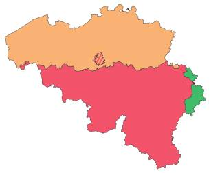
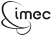
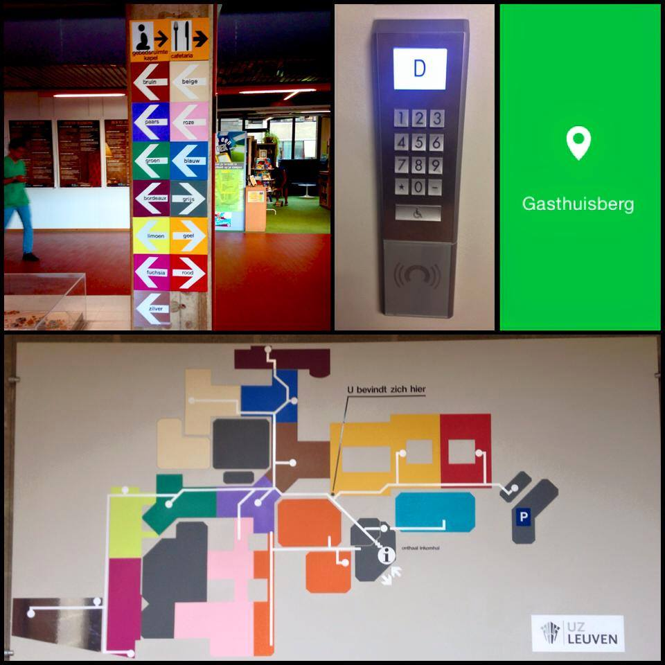
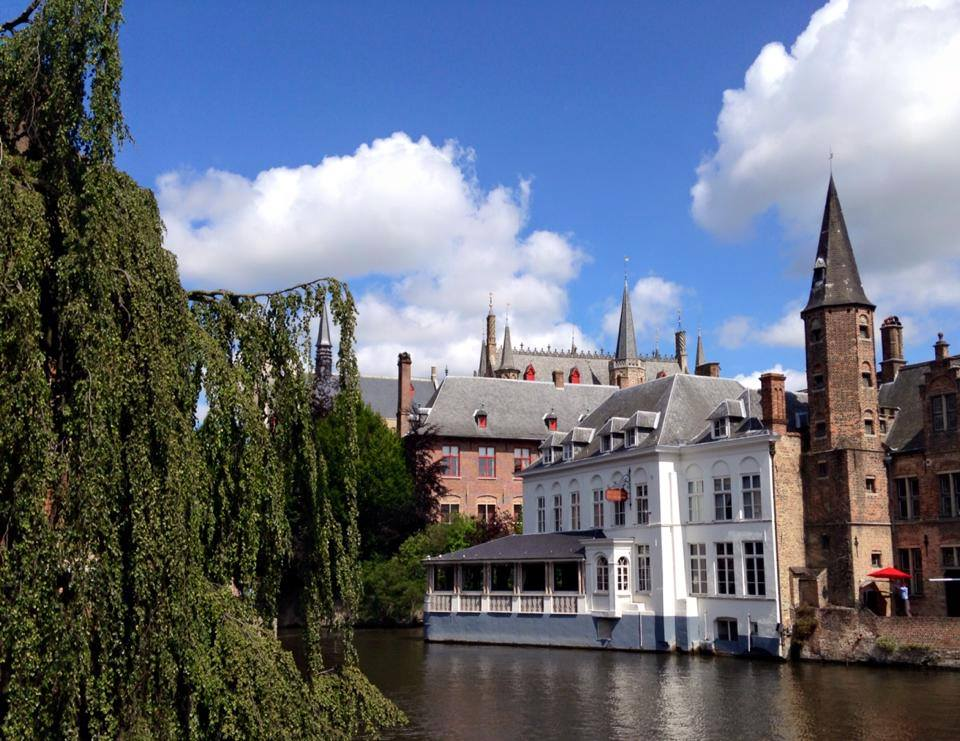

[<DSC_0997](http://www.flickr.com/photos/97648218@N08/9646819294) via [photopin](http://photopin.com/) [(license)>](https://creativecommons.org/licenses/by/2.0/)

最近調查朋友們對比利時何種資訊最感興趣，大致上分兩類：

（一）學術：研究強項、經費來源與年限、學術工作環境（職缺、薪資待遇、休假、福利）和台灣/美國有什麼不一樣？

（二）生活：美食旅遊文化、醫療治安、薪資與收支平衡、配偶工作機會及小孩教育。

接下來就分享我搜集到資訊給大家參考~

## 比利時地域

橘色為法蘭德自治區（荷語），也是此文主要描述對象；紅色為法語區；綠色為德語區。斜線區域是首都布魯塞爾，魯汶（Leuven）在其火車15分鐘車程往東，是本篇的主要描述的地區。

## 科研[註1]

比利時法蘭德自治區（Flanders）位於北部，屬荷語區，占全國總面積44.8%，GDP 占全國逾八成。首都布魯塞爾也位於法蘭德斯境內，是歐盟和北約等一千個重要國際組織，以及二千多家跨國公司的總部所在地。全歐洲 60%的採購活動發生在布魯塞爾周圍的600公里之內，區內的安特衛普是歐洲第二大港。由於地理位置關係，這裡的人們具備多語言能力荷、法、德、英四語，而且對不同文化採取開放態度。這些人力特質在區內各高科技研發機構也很常見。以魯汶 （Leuven）、根特（Ghent）等幾家大學和多個策略性研究中心，包括  imec、VIB 主導串聯的研發單位，也吸引全球高科技人才匯入。[註2]

**微電子領域**[註3]

台灣的交大和 imec 簽締合作條約行之有年，電子、資訊領域者對此單位應不陌生。它也是與美國 NIH、日本 RIKEN、德國 Juelich 並列為科技部 5 大特定研究機構補助項目之一。有招收博士班與博士後研究人員，畢業校友包含交大宋開泰教授、李鎮宜教授、成大高國興教授、臺大劉宗德助理教授等。此單位被 譽為台積電、英特爾、三星背後的重要腦袋，它也是全球最大的獨立微電子研發機構，每年可創造近三億歐元營收，以研發、先進製造及軟體、IP 等利基型產品 見長。

**(Vlaams Instituut voor Biotechnologie) 生物科技領域**

VIB 科研策略長 Dr. Lieve Ongena 才在上個月來台灣招募人才！VIB 和許多大學合作密切，與根特大學的合作偏植物與微生物，與魯汶大學的合作偏生物醫學，其中神經科學為重點科目。在 此先約略分享我未來老闆 Bart De Strooper （more than 30455 citations and h-index 94）的研究環境：Bart 是其中生物疾病部門的主要負責人，實驗室規模約 40-50 人，包含了17位技師、6-8位常任職的科學家（由工作數年的 postdoc 轉任）、16 位 postdoc、10 位博士生及 2 位行政助理。學術產值每年約 1-3 篇 CNS 文章加上 4-8 篇其他期刊文章。除此之外，透過與其部門之多位老師和 core facility 的合作關係，有豐富資源可應用。而在國際學術上最麻吉的大概就屬 Harvard Medical School、Dennis J. Selkoe，兩位都是阿滋海默症領域的神級人物。實驗室裡有 Selkoe 教授博士班畢業後過來做博士後研究的，也有這裡博士後結束到 Selkoe 那裡繼續做研究的，Bart 跟 Selkoe 兩人的友好度從此處就能了解。此外，在實地走訪後覺得設備、技術、題材新穎度及研究人員等資源是我完全沒看過的，這也是為什麼我二話不說立刻放棄另外兩個在德國的工作機會！

**魯汶醫院**

比利時最大醫院，當地人都說是歐洲前五大或荷比盧最大醫院， 說要去魯汶會以為是要去看病的。這在考證上有一定難度，但從 World Hospital Rank 來看，魯汶醫院排名約是世界第 63 大醫院 （Karoliska: 158、慈濟：13、北榮：16、台大：28）。就我實地走訪，醫院跟研究中心是緊密相連的，花了 20 分鐘才在這迷宮中找到實驗室。

**魯汶大學 KU Leuven**

世界排名第 30-70 位（曾高於倫敦政經學院及美國 UCSD）、歐洲第六位、比利時第一位（說實在這種排名都看次領域，我實在很不愛這種排名）。

## 經費

主要是看領域和老闆。以我的狀況來說，在 Bart 實驗室只要他願意收你，他就會先讓你跑人事室承諾由他計劃經費給予你薪資；而若你本身狀況符合自己去申請計劃的資格，他也會樂意協助你去申請自己的經費，資格通常是尚未在非本國籍的 host lab （以我的狀況就是 Bart’s lab）待超過半年，且有第一作者發表。符合資格就可以寫計劃申請國際經費（EMBO, Marie Curie, HFSP 同稱三大 fellowships）。若拿到計畫經費，不僅能幫老闆省錢，對自己的 CV 有幫助，計畫所帶給你的薪水也會比 一 般價碼更高！

## 文化

相信很多人選擇歐洲深造而非美國是文化因素。比 利時觀光局將觀光客集中在首都尿尿小童（太慘了，千萬別去）和布魯日（很美但很觀光客）。其實比利時還有非常多世界文化遺產。建築古蹟類雖比不過德法，但 精神上的文化遺產（類似具歷史意義的慶典活動）卻遠遠超出德法(比：12、 德法：0、 義：6)，然而這些俱有深度意義的文化遺產往往不是觀光客所能理解的。除簡章多半以當地語言存在外，觀光局也並沒有要推廣的意思。據當地人說法，是因為光 是消化本國人就已消化不完了！另外，巧克力 (如 GODIVA)、鬆餅、啤酒、淡菜、鑽石、蕾絲以及 112 家米其林餐廳（世界密度第三高的國家）也是遊客們的最愛！

## 生活

魯汶提供許多研究機會，距離首都布魯塞爾約 15 分鐘車程，是個嬌小的大學城，直徑大約 40 分鐘可步行完畢。各項生活資訊可查 [**Numbeo**](http://www.numbeo.com/common/)。

**(1) 語言：**比利時北部（包含魯汶）是荷語區、南部是法語區、東部一小塊有德語區。做研究只需要英文而在魯汶生活英文都通，跟臨床相關則需當地語言。

**(2) 保險：**工作念書的單位會自動向保險公司繳健保費，每年只需要額外繳 90 歐元即可享受大多的醫療服務。而看每個工作單位的狀況，項目會有所增減，好比說 KU Leuven 另外提供住院免費以及孩子的健保服務。

**(3) 稅收：**KU Leuven 的薪資無需另外繳稅，若你是申請獎學金當然也是不用繳稅。若是拿當地的工作合約，則須額外繳稅，但會有更多福利和退休保障。

**(4) 交通補助：**KU Leuven 提供公車火車腳踏車免費但沒有提供汽車。

**(5) 年假：**除了週末和一堆聖人國定假日，會有三十天的強制休假。就我接洽過的人每隔一兩個月就在度假。

**(6) 治安：**魯汶很小，治安可能比台北市還好，但首都布魯塞爾就很差（還是比美國很多城市好），晚上別自己一人去。

**(7) 物價：**跟荷蘭差不多，比德國貴，近台灣兩倍。

**(8) 薪資：**依領域有所不同，平均每月稅後 1860 歐。博士後第一年每月稅後 2500 歐；醫生依據不同統計資料為世界排名第一名（27.8萬歐年收 [註6]）或第四名（18.8萬歐年收 [註7]）。

**(9) 家庭觀念：**重視家庭生活，不介意裙帶關係，若他們很喜歡你的話會協助你的配偶找工作。

**(10) 教育：**15 歲以前公立學校免費（外國人也是）。幼稚園時間彈性從早上七點到晚上七點都可接送，但不建議將孩子放在學校超過八小時。魯汶教荷語，10 歲開始教法語，不會教英文德文，但荷文流利的基本上德文都聽得懂。魯汶有很多外國人，所以不用擔心孩子在學校會顯得特別奇怪。

若資訊有錯誤請不吝指正 謝謝!

--

###### 參考資料：

###### 1.Flanders Smart Hub  <http://www.flanderssmarthub.be/international/#hubs>

###### 2.林含笑(2011) 吸引台商投資高科技研發 比利時法蘭德斯頻招手  <http://www.mem.com.tw/article_content.asp?sn=1111020007>

###### 3.曠文琪(2011) 商業週刊 第1246期 直擊！台積電、三星的比利時頭腦

###### 4.UNESCO World Heritage List <http://whc.unesco.org/en/list/>

###### 5.UNESCO Elements on the Lists of Intangible Cultural Heritage  <http://www.unesco.org/culture/ich/index.php?lg=en&pg=00311&topic=mp&cp=BE>

###### 6. Sergio Arboledas(2015)13 highest paying countries for doctors <http://medicfootprints.org/blog/13-highest-paying-countries-doctors>

###### 7.Egyptian Doctor(2014) 15 Highest Paying Countries for Doctors <http://forum.facmedicine.com/threads/15-highest-paying-countries-for-doctors.19288/>

——

撰稿者：將帶著自己四歲孩子和老公一起去比利時生活的三十歲土博媽媽！

編輯者： Connectome 團隊 鄭傑仁
