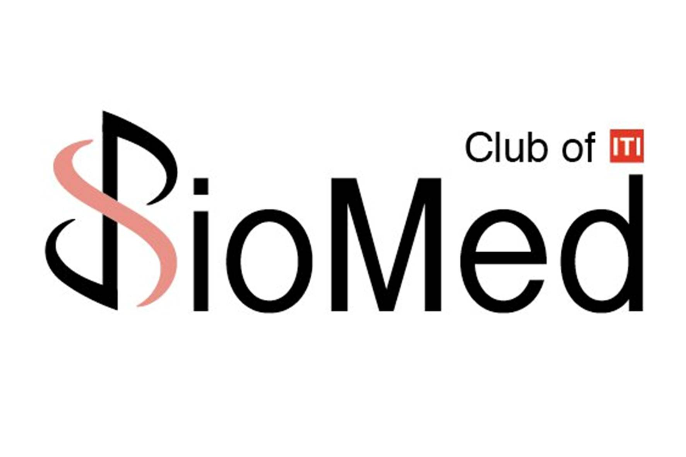
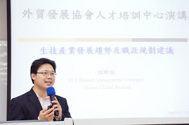

**BioMedITI**[部落格](http://biomediti.blogspot.tw/ "BioMedITI, Club of ITI") 以下轉載自 [生技產業發展趨勢及職涯規劃建議](http://biomediti.blogspot.tw/2012/07/blog-post.html) .

活動中林協理簡單地介紹上智生技創投/上騰生技顧問係為永豐餘集團旗下的生技創投公司，其工作內容需隨時留意產業狀況、閱覽各種分析報告及審核投資計畫書，以從中篩選出具有淺力的生技新星並予以資金的挹注及專業上的協助。  林協理提到，台灣的創投 VC (Venture Capital) 其實比較接近私募基金的作法，傾向於投資較為成熟的企業，只有少數的創投會進行早期新創公司的投資。同時，亦打趣的提到創業就從三個F (Family、Friends, and Fools) 取得資金來源，而好的口才可以幫上不少忙。 .

## **生技產業發展趨勢**

相較歐美等國將生技產業劃分為醫療照護、農業及生質能源三大領域，台灣主要將生技產業化分為[製藥](/industry/製藥/)、新興生技與[醫療器材](/industry/醫材/)三大部分。林協理提到以製藥產業而言，在台灣並無明顯的上、中 及下游之分，從就業觀點而言，如果從事藥品代理銷售及通路其未來發展較易受侷限；而在醫療器材產業部分，在台灣市場已經超過製藥產業，其規模也會越來越大，因為電子和半導體產業的轉型，使得醫療器材產業未來深具潛力。 由證交所所提供的醫療器材產業鏈架構來看，台灣之上游廠商利潤普遍偏低，而下游 (特別是從事銷售工作) 的獲利也會跟著減少，相對得就業的風險相對高，中游是目前台灣醫療器材產業求職的較佳選擇，而在產品別部分光學及生物檢測器材 (技術) 較具發展潛力，林協理提到從事醫療器材領域的工作，必須尋找創新的產品及技術、並瞭解真正的unmet need，才可以讓價值提升、使得價格可以提高。此外，在食品生技領域部分，其商業模式為仰賴明星產品提高知名度，因此仰賴具國際貿易、銷售背景的人才，不失為對生技產業有興趣的新鮮人的一個就業方向。 .

## **職涯建議**

林協理提到台灣生技產業就業市場的特性是員工流動率低，人才較為被重視，如果同學有志朝此一領域發展，可以從具有高度進入障礙 (不論是所處產業或本身擁 有得能力/技術) 的公司投入，此外以技術授權為主要獲利來源的公司也是同學們就職時較佳的選擇，而如果擔心自己為非相關背景而發展容易受限的同學，也可以選擇能提供較為完整系統的財團法人生技中心及工研院生醫相關系所作為進入生技產業的敲門磚。林協理亦提及找一間好公司最容易的方法是搜尋商業司的公司登記，了解其董事會組成 (由此可知其資金來源充足與否) 及董事背景 (推估公司的經營良窳)。 就業產業別部分，林協理特別看好**蛋白質藥物、[癌症治療](/search/?q=癌症)、[藥物輸遞](/posts/tlc-taiwan-liposome-company-rd-opertations/ "延伸閱讀: 台灣微脂體研發與營運概述")**、眼科相關的技術/產品。而在職能別部分，QA (Quality Assurance)、QC (Quality Control)及臨床法規/試驗等相關人才需求有缺口，儘管事前準備且前三年較為辛苦但前景甚佳，有經驗的 QA 或 QC 人員的起薪 (年薪) 是兩百萬至三百萬新台幣不等，然而非相關科系的同學可能會發現以 QA 或 QC 作為生技產業職涯規劃的入門磚或跳板有相當的難度，因此，林協理建議，如果具商業/財經學習背景，可從產業分析師及[顧問](/job_function/顧問/)等工作著手，前提是必須具備市場敏銳度、數字分析能力等。

林協理有非常豐富及深入的學習、活動 (競賽) 及工作經驗，他分享了他的人生、職涯哲學如下：

1. **Passion**，具有熱情是非常重要的且要相信自己一定可 以做得到，協理說：**「有些事現在不做，一輩子都不會做了。」**
2. **Dream Big**，有夢想才有目標，有目標才有前進的動力。
3. **Humanity Driven**，從人性關懷的角度出發可以讓生命更具意義。
4. **Interdisciplinary**，跨領域的學習能夠更進一步地充實自己。
5. **Have Fun**，從中體驗出樂趣會變得更有動力，當然人生就是要有趣不是嗎?

最後，林協理給新鮮人的建議是盡早建立自己的人脈，爭取和各領域的意見領袖認識、互動，並把握這種典範學習的機會。如果未來自己要成為一個 leader，期許自己可以讓每個夥伴發揮所長的能力，就像串起所有珍珠的那條引線，不要求 自己發光，但是卻可以透過自己整合並讓團對發光發亮。最後，擁有自信與執行力也是邁向成功的不二法門。

* [從數據看臺灣生技就業現況](/posts/biojob-informations-taiwain/ "從數據看臺灣生技就業現況")
* [生技人職場前五問](/posts/biojob-questions/ "生技人職場前五問")

**本文感謝 BioMedITI 同意轉載與分享，若您亦有意願分享您的文章給我們以及 Connectome 的讀者，歡迎主動聯絡我們**
