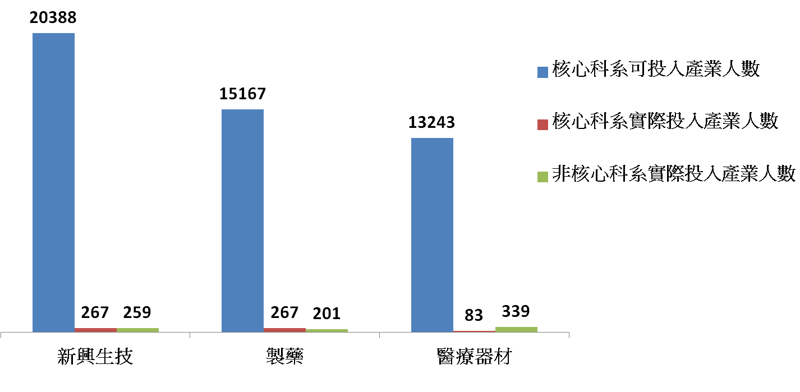
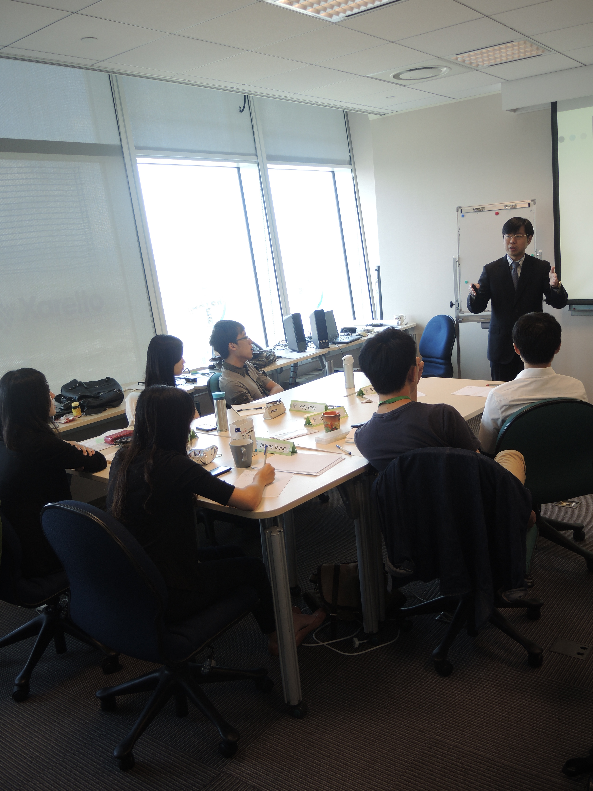

## **產業現況與趨勢**

全球人口正快速走向高齡化，預估 2050 年 65 歲以上的老年人將超過 14.6 億，這使得老年醫療照護及慢性疾病治療的市場逐漸擴張；此外，新興國家藥品的消費需求與日俱增，預計 2014 年全球藥品市場可達 1.1 兆美元；而近年來國際上許多公司經營策略的改變，同時也影響了台灣生技產業未來的發展方向。 由於這幾年台灣生技產業逐漸邁向國際化、中國市場需求增加、消費者導向的特色研發與品牌行銷意識抬頭，以及各國醫療政策調整，促使政府漸漸增加生技製藥/醫藥的計畫預算 (2012 年約 20 億)、推動相關法規與國際接軌，而台灣生技廠商亦積極爭取歐美相關許可、尋求兩岸生技醫藥產業的合作交流，甚至開始創新產品的研發，因而對熟知專利法規、擁有行銷管理能力、以及高階研發人才的需求增加。

## **就業現況及人才供需**

現階段而言，雖然經濟部公布的人才調查與推估結果顯示，截至 2014 年，不論是新興生技、製藥或醫材方面，各種景氣狀況下，基礎人才的供給數量均是**極為充裕**，然而，由於現階段台灣生技產業人才需求以學、碩士為主，對[博士](/posts/phddrug/ "博士藥不藥? – 雷佑甯")人才需求比例較低 (僅需 6 - 8%)，且普遍需要具工作經驗者 (約佔七至八成)，加上實際上各次產業中仍有許多經驗、科系或職能需求不完全符合的人才投入，致使目前生技產業中核心科系 (生農、醫藥等相關科系) 實際投入產業的人數仍遠遠少於核心科系可投入產業的人數 (不及 2%，醫材部分甚至僅有 0.63%，如圖一，產業定義請至[我國生技產業人才供需分析](http://www.bost.ey.gov.tw/Upload/UserFiles/%E5%A0%B1%E5%91%8A%E6%A1%88%EF%BC%9A2.0%E6%88%91%E5%9C%8B%E7%94%9F%E6%8A%80%E7%94%A2%E6%A5%AD%E4%BA%BA%E6%89%8D%E4%BE%9B%E9%9C%80%E5%88%86%E6%9E%90.pdf))。

(圖一) 2012年應屆畢業生投入新興生技產業概況

由經濟部產業報告指出，2012 - 2014 年新興生技由於已具備商業化量產或客戶端服務的能力，因此對行銷/[業務](/posts/sales-rep-customer-relationship-management/ "業務人生 – 如何經營與管理你的客戶")、經營管理等人才的需求漸增；製藥產業由於專利申請及 GMP 作業的推動，亟需法規、品管方面人才，另外，新藥研發或跨國[臨床試驗](/posts/taiwan-clinicaltrail-problem-future/ "臺灣臨床試驗的問題與未來")亦有所成長，因而對中高階研發人才亦有需求；而[醫材](/posts/third-class-medical-equipment/ "淺談第三類醫材的現況與展望 – 林育頡")方面仍著重研發，尤缺跨領域經驗的研發人才，此外，對商管、技轉等能力的跨領域人才亦有需求。 整體而言，目前台灣新興生技的人力需求以食品、農業生技居多，製藥產業的科系需求則以醫藥及化學、化工為主，而醫材方面則對跨足機械、電子的人才需求較大。此外，台灣生技產業的職能需求仍以生產製造為大宗 (佔三至五成)，其次才是行銷/業務、管理或研發 (各約一至二成)。

(圖二) 關鍵職缺及技能需求

## **面臨問題**

台灣目前生技相關科系博士畢業人數偏高，但產業人才需求仍以學、碩士居多，每年可投入各次產業 (在此區分為新興生技、製藥、醫療器材) 的畢業生人數皆在 1 - 2 萬人左右，然而 2012 - 2014 年預估的人才需求增長卻分別是新興生技：1895 人、製藥：1260 人、醫療器材：3610 人，足見供需失衡之嚴重 (數據來源：[我國生技產業人才供需分析](http://www.bost.ey.gov.tw/Upload/UserFiles/%E5%A0%B1%E5%91%8A%E6%A1%88%EF%BC%9A2.0%E6%88%91%E5%9C%8B%E7%94%9F%E6%8A%80%E7%94%A2%E6%A5%AD%E4%BA%BA%E6%89%8D%E4%BE%9B%E9%9C%80%E5%88%86%E6%9E%90.pdf))。 此外，學用落差使得學界專業技能未能確實符合產業需求，加上近來產業對於中高階人才需求較高，使得業界偏好具相關工作經驗者，造成無相關工作經驗的畢業生就業機會降低；而生技產業對跨領域人才需求的增加，亦是人才供需失衡的關鍵。未來台灣需強化產學教育、建教合作，以縮短產學落差，同時生技相關科系人才亦需培養多元的[跨領域](/posts/share-bio-medical-work-experience/ "跨領域學習後的醫材工作經驗分享 – 羅曉嵐")專業，才可能解決這些關鍵問題。 . .

**參考資料**：

1.  [2012-2014 生技產業人才供需調查報告摘要](http://itriexpress.blogspot.tw/2012/06/2012-2014_8125.html)

2.  [國科會第九次全國科學會議](http://www.nsc.gov.tw/9th2012/meeting.html)

3.  [行政院 2011 年生技產業策略諮議委員會議 報告案：2.0 我國生技產業人才供需分析](http://www.bost.ey.gov.tw/Upload/UserFiles/%E5%A0%B1%E5%91%8A%E6%A1%88%EF%BC%9A2.0%E6%88%91%E5%9C%8B%E7%94%9F%E6%8A%80%E7%94%A2%E6%A5%AD%E4%BA%BA%E6%89%8D%E4%BE%9B%E9%9C%80%E5%88%86%E6%9E%90.pdf) ( 此份報告分析了台灣生技產業發展現況與趨勢，以及對應的人才需求，並說明各類人才所需的關鍵技能，輔以詳實的量化分析，讓讀者能對就業情況有一全面性的了解，也能更深刻的體會到供需失衡的嚴重現況，應能對讀者 (尤其是學生) 產生影響，編者**非常推薦閱讀與分享！**)  .
