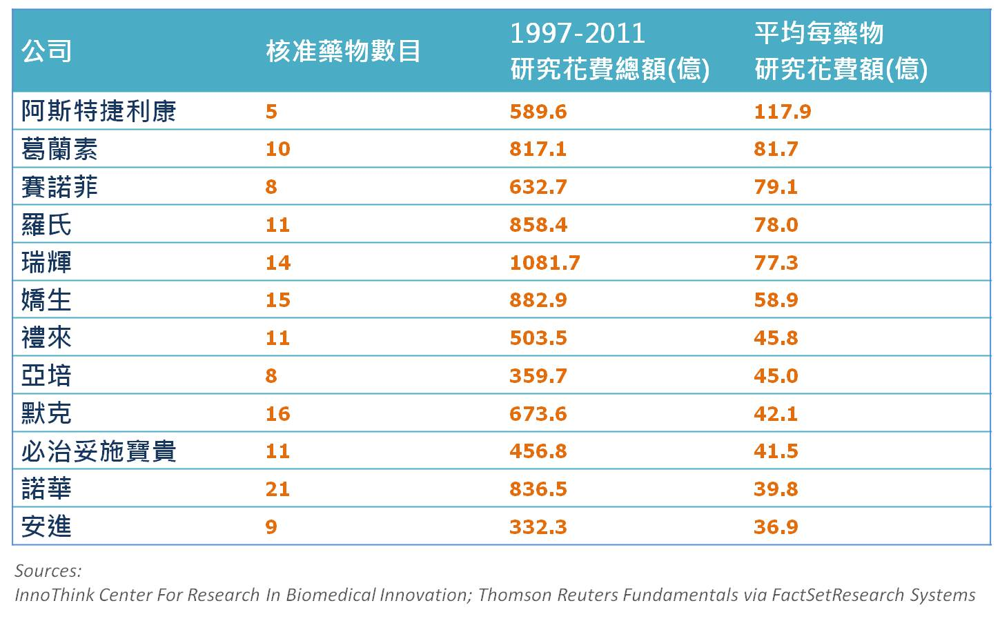

## **<span style="color:#333399">產品研發的效率與考量</span>**

藥物開發非常昂貴又耗時，InnoThink 生物醫學創新研究中心調查發現，研發一個成功上市的藥物，平均要花費**四十億美金**，最高可達**一百一十億**，花費相當驚人 (如下表)，因此除了技術上可行性、成功機率的評估之外，研發公司也應將消費者的需求及觀點在早期就納入考量，藉此衡量研發的成本與效益。 [](http://www.forbes.com/sites/matthewherper/2012/02/10/the-truly-staggering-cost-of-inventing-new-drugs/ "The Truly Staggering Cost Of Inventing New Drugs")

在美國生技產品消費每年約成長 20%，<span style="color:#800000">因此消費者非常關心他們能如何影響生技產品的應用及資金投入方式，特別是預期在近幾年打入市場的產品，會受到消費者前所未有的嚴密監督。因此，全面了解消費者的需求及觀點是產品最終能否成功，是非常關鍵的。</span> 因此，一個成功的藥品，不只要能發現適當的化合物、通過臨床試驗及美國食品藥物管理局檢驗，同時也要使醫生願意認可並開此藥的處方箋，而病人也願意給付該藥品的花費。而公司若要減少其整體投資上的花費與提高效率，必須在早期研究時，便將此一變數納入考量，畢竟臨床研究一次約一億美金，投資不可不審慎。

> ```
> 編者註：事實上從醫療科技評估 (Health Technology Assessment, HTA) 與藥物經濟
> 學 (Pharmacoeconomic) 的興起，以及歐巴馬的 Affordable Care Act，我們都可發現
> 消費者越來越注重醫療科技價格的合理性，也越來越精打細算，因此研究機構與企業勢必要深究
> 的問題便是真正的研發成本是什麼? 可以帶來的效益又是多少?  而及早納入付費者的考量
> 即是讓消費者信服其效益的方法之一，也是確保日後能獲得預期收益的重要因素。
> ```

## <span style="color:#ffffff">.</span>

## **<span style="color:#333399">謹記消費者的角色</span>**

由於研發成果最終仍是由消費者買單，因此若消費者不重視或不願意購買，那麼研究成果便無法帶來回報。那麼消費者究竟重視什麼呢？事實上消費者對研究的結果非常在意<span style="color:#800000">，</span>但公司必須能解釋研究結果在臨床的重要性，而非僅是足以通過審核的數據。消費者不會在意什麼樣的統計對研究比較方便，他們更在意的是臨床上顯見的結果。譬如在癌症研究中，常常會利用腫瘤縮小程度及無疾病進展的存活時間作統計分析，但此兩結果可能對直接結果總存活時間完全沒影響，這樣子的結果對消費者的吸引力便小很多。(延伸閱讀: [對癌症臨床試驗的反思](/posts/cancer-clinical-trial/))

> ```
> 編者註：本文所指的消費者並非單指病患，更多時候指得是政府或保險機構，而不同國家的政府
> 或保險機構具有不同的性質或考量，例如美國的醫藥支出與保險高度相關，且民眾又常常因為工
> 作而改變保險機構、歐洲國家政府更常扮演付費者的角色而非民眾，諸如此類的特點皆會影響付
> 費者的考量，進而影響研發成果的效益。
>
> 例如若某公司預計研發某種疾病的檢測方法，並期待保險機構買單，但就保險公司而言，納入此
> 一檢測方法或許可吸引民眾納保，但若檢測結果有較高的比例是的確需要高額治療，那麼對保險
> 公司來說這便是賠本的買賣，故可能在一開始便拒絕為該檢測方法買單。研發公司若無事前及早
> 評估，那麼將可能面臨比預期來的少的收入。
>
> "While regulatory delays have improved to a degree, companies are 
> left in the lurch because even when they reach approval, they have 
> an increasingly hard time obtaining insurance reimbursement unless 
> they can prove their product is also cost-effective."  
>                        - Gary Kurtzman (引用自 FierceMedicalDevices)
> ```

另外了解消費者是誰也十分重要。若該<span style="color:#800000">藥品在進行市場評估時，知道會被某種醫療保險人口大量使用，臨床試驗時最好也有樣本來自於該醫療保險人口，使評估結果對消費者更具說服性</span>。而該醫療保險人口的經濟狀況如何，在他們經濟能力範圍可以付多少，多少人可能會得此類疾病，需要此類藥物，都須納入計算之中。 總體來說，早期將消費者的需求及觀點納入研究開發的考量之中，其評估之花費比潛在利潤低，而該評估也會提升產品研發效率，最終增加使用率，提高收益。 <span style="color:#ffffff">.</span>

## **<span style="color:#333399">編者小結</span>**

<span style="color:#800000">「藥物經濟學的數據直接影響著產品的上市和銷售，愈來愈多臨床試驗必須同時達成評估療效及成本效益的目的。甚至大藥廠已不再將藥物經濟的數據，僅視為一項市場行銷的工具，而是將其視為產品的性質之一，如同產品的安全性與功效性同等重要。」</span>(引用[出處](http://www.hbmsp.sipa.gov.tw:9090/itri/tw/images/NewsList1010222_07.htm "推薦閱讀: 藥物經濟學影響新藥研發趨勢")) 研發成果商業化不僅能鼓勵科學進展，同時也為社會大眾帶來福祉，然而在醫藥研發上，勢必需要更有效的利用資源，跳脫獲得審查通過就能獲利的舊思維，而是轉而在研發階段便以納入付費者的考量，慎選試驗終點 (endpoint) 與設計，合理訂價與行銷。

**<span style="color:#3366ff">延伸閱讀：</span>**

1. [醫藥科技評估 Q&A](http://www2.cde.org.tw/FAQ/HTA/Pages/%E9%86%AB%E8%97%A5%E7%A7%91%E6%8A%80%E8%A9%95%E4%BC%B0.aspx)

2. [藥物經濟學影響新藥研發趨勢](http://www2.cde.org.tw/FAQ/HTA/Pages/%E9%86%AB%E8%97%A5%E7%A7%91%E6%8A%80%E8%A9%95%E4%BC%B0.aspx)

3. [Top 10 Med Tech Investments of Q2](http://www.fiercemedicaldevices.com/special-reports/top-10-med-tech-investments-q2)

**<span style="color:#ff0000">本文編譯自 Sarah Collins 的文章:</span>** [The growing importance of incorporating US payers into biotechnology drug development decision-making](http://www.palgrave-journals.com/jcb/journal/v17/n2/abs/jcb201029a.html)
