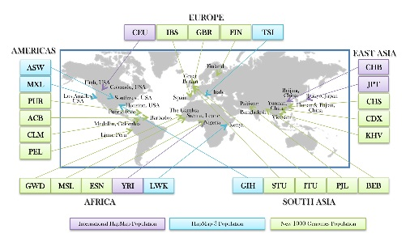

 緊接著在 2005 年，因次世代測序技術（next-generation sequencing technology）的成熟，人類更將野心推到了測序每個人類個體（當然現在離這個目標還有點遙遠），世界各國也因此紛紛開啟了大型的人體基因體計畫，其中較特別的是**法羅群島（Faroe Islands）基因體計畫，[FarGen](http://www.fargen.fo/en/) 的目標是測序每個國民的基因體**。而後，這些國家預期都將擁有完整的國民基因庫資料，這資料庫將會是非常珍貴的資源，應用可從疾病檢測、疾病預防、個人化醫療到犯罪追蹤，是福是禍，就不在此文討論範圍內了。

 .

## ** 基因體計畫裡的資訊人員 **

在介紹我所參與的這個計畫之前，先容我介紹一下我自己和我目前所在的實驗室。我並非生物科班出生，我的專業訓練完全建立在電腦科學上。五年前加入實驗室時，只知道研究內容將會是演算法和軟體開發，這也是目前實驗室的研究主軸。 需要演算法和軟體開發是因為大量測序資料的出現，就拿人類基因體來說，人類基因體大約共有 30 億個鹼基，次世代測序每次大約能產出上千萬或上百萬條短序列，一條短序列大約包含幾十到幾百個鹼基，如何將這些短序列拼湊出一個基因體，是一大挑戰，如何在很多基因體裡找出個別變異，又是另一層次的困難。然而正因為困難，這些應用才都是非常有趣的電腦演算法問題，開發有效的演算法並且實作也就變成生物資訊領域裡的顯學。 如果你有看過電影或小說「白金數據」，那麼資訊人員所扮演的角色便是在 DNA 資料庫裡比對兇手 DNA 的那些科學家。電影裡，僅由一位天才負責處理數據，但，畢竟天才難尋，真實世界裡，DNA 分析的這項工作需要很多研究員共同完成。

## ** 1000 Genomes Project  **

接著來說我個人參與其中的計畫，[the 1000 Genomes Project](http://www.1000genomes.org/)。1000GP 開始於 2008 一月，是第一個較大規模的人類測序計畫，到目前為止，已收集大約 2500 個個體來自於全世界 26 個族群（參考圖一）。**此計畫的目的在於研發資料處理流程且提供常見的人類基因體變異資訊**，在開始之初，該如何處理資料，該發展哪些軟體其實都還是個未知數。常見的變異則是指此變異發生的機率至少為百分之一。計畫運行至今，在單核苷酸多態性（SNP, Single Nucleotide Polymorphism）的研究上，已有顯著的成果，至於其他的多態性研究（例如，insertions 和 deletions）仍在努力之中。由於 1000GP 的目標是提供常見的變異，因此 2500 個個體皆為健康的人，至少沒有重大疾病歷史。

圖一、1000GP 樣本個體來源

1000GP 是一個國際性的計畫，目前大約共有兩三百研究人員參與其中，每年大家會在 [ASHG（The American Society of Human Genetics）](http://www.ashg.org/)meeting 和冷泉港的 the biology of genomes meeting 見面，其餘時間就是小組透過電話聯繫，每個禮拜至少會有一次一小時的電話討論，討論內容通常都會是，有誰發展了什麼新軟體，發現了什麼需要被修正的程序臭蟲，或者是發現了什麼有趣的基因變異。 老實說，這類的電話討論，對我來說有時壓力真的是挺大的，這不是什麼質量非常好的三方視訊通話，只是一個簡單由美國健康部（NIH）提供的專線電話，大家 call in 進去進行討論，品質大概就跟在電視上看到的 call in 差不多。在只聽得到聲音的情況之下，有時真的很難跟上討論。有一次輪到我報告，我嘩啦嘩啦地講了 15 分鐘，過程中不斷請與會者對照投影片，說明上面顯示了什麼樣的成果，報告完畢後，我問道，請問是否有任何問題或建議呢？沒想到第一個問題居然是「我沒有收到投影片耶」，緊接著就是此起彼落表示沒有收到投影片的聲音，我心裡吶喊著，為什麼不早說，我想或許是大家聽到我緊張的聲音，不好意思打斷我的報告。不過事情也總是在習慣之後，就漸漸的好轉了。 話說回計畫裡的研究人員，裡邊有的負責收集 sample、將 sample 測序、將測序資料放上網路、從網路上獲取資料以進行研究，接著也有 wet bench 的研究員負責檢測資訊人員所產出的結果。目前完整的資量大約有 150 TB（terabyte, 1 terabyte = 1,000 GB），因此如何保存分享這巨量資量也是課題之一。 1000GP 基本上應在 2013 年年底就結束了，不過由於第三篇論文還在進行當中，因此計畫也還尚未結束。其中的 structural variation group 則會一直延續到 2015 年底。

## ** 後記 **

對我這位生物研究的門外漢來說，了解人類基因體，就像學習基礎數學知識一樣，了解更多，將來的工具就會更多，隨著對這個領域的認識，我想個人化製藥或許真的會有得以實現的一天。

您也有海外生技產業的獨特經驗嗎？您也同樣擁有滿腔熱血無處發揮嗎？ 還在等什麼！快來了解[【海外連結計畫】](/posts/oversea-connection-sharing-recruit/)、[【](/events/oversea-connection-sharing-recruit/)[填寫分享者問卷](https://docs.google.com/forms/d/1aYMzLTGLxf7LDBiNLigDW4kmwj7LXZlTnytdY7exSZ0/viewform)[】](/events/oversea-connection-sharing-recruit/)，讓 Connectome 為您規劃專屬的分享空間吧！
