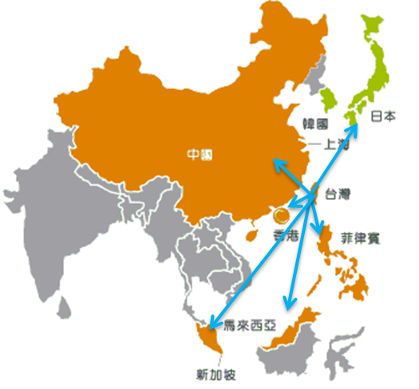
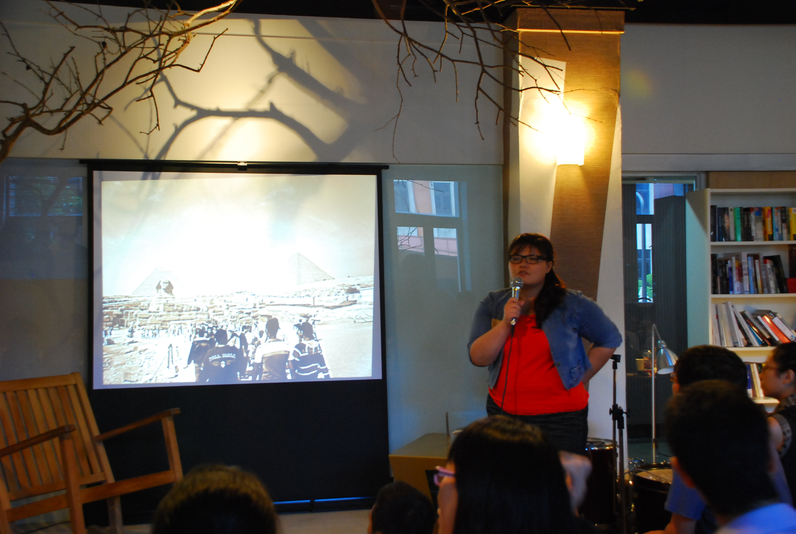
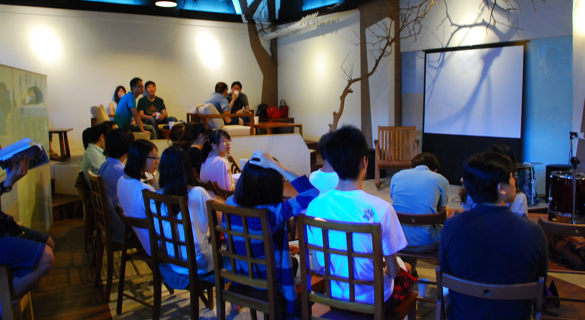

## **台灣的角色 -  大中華區的資源整合者**

學姐所任職的安成生物科技為安成國際藥業旗下子公司，目前主要的業務為[新藥開發](/industry/製藥/)以及協助[學名藥](http://www.flickr.com/photos/97565412@N03/9054398637/sizes/c/in/set-72157634149166929/ "什麼是生技學名藥?")相關的臨床研究，考量臺灣市場規模有限，因此公司以台灣作為據點，將視野放在全球市場。公司現階段的經營模式為扮演藥物發展中第二棒的角色，也就是引入有潛力的研發案，並與其他研究單位共同發展至臨床一期或二期，透過進一步研發與加值後，再與其他國際藥廠策略聯盟如進行授權或共同開發。 

在新藥開發鏈上選擇擔任第二棒角色是公司整體考量的運作模式，因為設置一個研究中心，不僅成本過高而且也不見得符合開發效益，但若選擇與國內外學研單位共同合作開發，不只可以節省部分花費，而且更具有時效性，此外也有助於國內學研單位與產業接軌。 至於為什麼不獨資投入臨床三期甚至是自行上市銷售，除了目前臺灣市場規模過小外，也由於缺乏國際市場[行銷](/job_function/行銷/)的相關經驗，另外也基於公司資金運用考量，畢竟執行臨床三期所投入的經費並非目前台灣資金市場能夠支撐的。 許多與會觀眾相當好奇，站在藥廠的角度如何選擇研究案呢？學姐笑說：「我們的案子都看不完呢！好多人來投稿。」在研究案的選擇與過濾上，公司基本上只考慮有確切市場需求的開發案，不過仍要考量公司的策略以及財務規劃，畢竟安成並非有能力可以接下每個好案子。

## **藥物商品化的重點 - 專利**

藥物商品化其中最重要的考量因素之一便是[專利](/industry/智財/)，學姐再三強調，學研單位考慮專利布局時請務必要包含 PCT (Patent Co-operation. Treaty )，因為 PCT 案未來可以進入多國包含美國、歐洲與中國大陸，千萬不能為了省錢或是基於單位要求而選擇申請臺灣與美國的專利。不過 PCT 進入各國階段是非常花錢的，所以一旦送出專利申請案後，也要積極尋找未來合作對象以因應後續花費；若找不到合作對象，也可以在預算考量下選擇幾個主要國家如美國、歐洲與中國等申請專利。 此外，學姐也指出一個合作案的順利與否，其實不僅僅是依靠研究經費的投入，更重要的是合作單位間的信任與默契，只有長期夥伴關係，才有可能花較少時間與精力達成預計的目標。而每個合作案都是經驗的累積，在錯誤與失敗中都有值得學習的地方，也增進自己的功力，為下一個成功作準備。

## **臺灣的優勢與劣勢**

雖然目前中國是第二大藥品市場，許多藥廠都想前進中國，但受限於政策與信任感等因素影響，有許多國際藥廠考慮向台灣尋求合作，除了經濟因素 (如 ECFA，[臨床試驗](/posts/biotech-project-manager-yenlun-huang/ "臺灣臨床試驗的問題與未來")費用等) 外，同時也是分散風險的策略考量，加上臺灣在法規和標準都與國際同步、深厚研究基礎、及優質人力，臺灣可以將自己視為大中華區的資源整合者，與國際藥廠合作在中國市場上爭取發展空間。 在生技產業的發展上，學姐認為臺灣目前仍缺乏真正願意投入的金主，與懂得新藥開發的人才，許多在國外藥廠具有完整經驗的人才沒有回來或還沒有機會將新藥開發的知識和經驗傳承下來。此外，生技產業的發展缺乏國家政策的扶持，法規不透明或不明確，導致生技新藥公司無法負荷時間成本而打退堂鼓，對比於印度、韓國等有國家政策支持和保護，進而能在國際製藥市場開始佔有一席之地是不同的。 此外，臺灣雖然有著很強的研發實力與能量，許多值得商業化的成果卻往往出不了實驗室，主要是因為學研界大多缺乏藥物開發和產業發展的概念，所產生的落差。因此，學姐認為產業界與學術界要能夠彼此合作，透過合作學習、溝通所長，才能夠將研究轉化進入產業開發，這也才有助於研究案價值的延續。

## **專案經理該有的特質**

學姊認為要成為一個好的[專案經理](/job_function/專案管理/)，除了專業能力之外，也要具有宏觀的視野以及正確的態度，更要常保學習力以了解產業發展和技術狀態，並且能夠以極佳的彈性處理各種人、事、物。專案經理的工作在於要能夠按部就班的完成預計進度，這不是一件容易的事，因此這當中面對的各個環節都是這職務的挑戰與價值所在。

## **對學生以及社會新鮮人的建議：**

**跨領域學習**

學姊鼓勵大家可以多學一點不同的東西，學姊當年就讀清大生科時，因為興趣也跨系選擇了許多課程，而在實驗室也盡量學習不同的技術及涉足[不同領域](/topic/學習與跨領域/)，因為知道的東西越多越不同、知識和視野就越寬廣，學習能力也會因此培養起來，雖然以後不見得一定用得到，但可以訓練廣度。學姐在前一份工作學習到對於各種貴重儀器的原理與操作知識，就有助於與合作教授溝通，讓老師不會覺得他們在跟一個什麼都不懂的人講話。而學姊更提醒學生們，如果可以利用學生身分，積極的修課與跨領域學習是最好的，畢竟出社會後要學習不僅是時間和金錢上難以安排，機會也相對較少。

**拓展自己的視野**

此外，學姊也建議大家可以透過不同方式如自助旅行、打工實習、活動參與等方式擴展自己的視野與團隊合作能力，這對於跨國專案的執行是有幫助的，除了專業外，其他能力的整合也是很重要的。這些活動同時也是了解自己及增進自我實力的好機會，當然也可以累積自己的履歷表。

**發掘自己的天賦與熱情**

學姊提醒大家要試著去發掘自己的天賦與熱情，每個人都有喜歡做而且很容易就能作得比別人好的事，而這往往就是天賦的所在。在實驗室或同學或朋友中，有時很難看出自己跟別人的不同，但事實上每個人都有獨具的能力與專長，也許是整合分析力、也許是思考邏輯力、也許是溝通力，每個屬於自己獨有的就是你的利基。學姐也建議在選擇工作時要思考自己在三年或五年後想扮演的角色，藉此發現自己的熱情與方向，讓工作真正可以成為自我實現的方式，而非僅是為了領薪水過日子而屈就自己。

**做好傳承這件事**

沒有人可以不被失去，因為每個人都要往前走。傳承這件事可以很早就開始學習，在實驗室裡如何指導學弟妹，把研究主題交棒繼續做下去就是一種傳承，老師也不會因為無法失去你而留你下來…… (笑)。傳承的角色要做好，不藏私的傾囊相授是最重要的，有能力分享才有能力吸收更多，懂得分享也才有可能擦出更多火花，而傳承的過程也是一種自我省視以及互相學習的機會，這在職涯發展中其實是很重要的一環。

**永遠都要心懷正直 (integrity)**

任何人都該作對的事，都該在關鍵時刻做出正確的決定。做藥物開發的人更是如此，因為我們做的是和人有關的工作，即使專案會因此 pending 或結束都不該找任何手段繼續不對的事情，因為到最後影響的是用藥的人甚至更大。

**不管位置多高 成就多大都要謙虛學習**

另外學姊也與大家共勉，不管學歷或在公司擔任的職位多高，都要虛懷若谷，謙虛且積極的去學習，這聽來似乎不難，但往後當你需要向比你小五歲或十歲的人、甚至位子比你低很多的人請益時，能不能夠真正作到就不一定了。

## .

## **Q & A 節錄**

**Q：職場新鮮人該如何看待第一份工作 ?**

A：對於新鮮人沒有工作經驗如何跟別人競爭，學姐則是認為第一份工作很難要求，新鮮人的優勢有限，畢竟從雇主的角度看來，新鮮人沒有成功的經驗與成就，較難獲得高薪的機會，學姐建議若能找到自己有熱情、待遇又能接受的公司，不妨當作培養自己的機會與跳板，為未來做準備。

**Q：學生應該如何增加自己的能力 ?**

A：至於學生可以怎樣讓自己更有實力及就業力，學姐認為，除了跨足國際必備的英文外，在學生時期就參與活動與實習，甚至在選擇實驗室或研究所時就選擇產學合作的實驗室，都能夠幫助自己了解產業需求、釐清自己的方向並且培養軟實力，比起一般人而言就能夠獲得更好的機會，也更有可能獲得進入業界的門票。 .

 分享者： 黃嬿倫，陽明生化所碩士，目前於安成生物科技新藥研發部門擔任專案經理與副研究員。總是跟著自己的心走，不盲從，在人生重要階段做出對的選擇。紮實的實驗室訓練以及智財專業，配合絕佳的整合溝通能力，協助團隊執行多個新藥與學名藥研發專案。抱持著人生要不斷為自己找樂子的座右銘，走遍世界各地，看遍美景，吃遍美食，集滿所有的世界文化遺產與古蹟是他的人生目標。

- 本篇為黃嬿倫學姐在 Connectome 9月2日「生技人，工作藥不藥」職涯沙龍的分享整理 -

**[Connectionary](http://www.flickr.com/photos/97565412@N03/sets/72157634149166929/ "點我看更多生醫詞彙")相關詞彙介紹**

