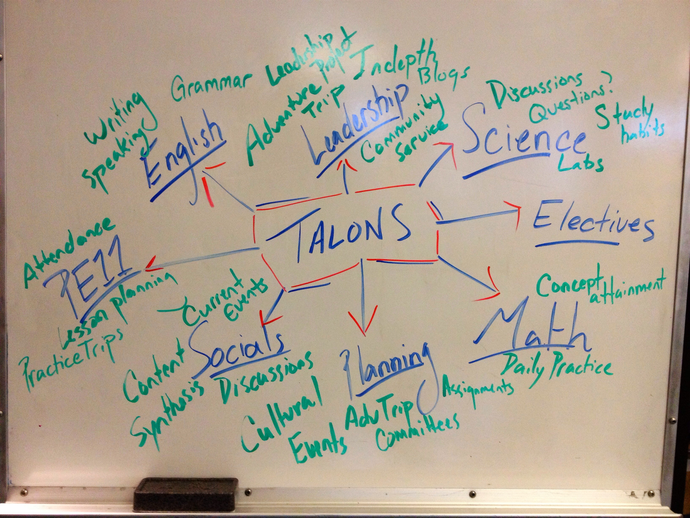

## **整裝 - 學思歷程**

**「看到大家今天來其實是蠻感動的。生技產業大家都知道，許多即將畢業的學生還是不曉得業界有什麼樣的機會，但看到大家仍然願意投入這個產業，相當高興，也希望大家能延續這股熱情，一起努力。」**甫開場，陳經理幾句話鼓勵在場的聽眾，同時也展露了自身對於國內生技展業的期待與熱忱。

陳經理畢業於生命科學本科系，後就讀清大生醫工程與環境科學所，所上的主題本身就有[跨領域](/topic/學習與跨領域/ "觀看含\"跨領域\"標籤的文章")的成分，在碩士班時期除了學術研究外，未來在生技領域[創業](/topic/新創/ "觀看含\"創業\"標籤的文章")的念頭也開始萌芽。因此一開始透過一些課程的修習，如：「專利實務」、「財務分析」及「高科技創業」等課程，廣泛學習探索自己的可能性，尋找自己在生技領域可能的定位；畢業以後，先到國衛院擔任研究助理，但不同於一些新鮮人只視研究助理為一個過渡期的權宜之計，「初出社會，希望能先嘗試純本科的應用，或許能得到新的想法。」陳經理當時這樣想著，同時為自己這一階段設立了目標：「將研究成果發表在國際期刊」，在埋首研究之餘，陳經理也有意識地充實自己在商管領域的實力，研讀財務分析相關領域，考取了 CFA 財務分析師 Level 1 的認證。

論文發表後，陳經理進入業界一間小型投資公司，由於手上握有 CFA Level 1證照，讓老闆願意給予機會與資金對生技產業進行分析與投資，累積了一些商界的實務經驗；此外在小公司工作常常被指派許多非職務內的任務，體認到了**專案管理**與**多工處理能力**的重要性。這段時間的工作經驗，讓陳經理意識到自己距離創業的理想仍有一些不足之處，因此下一階段選擇出國，到西班牙 ESADA Business School 攻讀 MBA 學位；在西班牙的這段時光除了透過許多 CASE STUDY 及創業競賽累積了實務上的專業知識，更開展了自己的事業，也結交到許多未來可以一起合作的夥伴。

綜觀陳經理的學習進修生涯，可以看到每一個決策後面都有其理由，而且在各時期都會為自己設立一個目標，**「先發想自己目前所想達成但有點難度的目標，再回頭檢視自己自身的狀態，接著才進一步規劃，思考如何去填補中間連結的空白。最大的重點是不要侷限自己，而且要確實去履行以達成。」**例如最初陳經理希望能在 biotech 創業，就體認到自己應該要懂一個產品從研發到商業化的過程，進一步了解[專利](/industry/智財/)與市價評估等…，從而去一一補足。藉由這種思考模式，或許就能讓眼前的努力方向不再那麼模糊不清，能夠持續精進而不至只是隨波逐流，虛擲光陰。

.

## **出發 - 工作內容**

中研院生技育成中心旨在輔導創業與技轉，幫助學術成果產業化，陳經理服務於隸屬育成中心下的萌芽中心，負責早期研發成果之探勘與培育規劃，陳經理進一步解釋：**「例如有個研究室進行某藥品研究，效果很好且數據非常有說服力，但在商品化前仍須符合法規等規範才能夠順利上市；然而法規部分的細節很多在研究上並不會被注意到，萌芽中心的工作就是協助輔導，弭平產學間的鴻溝。」**在運作上則常透過組成一個團隊的方式，研究者負責技術面，而中心以「basic research → 技術突破 → 產品加值」的模式協助上市。

作為萌芽中心的技術經理，陳經理的工作內容主要可分為智財分析、法規規畫及市場分析三個部分：

(1) **智財分析**：分析該領域的專利發展趨勢、細究當中的 claims…

(2) **法規規劃**：熟悉各國各種法規，溝通協調幫助產品符合規範

(3) **市場調查**：分析市場的大小、定義、成長、背後動力及競爭狀況 此外，也會進行一些 case或 business model 的 study 及 validation，對當前產業動態做進一步的觀察與思考。 .

## **收穫 - 分享與建議**

就目前生醫兩大主流－醫藥及醫材產業，陳經理分享了一些他的觀察與想法。製藥產業幾個值得注意的現況：

(1) **主流藥品專利斷崖**，這些暢銷藥品的專利到期，除了讓大藥廠不得不開源節流外，學名藥廠們也一個個蠢蠢欲動。

(2) **RD 部門的生產力下降**，新藥推出的時程沒辦法馬上彌補前述藥品專利到期後的營收缺口。

(3) **學名藥競爭將越趨激烈**，各大學名藥廠無不積極研發改良以卡位搶食這些暢銷藥的市場大餅。

(4) **生物藥的崛起**，當今越來越多生物製劑躍居藥品銷售領先群，如何研發出好的產品並成功進入市場，值得研究。

回頭檢視國內的狀況，目前有一些藥品已在[臨床試驗](/job_function/臨床試驗9�驗/)階段，比較小型的企業，則需在藥業產業鏈走向分工的趨勢下盡快確立自己的定位與品牌，此外 botanic drug (植物藥)及學名藥市場也是值得未來台灣廠家攻略的戰場；而法規的部分，老實說是台灣比較弱的一環，政策面相較他國仍略顯落後，這方面的人才也較為欠缺，對於這領域有興趣的可以多加嘗試。相較新藥，對本身就以 ICT 產業見長的台灣，醫療器材的開發相當值得投入，目前全球醫療器材的市場仍是高成長率的狀態，未來新興產品應會往**行動化 (mobilize)**、**個人化 (personalize)** 演進，同時高階醫材的改良或是使用上的簡化、家用化都會是熱門的發展方向。

## **對於有心想跨領域的新鮮人，陳經理也提供了幾個方向作為參考：**

(1) **業務/ 行銷**：或許一些人不太喜歡業務這個角色，但[業務](/job_function/業務代表/ "觀看含\"業務\"標籤的文章")作為銷售的第一線直接接觸客戶與市場，事實上最能掌握現下的市場動態與客戶心理，可以說是非常好的入門！對於個人的經驗是很好的鍛鍊機會，加上生醫產業客群比較特殊，若能應付自如，某種程度上也已經創造了個人能力的差異化；而若個人有管理背景 (如 MBA)，通常會從 Marketing 入手，熟悉之後跨其他部門也相當有利。

(2) **專利/ 法務**：前面陳經理一直強調，了解[專利](/job_function/智財管理/ "觀看含\"專利\"標籤的文章")與[法規](/job_function/法務與遵循/ "觀看含\"法規\"標籤的文章")的人才是目前產業所迫切需要的，專利並不只是產品上市時才會重視，上市後的專利維護與攻防亦是不可或缺；法規方面，則有一些認證，如 RAC (Regulatory Affairs Certification, 可參考<http://www.raps.org/>)，台灣方面擁有的人並不多，值得一試。

(3)   **製造**：產品商業化後的量產業務，適合具工程相關背景者切入

(4)   **投資/[顧問](/job_function/顧問/)**：需要懂得鑑價、市場評估，最好能取得前面提到的財務分析 CFA 等財金商管領域的認證，加上工作一段時間後的實務經驗，相信更能得心應手。

除了學業職場上的進修與鍛鍊，平時也可以藉由訂閱產業新聞、閱讀 market report 與企業財報等培養自己的產業知識，此外也有很多課程與”webinar”值得參與。網路資源信手捻來，只要有心就能夠找到方式來充實自己，很多時候必須自己發想並行動，而不是僅由外在環境來推動。核心價值就是前面所提的概念，將現況與個人目標做連結，這個目標會與自己夢想的生活、想要成為什麼樣的人有關，越明確越好，時時檢視，確認自己走在正確的道路上，**「當然，大部分人沒有辦法一開始就能釐清自己最想要的東西，但努力一段時間後你會發現，在這些階段性目標一一實現後，理想的輪廓便會漸漸清晰可見。」**最後就是別侷限自己，拼命去做吧！

 分享者：中研院生技育成中心萌芽辦公室技術經理 陳孟琦

- 本篇為陳孟琦經理在 Connectome 2013年4月27日 「生技人，跨界學習．無限暢贏！」職涯沙龍的分享整理 -
