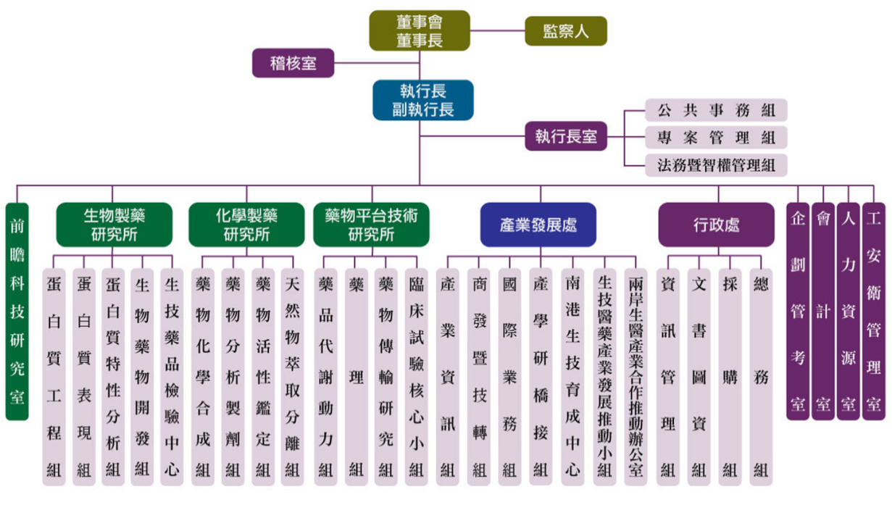
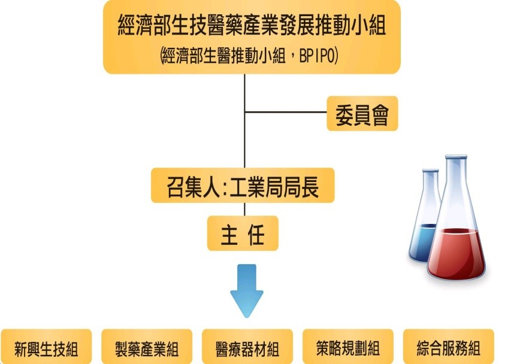
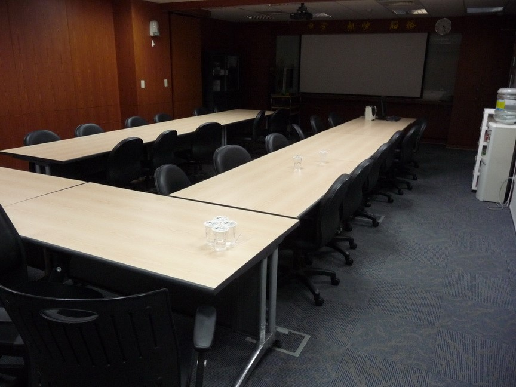

### **(一) 生醫推動小組**

小組的歷史悠久，可以追溯到1996年，行政院鑑於發展生技醫藥，需要跨部會合作，成立小組的前身-「經濟部生物技術與製藥工業發展推動小組」，負責政策推動與跨部會協調。小組在2011年成立「行政院生物技術產業單一窗口」，納入產業諮詢與廣宣，近年更進一步負責國際合作的推動。目前，小組的正式名稱為「經濟部生技醫藥產業發展推動小組」，簡稱「[生醫推動小組](http://www.bpipo.org.tw/2t2s/establish.html)」。 由於小組營運需要生物專業，經濟部工業局以計畫的方式招標，並由生技中心承接，負責實際業務的執行、人力支援，也因此小組的營運本身，就是一個政府與產業的緊密結合。

### 

### **(二) 部門簡介**

小組的組織可以分為三大領域：綜合服務、策略規劃和業務。

**綜合服務組**，最重要的工作，便是負責「行政院生物技術產業單一窗口」，將產業所遭遇的問題，轉介到適合的單位，或是將案件交辦給小組業務單位，以便後續進一步的合作等。 **策略規劃組**，對於國內生醫藥產業狀況加以掌握，並協助經濟部制定產業政策，便是主要職掌。所收集的資訊，一部份會每年出版成政府刊物，包含「[生技產業白皮書](http://crm.biopharm.org.tw/wb/)」、「生物技術與醫藥工業簡介」、「台灣生技產業新興生技公司名錄」等。另外，該組也會舉辦各種研討會與課程。 **業務部門**，也是小組的主要組成。業務部門有有三大部分：新興生技組[1]、製藥產業組和醫療器材組，我這次便是在其中的製藥產業組實習。除了服務的對象有所分工，實際工作內容差異不大，主要是促成產業投資、召開技術/投資說明會、輔導諮詢、推動國內外合作。另外，小組的重要功能之一的跨部會平台，也往往是產業與業務單位接洽，才能夠促成跨部會會議的召開。

## 二、如何獲得這個機會

陽明大學的基因體與蛋白質體之臨床應用教學資源中心，每年都會開設[實習課程](http://gpp.ym.edu.tw/)，並開放校內外學生申請。

我前一年透過相同的途徑，在[友霖生技法規部](/posts/orient-pharma-internship-tony-wu/)進行兩個月的實習，大大的影響了我在學校的研究與未來的規劃。今年之所以再度申請，是想進一步了解政府與法人，與之前實習的藥廠有哪些差異，雙方又是透過甚麼方式相互合作。在這樣的背景下，作為產業訊息交會點的生醫推動小組，自然成為心目中的第一志願，由於我對製藥產業興趣較高，便選填了製藥產業組。

在準備履歷時，我特別強調自學習生科以來，對生技產業推動的強烈興趣，也陳述在大學、研究所期間所參與的各式課程、活動，尤其是與藥品相關的部分，當然也大致提及了之前在友霖的實習經驗。另外，雖然當時並不瞭解，但是外文也是重要的指標，畢竟業務組常常需要與外國廠商接觸。

面試是由藥品產業組的組長出面，對我十分友善，主要詢問之前在藥廠的經歷，以及來到小組以後想要學習的方向，在過程中還親切的說明實際工作內容，並分享了許多未來推動產業的願景。

↑ 面試地點：會議室

## 

## 三、實際工作內容與收穫

我很高興能在生醫推動小組實習，除了與生技公司的高層聯絡以外，大多數的工作我都能夠有所參與。工作內容大致可以分為三大方面：辦理活動、了解產業脈動與產業服務。

### **(一) 辦理活動**

除了向台灣生技月這種一年一度的大型展覽，每年小組也會定期組織代表團，到美國、日本的生技展設攤交流。我在實習期間，當好遇到每個暑假的重頭大戲-台灣生技月，製藥產業組要舉辦一場「[台日生技醫藥合作商機發表會](http://udn.com/NEWS/FINANCE/FIN1/8028597.shtml)」，是製藥產業組承接對日本窗口以來的最大一次活動，未演先轟動，全組上下如臨大敵。 在小組的前一個月，我的主要工作便是協助發表會的事前準備，包含會議文件的編排、會場規劃、還有其他所有用品的準備。這些工作雖然簡單，卻也隱藏不少細節，比如公司的座位安排、當下廠商的動線等。會議當天，往往有電腦抓不到、準備時間不足等突發狀況，需要隨機應變，我也見識到小組靈活的處理方式，在很短的時間內讓會議順利進行。我負責的是會場議程的控管、照相等比較簡單的工作，使用學校研討會常用的舉牌方式，效果不錯。 在過程中，我學習到舉辦活動的技巧，但最令我開心的，是看到台日雙邊藥廠的簡報。在會議中，各公司及其所能地展現自己的長處，並有條理地介紹合作方式與有興趣的標的。會後的餐會也是發表會的延伸戰場，台灣廠商積極地的與日本廠商交換意見、名片，洽談各種可能的合作。雖然在這次的活動參與有限，但那種農夫播種時的期待與喜悅，我稍稍有了體會。

### **(二) 產業服務**

包含土地取得、上市櫃科技事業推薦、舉辦說明會、投資減免與輔助等，廠商都有可能到生醫推動小組來尋求協助。 比方其中一次，是有外國廠商要來台灣了解合作對象，我協助挑選出較具代表性的幾家廠商，安排參訪行程與主管的會面。由於溝通的層級頗高，我第一次撥給台灣公司的時候，甚至手還會微微顫抖，不過以平常心和誠懇的態度和廠商溝通後，順利的媒合雙方，參訪當天也賓主盡歡，很令人開心。 另外一次，是廠商想要了解台灣公司併購外國公司的限制，我以在法律系的所學，寫了我生平第一份的意見書，供該廠商參考，算是意外的收穫。 我從服務的過程中，學到與如何與廠商溝通。第一次接觸的廠商，難免會對政府單位有所疑慮，但只要找到對的人，並且盡量在限度內盡量和廠商誠懇的溝通，通常都會有些收穫。當然，有時候來接觸的廠商品質參差不齊，如何婉轉的拒絕，或是協助轉介專業單位，也是一門學問。

### **(三) 了解產業脈動**

小組也需要主動拜訪廠商、參加研討會與法說會，增進對廠商的了解，並且建立人脈，以利政策推行。 至於我最令我興奮的，是幾次安排拜訪藥廠的行程。我印象最深刻的，是一次例行拜訪。我事前與廠商聯絡，商談適合的時間以及會談的主要方向，剛好廠商有開發國際市場的需求，除了和我分享了目前該項產品的市場分布，也聊了不少產業發展的脈動與趨勢，上了一課。 參加上市櫃公司法說會也是很特別的經驗，這樣的場合非常適合了解業界的走向，以及市場對該公司的看法，尤其法說會上，往往有股東會對公司經營提出犀利問題，比方是否要進行垂直整合、併購或進一步上市等等，通過掌握這些關鍵資訊，也可以在適當時機促成投資案。 這些機會，讓我看到許多不同公司，各有不同的發展方向。在經濟部實習的好處之一，就是可以在參訪後詢問部門先進的意見，學著從細節中觀察公司的經營模式、領導風格，我也從中獲益良多。

## 四、給想實習的人的建議

生醫推動小組，可以說是全國性的育成中心，在實習的過程中，廠商到小組來尋求的協助，往往也代表著相關人才不足，透過了解這些需求，可很快地知道要在學校培養哪些能力，以彌補這些缺口。如果同學對於推動產業、扮演政府與業界溝通的橋樑有興趣，非常建議到小組去學習，並選擇自己擅長的產業分組。 小組的工作，大部分是與廠商的溝通、聯繫，扮演著政府與業界溝通的橋樑，工作本身雖然看似簡單，但真正困難的是對產業的了解、人脈的建立和溝通技巧，沒有辦法在短時間培養。建議未來有心想要進入生技中心實習的同學，能夠多多向有業界經驗的老師學習，並利用寒暑假的[課程資源](/topic/學習與跨領域/)，涉獵法律、管理、商學的相關知識。另外，如藥事論壇等研討會，或是個別公司的法說會，往往牽涉產業最注重的議題，是理解實際產業趨勢、學習產業特有詞彙的最快方式。 最重要的，兩個月的時間並不長，在公司內，實習生的貢獻有限，如果有幸碰到願意指導的業界先進，可以盡量自告奮勇幫忙，分擔的工作越多，部門處理事情的速度就越快，也才更能夠在有限的時間中，學習到各種事務的處理。

-------------------------------------------------------------------

[[1]](/posts/實習(生醫推動小組).docx#_ftnref2/) 新興生技組，負責藥品與醫材以外的所有生技產業，因此包含食品、觀光醫療、農業等，都是業務範圍之內。

Connectome 在部落格建置了實習故事專區， 我們號召有參與產業實習經驗的朋友撰文分享自己的經歷。我們相信，有更多人的分享、關注，將可帶來更多討論！填寫問卷，一起分享自己的實習故事：[【實習分享計畫】](/posts/intership-sharing-recruit/)

 
