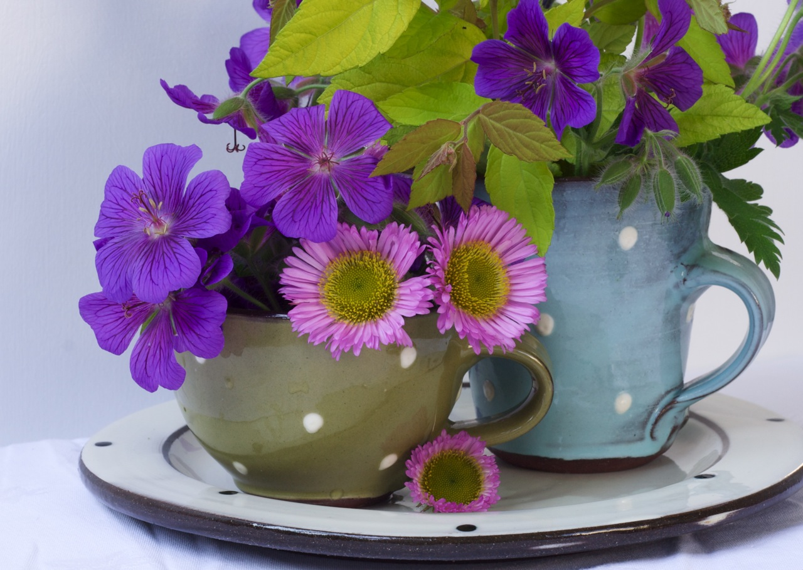

團隊研究的主題－**基因轉植花卉**，而主要著重於**切花**市場。切花，意指把植物觀賞部位裁剪下來以供插花、裝飾或佈置之用。由於台灣氣候炎熱，花卉容易因蟲害而得病，噴灑農藥雖能解決蟲害卻對環境造成嚴重的副作用，除了影響環境之外，亦無法協助花農提升花卉的拍賣價格；另一方面，農改場或農試所對於花性狀的改良往往需要長時間才能見到效果，而台灣農業技術累積的實力深厚，團隊認為若能將這些研究成果應用在切花產業上或許能迸出很棒的機會，因此。尚燐向劉文裕博士借用他所申請的**抗菌基因專利**，進行基因轉植花卉的技術商化。並直接與家中經營**花卉農場**的學妹請益，蒐集潛在終端顧客的需求。團隊將這些分散的點連結成一條具有執行力的線，透過每一次業師的分享與資訊的收集，進一步從培訓、討論中整合出切花產業可行的商化模式面，希望透過此抗菌基因技術，不僅能克服上述缺點，更能減少花農的管理成本，提升花卉在市場的販售品質。

一開始，生物背景與實驗室出身的他們以為技術所佔的比重應該最高，在 Boot Camp 報告時積極介紹此抗菌基因技術之優勢。然而，經過培訓期間和實際參與的歷練，他們漸漸發現**「市場需求」才是商業化最重視的**。為了跳脫出傳統技術為重的框架，團員們決定親自走訪產業端，深入瞭解從種苗商、花農、經銷商到花市整條產業鏈的運作模式。團員們回憶當時在一個大雨的凌晨時分至花市現場觀察拍賣過程，「我們才明白**花卉性狀**與**當時環境條件**是決定花價的兩大重要因子，也是那一次我們才了解市場上，花農、拍賣官與消費者的心態，以及各方在獲利上的觀點。」從花卉種類的整理、台灣的切花產業到全球市場需求，必須一步步真正了解整個產業鏈的現況後，再切入花農的實際需求，才可能以技術解決真正存在的問題。

## **多元背景 激發團隊創意**

相較於其他參與 Boot Camp 的隊伍， Group Ardise 團隊成員的背景與專業相當多元，有在中研院生技育成中心的尚燐、雄厚技術能力的科學家筱婷、生技服務業背景偉鈞、從事網路創業的工程師玉霖以及熟知日本市場資訊的鼎峰。正因為團隊有豐富背景作為底子，在執行計畫的過程中，每一位成員都能依據自身專業提出想法，大方地將所見所學發揮出來，也因此創造出高效率的工作環境。活動過程當中，從實驗技術面的獨特見解到商化應用面的產業分析課程、網路資源與資訊內容共享；最後甚至是實務面的市場需求分析，大家都是從各自經驗的分享中，幾經深度討論漸漸將整個技術商品化的模式建構出來。

在台灣，目前尚無類似概念的業者出現，然而從澳洲 Florigene 公司（由日本 Suntory 公司投資）研發出藍色玫瑰花的成功案例中，卻看見此類商業模式的可行性。經過整個切花產業鏈資訊的蒐集與歸納，團隊的商業模式著重在兩大特性，花卉售價的提升以及物流支出的降低，即**「提升良率與降低損失」**。團隊著手以技術為基礎，藉由基因轉殖可以專一控制性狀或是抗惡劣環境的優勢，繼續投入心力研發改良、進行田間試驗並申請相關植物專利；同時，針對產業進行商業規劃與法律規範的分析，進而在市場上降低種植與運送管理成本、延長瓶插壽命，以提升產品利基與市售價格，吸引目標對象（目標對象為種苗商；長遠目標為花農）前來購買。

## **深入分析創造無限價值**

從 [Boot Camp](/columns/Boot Camp/) 培訓過程一路走來，團隊接收到許多的刺激與啟發。團員偉鈞回憶，「團隊投影片的演進反映了我們對於生技創業思維的改變」。起初，團隊想以整條產業鏈內的每個點皆作為客群，後來發現範圍太廣且每段都各有專精。因此，技術出身的他們決定鎖定上游端的研發切入，將自行研發出來的改良種苗賣給種苗商或花農；爾後，又將技術強調與專利介紹的實驗室想法漸漸轉變到市場現況與實際需求的商化思維，希望透過逐步修正概念的做法，以更實際的角度解決問題。

多數團員認為，培訓過程中最大的收穫在於**[法規](/job_function/法務與遵循/ "觀看含\"法規\"標籤的文章")的了解**以及**[商化](/job_function/事業開發/ "觀看含\"商業化\"標籤的文章")的運作模式**。大家從資訊的收集與討論，以及相關書籍與線上自學網站的分享，並且透過生活的觀察，親身了解市場的需求、產品商化的思考模式與執行方法、投資人的喜好、創業的感覺以及創業家精神。當中，團隊曾提出為種苗公司進行生物技術服務快速育種（研發）服務，提供生產新種苗、性狀檢測或田間試驗的新概念時，雖然有些業師認為以現在產業發展程度而言可行性不高，但也有業師給予正面的鼓勵，認為農業技術服務業可能會是一種新創且重要的出路。另外，其他業師在生技創業的分享，不論是人文關懷或是失敗經驗，都給予團隊深入的啟發，進而在切花產業上創造出無限的想像與可能性。更重要的是，經過 Boot Camp 培訓的歷練後，團員在蒐集產業相關資訊的靈敏度與對於新領域的學習效率皆大有所獲。

.

## **結語**

Group Ardise 的團隊故事精采之外，也看見他們背後努力用心做好每一件事的態度。採訪過程中，身在南部的團員即使無法前來，也以視訊的方式與會；在密密麻麻的講稿準備中為我們細說團隊的核心價值；此外，團隊獨一無二的命名也是下了一番功夫討論。從他們身上看見同樣都是生科背景出身的他們，卻不受限於過去強調技術的框架，實地了解市場需求，真正解決實際存在的問題，並且透過 Boot Camp 匯聚也培育一群有熱情實力的夥伴，在生技產業的商業模式與創業之路上，為了同一個目標齊心齊力。

 Group Ardise 團隊成員： 中研院育成中心萌芽功能中心專案經理 蔡尚燐、國家實驗動物中心員工 謝偉鈞、Bernardo Scientific 營運助理 王筱婷、聯發科工程師 陳玉霖、太暘生物科技公司員工 蘇鼎峰 受訪者： 中研院育成中心萌芽功能中心專案經理 蔡尚燐、國家實驗動物中心員工 謝偉鈞、Bernardo Scientific 營運助理 王筱婷

採訪者：[Connectome 團隊 陳明正、蔡宜璇、洪士軒](/about)
