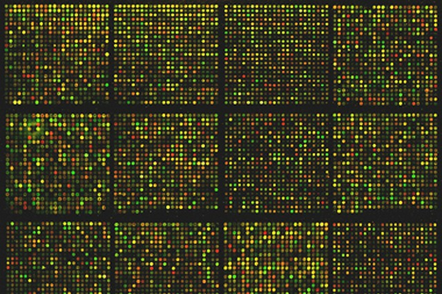

 Photo via [kat m research](http://www.flickr.com/photos/36128932@N03/)

## **醣晶片？**

顧名思義，醣晶片即為使用醣分子當作偵測標的的晶片，他和目前已知之 DNA 晶片或蛋白質晶片有甚麼不一樣呢？ 宗義為我們做了簡單解說：DNA 及蛋白質分子一級結構上皆有方向性，且單元間接合鍵固定，所產生的變異程度僅視各種不同單元 (DNA：4 種核苷酸；蛋白質：20 種氨基酸) 在序列上的組合而定，故 DNA 及蛋白質合成技術相對容易，並且準確定出序列不是難事，故我們可以見到許多商業化的檢測晶片。 單醣分子在人體內主要有 9 種，並且還分 alpha、beta 型，另外亦有不同的接法如 1-4、1-6、2-6 等等近十種，單元變化加上支鏈的結果令組合相對複雜，這也導致醣分子的合成技術門檻頗高，而序列鑑定的方法也還待近一步開發，使得醣相關產品並不多見。不過醣分子雖然複雜，卻因此產生很高的鑑別度，每個物種甚至細胞間表現出的醣分子及序列皆不相同。 在檢測方法上，核酸並不能夠直接見於檢體中來偵測，需要一道樣品處理的手續。蛋白質、醣修飾分子可以見於檢體中，但相較於蛋白質體學的生物標記定量法所需設備門檻不低且準確率尚未令人滿意，使用醣質體學的方法來檢測只要做到定性，即可以辨別是否有特殊病灶或者病原，如此節省了樣品處理及定量的步驟，使得花費的時間大大降低。 目前吳宗益老師及翁啟惠院長的研究團隊已有一套合成醣類的製程，能夠有方向性、固定性、地域性的將晶片產出，並且已進行專利保護流程，未來若能將[技術轉移](/posts/bio-technology-transfer/)，搭配台灣十分成熟的晶片製造技術，進行量產後成本也可大大降低。

## **終極目標：確效、時髦、高通量？方向大轉彎**

隊員們坦言在實驗室中的思考模式是朝如何將檢測做到百分百準確、多面相應用甚至高通量分析來進行，但由業界導師來看卻不是這麼一回事。導師們提醒他們，除了產品本身的品質外，最重要的其實是回歸到使用者的感受，使用族群是否能夠接受新的產品才是關鍵。而使用者考量的無非是快速、方便操作、準確性，並不要求在這樣的一個檢測上大做文章。 舉例來說：團隊可以設計出能夠準確辨別流行性感冒病毒各種亞型的晶片，但其實治療上並不需要這麼詳細的資訊，因為只要檢驗出是流感病毒，一貫的處置皆為服用克流感作治療。 為此，晶片的設計和原始構思大大不同，現今的產品原型已是一個具有操作流程簡單、不須特殊設備、快速輸出準確結果的晶片，這也才回歸到他們的初衷：縮短病人看診時間，醫檢師能夠快速採集檢體並在十分鐘內提交結果給醫師做診療判斷，使得看診一氣呵成，不必花費太多時間在檢測上。

## **想得到的、想不到的困難**

隊員們分享在學習商業化過程中的體會，覺得其中的困難點之一在於使用者的接受程度，醫師、醫檢師們若學生時期未能接觸到醣檢測的概念，則執業後要能夠接受這樣子的產品其實並不容易，需要投注蠻多心力在觀念推廣上，若能夠從根紮起，在學校教育時就提倡此類概念則對於產品的普及化才事半功倍。 另一困難點則是驗證。因為開發出來的產品畢竟屬於醫療用途，商品化的過程中需有大量檢體不斷進行驗證認定，然而這樣子的流程並不是學研單位能夠獨立完成的，還需要和各醫療單位、廠家配合，目前團隊傾向將技術移轉至業主，將此重任交棒給更貼近產業端的廠商們。 信佑有感而發的說：要將實驗室的成果商品化其實不簡單，需要有臨床樣品知識、要有廠商配合量產、要熟悉法規等等，這些都不是只在學研單位就能夠接觸到的，參加 [Boot camp](/taxonomy/term/139/) 後，才了解到「**資金**、**人才**、**技術**、**市場**、**法規**」五種面相均須顧及才不會誤入歧途 (此指多走冤枉路)。 其實簡單走過一遍商品化培訓後，我們問隊員們是否還會考慮繼續參加[相關培訓課程](/topic/學習與跨領域/)，他們異口同聲的表示比起參加課程，若能夠讓自己貼近市場一次，親自接觸市場會比繼續參加其他培訓課程有更深體驗，更能從實務面體會到市場可能面對的問題。

## **課後啟發**

產學合作是個有助年輕人進入業界、能有實務經驗又涵蓋研究的平台，國內不乏研究人才，然而若在學習階段沒有導入適當的產學概念，從產學合作面相來設計研究，則遑論訓練出來的能力可以符合產業要求。因此研究主持人們應接納產學合作觀念，而業界也應積極與學校合作，共同培育具有業界需求力之適當人才，互信互惠的合作才能有雙贏局面。 宗義也提出對於生技業發展的看法：台灣要發展生技，不必像挖金礦那樣，執意一直朝研發新成果投注能量，其實可以從周邊做起，協助別人完成找尋金礦而從周邊獲得利益。如此，換個角度則不需要太多資本，把資源串聯起形成聯盟也可以走出一片天。 綜觀上述，參加了 Boot Camp 培訓活動後，的確使參與者拓展了視野，在未來朝產業界邁進的規畫上實是一大助益。我們鼓勵年輕研究人員們主動接觸此類活動，也期望藉由逐漸推展此類產學活動風氣，讓我們所鍾愛的生技產業順利成長！ .

中研院基因體中心吳宗益副研究員實驗室團隊：蔡宗義、林志偉、李信佑、張世皇 受訪對象：宗義、志偉、信佑、世皇

採訪者: Connectome團隊 陳明正、吳元亨、蔡宜璇 
