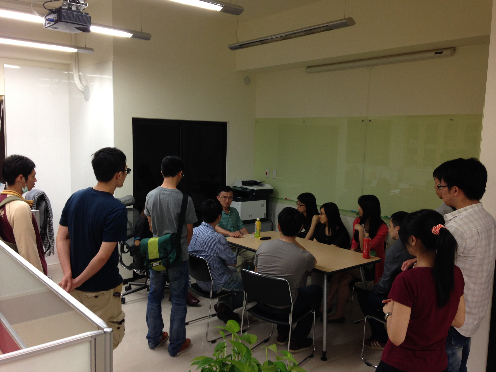

## **找到自己所愛的工作竟是偶然**

1960 年代正值李政道、楊振寧風光獲獎的時期，當時正要進入大學的年青人都嚮往讀物理，對李文機博士而言也不例外，物理系當然是志願首選，但在物理系研讀一年後，李博士發覺自己實在不適合讀物理，因而轉至化學系就讀，並在大學畢業後前往美國繼續有機化學及合成化學的研究，完成碩士學業後，不巧正逢石油危機、工作難尋，經過了漫長的求職與面試，終於因為特殊的有機化學背景讓他從眾多角逐者中脫穎而出，進入 Syntex 的藥物動力與代謝部門任職，不過進入公司後，李博士所負責的工作卻是過去沒有經驗的動物藥理學實驗，一切只能從頭學起。李博士萬萬沒想到雖與當初所學不同，與化學相比，與「人」息息相關的藥理學燃起了他繼續求學的熱情。數年後李博士重返校園，一方面身為兼職員工，同時更是全職學生，花了五年的努力取得了博士學位，積極求知的態度也成為李博士日後成功的因素之一。從這個過程中得到的啟示就是及早瞭解自己的個性，發覺自己的強項及弱點就可以找到自己喜歡的領域而發揮。

## **幫助別人就是助己**

在 Syntex 藥廠工作了一段時間後，李博士轉入 Glaxo 公司任職，參與早期新藥研發，任勞任怨幫助研究部門完成多項指標。曾有一次，為了讓部門能順利在三個月內完成一百多種藥物的動物藥物動力（PK）篩選，李博士率領他的團隊上下協力，設計出了一套快速動物篩選技術，得已在時限內完成目標，對於這項創舉李博士秉持平常心，並不因此邀功、搶鋒頭，將功勞歸給他的團隊，因而交到許多好朋友，在公司內外都有好的名聲，也受到主管的肯定，陸續獲得更多的領導責任。十幾年後，李博士與團隊夥伴們一起進入 Du Pont 公司繼續在事業上合作，然而不久Du Pont 被 BMS 公司收買併購、部門遭到解散的命運，這次李博士仍然以幫助同事與下屬找工作為優先，親自為他們寫推薦信、尋找新的工作機會，即使已經不再是上司，仍然不忘為下屬們的未來做好規劃，也因此受到許多共事夥伴的好評，讓李博士獲得許多工作機會邀約，順利的進入 Millennium Pharmaceuticals 藥廠任職，因此李博士也一再提及凡事先為別人想，別人就會為你想。

## **不要在意頭銜，在乎實質的貢獻**

在數十年的職場經歷中，李博士發現大部份的年青人非常重視頭銜與薪水，反而忽略了對工作的熱忱及對公司營運的貢獻。常常抱怨作的多，加薪少。換工作是為拿高一點的薪水。這樣的態度與做法是非常短視的。通常第一份工作是進入職場的敲門磚，沒有太多選擇，但第二份工作若能拋開加薪或升遷的窠臼，找到自己擅長且有興趣的工作，並且在職位上盡力對公司做出實質的貢獻，自己在公司的價值自然就提升了，這時頭銜及金錢酬勞都是自然的副產品，不需特意去求。如同李博士當初轉換工作時，在原本的公司已是一位帶領數十人團隊的主管，後來雖然有機會同時獲得一個能領導更多人團隊的職位，但在幾經考慮後，卻選擇了另一個只管理不到十人團隊的職位，原因就是發現自己比較認同這家公司的理念，也較喜歡這個工作類型，覺得自己能對公司有實質的貢獻，後來公司也確實提供了很好的升遷機會。

## **不會溝通表達是職涯成長的致命傷**

除此之外，李博士更不忘分享自己在國外生技產業工作多年的感觸，鼓勵台灣生技新鮮人勇敢走出台灣，在場有位夥伴問了一個可能是想要出國工作的新鮮人心裡都曾出現過的疑慮：「到國外、尤其是到歐美工作，是不是可能會面臨種族歧視的問題，大家若是有機會出國工作要如何避免這種情形？」然而李博士認為，歧視的問題是來自於無法清楚的表達自己，無法與同僚及上司有效溝通讓他們明白你的貢獻及能力所致。若能夠清楚表達自己的想法，與工作上的夥伴順暢溝通，不論到任何國家工作，都能完整展現自己的實力就不會有被歧視的感覺了。

## **事業發展不可缺的 6 個基本素養**

李博士從他數十年的工作經驗中，總結出 6 種個人的基本素養是我們職業生涯成長過程中不可缺少的。

第一就是**謙卑**，一個自滿的容器無法容進新東西，我們需要擴充度量。先把自己的主見放一邊，願意聽一聽不同的意見，才會看到自己的盲點，也會激發更好的想法。謙卑不是自卑，乃是對自己及別人的尊重。

第二是對**工作的熱情**，你必須喜歡並享受你的工作，你作的事才會有突破才會成功。

第三是**不自私**，凡事總為別人想，總為團隊的目標想，自己的利益放在最後。有時看似自己損失了，其實自己受益更多，這就是施比受更為有福的原則。

第四是**專注**，全心專注把一件事作好，在所定的時間內完成高品質的成果。不要想同時作許多事，結果沒有做好任何一件事。專注是善用時間的基本功夫。

第五是**正面的態度**，解決問題需要正面樂觀的態度，它能提高士氣，帶動團隊。負面消極埋怨具有極大的殺傷力。

最後也是最重要的就是**言行一致，表裡合一**，它代表一個人的誠信及名譽，我們要全力保護它。

另外，李博士也強調家（family）與導師（mentor）的重要性。家像是一個避風港，家給我們安全與溫暖。導師則能在我們打拼事業的路途上適時的給予指點，省走不少冤枉路。

## **感恩回饋提拔後進**

退休後，李博士致力協助心繫數十年的家鄉台灣的生技產業發展，除了想要解決台灣研究與臨床間轉譯科學銜接的不足之處，也極力提攜年輕晚輩，期待能透過經驗的傳承，帶領後輩腳踏實地充實自己成為生技領導人才，進而加速台灣生技產業的提升。李博士認為台灣作為代工製藥的時代儼然成為過去，創新的商業模式和產品才是成功的基石，現在正是大好時機讓台灣生技產業邁向到一個新的階段。立足台灣，放眼國際、擁抱全球是台灣生技人必需要有的心志，讓我們同心合意來實現這個夢想。
