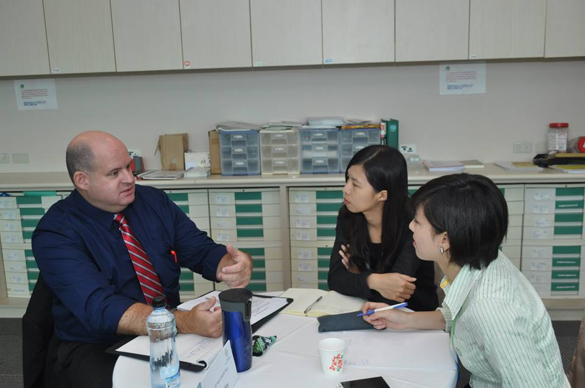
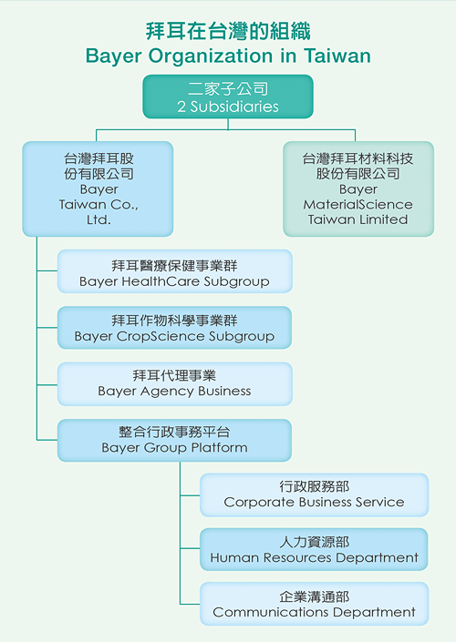
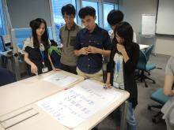
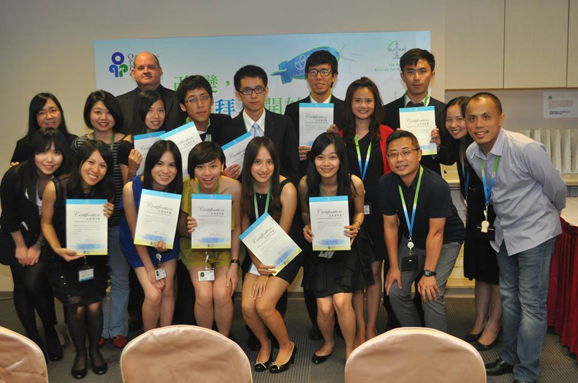

<職涯探索，主管與業師們的分享>

## **實習公司與部門簡介**

拜耳集團 (Bayer) 為[全球前十大藥廠](/posts/top-10-global-big-pharma-1/ "全球十大藥廠介紹 ")，總部設於德國，以化學染料起家，至今已成立150年，在全球有118000位員工，營業額達365億歐元，目前以醫療保健、作物科學和高科技材料為核心產品，集團以此三大子公司為主要營運事業。拜耳於1958年投入台灣市場，1989年在台設立分公司，目前主要有兩大子公司，分別為台灣拜耳材料科技和台灣拜耳（包含醫療保健、作物科學、代理事業等項目），在台至今有近500名的員工，年營業額超過100億新台幣，近年也將有多項產品陸續上市。

我所在的部門為醫療保健事業群的西藥部門，西藥部有幾十種產品遍及全球100多個國家，產品線包含心血管疾病、腫瘤疾病、眼科、女性健康等用藥。由於西藥部門大部份為處方用藥，以醫生為主要客戶，銷售模式與一般行銷不太相同，主要為醫院拜訪、舉辦大型學術研討會、與基金會等單位合作舉辦公益活動等，因此在西藥部門，[業務](/job_function/業務代表/)、[行銷](/job_function/行銷/)和公關部門皆有非常緊密的合作與支援。

## **如何獲得這個機會**

我所參加的實習計劃為 ”卓越領航計畫 Outstanding Pathfinder Program (O.P.P.)” 是由台灣拜耳醫療保健事業群 - 西藥部主導成立，今年已邁入第四屆。拜耳希望透過 On the Job Training (OJT) 的方式，讓學生從工作中學習，不僅讓學生實際執行專案，也透過許多專業的企業訓練課程、職涯探索、團隊合作等，發覺自己的潛能與專長，並與職場接軌，培育台灣學生成為未來的國際菁英。 甄選方式總共分為三個階段： 1) **撰寫履歷**：撰寫拜耳提供的制式履歷，依據 STAR (Situation, Task, Action, Result) 原則，將碰到的問題、任務、行動和結果詳實地具體描述。STAR 原則不僅幫助我釐清許多細節，面試官也可根據 STAR 判斷面試者是否具有縝密的邏輯思考、有效率的行動和目標。 2) **第一階段面試**：這個階段是和初階與高階主管1對1面試，包含自我介紹和履歷問答，讓面試官透過 STAR 更瞭解面試者。 3) **第二階段面試**：採用團體情境模擬的方式，先讓小組有20分鐘的時間閱讀個案，接著有30分鐘的討論時間，最後向現場主管作簡報。整個過程中所有面試官都會當作觀察員，現場記錄面試者的言行舉止，報告時也會有非常逼真地情境模擬，讓我們實際體會面對客戶時可能會遇到的情況，測試我們的臨場反應與應對進退。 甄選上後，我也有詢問面試官當時評估的重點，大致上來面試的人，以商管背景和醫藥背景為主，經歷都相當豐富，在履歷上難分軒輊，因此面試的兩階段便十分重要。除了在1對1面試時，要清楚用 STAR 具體描述經驗外，在第二階段團體面試時，也需要有邏輯、冷靜的思考能力，並在高壓下沈著應對，互相支持其他團隊成員。拜耳非常重視團隊合作，因此能不能傾聽他人意見、給予適當支援，也是他們看重的人格特質。

## **實際工作內容與收穫**

這次實習計劃總共有十個實習生，負責的專案為避孕藥行銷與推廣活動。為什麼會執行此專案，主要是因台灣青少年女發生性行為之年齡逐年下降，在診間意外懷孕的狀況層出不窮，小媽媽懷孕產子，不僅使自己的學業受阻，對下一代的教育和經濟支助也會造成問題。因此，台灣婦產科醫學會於今年大力推動 ”青少女(年)避孕指引”，與臺灣幸福教育協會與台灣拜耳共同合作，希望透過一系列的推廣活動，宣導正確的避孕知識，降低台灣青少女意外懷孕的機率。 在執行專案時，才發覺許多避孕知識和我們原本所想的大有不同，例如台灣使用保險套的比例有40％、德國僅4％而已，但女性意外懷孕率，台灣卻比德國高上6-7倍。此外，在國際上避孕藥已是相當普及的觀念，但在台灣避孕藥卻長期遭汙名化，許多女性認為避孕藥會導致不孕、癌症等嚴重副作用，但已有許多研究證明避孕藥不僅與癌症沒有相關性，且長期服用之女性甚至在停藥之後，可以提高懷孕機率。因此，傳達正確的避孕觀念給台灣青少年女，對我們來說是這兩個月中相當重要的使命，也是每天工作最大的動力。 第一個月，主要在執行品牌計劃書的撰寫，透過街頭市調、基金會訪問和電訪等，觀察青少年女的行為、想法和習慣等，這是行銷當中非常重要的一環，唯有真正瞭解目標客群，才能規劃出精確、有效的行銷策略。這是我第一次如此完整地學習撰寫品牌計劃書，從了解目標客群、資料分析、探索需求、品牌建立，甚至到廣告標頭的發想，都讓我們實際操作與練習。並且藉由每週與行銷主管的開會，一字一句雕琢、互相討論，不斷反覆的思考與腦力激盪，讓我們對行銷與品牌有更全面的認識。

第二個月，分為兩個專案同時進行，一為手冊之撰寫，透過訪問高中老師、家長、藥師等，了解使用者對 ”青少女(年)避孕指引” 之疑惑與建議，撰寫文章並編輯成冊，協助使用者傳達正確的避孕觀念予青少年女。另一為微電影之拍攝，由於許多民眾對避孕藥和保險套仍存有不正確的迷思，因此我們希望藉由活潑的宣導短片，傳達正確的避孕知識。這一個月中，我們實際採訪醫生、與廠商洽談、撰寫劇本、監督拍攝等，透過這些活動讓我們實際瞭解藥廠的行銷模式，並嘗試以[專案經理](/job_function/專案管理/)的角度提出建議與看法。

除了專案執行之外，拜耳也提供了非常多的訓練課程，包括[銷售技巧](/posts/sales-rep-key-success/) (Sale Skills)、教練式技巧 (Coaching)、[專案管理](/posts/byer-project-practice/) (Project Management) 和履歷撰寫等。此外，在德商，Mentor-Mentee 制度是十分重要的傳統，我們每個人都有自己的 Mentor，可以一起討論未來的職涯規劃，獲得許多寶貴的建議與經驗分享。這兩個月，所有實習生也必須完成屬於自己的 ”職涯探索書 (Pathfinder)”，藉由撰寫 STAR 和人格分析測驗，一步步地瞭解自己的特質、專長，並且與主管們討論未來適合的工作職位。這一本職涯探索書 (Pathfinder) 讓我更瞭解自己的特長，雖然對於未來還不是非常明確，但已有較清楚的輪廓和方向，對我將來工作的選擇與規劃有很大的幫助。 在這兩個月當中，除了行銷思維與執行外，我學到最多的是溝通。具備良好的溝通能力，在大規模的跨國公司尤其重要，我觀察到許多高階主管，他們花很多時間在處理人和部門間的協調與合作，而非技術與產品本身。由於我們共有十個實習生，在執行專案時也花許多時間在溝通上，必須確認彼此有一樣的共識和想法，才能有效執行專案。此外，隨時保有正面思考與積極態度也是我在實習當中不斷練習的課題，在工作上不免會遇到挫折與困難，若以消極的態度面對，不僅會讓自己陷入負面氛圍中，也會影響整體團隊的士氣，讓專案更難以執行。

## **給想實習的人的建議**

在拜耳的實習過程中，我瞭解到藥廠的行銷策略與模式，也透過其他部門同仁的分享，讓我對國際藥廠的組織與[分工](/posts/pharma-job-introduction/)有更多的認識。我認為拜耳是一家非常重視人才的公司，對於公司同仁有許多培育與職涯發展的機會，希望把人才放在合適的職位上，並鼓勵不斷進修與自我發展。我們雖然只擔任兩個月的實習生，但拜耳仍十分用心地投入資源在每一位實習生上，專案的執行、訓練課程、業師制度、職涯探索等，希望能培育台灣學生站上國際舞台。

不管未來是否會進入藥廠工作，拜耳的 ”卓越領航計畫 Outstanding Pathfinder Program (O.P.P.)” 都是一個很棒的選擇，我建議在學期間可以多爭取實習機會，讓自己像塊海綿般不斷學習、善用資源。透過實習可以多瞭解什麼樣的產業、工作職位適合自己，把握機會請教公司主管們工作的內容與職涯規劃。我認為學生最大的本錢就是可以不斷嘗試與犯錯，盡量利用學生時期多方接觸，不要為自己設限，也不要害怕失敗。人生的道路很長，有時同樣的終點，會有不同的路線抵達，沒有好與不好，每一條路都會有不同的風景，都值得用心欣賞與體會。

參考資料：[拜耳卓越領航計畫 Outstanding Pathfinder Program (O.P.P.)](http://www.bayerpharma.com.tw/scripts/pages/zh/bayer_opp/index.php)..

去年開始，Connectome 在部落格建置了實習故事專區，我們號召有參與產業實習經驗的朋友撰文分享自己的經歷。我們相信，有更多人的分享、關注，將可帶來更多討論！

填寫問卷，一起分享自己的實習故事：<http://goo.gl/LrczHh> .

.
