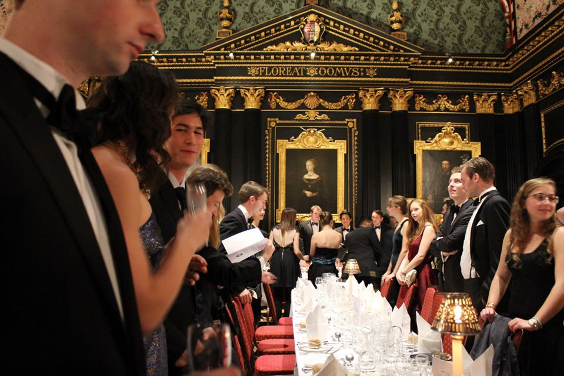

## **生物科學企業碩士簡介**

位於美國大波士頓『劍橋市』的麻省理工學院 (Massachusetts Institute of Technology, MIT) 向來以一流的尖端研發與技術轉移聞名，自1998年起，英國政府為了將MIT豐沛的科技創業風氣引入英國，政府與幾個大企業如英國石油 (British Petroleum, BP )和英國電信 (British Telecom) 合資成立了劍橋－麻省理工學院中心(Cambridge-MIT Institute, CMI)。 CMI的合作範圍相當廣泛，包括創新創業教學、產學合作與知識整合以及相關硬體設置。在大學部，CMI促成了兩校的交換學生計劃，並且在劍橋的大學部課程引入了許多MIT的尖端科技和創業教材。在研究所部分，CMI也推動了數個跨領域碩士學程的成立，MBE課程即是其中兩校創新教學計劃的產物，其它還包括了微奈米科技企業(Micro- andNanotechnology Enterprise)、高階化學工程(Advanced Chemical Engineering)、永續發展工程(Engineering for Sustainable Development)和科技政策(Technology Policy)等跨領域碩士課程。除了正式學位之外，CMI也企圖透過新穎的科技與創新管理(Management ofTechnology and Innovation, MoTI)課程將創新創業的商業知識普及化。 MBE課程每年大約收20-25人，年齡普遍在24-28歲之間，普遍有1-2年以上的工作經驗，但也有許多有豐富實習經驗的社會新鮮人，成員的背景相當多元。以筆者的班級為例，23個成員共來自於15個不同國家，平均每年大約收2-3位華人，專業背景則多半是生命科學或醫學背景，但大多數都有一些業界經驗。由於大部份的同學都有一些工作經驗，教學內容偏向實務，步調相當緊湊但不失精緻。為了貼近真實情境，測驗多半以團體報告形式進行，且非常強調口語和書面表達能力，以及內容的全面性和深入程度，應該是劍橋大學最精實的幾個碩士學程之一，若已有相關背景和心理準備，會是個相當有收獲的一年。

## **核心課程簡介**

MBE的核心課程分成三大領域：科學與科技(Science and Technology, ST)、基礎商學(Business, B)、產業銜接(Transition, T)等。除此之外，前兩個學期（註：劍橋一年共有三個學期）末，必須各繳交約4,000字的「商業中的科學與科技」(Science and Technologyin Business, STB)專題報告，主要針對該學期的重要議題進行深入探討，第三學期則要繳交一份完整的商業企劃(Business Plan)，在學年末則要根據實習主題撰寫一份10,000字的碩士論文，在一年一度的MBE論壇上進行論文發表與口試。 科學與科技系列課程涵蓋相當廣泛，總共分五個模組：ST1為疾病治療(Treating Diseases)，主要是針對重要的醫療疾病進行簡介，並且點出尚未被滿足的醫療需求(unmet medical demands)與商機；ST2和ST3則涵蓋現代藥物開發的流程，從標的探索、藥物篩選與優化、動物試驗、生產和品管、臨床試驗到後續追蹤等各項議題，在藥物分類上，ST2較偏重於小分子藥物(small molecule drugs)而ST3則偏重於生物製劑(biologics)；ST4主要著重醫療儀器於第二個學期教授，內容涵蓋影像診斷、新穎的檢驗試劑、健康輔助器材等等，同時也會介紹醫療器材的開發流程、法律規範和定價與藥物不同之處；ST5則為農業生技，除了傳統的基因改造作物議題，也會提到生物能源等的產業和法規的各個面向，最後會介紹新興領域如合成生物學的展望。此系列課程的測驗方式皆是一個團體簡報與個人書面報告，主題皆從市場上重要的藥物、器材或農業科技實例取材，內容非常實用。 基礎商學系列課程也包含五個模組：前三個模組B1至B3即為先前提到的科技與創新管理MoTI課程，由劍橋嘉治商學院(Cambridge Judge Business School)統一授課，內容涵蓋八個主題，分別為個體經濟學、公司財務、科技產業策略、選擇分析、行銷學、創新模式、組織行為學以及創業學，其中創業學課程是由當地的成功創業家每週二以演講和圓桌討論呈現，由於授課範圍很廣，每個主題僅會簡單提及重點佐以個案討論；B4模組主要為醫療經濟學，主要探討各國健保制度與藥物定價策略；B5則為智慧財產與法律，委外由幾個專利法律事務所統和授課，內容從基礎的智財觀念到生計公司如何與大藥廠談授權以及大學如何管理專利都有。 最後則為產業銜接課程，是實務性最強的部分： 第一學期，先由T3與T4開始，主題為高科技創業，產學經驗豐富的William Bains教授授課，內容從如何評估商機、商業企劃、個案管理、業務開發、募資到各種創業成功和失敗經驗的個案分析。第二學期的重頭戲為T2公司財務與評價，內容從最基本的淨現值分析談起到各種生技公司營收預測的模型與評價的方法；T1課程為業務開發與策略聯盟，主要內容圍繞著如何做一個妥善的『盡職調查』(due diligence)，尤其是一家藥廠或基金如何評估是否併購或與一家生技公司合作。值得一提的是此系列課程為了加強其實務性，其測驗方式也試圖模仿真實情境，例如T3/T4測驗是當天早上分組，發給每個人商業個案，當天下午口頭報告，而T1/T2則是分析真實公司與近期併購案來瞭解公司評價與盡職調查的方法。

## **實務經驗培養：創業競賽、顧問專案、公司參訪、企業實習**

除了演講課程之外，MBE的特色在於兼顧實務經驗的培養。由於MBE畢業校友出路遍佈各大顧問公司、新創公司和大藥廠，實務課程自然也試圖涵蓋這些範疇，讓同學能有更多的職涯選擇。 創業方面，MBE系方積極鼓勵同學參與各種創業競賽，例如：劍橋創業家(Cambridge University Entrepreneurs)、牛劍生技圓桌創業競賽(Oxbridge Biotech Roundtable OneStart Competition)等，不僅可以練習如何撰寫商業企劃和發表創業點子，亦可以學習如何在多元的團隊中扮演不同的角色。對以後想從事顧問業的同學，除了平時可以從團體報告中學習相關技能外，第二學期在MoTI課程有所謂顧問專案，在六個禮拜期間與真實客戶進行專案研究，過去客戶包括安進(Amgen)、英國電信(British Telecom)、ARM等公司。在過程中，可以習得許多商業分析、專案管理、應對進退等能力，是一般以理論授課為主的碩士課程無法提供的。 每年三月，由於與MIT的密切合作，至今MBE每年都會全體前往美國波士頓生技聚落參訪不同的生技、醫材公司和大藥廠，讓學生有機會瞭解產業實務，更重要的是建立當地的人脈，甚至可以直接在畢業後進入參訪的生技公司或大藥廠工作或實習。 每年的第三個學期，就是MBE課程的重頭戲－公司實習。在第一學期末和第二學期初時，同學會與課程主任進行一對一的面談，討論未來的職涯發展，並選擇想要探索的領域和公司形態。由於每個人的背景與個性不盡相同，過去同學曾實習過的公司也自然包羅萬象：凡舉顧問業、創投、生技公司、藥廠、技轉中心、產業協會或政府主管機關等，都有人做過。此外，同學會在學校和業界導師的共同指導之下，根據實習的內容完成碩士論文寫作，論文的標準要求頗高，品質起碼要相當於市售的產業分析報告才能過關，佔全年成績30%，是不能忽略的重要項目。

## **課堂外的劍橋**

劍橋大學是世界最古老的大學之一，在2009年，劍橋才歡度了800年的校慶。 生活在劍橋小鎮是個非常特殊的經歷，去體驗世界一流的科學和深厚文化底藴揉合出的特殊氛圍，對於從未住在歐洲的我更是一個特殊的體驗。許多同學會利用週末搭成廉價航空到歐洲四處旅行，享受背包客的生活，但由於MBE課程忙碌，大概只有在寒假和第三個學期比較有時間去旅行，不過仍是一個相當不錯的體驗。 劍橋最著名的學院制，更是一個讓人可以快速認識不同領域朋友的機會，每週數次的正式晚宴，同學們可以應邀前往任何一個學院，穿著正式西服和哈利波特長袍享受一套完整的西式晚宴：從餐前酒一路到餐後酒，在一年後，一向不諳酒興的我，也可以學會品嘗各式各樣的風味。若是夠積極更可以投入劍橋琳琅滿目的課外活動，例如划船、足球、橄欖球等都相當熱門的運動，亦可以參加各式各樣的特色社團與運動。 最後，歡迎對生技產業和歐洲有興趣的讀者可以考慮加入MBE課程，一同享受這趟美妙的旅程吧！（註：劍橋碩士申請截止時間通常比其他課程晚，可以遲到六月底，所以現在還來得及喔!）

**專欄簡介** 本專欄將記錄作者於英國劍橋大學攻讀生物科學企業碩士其間的所見所聞，佐以美國、歐洲和新興市場的生技產業發展情形，提供讀者生物科技、醫藥，照護、醫材乃至農業科技產業更開闊的全球視野。同時，本專欄將不定期摘錄服務於生技產業的資深產、官、學界的前輩，對特定議題做更深入的探討並且分享職涯心得與經驗。然而由於作者在生技領域仍屬後生晚輩，文章觀察和見解若有偏頗或失真之處，還請各位前輩們多多給予指教。

您也有海外生技產業的獨特經驗嗎？您也同樣擁有滿腔熱血無處發揮嗎？ 還在等什麼！快來了解[【](/posts/oversea-connection-sharing-recruit/)[海外連結計畫](/events/oversea-connection-sharing-recruit/)[】](/posts/oversea-connection-sharing-recruit/)、[【填寫分享者問卷】](https://docs.google.com/forms/d/1aYMzLTGLxf7LDBiNLigDW4kmwj7LXZlTnytdY7exSZ0/viewform)，讓 Connectome 為您規劃專屬的分享空間吧！
