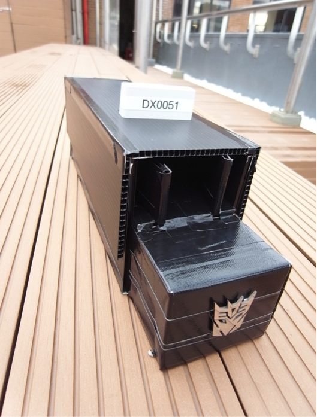

## **離開象牙塔與客戶面對面**

最一開始，他們即被多位業師提醒，「你們要走向客戶。就像是創業的首要條件，你要弄清楚客戶真正的需求是什麼。」因此，在做出第一代模型、且合作醫師經過 IRB 核准後，他們終於開始進入醫院。檢測流程如下：胸水檢體（或針刺抽吸術取出的細胞），以 BMVC 染色後流過特殊細胞處理系統將死細胞或雜質濾掉，再以適當光源激發、數位相機拍照截取，與對照組比較計算出數值。實際與醫療人員接觸。育霖、翊庭這才終於體會到與客戶接觸的重要。先前在實驗室所追求的「降低成本、縮小機器、一味提高靈敏度」根本不是醫生、醫檢師或病人所在乎的。反而，「全自動化、流程快速簡便、高準確度」才是首要考量。而且，走入醫院之後，他們才確立自己的定位。發展這個癌細胞偵測儀器的目的不應在於取代醫檢師，而是在臨床醫師、病理學、血管攝影等等技術之外多一項參考值。這樣一來，除了使得醫師在結果判讀多了一個參考因子，更使得原本極度仰賴醫檢師經驗的細胞抹片判讀轉而變成可以在不影響原本標準流程的前提之下減輕醫檢師的工作壓力（注）。他們深刻的體會到做研究的應用面是需要與你的客戶聊過才真的知道自己產品的核心價值是什麼，也才知道未來該朝什麼方向努力。

(注) 由於在團隊中有醫師的參與討論，他們得以明瞭在臨床上第一線的需求。此外醫生原本就會對病人引流的胸水取樣做檢測。但通常引流出的胸水體積極大，本來就會留下來很多用不到，不需額外再扎針。因此開發此檢測工具除了可給醫生多一道證據上的輔佐，也不會對病人造成負擔。同時增加一個參考資訊，讓醫師診斷上的失誤率大幅下降。

.

## **帶動正向討論激盪出創意思考**

比起實驗室中單純的細胞株，醫院檢體中會產生螢光雜訊比較多。而且正常細胞死去也造成 BMVC 的偽陽性訊號，因此雜訊要怎麼篩除成為他們第一個面臨的難題。實際收集醫院檢體數據的過程，他們一邊修正儀器模型以及檢驗流程。如何加強有意義的訊號、又要濾除雜訊，成了過程中一直在腦力激盪的。育霖、翊庭把在 Boot Camp 所學帶回實驗室給實驗室其他成員。他們結合了設計思考 (Design Thinking) 的模式在實驗室帶領討論。曾經嘗試各式各樣的材料抓取細胞，甚至連絲襪、衛生紙都拿來嘗試，後來在幾次瘋狂點子的修正後，找到了提高訊雜比的方法。

當時他們有感於現有實驗室的 meeting 方式常常因為太制式，反而可能扼殺創意。因此在他們這樣的討論過程中，非常重要的元素之一便是「每個人都有平等發言權，過程不可以說別人的提議不好，只可以提出正向的修改意見。」他們鼓勵大家一直提出新的想法，替 lab meeting 注入活絡的討論氣氛。同時讓一些瘋狂點子在眾人的討論之後，變成可行的、實際的解決方法，在他們的討論中，有很多很棒的點子都是在這些歡樂氣氛中誕生。

[儀器 Prototype ] 採訪後，他們秀出手工組裝的儀器原型，現在已有改良到第二個版本了呢！他們現在專注在儀器的改良，試圖更增進他們想要達到「快速簡便」的目的。

## **多聽多討論- Ask for Feedback**

在 Boot Camp 他們還學到一件事：逮到機會就要把自己的構想拋出來與人討論。這個忠告是來自於有一次，他們與業師提到一個想法是，他們想要開發一個「在家檢測血便即可知道是否罹患大腸癌的儀器」。但沒想到被業師一句話：「沒有人想在家檢測自己有沒有癌症的！」簡單帶過。這個小經驗讓他們學到，研發者不能一頭鑽進自己的理想世界，需要多與各界的人聊聊自己的東西，隨時做修正。

在 Boot Camp 中，他們也發現和人分享可以獲得更多的東西，有的時候閉門造車只會浪費自己的時間。在幾次 Boot Camp 的討論中，他們也從其他團隊的成果中找到合作的可能性，甚至把競爭的對手轉變成合作夥伴，並且認識了其他團隊中熱血的青年，讓 Boot Camp 的討論產出一加一大於二的效果。

.

## **你夠積極嗎？**

參與 Boot Camp 培訓當中衝擊最大的事情是什麼？育霖尷尬地笑著說，「我一直以為自己是一個還算積極的人。」當初 Boot Camp 要求的市場調查評比，他們簡單列出三項市面上類似的癌細胞檢驗產品比較其成本、原理、準確度等項目。業師林群倫經理看了直搖頭，狠狠地給他們上了一課。「你知不知道世界上有多少人和你做類似的事情？做到哪一步？有誰成功了？他們又是怎麼做的？他們的優勢和弱點在哪裡？」他建議，平時應該要有累積你所學的習慣，用 Excel 檔把看過的資料隨手表列整理。後來翊庭把所有病人的病歷都拿出來一筆一筆看，看該病患得過什麼病，可能用過什麼藥會影響實驗結果都拿出來比一比，整理成表。另外，Google 搜尋得到的相關資料，哪怕是新聞、廣告，或是研究論文發表，他決心一筆筆登錄。他們這才體會原來這當中有許多功夫要下。「很多人感歎台灣生技產業環境不好，產學合作問題多，」育霖走過一趟訓練營有感而發：「其實很多時候我們自己都做得不夠好，怪不了別人。真的是要夠主動積極累積所學，自己的實力才會出來。」

.

## **結語**

採訪育霖、翊庭兩人的過程非常愉快。他們積極主動的背後都源自於對自己的相信、對科學的信心、以及想要讓社會更好的責任心。他們相信自己不論投身教育或產業，都能夠帶來改變。Boot Camp 就像是一張網，可以匯聚許多有熱血、甚至也想要創業的人。參與培訓除了增強自己的視野及實力之外，透過這些種子一代代傳承也將會吸引更多人投入。最後期待能發展成為一個巨大的網絡。

受訪者：中研院原分所博士後研究助理 蔡育霖，中研院原分所助理 林翊庭 

採訪者：Connectome 團隊 蔡宜璇 吳元亨 陳明正
