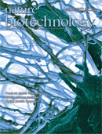

 

七月初由美國 FDA 發表的加速藥物審查的[計畫](http://www.fda.gov/Drugs/ucm309182.htm "FDA 法規原文")之中，同意患有高度轉移性乳癌的病人可以接受數個月的新型療法。這個計畫也同意讓未曾接受過治療的病人，在首次治療時即可用新型療法。由於傳統人體試驗只能將新型療法使用在對現行可用的療法都沒有反應的病人身上，此計畫也顯示出與以往傳統人體試驗的差異。FDA 此舉可能可以加速辨認出有潛力的癌症藥物，並且增加以現行療法難以治療的癌症病人存活率。 本期的 Nature Biotechnology 就針對數種最新型的技術進行探訪，其中包括了單細胞分析 (single-cell analysis)、基因工程鼠模型，甚至是不同的實驗處理方法，像是利用溶瘤病毒治療癌症。此外，了解癌症的基因體學更能夠幫助我們了解不同癌症中未曾被發現過的表觀基因差異性 (epigenetic heterogenicity)。然而隨著研究方法改良，深入對於癌症生物學的基礎認識，卻也同時突顯出對抗癌症在臨床上的進展是多麼的緩慢。 在今日，籌備癌症臨床試驗的期間可能從六個月到兩年之久，等到試驗正式開始的時候，許多用來測試的模型可能已經過時了。舉例來說，現在用在人體試驗的溶瘤病毒已經是較為早期的病毒株。設立癌症臨床試驗之所以花上那麼長時間，其中一個原因是難以蒐集到合適的病人。雖然目前推測有20%的病人是進行癌症臨床試驗的合適人選，但考量到病人的生活品質、醫療保險給付等問題，實際上只有少於3%的病人適合進行臨床試驗，對某些罕見癌症及青少年癌症來說，適合進行臨床試驗的病人比例更少。 另一方面，隨著癌症病人的照護標準提高，臨床試驗中的新藥對於是否能延長病人壽命的門檻也隨之提高。如果遵循所謂的黃金標準 - 也就是觀察新藥能不能延長病人壽命 - 卻也表示臨床試驗將會進行更長的時間。於是，立法者 (像是 FDA) 有時也會設立新的藥物批准標準。例如 Pfizer 的 Xalkori 被批准用於治療轉移性肺癌，依據的就是病人腫瘤在固定時間內縮小的程度。但即使臨床試驗上提出新藥有顯著增加存活率的證據，臨床受益依然是模擬兩可的，原因是在現存的癌症臨床試驗中，有太多的具類似功效的試驗。 大多數的癌症藥物通常是混合處方中的一部分 (大多數的處方為細胞毒殺用藥加上針對分子機制的藥物)，而直到現在，許多新的實驗性療法都是獨自測試或是與現行已核准的藥物共同給予病人，未來審查者應該增加將新型的藥物組合做為第一線藥物的嘗試。此外，因為癌細胞本身的複雜性，加上其內部訊息傳導路徑的失調，將會導致現行藥物無法順利治療癌症，因此儘管臨床試驗的設計也不斷在創新，但我們對於癌症的了解，或發現其異質性的程度，卻遠超過試驗創新的速度，造成了文章開始提到癌症藥物開發延宕的議題。 如何系統性的決定癌症治療藥物的組合，以及這種組合適用於何種癌症病患，也是需要考量的問題之一。直至現今，大多數組合裡的藥物都是針對數條已知的癌症分子機制，而隨著分子生物學及生物標記 (Biomarker) 的發展，將可讓我們透過新知及系統性的模型測試對癌症的雞尾酒療法有更多了解。 最後一個問題是如何決定組合裡藥物之間合適的劑量。目前常見的方式，即讓研究人員隨著臨床試驗的結果調整適當劑量，像是目前針對乳癌的 I-SPY 試驗以及針對肺癌的 BATTLE 試驗都是採用這種方式。 對於目前大量進行中的癌症臨床試驗，我們最終要問的問題是，在病人不足的情況下，如何決定各臨床試驗實行的先後順序？科學的進展已經可以針對各別癌症找出最適合的藥物組合，但文化上的差異、專利權、訴訟案的可能性、行政程序的繁文縟節、以及 FDA 對於法規的表述不清將會造成臨床試驗的速度更加倍延宕，然而這對缺少時間的癌症病人來說並不是好消息。 . 本篇討論了幾個在癌症藥物臨床試驗中的重要問題，包括病人不易募集、法律的限制導致臨床試驗結果不明確、如何有系統性的決定癌症藥物組合及劑量。而這些將可能隨著 FDA 新頒布的臨床試驗規則得到改善，抑或有可能停留在現階段煩瑣冗長的行政程序中。回頭看看台灣，或許可以思考如何優化臨床試驗中的行政手續，以加速藥物的測試以及結果蒐集。

原文連結 (Editorial)：<http://www.nature.com/nbt/journal/v30/n7/full/nbt.2315.html> Nature Biotechnology, volume 30, number 7, page 567
