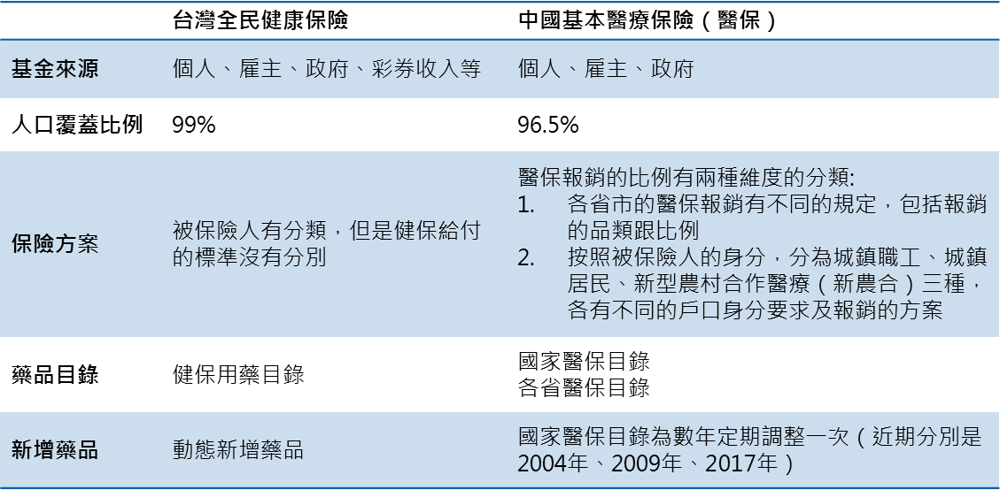

根據統計，2016 年中國整體醫藥市場為 1,167 億美金，在全球排名已經於 2013 年超過日本，成為全球第二大市場。據估計未來 5 年仍會以每年 7% 的增長率持續增加，尤其是在跟其他國家比較的時候，更可以看出中國在醫藥市場還有繼續增長的空間。這邊舉兩個常用的指標為例：

1. **衛生醫療費用佔 GDP 之占比**：2014 年 World Bank 資料顯示，中國衛生醫療費用佔 GDP 的占比為 5.5%，相比於 OECD 國家的水準（4.3 - 16.5%；中位數是 9.1%），還有空間可以繼續增加，其中也包括藥費的空間。

2. **人均醫療衛生費用支出**：同樣是 World Bank 的資料，可以看到中國 2014 年人均醫療衛生費用是 420 美金，相對於 OECD 國家的水準（1,002 - 9,035；中位數 3,890），也還有繼續增加的空間（[world bank](http://data.worldbank.org/indicator/SH.XPD.PCAP)）。

中國市場雖然這麼大，但是對於台灣的廠商來說，機會是否真的有那麼大？其實不一定。例如中國市場裡面有很大一塊是中藥的部分（包括中成藥及中藥注射劑等）。將之扣除以後，西藥的部分大概佔 80%（醫院市場）。同時中國政府已經啟動醫療改革多年，以各種辦法來限制醫藥費用的快速增加，未來高速成長的可持續性還有變數。

為了能更仔細的描繪中國市場，以及市場的特性，在這裡就先介紹一下兩邊健保（醫保）制度的差異。

雖然起步較晚，中國在近年大力地增加醫療保險的覆蓋，同時大幅投資改善醫院醫療設備，特別是基層醫療機構及偏遠地區，所以整體的醫療水準有大幅的提升。同時因為醫保覆蓋的增加（每年醫保報銷的比例及支付上限等條件都有所調高），也病患看診時的負擔相對減少，因此個人支出佔整體醫療支出的比例近年來降到不到30%（2016年），已經低於台灣的 34%（2016年）。

先撇開兩邊醫療品質的差異，直接從健保（醫保）制度上來說，最大的不同是中國的醫保因為歷史因素以及各地的差異，所以沒有全國統一的制度。這個差異會展現在兩個方面。第一個方面是就保身分的差異。根據戶口所在的地方以及是否有給在職公司加保，會有不一樣的醫保方案。例如在城市的話，就是參加當地的城鎮職工（由公司投保）或是城鎮居民醫保（個人投保），而如果在農村的話，則是參加新農合。一般來說，新農合（新型農村合作醫療）的報銷範圍跟比例較低，但是未來這個情形會改變（詳見後文）。

另一個方面是因為各地的經濟發展跟消費水準都不一樣，同時醫保基金的籌資及管理都是由地方管轄，所以各地的醫保給付的水準就都不一樣。一般來說，北京、上海、廣州、浙江、江蘇、青島等沿海發達省市的報銷覆蓋較高，或者是對於一些新的藥物如癌症的靶向藥（標靶藥）會較快地納入醫保報銷範圍（2019 年更新：目前國家醫保目錄的持續更新，讓新的藥物能以較一致的速度進入各地的醫保覆蓋）。另外省市的差異會造成異地結算的問題，也就是當一個人的醫保是跟著某一省市的，但是到其他省市看病的時候，必須要自己先自費結算，看完病或手術後再跟原本的醫保單位申請報銷，對於做重大手術或處置的人，先行墊付會是很大的負擔。不過這個問題也將會在近期全國醫保聯網後漸漸被解決。

中國的醫保目前達到了全覆蓋的目標（覆蓋 96.3% 的人口），因此現在醫保的目標轉而改善覆蓋的結構，一個是 **消除因不同的醫保身分造成知保障差異**。這個部分國務院已經發文要求各地醫保單位在 2017 年底展開二保合一（整合城鎮居民與新農合醫保），以減少醫保身分的差異。另一個做法是 **醫保報銷（給付）的範圍增加**。在 2017 年 2 月公佈的全國醫保目錄當中新增了 339 個藥品品項（例如新增了糖尿病藥 DPP-IV 抑制劑），達到中西藥總共有 2,535 個品項。另外 2017 下半年還有增加經過藥商與國家談判機制的 36 個品項 （以高價藥為主），以及浙江省還加碼準備進行 35 個品項的省醫保談判。（2019 年更新：2018 年又有一輪經國家談判機制納入醫保的 17 個品項）。對於廠商來說這個趨勢是重大的利多。這裡列舉幾個方面：第一個是農村地區的病人支付能力會提升，因為新農合醫保與城鎮方案整合後，將採用城鎮醫保的報銷範圍，所以報銷的比例提高，或是可以用更多新的藥物，更有利於廣闊市場的進入。第二個是全國及省醫保目錄品項的增加，可以讓這些新增的藥物得到醫保的給付，進一步打開市場，特別對於高價藥的銷售提升影響更大。在進入各省市場裡還有非常重要的一環就是招標集中採購，以後將另文說明。

一方面醫保範圍的增加，開拓了更多市場的空間，另一方面中國政府在使用端進行合理用藥、總額給付限制、藥佔比規定、醫院集團採購等控費手段，來限制不管是藥品使用量或是藥品價格，進而限制藥費的增長，其中也包括越來越紅的 DRG 跟點數法（2019 年更新：2018 年底開始的帶量採購，將常用的藥品的價格進一步再砍了一次，而且可能會有更多輪的帶量採購）。同時在上述醫保談判增加的品項，各地的執行狀況不一，例如就有新聞提到某些地方的醫院的採購速度就比較慢。最後對於不同的廠商來說，受到的影響也是不同的，例如高價藥被移到門前藥局販賣，以求不被計算在醫院的藥費支出，以及輸液產品使用受限等等。

最後總結來說，中國醫藥市場正在往市場化的方向進一步地開放，因此未來的市場會持續的增長，包括醫保整合以及醫保目錄的擴增等因素，但是另一方面還有許多措施在限制藥費增長。

不論如何，這幾年政策的變化非常迅速，中國政府真的是猛踩油門快速地推進各種醫療改革，包括在醫保支付、醫院處方、藥品開發、藥品流通、藥品採購等方面，所以這篇文章提到的狀況有可能很快就會不一樣，對於想進入中國市場的廠商也需時時注意最新的變化。

＊ 作者聲明：以上言論為作者之個人觀察心得，不代表任職公司之立場 ＊ 

#### 資料來源:

1. IMS market prognosis 2017-2021
2. 中國醫療衛生事業發展報告 2016
3. 國民醫療保健支出統計 2015 年
4. E 藥經理人 http://mp.weixin.qq.com/s/au7HibXdL_eMxpLX8SI4vQ
