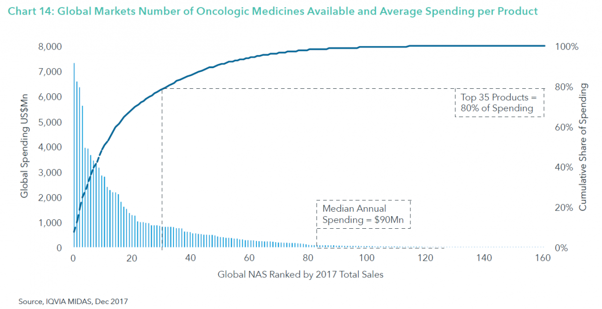

（上圖為電影《我不是藥神》劇照）

首先先介紹電影的背景，以下摘自維基百科對這個事件的介紹。

*江蘇省無錫市一家針織品出口企業的老闆陸勇是一名慢性粒細胞性白血病患者。因所服用的治療藥物格列衛（Glivec）價格過於高昂，家中積蓄幾乎要掏空。陸勇發現一款印度學名藥，療效相似，陸勇自己先開始服用學名藥，發現確實有效後，介紹給其他白血病患者，並違法使用信用卡自印度引進在中國未上市的學名藥。後來陸勇被警察以妨害信用卡管理犯罪、銷售假藥罪逮捕。陸勇被捕後有數百名患者聯名上書，請求免除對陸的起訴。最後，法院撤銷起訴，陸勇獲釋。*(1)

這個事件發生在 2015 年，當時的確癌症藥品在可及性上有很大的阻礙。一方面是當時藥品審查速度過慢，導致很多藥比國外慢了好幾年才在中國上市；另一方面是病人負擔過高，除了藥價高，且很多藥沒有醫保補助。因此有些病患跑到香港去買藥，因為香港藥價比較便宜，另外也有些人就像陸勇一樣，買印度的學名藥。

其中必須要先提到的就是，Glivec 的原廠在當時已經有提供患者援助計畫，讓符合條件的患者領到部份免費的藥品(2)，另外其實當時在一些省市已經有醫保補助，但是這樣的負擔還是讓很多患者無法維持治療。

不過近幾年來，中國醫藥產業的環境已經有很大的改變，延續我在[上篇文章](/posts/china-market-column-1/)談到的話題，光是政策已有很大的改變，再加上中國生技公司的持續蓬勃發展，所以在癌症藥物的可及性已經有相當大程度的改善，以下分開詳述。

**1. 藥證審查流程加速**

近年來，中國藥監局一方面投入人手及資源，增加審查的能量，一方面開放優先審評的綠色通道(3)，加速符合高醫療需求的藥品能夠盡快上市，一方面以臨床數據自查的方式(4)，減少舊有案件的積壓跟排隊過久的問題。如此以多管齊下的方式，來加速藥品上市。

後來像是 Tagrisso 這個針對肺癌的標靶藥物，在中國的上市速度就增加許多，從臨床試驗審批到上市申請核准，都經過快速通道加速，最後只比美國 FDA 核准晚了 15 個月就在中國上市了(5)。

不只是原廠藥，學名藥也可以經由優先審評的綠色通道快速上市，像是電影裡提到的 Glivec 在中國也已經有學名藥可以使用，訂價約為原廠藥的十分之一，提供患者更多的選擇(6)。

除了審查流程的加速之外，中國也準備認可國外臨床試驗的結果，用於查驗登記文件的申請，從而放寬必須要在中國做臨床試驗的規定，如此可以提前國外藥品上市的時間(7)。

最後針對尚未在中國核准上市的產品，在特定情形下，在海南博鰲(8)以及上海(9)將可以先行進口使用，更快地給患者使用到最新的藥品。

因此這些措施加起來，都大大的簡化了上市審查的手續以及加快了審查的時間，讓癌症藥能夠更快地上市。

**2. 癌症藥品可及性提高**

如[上次文章](/posts/china-market-column-1/)的分享，針對癌症藥品的醫保覆蓋正在增加，像是去年（2017）國家醫保談判就已經把 Glivec 納入國家醫保目錄(10)，現在已經在多個省市落實。而且今年（2018）下半年預計會再啟動另一輪的高價藥醫保談判(11)，並點名目前仍是獨家的癌症藥品藥納入，一方面加速藥物被給付的速度，一方面進行降價談判。

另外針對國外進口的癌症藥品，中國也在今年（2018）宣布自 5 月 1 日起減免關稅(12)，以進一步降低藥品售價。這些措施最終都希望能夠達到降低價格，增加醫保給付，以減輕癌症病患的負擔。

在癌症藥品的可及性提高後，可以預期的是醫保基金的負擔將會大大地增加，在醫保基金不會無限制的增長之下，未來再納入癌症新藥的空間是會被壓縮的。例如剛在中國上市的 Opdivo 以及其他近期會上市或正在研發的免疫腫瘤藥品，治療價格將會比現有的標靶藥物更高，在醫保基金空間有限的情形下，因此未來納入醫保的機制以及評估方式是否仍依照現有的做法將會需要再觀察。

**3. 海量的研發產品數量**

先從全球範圍來看，癌症治療已經與過去有極大程度的不同，例如下圖是 2006 年跟 2016 年可用於治療非小細胞肺癌的藥物比較(13)，可以看到可用治療選項的數目與複雜度都增加非常多。

未來癌症治療領域的藥品數量同樣將會越來越多，例如在免疫腫瘤藥品的類別中，會有更多的在研產品來自於新的作用機制（MoA），如下圖所示(14)。而且幾乎每個主要的癌種都有多個機制的藥品正在開發。代表未來在免疫腫瘤的領域也是非常地競爭。

未來這麼多的癌症藥品出現，不管是標靶藥物或是免疫腫瘤藥物，都會讓癌症治療領域越來越擁擠，使得新上市的產品能夠分得的市場份額越來越小。例如下圖統計(14)，2017 年全球銷售排名前 35 的癌症藥品，佔了全球銷售金額的 80%，如果用平均值來算的話，排名前 35 名的前段班的產品的平均銷售額是後段班（第 35-160 名）的 14 倍。因此如果僅是 Me-too 或是 Me-better 的產品，可能因為面對的競爭者太多，以及優勢不夠，所以真的上市後，市場潛力可能不會像當初開發時想像地那麼高，或是能夠持續市場優勢的時間變更短了。

如上所述，在全球的確有非常多新的產品在研發當中，對照來看，中國現在在癌症創新藥研發的熱度也不惶多讓。以 PD-1/PD-L1 這個靶點來說，除了已上市的 Opdivo 之外，目前有 4 個產品在申請上市，另外還有 20 個產品申報了臨床試驗，進行的臨床研究有 57 個(15)。等到時候這些相類似的產品陸續上市以後，將會有激烈的競爭。當然對於患者來說，不斷地有更新的產品出現，其實對於治療會有更多的幫助，而且激烈競爭下的價格也就不會太高了。

總括來說，近幾年來在中國的變化真的很多，包括政策的開放、國外海歸人員帶回來的技術、以及資本的投入，都讓中國的生技產業有不一樣的面貌。同時在需求端，不管是在價格調降或是醫保補助上，都讓藥品的可及性有所提升。因此在觀眾看完《我不是藥神》以後，可能會因為故事裡患者的掙扎而感動，但是在產業裡的人其實對於這樣的議題早就拋在腦後，因為整個產業的趨勢已經朝向一個良性的方向快速前進。

資料來源：

1. <https://zh.wikipedia.org/wiki/%E9%99%86%E5%8B%87%E6%A1%88>
2. <http://www.chinacharityfederation.org/ProjectShow/9/13.html>
3. <http://www.lnfda.gov.cn/CL1444/45018.html>
4. <http://www.cnppa.org/index.php/home/news/show/id/514/sortid/18.html>
5. <https://xueqiu.com/8965749698/83042629>
6. <http://www.xanda.cn/>
7. <http://samr.cfda.gov.cn/WS01/CL0050/222386.html>
8. <http://samr.saic.gov.cn/xw/yw/zj/201804/t20180426_273934.html>
9. <http://eng.sfda.gov.cn/WS01/CL0005/230050.html>
10. <https://db.yaozh.com/yibao/detail?type=yibao&id=1019>
11. <http://big5.xinhuanet.com/gate/big5/www.xinhuanet.com/fortune/2018-07/08/c_1123093827.htm>
12. <http://gss.mof.gov.cn/zhengwuxinxi/zhengcejiedu/201806/t20180608_2922018.html>
13. <https://www.iqvia.com/institute/reports>; Global Oncology Trends 2017
14. <https://www.iqvia.com/institute/reports>; Global Oncology Trends 2018
15. <https://mp.weixin.qq.com/s/jro3PQV0CAns7op5dfx2zA>
