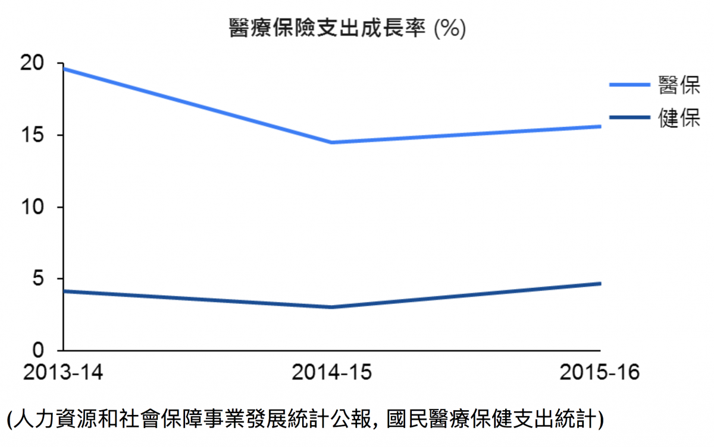
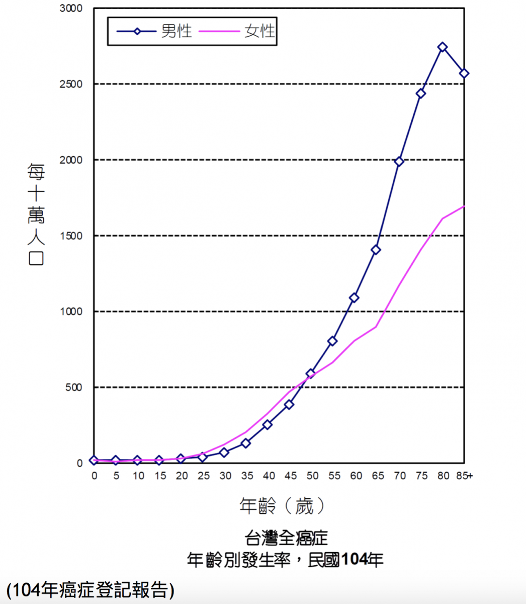

上圖來源 [Pictures of Money](https://www.flickr.com/photos/pictures-of-money/17307624302)

**癌症藥品在醫保目錄的更新**

2018年10月的時候，中國國家醫保目錄又更新了，這次共有17個癌症藥品納入了國家醫保目錄。連同前兩次的更新，近幾年已經有2+15+17共34個癌症藥品透過國家藥價談判的機制，新納入醫保給付的範圍。詳細如下圖，而藥價談判的結果是標價（list price）25%~75%不等的降價幅度(註1)。

**健保與醫保的癌症藥品給付比較**

這34個癌症藥品，去除只在中國有上市的本土藥品之外，大多數的藥品其實都已經在台灣納入健保，有的時間差距還蠻久的(註2)，例如Iressa在2004年納入健保，醫保則是2016年納入國家目錄。除了進入醫保的時間長之外，這個差異一方面也是受制於產品上市時間的差異，可以看[上一篇文章](/posts/china-market-column-2/)的介紹。

不過在近三次的藥價談判納入多個藥品之後，這個時間差距已經越來越小，例如Zykadia, Inlyta, Imbruvica都是在2017年的時候剛進入健保，而這三個藥在2018年10月的時候，也都進入了國家醫保目錄。還有就是Tagrisso跟Ninlaro這兩個藥品，則是已經進了醫保但是還沒納進健保。

這邊也要說明一下，藥品納入國家醫保後，還要等各省市調整醫保目錄才會真正執行，同時各省報銷比例也會不同，最後還有醫院的採購跟控費的考量，(這也是為什麼最近有討論要放寬醫院藥佔比的限制)，因此醫保在納入藥品後的執行速度跟範圍上，會與健保不一樣。

而對於外商藥廠來說，這是一個重要的趨勢。如上所述，藥品通常需要大幅降價(註1)，才有可能進入醫保。在價格降低跟銷量增長的權衡考量下，有些藥廠本來是比較遲疑的，但是隨著越來越多的藥品透過談判進入醫保目錄，在競爭者納入醫保之後，其實也就比較有理由說服總部進行降價來進入醫保。而這個趨勢是不是同時能減輕一點台灣分公司跟健保談判的壓力(如果醫保的價格比較低或是將會比較低的話，可能比較容易跟總部爭取較低的健保價)，也就值得觀察了。

**健保 / 醫保的壓力**

台灣在新藥納入健保這一塊比較保守，是來自於財務狀況的壓力，所以要將藥費控制在較低的成長率。常見有三種處理的方式:1)延後納入健保給付的時間; 2)限定給付適應症或是治療人群，例如C型肝炎以及免疫腫瘤藥物的給付; 3)壓低價格。然而這個財務壓力在未來只會更大不會更小，以簡單的數學概念來說，這是因為健保的收入基本上不會有大幅的增加，但是支出增加的幅度卻是有加速的趨勢。

以收入來說，在健保收費基礎(個人所得)沒有大幅增加，但健保費率可能也無法大幅增加的情況下，健保收入頂多就是維持現有的增速或是小幅成長。

而醫療支出則是基於實質的需求，這直接受到人口老化的影響，除了已知老年人口數目快速增加之外(量的增加)，在醫療需求上也是增加的(質的增加)。依據健保署的資料估計(註3)，65歲以上年長者的平均每年每人健保支出是50-65歲族群的約2倍，是15-50歲的約5倍，所以每增加一名年長者的醫療支出，其實是遠高於其他年齡族群的。而健保預算估算的成長率似乎看不出有調整到這一部分(質的變化)，或是調整得不夠，因此健保會一直承受較大的財務壓力，而且這個壓力會越來越大。

整體而言，中國醫保的壓力”相對”沒有這麼大。除了人口結構的不同外，一方面也是因為醫保覆蓋範圍的調整也是近年才大幅度增加，整體基金仍有結餘。如下圖比較，醫保的支出成長速度比健保的成長還要高。不過未來的趨勢就仍需要觀察。

**癌症藥品給付的趨勢**

上述人口老化的情形其實也與癌症有關，由下圖可得知癌症發生率是隨著年齡而不斷增加的，所以台灣的癌症治療需求也會隨著人口老化一直增加。

而隨著新的癌症藥品研發上市，許多癌症已經越來越像慢性病，可以藉由不同的手段控制病情，同時也就增加了包括藥品在內的醫療費用。而且藥品的效果越好，病人使用的期間也會加長，不管是同一藥品，或是多線藥品接續使用。總結來說，癌症藥品能夠幫助癌症病人延長壽命、減緩症狀絕對是好事，不過對於健保的財務來說，就需要有更好的規劃，不然會跟不上疾病治療的需求。

註:

1. 有些藥品原本已經有慈善贈藥計畫（台灣稱恩慈計畫），所以價格會比標價(list price)還要低。因此藥價談判的實際降幅可能不會像文中以標價計算的降價幅度那麼多。

2. 這裡比較的是納入國家醫保目錄的時間點，有些藥品會更早納入省醫保或是大病醫保目錄。

3. 這邊的計算只能當作參考，因為是以2017年分年齡段的健保支出資料以及人口數來估計，並沒有計入過去及未來醫療科技改變，對於疾病發生、診斷、治療的影響。
