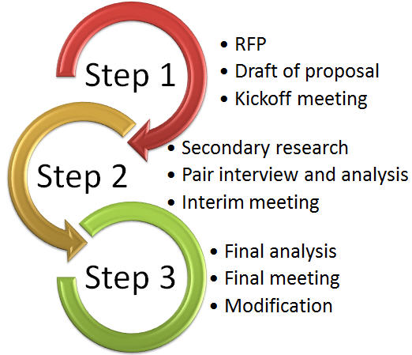
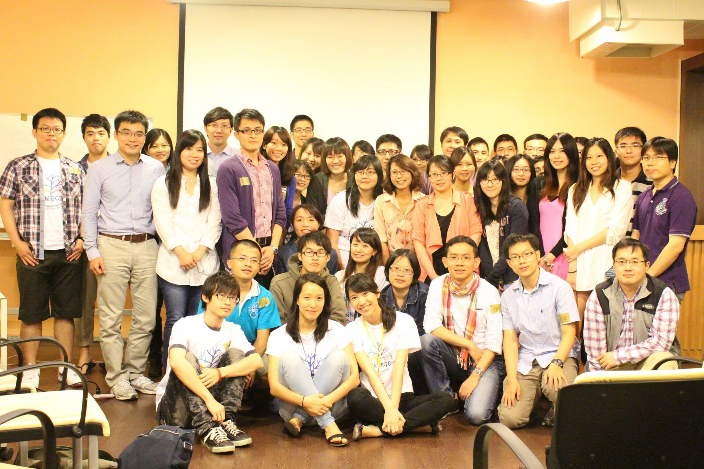

Jason畢業於台大生科系，起初選擇以植物學為專長，順利執行了大專生專題研究計畫，和阿拉伯芥相處約莫一年的時間，也因此知道這並不是自己的興趣。大學畢業後他選擇先盡完對國家的義務，在服役期間也思考自己的未來，知道自己仍想出國深造，因此退伍後以申請出國為目標，但對於選擇何種專業則十分謹慎，花了大量時間探索自己真正的想法，除了蒐集許多前人的經驗資訊外，也尋求多位相關領域教授之建議，另一方面更利用時間到陽明大學旁聽課程，最後發現自己並不適合實驗室生活，故最後在學姊的建議下申請到明尼蘇達大學攻讀公共衛生碩士學位，求學期間其實他本身對於金融投資業已十分有興趣，故也利用時間準備、考取特許財金分析師（CFA）等級一的認證。

## 誤打誤撞進入醫藥顧問業- 

## 沒丟過超過一百封履歷，別說你認真找工作過

本以為學成後即可找到一份穩定工作，豈知當時（2009年）正逢美國經濟不景氣，Jason要離開學校前陸續投出超過100多封履歷，卻僅得到5個面試的機會，最終有家公司願意給予工作機會，正和好友普天同慶時卻傳來晴天霹靂：該公司因為未注意Jason的國籍身分，無法提供外國人工作簽證，使得錄取成為烏龍一場，此時Jason當然倍感挫折，但也藉這一段時間練就自己有效率尋找工作的能力，在此不吝分享給大家。

**有效運用重點網站可大大增加找工作的效率**

在這個時代資訊的取得、個人的曝光皆已和網路離不開邊，利用現有的數個聯通型網站可以使得找工作事半功倍，其中如大家已不陌生的[Linkedin](http://www.linkedin.com/) 作為 professional network ，而 [Biospace](http://www.biospace.com/) 和 [Fiercebiotech](www.fiercebiotech.com/) 則收錄不同類別的美國國內生技公司資訊； [Yahoo finance](http://finance.yahoo.com/) 也提供另一分類管道； [Vault](http://www.vault.com/) 則有許多和顧問業、投資業相關的公司資訊；另一方面，中國大陸的[智聯招聘網](http://www.zhaopin.com/) 、 [528 招聘網](http://www.528.com.cn/) 以及其他不勝枚舉相關網站則將眾多中國大陸的工作機會列出。 Jason 提醒大家，雖然投出超過100多封履歷，但是其實是有系統地而不是亂槍打鳥，是需要花時間研究的，首先可以藉由上述的網站先整理出自己有興趣的產業及公司清單，接著再到這些公司網站裡看自己對哪種類型的工作有興趣，一開始可能會完全沒有頭緒，但是看多了就會漸漸知道這些當初覺得有興趣的工作，自己究竟有沒有達到它的要求門檻(學歷、經驗、專長、人格特質等)，同時也是會知道這工作的性質究竟和當初自己所預想的有沒有符合。對Jason來說，一個理想的工作是自己有興趣、能勝任和做得開心，當然大多時候還是必須與現實做出妥協，但是這個準則一直是職涯規劃上的不變大方向。

回到台灣的Jason，由於本身持續在Linkedin上更新自己的資訊，又正逢台灣IMS需要拓展顧問業務，而獲IMS人力資源部門屬意，開始踏入顧問這個行業。IMS Consulting Group是專注在生命科學及藥學產業的顧問公司，奠基於母公司IMS Health完整醫藥品資料庫之上，目前是全球專注於醫藥產業的顧問公司的領先佼佼者，雖然Jason在念書時的所學廣泛（生物統計、流行病學、藥物經濟和醫務管理等），但因緣際會下能進入顧問公司，一方面戰戰兢兢，另一方面卻也把握機會和同事以及客戶們學習，而後進一步把握機會，爭取並獲得轉到美國紐約總公司工作的機會。

## 顧問業的生態

**如何成為一個顧問？**

首先當然要思考顧問需要哪些特質，相信大家腦袋中浮現的選項已經差不多，不外乎分析問題、發現問題的能力、溝通能力等。其實除了基本學歷外，把問題切割的能力才是更重要的，每個客戶都有自己的想法邏輯，身為顧問要能夠聆聽顧客訴求，但又不被牽著鼻子走，若客戶的需求是「如何打敗對手」，則顧問則要能把問題切割成數個面向如：產品強化、定價調整、醫生想用或提高病患認知等，而後整合出一個對策。除此之外，快速的學習能力也很重要，要能馬上拾取知識並應用、貢獻到專案中；最後則是要夠細心，因為最後給客戶的建議方針是建立在多項數據上，稍有誤差則有可能影響全盤結果。因此，其實要進入IMS Consulting Group不需要一定要是生科背景（醫師身分可能有些幫助），個人特質、溝通力、邏輯思考能力才是重點。另外，做為一個顧問，必然要對財務知識有些瞭解，即便以前不是相關背景出生，但其實可以靠自修，譬如有機會就看看公司的財務報表、路透社、彭博社的新聞等。

**聽起來這些能力在學術圈也是必須，那顧問的工作和學術工作究竟有何差異呢？**

念書時可能半年才完成一篇論文，作研究也是花很多時間，但在業界面對客戶丟出的問題，從3天、一週、頂多一個月就必須要結束，時間是最大的壓力，這感覺是最不一樣的，因此短時間那就要發揮快速統整的能力，並要注意時間和完美二者中間的不平衡關係，在學界可能要求完美的程度比較多，但在業界實務上很多時候必須妥協，不過妥協的根本還是基於實際有的證據而說話，有時客戶的經濟能力也一並要考量進來。

**個人特質似乎是公司徵才的重點，我們要在履歷表上如何展現？**

雖然Jason並不很有人力資源管理相關經驗，但就他的經驗，履歷審核基本上大致都是同樣的流程，第一關絕大部分取決於個人學經歷，接下來則在一開始就要有簡短摘要介紹，把幾個自身特點如跨領域背景、獲得認證、執行過專案等展現，使得人力資源部門在瀏覽時就能夠快速了解，基本文法一定要顧到，並且能夠將過往所參與的活動與未來方向規劃巧妙地和所應徵的職缺連結上。國外應徵工作基本上都需要附上Cover letter(即便公司沒有明文要求，仍然要附上)，要在一個頁面內有系統地將人生經歷精彩但不冗長地呈現，最後更要根據每家公司性質、職位作修飾。基本上一個版本的履歷投出後，第一個得到的回覆就決定這樣的內容是否合適了，若第一個回覆並不樂觀，通常類似的內容要找到第二個已經不太容易。

而公司若真的想細看個人特質的話，一定會安排面試，則應徵者在面試時就要更針對履歷中的學經歷作清楚的展示。面試時可能會有Case study的模擬應對情境，通常即和應徵的工作內容相關，Jason舉自己的經驗為例，當時遇到的是「評估一家具有新技術、新乳癌治療基因療法且尚未有競爭者的公司在治療市場上的價值」為題目，則腦袋瓜內就必須具備Price x Volume = Sale的基本概念，並由此延伸，分別把Price中的參數如國際定價、現有療法售價、折讓、收益回收時間等，及Volume的參數如適應症人數、市佔率等列出，更要再假設可能發生的情境，如類似競爭者出現的影響、如何取得最佳平衡等，最後將上述內容有系統的告訴面試官，才能夠得到好的印象。平常在學界可能較聚焦在治療的機轉（MOA）和臨床試驗數據上，不容易一下子就有上述的想法產生，但在商業界其實關心的是如何將銷售作最大化，因此要有能力將科學的資訊和數字轉換成商業上的影響。

**為什麼客戶需要顧問諮詢？**

### **[Launch](img-1-connectome-mini-forum_jason_may11_v1.jpg)**

以藥廠為例，在產品週期中，客戶往往沒有人力、時間或專業知識來處理這類事情，畢竟分析的工作仰賴長時間的資料蒐集與整理，且還須避免藥廠內部人員的偏見而能求得客觀的分析結果，另一方面對於競爭者各層面較機密的資訊如定價策略、產品生命週期策略等其實不見得藥廠自己就能取得，因此顧問的角色就很重要了。

此外，除了要統整分析，顧問的保密程序更不可少，基本的硬體保密措施公司已嚴密管理，保密協定也是必要文件，而和客戶溝通時，僅能就資料庫中累積的經驗法則做闡述，而不能拿他家公司內部的機密數據資料出來說。

**顧問工作所執行的專案是如何進行的？**

Jason 舉自身在台灣所處理的案件為例，那是一家準備將新藥上市的藥廠，欲將此新產品推成第一類新藥而可以有較高的販售價格，但不知道須要花多久時間、如何將新藥價值換算，故委託顧問公司幫忙分析，如此得以將公司財務政策走向作定位。

主要流程則可分為：

一、 客戶提供要求（request for proposal, RFP），說明問題點及表達需求。

二、顧問要迅速草擬一個 proposal 回覆，若客戶接受草案的解決方式則表示專案可以開始。

三、進行初始會議（Kickoff meeting），客戶及顧問雙方決定專案正式進行，將兩邊的對口人員、業務分工人員分配好。

四、進行現有資料分析（Secondary Research），蒐集文獻上、網路上現有可查得的資料來研究，包含現有類似藥品的價格、特性等，建立假設。

五、進行比對訪問，對象包含健保局官員、藥師、醫師或其他有決策能力的利害關係者，參考其意見來驗證此新藥認證條件的假設

六、進行結果分析，知道假設的正確性及適用性後，拿客戶的產品相比對，看看客戶所推出的新藥產品符不符合健保局判定認可的條件標準，是否存在落差，以及是否能夠彌補。

七、進行結案會議，提出數個不同情形下的解決方案，舉出不同認證結果所需要花費的時間、金錢及收益比對、可行性評估等資訊給客戶作參考，最後建議其中一條有最大利益的方案。

八、隨著專案時程變化，若客戶又提供新的資訊，則在結果的分析、方案規劃上會再循之前建立的資料經驗進行一次

簡單來說，顧問的工作就是提供客戶一個使客戶獲得最大利益的選擇作參考；另也有一種案子的情形是客戶公司有上百個產品，而延請顧問來做各個產品分析，用以決定資源如何分配才能最佳化。整個產品生命週期長達數十年，在不同階段都會面臨不同的問題，而不同國家和市場面臨的問題也會不一樣，因此顧問們所接手的案子類型也都是百百種，上面所舉的僅是一種台灣較常見的類型。

顧問公司內部的成員依照學經歷可分為senior team和junior team，senior team包括Principal (P) 、Engagement manager (EM)，而junior team包括Senior consultant (SC) 、Consultant (C) 、Associate consultant (AC) 及Analyst (A)，一個案子通常由1 - 2位senior team成員和2 - 3位junior team成員組成，不過實際組成端看案件規模和性質而定。一般來說，絕大多數資料蒐集、訪問、分析的事情是junior team操刀，Engagement manager主要是作審視及確認，而Principal則扮演領導的角色。

有時候公司請來的顧問會被誤解為是要「監控公司」，但實際上顧問並不涉及公司內部運作，其扮演的是公立、具職業道德來做分析的角色，而且依據專長、經驗和資料所提出的分析結果其實是公司內部無法自行產出的，因此Jason提醒大家不要有迷思。不過也因為有時候分析出來的結果反應出客戶公司內部的資源分配情形，主管們也會依據此結果進行人員調度等反應，故往往還是會被認為是扮演黑手的角色。

**顧問的生活內容是怎麼樣呢？**

### **[Schedule](img-3-schedule.jpg)**

顧問的工作內容基本上就是一直進行會議，Jason攤開他前幾週的行事曆，基本上幾乎每天早上下午至少都排了一次會議，另少部分時間是進行內部訓練、向上司彙報與討論、語言課程及公司歡慶時間，但剩下的空檔時間也不代表就沒有事情做，而是要進行資料查找搜尋、進行訪問、資料分析、準備投影片等等。顧問業的工作的時間雖然不比投資銀行長，但是也是比一般一週40小時長，另外一點就是顧問在時間安排上必須有很大的彈性，因為責任制是無可避免的事情，顧問必須因應客戶限制的時間壓力、配合客戶所在地區的時間而做調整，原則上即以客戶為優先考量。公司會提供所有通訊需要的設備，有時也可在家工作，但這也表示沒有理由說因為天災交通阻斷等因素，無法到達公司而無法工作，Jason回憶前陣子Sandy颶風發生時，仍然要在家正常工作，處理案件。

做為一個顧問，就要有心理準備在新人期就面對行事曆上滿滿的行程，時間運用上十分緊迫，甚至中午用餐時間被壓縮到幾乎沒有，也由於同一個時期就要面對多個案件，顧問在思考切換上必須要能迅速調整，但也要細心避免混淆出錯。在公司中，每個人的工作負擔其實是差不多的，並不會因為種族、國籍而有差異，只是亞洲人通常比較願意做更多事情，所以看起來加班時間比較多。不過最重要的是，雖然忙的時候很忙，但計畫完成後也會有相對應的閒暇時間，所以要懂得調適。

而進行專案時，有時候會需要訪問政府官員或政策籌畫者，和他們互動時一定要自己先做好準備，心中要對討論議題有深度的瞭解及看法了，才抱持著雙方交換看法、教學相長的心態赴會；而IMS在全球市場中，早已經手過許多政府部門的委託案，除美國本身外，中國因為最近醫藥市場興起，對於其藥價與如何訂定市場規範仍在研議，所以也成為大宗客戶，另外台灣政府部分較少有諮詢顧問的案件，主要是數據需求導向。通常一件顧問委託案的規模在台灣是數十萬至數百萬台幣，而在美國則約三至五百萬左右，而隨著專案的時間長短、規模大小還會有很大幅度的變動，千萬以上的案子規模也不會說很罕見。

## 前進大蘋果

Jason在台灣IMS工作了一年半左右，因緣際會下有機會進展到紐約總部發展。很多新鮮人在選擇工作的時候，比較會在意薪水和福利，而會忽略公司的人才培育政策也是不可或缺的一環，因此選擇時記得要多打聽該公司在人才培育與個人發展上的福利如何(譬如教育訓練、部門間的輪調、海外派遣等等)，切記多聽、多看、多問而作規劃。

而在美國工作，Jason覺得外國人上司（包括在台灣IMS時的外籍老闆）的觀念比較開放，比較有協商空間，溝通上不會有階級的感覺，但還是要保持謹慎，尤其在初始接觸（例如面試）期，老闆觀察你的同時你也要觀察老闆，進入職場也要學習適應環境而不是改變環境。而美國公司的辦公室內，不管甚麼職位，分配到的空間都一樣大，同事間彼此都可以看到對方在崗位上，上司、同事間也會有偶然的閒聊互動，對於提升向心力有不錯的效果。

不過顧問工作其實十分繁重，工作壓力也很大，要適度調適主要還是靠成就感。不論在公司內部—大家都會認可你的付出，在升遷、薪資上都會獲得報酬，或是外部—辛辛苦苦完成專案，而客戶採納建議是最棒的結果，一旦成功建立關係、取得客戶信任後，往後就會有持續的委託案件過來。但Jason仍提醒，不是一開始就一帆風順，曾經也發生案子不是很順利地結束的情況，所以他目前仍兢兢業業，把每個案子都當最後一個案子來做。

## 出國工作？台灣學生的職涯準備與選擇

為什麼要出國工作？你可能腦中想到的是薪水高、假期福利好、工作和生活比較能取得平衡，又或者是能獲得特殊的經驗、能見識到不一樣的世界等等，大部分正確，但Jason也分享了小部分歧異的看法。

例如工作和生活休閒時間較平衡的想法，國內蠻多人嚮往到國外工作，可能一提到在紐約工作，腦海中會浮現常常到中央公園、時代廣場遊玩或是很悠閒地喝下午茶的畫面，但實際上的工作型態也一樣是在辦公室內辦公，還是有繁重的業務要忙，而顧問業的工時又是比一般行業來的長，未必有時間可以到處趴趴走，Jason提醒大家不要有過度遐想。又如薪資和假期，其實薪資高不代表能快速累積資本，還要考量當地生活水準、物價計算後才知；而假期的天數其實和國內差不多，差別在於國外是鼓勵你請假，而國內請假則或多或少要看上司的臉色而定，有時候假期是看的到吃不到。

不過，出國工作也表示踏出以往所熟知的舒適圈，能帶來不一樣的視野、見識到不同國家的環境及工作方式，可以見識到具國際觀的決策、接觸的也可能是國際化層級的夥伴、客戶，在對個人的見識上十分有幫助，另一方面其實也能尋找更好的機會和發揮所長的舞台，公司大多重視個人的生涯規劃，甚至協助個人學習、成長（公司內有個類似導師的角色，協助個人作階段性升遷的規劃），因此還是有其引人之處，不過關鍵還是視個人表現出的態度和成果而定。

**如何加強自己的能力？**

Jason 給大家的建議分為知識和技能兩方面，在知識方面來說，要**多充實自己對市場的瞭解**，平時即可關注 [Reuters](http://www.reuters.com/) 、 [Bloomberg](http://www.bloomberg.com/)  、 [FiereceBiotech](http://www.fiercebiotech.com/)  或 [BioSpace](http://www.biospace.com/) 等資訊來源，而也可試著找大藥廠的財務報表來檢視，並不需要甚麼財經背景也能夠看得懂，甚至可以試著推得其公司發展方向；另外還有些第三方單位撰寫的市場報告，雖然大部分需要版權金，然而如果善用搜尋引擎其實也還是可以找到不少；此外，也要盡早準備對全球市場的認知，而不是只聚焦在台灣，如此也才能規劃台灣往國際走的方向；最後還有跨領域的知識，尤其是財經相關知識（常用於預測趨勢），另外如市場、流行病學、生物統計學（如Overall survival、Progression-free survival、分辨Bias或研究上的瑕疵等）甚至醫學知識，並不需要每一項都專精，但是要能夠分辨出大方向。

其實 Marketing 是個很抽象的概念，並不是大量查找資料就能夠瞭解，其實不妨試著假設情境，試著將某種產品（如藥物）的開發到上市流程思考一次，再搭配查得、瀏覽的資訊，多想、多看、多思考會有更深的體會。

而實體技能的部分， Office 軟體如Excel對於大量數據分析、方程式使用，或是powerpoint軟體要熟稔，才能做出最適合解釋分析案的流程圖來說服別人；另外還有google、 PubMed查找時能使用合適的關鍵字則會事半功倍；語言能力上，英文一定是基本，而若有其他語言能力可能會有額外加分，不過就IMS而言效果有限，因為我們在各國都有辦公室，如果有語言上的困難通常是直接找當地的同事協助，但語言能力會增加之後去其他國家的機會。

**如何進行職涯規劃？**

首先，地理位置是考量的重點，不外乎幾個生技發展蓬勃的地區如新加坡、中國、美國東部的波士頓、紐約、紐澤西、賓州，美國西部的加州舊金山、洛杉磯、聖地牙哥等，若現階段還打算要深造，除非念頂尖學校，否則地域選擇的重要性就不可忽視，另外也還要注意學校和產業界的互動活絡程度，對於產業連結才較有幫助。

此外，翻開一家國際藥廠的工作職位清單，裡面有不下十幾種工作類別，究竟要從哪些層面著手比較有機會呢？Jason 認為就工作的內容來說，在台灣的我們較能朝幾個方向入門：

1.研發部門 (R&D) ，許多對於學術研究有興趣的人可以此為目標，但國外藥廠在台灣基本上沒有設立研發部門，故必須想辦法到國外的據點去；  
2. 市場行銷部門 (Marketing) 則是每個國家都會設立，但除非有工作經驗、具MBA學歷又或者是在銷售業務累積數年經驗後進行轉換(台灣目前是僧多粥少的狀況，除非換到小規模的在地廠家累積市場經驗後再轉回國際廠，或者申請外調)，否則一開始就進入的機會並不大；  
3. 銷售業務 (Sales) ，然而此類職位通常不容易在國外取得，畢竟公司直接找國外當地人擔任即可，若在國內從業務人員入行，則面對的也較限於台灣內的業務，鮮有機會做到國外的業務；  
4. 策略部門 (Strategy) 的工作主要是決定公司未來走向，聽起來十分吸引人，但並不會由新鮮人擔任，試想，公司會找一個大學畢業生來決定公司的發展方向嗎？就經驗來說，大多數策略規劃人員是由具市場行銷經驗的人員擔任，也因此若未來目標是策略部門，在規劃上就要先想辦法獲得市場相關經驗，無論是利用公司內部輪調的機會、攻讀MBA學位、或者先進入顧問或市場調查公司等等，有朝一日才有機會往主導策略的方向走。

而要鎖定那些類型的公司呢？其實也不必僅限定醫藥產業，舉凡生物科技公司、儀器設備商、通路商、代理進口商等皆有機會赴國外工作，但性質各不相同。例如進入罕病用藥代理公司，因需要花時間和國外原廠溝通，必須常常出國協商，故會有很多商務性質的出差；而通路商可能出國的機會不太高，但累積經驗後卻也不失為一個以後要跳回跨國市場行銷職位的管道；另外部分組織架構完整的顧問、市場調查公司，也有蠻多出國的機會。

若要細說公司名錄，則跨國公司如 Bayer 、 Novartis 、 Merck 、 GSK 、  Roche 、 Johnson & Johnson 、 AstraZeneca 、 Pfizer 、 Amgen 、 Boehringer Ingelheim 、 Bristol-Myers Squibb 等當然會有比較多往國外的機會；而國內幾家較有往海外擴展之企圖心、想要在某些國家佈局的公司如東洋、中化、永信等，也仍是不錯的選擇。而赴國外的工作通常是短時間的派遣，若要更長期則可能就待機緣了。

**機會是給準備好的人，而你準備好了沒？**

究竟要如何做才能夠對各國資訊上手呢？其實不必強迫自己馬上變成專家，而是要按部就班，慢慢地將實力累積起來的，例如想要瞭解他國醫藥產業，起碼也要知道醫療體系是如何運作，目前很多現成的介紹性書籍可以購買閱讀，而各國政府也會定期更新該國的市場報告、保健政策、醫療政策等等資訊，都是可以查詢而得的。

最後，Jason勉勵大家，雖然看起來台灣發展性並不是太大、能做的事情有限，但一開始也不必排斥在國內工作，其實在國內成長是相對舒適的環境，可協助大家把基礎打好。而在過程中，積極的態度和良好的表現才能有機會出國工作，被派往國外工作壓力一定會有，但其實也可以自豪地說，是因為夠優秀才會被派出來，在此與大家共勉之。

- 本篇為 Jason Yang 在 Connectome 05月11日「Miniforum- 從椰林大道到第五大道之我見我聞」 的分享整理 -
