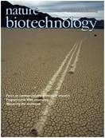

位於波士頓的 Enlight Biosciences 在這個月正式開始運作 “Knode“。Knode 是個聯結產業界與學界的網路系統，且將聚焦於轉譯科學領域。以往在產業界及早期的投資者要透過自己的人脈、顧問公司等，抑或是得搜尋整個研究社群才可能找到適合的專業人士。Knode 的啟用顯示了以網路為主的系統或許可以幫助產業界的科學家找到學術界裡適合合作的對象。 某種程度上來說，Knode 並不是全新的概念。除了我們所熟知的 Pubmed、Elsevier 等線上期刊系統之外，近年來也有數種線上服務，目的在於提供某些特定領域的重要研究人員，同時也可以促進科學家之間的合作 (如[1](http://biomedexperts.com/ "biomedExperts")、[2](http://www.researchgate.net/ "ResearchGate")、[3](http://academia.edu/ "academia.edu")、[4](http://www.iamscientist.com/ "iAMscientist"))。這些網站都有類似功能，包括提供研究人員們分享個人資訊及研究成果，追蹤其他競爭者的研究結果，組成研究小組，甚至是向捐贈者尋找資金。 Knode 就像是 LinkedIn 或 facebook 一樣，只是它是轉譯醫學的社群網站。這個網站提供了科學家的個人資料，列出他們的研究興趣、擁有的專利、補助、和公開資料庫中發表過的文章。其它社群網站，Knode 並不要求科學家更新自己的資料；而是利用演算法自動尋找出適合公開的資訊。Knode 也即將加入其他額外的資訊，包括讓科學家們在網站上放上自己擁有且能被授權出去的技術或資產。 Enlight 的 CEO，同時也是創投公司 PureTech Venture 的合夥人 David Steinburg 表示「每件事都是以專家為中心的，與其讓大家奮力的在未經整理的資料海中尋找有用資訊，不如直接找到一個最貼近你的問題的專家，並且尋找可能相關的技術。」 Knode 的計畫是在今年可以廣泛的運作此系統，但 Steinberg 表示，可能會有一個「企業版本網站 (enterprise price model) 」，讓一些大型製藥公司能夠客製化自己的介面。 Knode 網站屬於現今幾個以大學做為資產評估單位的線上模型之一，目前還在 beta 版測試中。傳統上，智慧財產是學術機構中的主要資產。近期產業界則更加著重於直接與學術界的研究人員合作，不管是針對研究項目提供資金，或是透過諮詢的方式來導入與研究人員的互動。 就學術圈和產業界的角度來說，研究人員得到經費的困難度越來越高；同時，業界公司也急需在大學中尋找適合的研究人員，而透過傳統的方式－經由創新的生技企業－來尋找夥伴的模式，也因為生技公司正在萎縮當中而越來越不實用。

對於想要進入早期發現的公司來說，有一部分的問題在於「沒有辦法找到研究專家是在哪個機構或公司裡，也無法將他們連結起來。」Steinberg 如此說。他希望產業界的執行長們可以透過 Knode 的搜尋引擎去找他們需要的科學家。而目前，Knode 已經在學界有一些穩定的合作夥伴，包括加州大學舊金山分校 (UCSF)。Steinberg 表示，Knode 正在為 UCSF 量身開發「小工具」，以加強學校內及校外的合作關係。 **「促進學術界及產業界的合作一向是急需解決的問題。」** 賓州大學的教授及轉譯醫學及治療中心的主任 Garret FitzGerald 表示「我們需要在競爭前的發展上更勇於冒險，無論在本質或尺度上皆是。」隨著這麼多公司想要尋找學術圈的合作，會有其他競爭者的存在並不令人感到意外。一間位於波士頓的新創公司 Relay Technology，已經在 2011 年得到 London 的 Nature 集團進行的策略性投資。Relay 提供生技醫藥公司及技轉中心資料分析的結果，且其平台也會提供諸如特定領域主要研究員或是知識給有興趣了解的公司。 「其中一個元素是社群網站的配對」，Relay 的共同創辦人 Brigham Hyde 表示。「我們有標準用來幫助使用者衡量誰會是最佳的合作對象，這不只是看誰有最多篇 papers，我們還會觀察具有意義性的指標，像是經費來源，以及其研究是否具可轉譯的潛力，是屬於基礎科學或臨床醫學。」Relay 剛和國家衛生研究院 (NIH) 簽署一項合約，而這份合約將會讓國衛院所有的博士後研究員的資料上線。

## **譯者附註**：

本篇介紹的 Knode 網站在蒐集資料過程中需要大量的演算法支持，處理龐大資料，並利用機器學習 (machine learning) 類似的程式設計語言進行分類，進而得出對使用者最有利的選擇。由於台灣在電子資訊產業的發展相當健全，所以自然而然會希望可以將生物科技與資訊科學進行結合。但反觀政府已經大力宣導多年的生物資訊產業到目前仍未能善加利用其能大量處理多種資訊的功能，的確還需要多加努力。不過，最近中研院剛啟動的「台灣生物資料庫」計畫，即是需要大量處理生物資訊的計畫，或許可以觀察此資料庫的運作情況，並看看台灣的生物資訊學實力是否能在這方面有所發揮。 另外，近來為了解決生技博士的就業議題，台灣政府也推出了「生技博士再加值」，由行政院投入 3 年 3 億經費的新政策。但顯而易見的，台灣一直[面臨的問題](/posts/biojob-informations-taiwain/ "台灣生技領域人才就業問題")並不是沒有人才，而是沒有平台可以將各種人才的所學連結在一起。如同 Knode 平台的開啟，不只需要具有生物資訊學的人才，也需要熟知產業需求的人士連結產學。但目前台灣在發展生技產業的過程中面臨的是研究成果無法商品化、人才所學非業界所需等問題，而透過本篇分享，或許我們也可以思考新的產學之間合作模式，參考 Knode 平台，透過資訊分享來釐清所需，促進產業學術的良性循環。

原文連結(Editorial)：<http://www.nature.com/nbt/journal/v30/n10/full/nbt1012-901.html>

Nature Biotechnology, volume 30, number 7, page 901

**相關網站:**

1. Knode 官網：<http://knodeinc.com/> (目前開放免費試用，有興趣的讀者可以註冊帳號來瀏覽看看哦!)
2. Enlight Biosciences 官網：<http://www.enlightbio.com/index.php>
3. PureTech Venture 官網：<http://www.puretechventures.com/about-us/>

**延伸閱讀:**

1. 聯合新聞網：生技博士「再加值」年薪百萬 <http://udn.com/NEWS/NATIONAL/NATS4/7445434.shtml>
