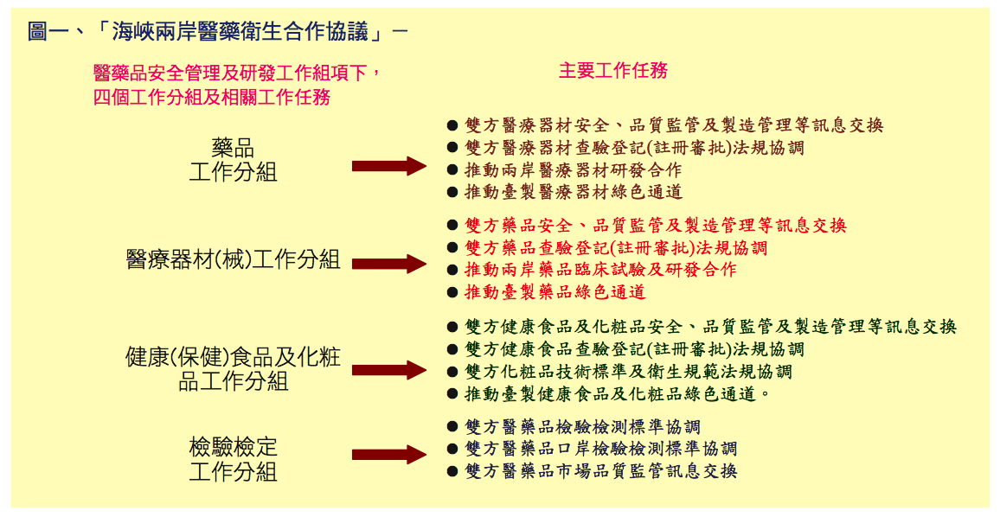

## ***HOT NEWS* –以下消息，你蹦出的第一個想法是…？**

台灣微脂體的抗癌新藥 Lipotecan 進入大陸臨床試驗 ([新聞](http://www.moneydj.com/kmdj/news/NewsViewer.aspx?a=855c39fb-ec5e-4b88-a345-e8d72fc4fd44))，以及太景的專利新藥奈諾沙星雙軌申請台灣與大陸藥證([新聞](http://www.nownews.com/2013/05/17/10844-2939803.htm))。兩者皆為推出深具發展性藥物的台灣製藥公司，在差不多的時間點進入大陸。

簡短介紹兩項藥物的背景：

* Lipotecan®: 已獲美國 FDA 以及歐盟 EMEA 認可成為治療原發性肝癌的孤兒藥。大幅提高腫瘤的局部控制率，且具備了放療增敏劑與抗腫瘤劑的雙效特性，能夠克服藥物時常在臨床治療上出現的抗放療與抗化療問題。([TLC網頁](http://www.tlcbio.com/ch/product_lipotecan.html))
* 奈諾沙星: 理想中能對抗抗藥性細菌 (如：金黃色葡萄球菌) 的抗生素，用以肺炎，亦適用於嚴重院內感染適應症。是太景獨有 11 項專利的全新化學新藥。([新聞](http://www.gvm.com.tw/blog_content_667.html "11項專利奈諾沙星 太景生技獨有"))

而此外，去年底新聞已經報導兩岸藥品和醫材，將透過雙城試點 – 廈門和福州來舉辦，藉此將國內產品引領入大陸市場。加上最近遭業界強烈反彈的兩岸服務條款，其實這一切都是因為 ECFA 的簽訂。而以下我們將為大家簡單介紹 ECFA 底下的醫藥衛生合作協議以及相關閱讀資料。

 .

## **一個美好的承諾 – 「海峽兩岸醫藥衛生合作協議」**

眾所皆知台灣商機比不上大陸。根據政府刊物資訊，台灣現有醫藥年產值可達到 1000 億；但是大陸政府卻能列出 3 年 8500 億人民幣的醫改方案 ([來源文章](http://www.fda.gov.tw/upload/133/Content/2012102511405920005.pdf "產業動態 - 以臨床試驗為優先合作項目 兩岸開啟技術審查交流大門?"))，並且 2015 年的醫療市場總產值預估可到 3 兆人民幣。除此之外，大陸的醫藥業正在爬坡階段，老年人口劇增、藥價正逐漸升高。把台灣藥廠推進至大陸市場，這是多美好的藍圖。

根據衛生署食品藥物管理局的公開資訊，2012 年 9 月 4 號發布的「[海峽兩岸醫藥衛生合作協議](http://www.fda.gov.tw/TC/siteContent.aspx?sid=3169 "海峽兩岸醫藥衛生合作協議")」，開宗明義定下合作領域為：傳染病防治、醫藥品安全管理及研發、中醫藥研究與交流及中藥材安全管理、緊急救治和其他互相同意的領域。

由於兩岸交流頻繁，加上地理因素，傳染病防治和緊急救治的簽訂顯有益於台灣社會。引起熱烈討論的是「醫藥品安全管理及研發」的部份。其範圍包含藥品、醫材、保健食品和化妝品的非臨床檢測、臨床試驗、上市前審查、上市後管理等制度規範，及技術標準、檢驗技術與其他相關事項，進行交流與合作。 ([政府公開資訊](http://www.fda.gov.tw/upload/133/Content/2012102511380545297.pdf "產業動態 - 建立制度化合作機制  兩岸醫藥衛生合作協議  開啟生醫產業新紀元"))

醫藥衛生合作當中，又以臨床試驗為試水溫的先行合作方式。**目前**協議僅落實台灣和中國彼此的國產製藥，對於非兩岸的跨國大公司還沒有開放。而文章一開始提及台灣微脂體和太景的相關新聞，即是利用「海峽兩岸醫藥衛生合作協議」的現行制度 – 「**綠色通道**」來實行。台灣臨床試驗的主管機關是 TFDA (台灣食品衛生藥物管理局)，而和 TFDA 對等的大陸主管機關是 SFDA (中國國家食品藥品監督管理局)，兩造雙方組成「醫藥品安全管理及研發工作組」來共同執行這份協議。

   圖片來源：TFDA – [產業動態「兩岸開啟技術審查交流大門」](http://www.fda.gov.tw/upload/133/Content/2012102511405920005.pdf)（有趣的是這政府出品的圖，誤植藥品和醫材兩項綠色通道。）

## **可是瑞凡，我們回不去了 – 遠慮近憂**

廠商樂見其成，業界開心，政府自然笑呵呵。然而不得不提及還有相當多的潛在危機未浮現。以下是編者以目前業界新鮮人為出發點所能想到的黑洞，希望這部份能獲得廣大的迴響和交流。.

一、以下這些問題的前提是建立在政府簽ECFA時，出現在協議上的白紙黑字語句 - 「此份協議終極目標是減少重複試驗，兩岸互相認證臨床試驗。」臨床試驗的施行受囿於嚴謹的法規，所以區域性特別強烈，衛生署要如何協調彼此的認證，其實相當具挑戰性。兩岸臨床試驗的開放，首當其衝是醫院；次之就是台灣從事臨床試驗產業的人員 (e.g. CRO 的僱員)。醫院若是行政效率低落，很可能因此失去競爭力；而要是發展一面倒的傾往大陸，台灣面臨的衝擊可想而知，畢竟臨床試驗除了需依循主管機關法規之外，如何和當地醫師/研究人員溝通，也讓臨床試驗的地域重要性不可磨滅。此外，協議是否能夠維持限於兩岸當地的製藥產業，或國際大廠最後也能跟著認證，若不幸地是後者，台灣臨床試驗產業必大量萎縮。關於臨床試驗的其餘考量也可由Connectome 先前文章 「[臺灣臨床試驗的問題與未來](/posts/taiwan-clinicaltrail-problem-future/ "臺灣臨床試驗的問題與未來")」窺得一二。

.

二、承接第一，假使有人認為第一點已屬無限上綱。在沒有確切政策，只有方向及階段目標的當前狀況之下，那來討論生技業製藥業移往中國的趨勢也許比較符合現況。關於中國現階段的生技製藥業熱潮，相信讀者們都有所聞。中國政府砸下的金額可以兆計算，並且政策領頭。外商們大幅投資，甚至有藥廠裁撤掉全球臨床事業部，獨留在中國的區塊。但是中國的醜聞，賄賂層出不窮，數據造假的事情年年有，並且法規人員已開始盯上外商的案子，政府對外商藥廠實行箝制的動作已逐步開始，關於中國市場的議題將會在下一篇新聞導讀中更深入介紹。

.

三、關於ECFA中醫衛合作對生技業的衝擊分析文章，**強烈推薦以下這篇醫策會的文章**，由中興大學科技法律研究所的許舜喨助理教授，所撰寫的「[淺論生技新藥產業發展條例對我國生醫產業發展之影響與建議](http://www.ibmi.org.tw/client/ReportDetail.php?REFDOCTYPID=0lgfj8ve17pfj9w5&REFDOCID=0mnl8z9jcn3pswvn)」，雖然大多著墨於醫材研發的整體考量，但其中對於目前的法規不足之處給予建議，從利益衝突未被釐清、產學合作，到政府奬勵措施的不完整面皆全盤點到。耐著性子讀一下，也許一天一小段落，相信不論從論述方法或是內容都能讓讀者受益良多。

  四、最後幫讀者們摘要政府對生技產業的執行力和~~美夢~~深切期許。內文依據 **99 年**經濟部發表的「[專案執行成果報告 – 兩岸經濟合作架構協議 ( ECFA ) 對生技產業之影響](http://www.bpipo.org.tw/ecfa/ " ECFA 白皮書")」的**早期收穫產業**。若編者尋找到最新版本將再為大家添補。

**(1) 製藥業**： 開放 – 開放大陸的**部份供做原料藥之有機化學品**進口至台灣。 期許 – 降低廠商生產成本，亦可減少有機化學品對台灣環境的衝擊。 缺點 – 其實西藥製劑才是台灣發展主力，中國更為台灣的西藥製劑最大出口國 ( 2009 出口額新台幣 11.78 億元)，且中國關稅高於我國，但此項卻未列入兩岸早期收穫清單內。 ECFA 稱兩岸互讓利，但針對此點卻未讓到台灣最大利益(中國對台灣開放西藥製劑)。

**(2) 醫材業**： 開放 – 為消弭中國對台灣的關稅 (針對中國輸入台灣無須關稅，但台灣輸入中國卻課稅的產品)。早期收穫階段，中國預計**開放台灣的以下兩種醫材**：人造關節 (台灣主要廠商為[聯合骨科公司](/posts/cross-straits-medical-collaboration/ "生技公司介紹：太平洋醫材、雃博、聯合骨科、台灣神隆")) ，與健身及康復器械 (我國主要健身器材廠商為喬山科技公司， 2009 年為全球營收排名第 4 大之健身器材廠商) 。但這兩間大公司在 ECFA 簽訂之前，已在大陸設廠。 期許 – 藉由關稅大幅降低，而吸引台商將高技術產品移回國內生產。 缺點 – 台灣吸引優良台商回流的優勢在哪？

**(3) 研發服務業**： 開放 – 台灣開放中國的研究與發展服務業；中國開放台灣的自然科學和工程學的研究和實驗開發服務廠商。 期許 – 助我國優勢的 CRO 公司布局中國醫藥市場，吸引中國向海外市場拓展，增加台灣執行臨床試驗的案件。 缺點 – 兩岸已走向臨床互認證，台灣臨床產業的優勢是否會因此被取代。

**(4) 醫療服務業**： 開放 – 中國允許我國服務提供者在上海市、江蘇省、福建省、廣東省、海南省設立獨資醫院。 期許 – 有助於台商在中國設置獨資醫院，並藉由優勢的技術與設備，提供完好的醫療服務，並可引進我國醫療相關產品，帶動我國生技產業的發展。 缺點 – 無法避免台灣優秀醫療人才嚴重外流至那些醫療能更賺錢的區域。也就是中國能帶走台灣優秀的醫療人才，那台灣能得到什麼？醫療財團能獲利，但對於市井小民呢？ .

## **編者小結**

編撰這主題並非想營造對立，因這份協議木已成舟。但我們必須瞭解自我優勢，以及台灣局勢，才可能打造自己的舞台。只因 **「這是最好的年代，也是最壞的年代」**，我們擁有最好的條件，但又處於可能被局面吞噬淘汰的懸崖邊稜。 期許這篇文章能帶給你一點靈感，簇發一蓬火苗。

「千年暗室，一燈即明」，這是最令我感動的八個字。這篇新專欄，懇請各界不吝賜教，以使這系列能臻完美，給予渴求新靈感和新想法的人一些些幫助。讓我們一起閱讀世界。

**推薦閱讀**

1. 醫藥產業篇章 – **[癌症新藥開發的業界實務觀點 – 張惠玲](/posts/cancer-new-drug-development-zhang-hui-ling/ "癌症新藥開發的業界實務觀點 – 張惠玲")**

2. 臨床試驗訊息 – **[臺灣臨床試驗的問題與未來](/posts/taiwan-clinicaltrail-problem-future/ "臺灣臨床試驗的問題與未來")**
