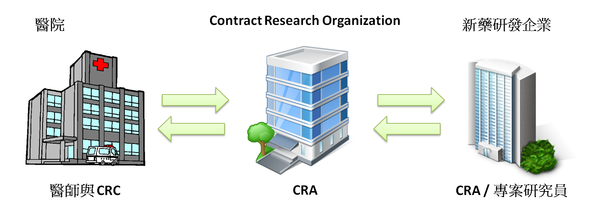
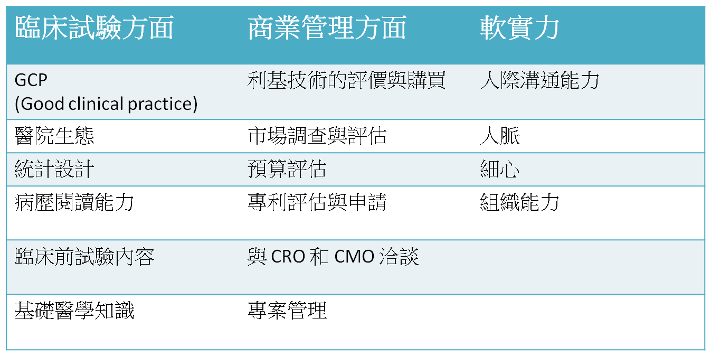
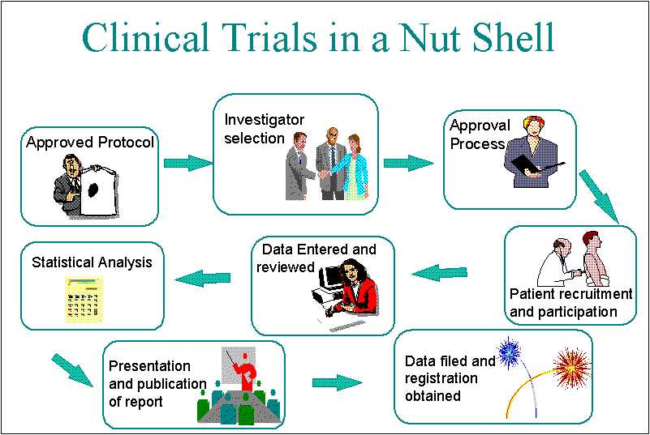

## **新藥臨床試驗的工作單位**

CRO (Contract Research Organization / Clinical Research Organization) 是一個專業分工的生技服務業 (註1)，分為規劃與執行等許多環節，各環節中每個人的工作內容皆不相同，依照發生流程簡述各工作內容如下： 依法規撰寫計畫書 (需與醫師以及廠商開會討論)，計畫書送審，與醫院協調與簽約等事項 (Site Star-up Specialist)，臨床試驗主持人會議，而 Monitor (一般大家所稱的 CRA 皆為此類別)則需至醫院檢閱病例報告表 (Case Report Form, CRF)、計畫書與病歷以及確認 CRC (Clinical Research Coordinator) 工作品質，嚴重不良反應通報，統計與數據資料分析，報告書撰寫等。

## **本土生技藥廠的專案研究員的角色**

本土生技藥廠的 CRA (Clinical research associate) 或專案人員 (跨國藥廠現多為請 CRO 代聘 CRA 至公司上班)，主要工作為找尋研究合作夥伴、臨床試驗伙伴以及確保 CRO 及其 CRA 的工作品質，並與醫師們維持良好的關係。雖說用人不疑，疑人不用，但坦白說，目前很多 CRO 的 CRA 品質很不穩定，且由許多廠商與 CRC 得知，很多臨床試驗計畫一年可以換到三個 CRA，每換一個人都是半途接手，且計畫書剛弄熟就又走了，造成試驗時程的拖延與金額的損失。背負著計畫成敗的我們，要假想錢皆出自於我們手中，怎麼能有辦法心平氣和的去看待此事呢!? 不過CRO要換人，也許它也有它的難處 (這可能就要問眾多的CRA了)，我們也無法強逼他完全不准換，所以對 CRO 的監察就很重要了。 在此呼籲想進此行的先進與後輩，請確認興趣與工作內容後再踏入您將來的工作，雖說找工作不易，但也請為大環境的品質以及您個人的履歷著想。

## **如何成為好的臨床試驗專員**

至於如何確保 CRO 的服務品質進而確保公司的新藥臨床試驗品質，就是一件相對複雜的事情了，主要精神是當你花了幾千萬之後，你要確保試驗就算失敗也不是因為人為疏失所造成，而最好的態度，就是把這些錢當成是你投資的，如此一來你才會戰戰兢兢的去面對它。而為了做好這份工作，需要有廣泛但不需太深入的背景知識來支持，在此將專案人員所需的能力整理如下:

由此可看得出來，本土生技藥廠的臨床試驗專員部分工作內容是與 CRO 的專業有所重疊的，雖然我們不需要達到專精，至少也要能達到看著別人做且知道對方做的對不對，並可適時提出意見或糾正。打個比方，這就好像我們 (專案人員) 要坐計程車回家，至少看得出來司機 (CRO/CRA) 有沒有繞路來多賺我們的錢並延誤我們的時間。而這部分的工作就是專案管理，而專案管理最重要的就是要以最小的合理經費，在最短的時間內達到最高的品質。這是個看似簡單但勞心勞力的工作，且**非常仰賴溝通能力**。

Picture courtesy of http://www.clinical-trials-info.com/

## 個人求職心得

本土生技藥廠對於英文程度的要求，坦白說不像 CRO 那麼高，因為大部分案件是台灣或大陸的臨床試驗，其計劃書並沒有強迫要用英文撰寫。而本土藥廠在人才上要求的，是希望你能對於申請 IND 臨床試驗 (包括新藥、新醫療器材或植物新藥) 與新藥研發過程有基礎的了解，並對公司產品的基礎知識上也有個大概，以及很重要的人格特質。 若你是去 CRO 求職，則需要更佳的英文能力 ( TOEIC  750以上)，且口說能力更要好，若你是應徵 CRO 的派遣人力到某些跨國藥廠上班，那就有可能整天用英文對話了。大部分跨國 CRO 通常會先有英文電話面試，通過之後才會有面試機會，這是可以準備的，把你網路上找得到的問題，全部寫出答案並背得滾瓜爛熟，說背也太誇張，故事主角都是你，應該不是很難的工作。 至於本身有無臨床試驗的基礎，個人覺得多少會影響錄取機率，有的公司還有實務上的問答題筆試。至於該怎麼讓自己有基礎，就要回到一個問題的基本面上：**你在找什麼樣的工作？**個人覺得找工作最基本的，是你要了解你在找什麼工作? 它的工作內容以及在職涯上會遇到的困難是什麼? 對於這樣的工作內容與性質、時間以及壓力是你真正了解並接受甚至是喜歡的嗎？當你藉由網路、研討會以及向人討教後，可以回答這些問題時，你就已經有了該專業的基礎了，也可以知道你到底是否想要這類工作了，以免浪費青春在錯的工作上。 很多人好奇，許多 CRO 公司的職缺可以放半年以上還在徵人，但投了卻都沒消息是怎麼回事? 排除你被刷掉的原因以外，根據幾位 CRO 經理的說法，一則是因為目前的人力勉強可以應付手中的 CASE，但希望當有新計畫而人力不足時，可快速收人。另外也因為，也許現在缺人，但更缺資深 CRA來帶人，以致於無法招收新人。

## **結語** 

其實本人在這個領域還是個資歷很淺的新人，但卻是個有幸能成功轉職的人，當初在求職階段，僅僅投了有關人體臨床試驗以及專利事務所的職缺，一路走來深感惶恐無助，只能四處拼湊資訊並吸收，有幸遇到幾個賞識的主管，就此展開了臨床試驗的生涯，並立志在此領域發光發熱。也因為有此經歷，所以希望能提供先進後輩一個出自於菜鳥的整合資訊，讓大家對於將來的路有個更清楚的選擇。 若您將來也決定踏進來，或多或少會有碰面的機會，希望大家能互相認識並成為朋友。若有錯誤之處，也請不吝指正，謝謝。 **註1** ：生物技術服務業包括： "藥物安全毒理試驗、生理活性試驗、委外研發(Contract Research Ogranization，CRO)、委外生產(Contract Manufacture Organization，CMO)、委外行銷服務(Contract Sales Organization，CSO)、儀器及耗材、專利業務等。 其中 CRO 是指協助生技及製藥公司設計，管理及進行臨床試驗。CMO 是指提供化學或生物合成之原料藥或中間體製造，以供臨床試驗或商業化用途，並提供劑型製作如錠劑或針劑等。CSO是協助生技製藥公司推廣，行銷及銷售藥物，以建立行銷推廣及藥物服務教育。" 以上節錄自:<http://tinyurl.com/9a9wnf3>
