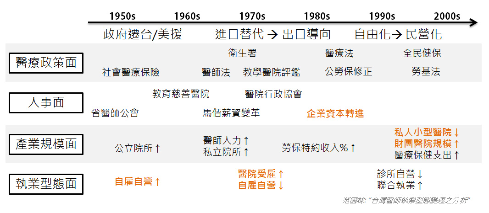

##### 

吳沛燊，台大B94級，原本考取電機系，升大二時轉系至醫學系，他戲稱那真是個想不開的決定。今年暑假甫考取執照，他笑著說：「終於可以自稱醫師了！」

然而，就算是即將成為醫生的他，他認為無論是哪個行業，在這個世界趨勢的流變下，未來等待的人才已經不是純然用理性思考就能掌握全局，而是在加入感性、意象、設計等元素，世界已經悄悄的在改變。頂著最高學府的光環，在社會世俗標準中的天之驕子，他怎麼看待這個看似迷航、失控的醫療環境？他又怎麼看待未來社會的走向？年輕人該怎麼抉擇屬於自己的未來？

## **台灣醫療環境現況**

台灣的醫療環境在眾多因素之中走向了今天的混亂場景，沛燊認為主要是三個因素導致了目前的現象：全民健保、法律訴訟、財團醫院。

台灣的健保制度和美國的醫療保險不同，美國的制度下會因為你所繳納的保費金額不同，而取得不同等級的醫療服務；台灣的健保制度設計則是無論服務質與量的多寡，所付出的價金是一樣的，因此會導致民眾對於醫療資源過度的取用，而對醫院而言，只要多提供服務，醫院可能就會虧損。

大家可能也會疑惑，醫院不是可以向健保局請款嗎？然而卻因為保費調漲的困難，使得保險不給付的風險轉嫁至醫療院所，縱使健保局已經在民國91年時採取了總額給付的概念，讓醫療服務點數化，以固定預算分配金額，這樣的制度固然保障了醫生有服務就有回饋，然而卻也間接導致了現今醫療「三長兩短」—醫師看診總時間長、病人排隊長、等待時間長、醫師診療時間短、醫療照顧時數短。

而第二項則是法律訴訟的問題，近年來醫療訴訟的問題不斷攀升，統計數據顯示訴訟問題中內、外、婦、兒四大科合計超過85%，也導致醫生群體行為的改變。

最後則是商業層面問題，財團醫院的興起。財團醫院之所以會興起，沛燊認為與兩個原因有關，一是規模大的優勢，現行勞健保法規有利於大規模的醫院，二是醫療高科技化，像是一些成本昂貴的儀器，規模大的醫院比較有議價優勢。這樣的現象使得醫療走向兩極，醫院逐漸開發自費項目，如醫美、預防醫學等，中小型的醫院開始萎縮，不是納入財團醫院就是轉型為診所，而大部分醫生也選擇投入低風險、低成本的專科項目。

## 

## **醫療產業的未來該怎麼走？**

沛燊認為面對任何的問題，都要先從瞭解問題本身開始，所以對於醫生的未來，必須先瞭解，醫療未來的需求會是什麼？甚者，未來是什麼？

對於未來這個辭，他認為如同楊明唐(註1)學長所提，我們做任何的事情，沒有辦法在學校學到完美，如果學到完美代表那個領域即將被淘汰，但我們必須要找出架構、有跡可循可以去改變他的可能性。沛燊同時也提出了Toyota的哲學，如果要改變某件事情，一定要從流程上面來改變，才有改進的憑據，而不是憑感覺。

他以自身的背景舉例，醫療的本質是在避免可預防的死亡和疾病，將病人從死亡和痛苦中解救出來，但是所有的生物都難逃死亡和疾病，如果醫療僅將目標放在幫助人們脫離死亡和疾病，那無疑是挑戰一場註定失敗的戰役，然而，醫師的工作正是這樣的無止盡戰鬥。

若把這場戰役放在現代社會來看，慢性疾病就是一個不會痊癒的例子，而且未來慢性疾病絕對會大於急性疾病的需求，因此所謂「最佳照顧模式將會改變」。現代人皆希望未來的生活能夠有錢、有閒、有快樂，而慢性疾病並不會完全痊癒，在這樣的狀況下，慢性疾病的治療將會走向生活與行為模式的改變，如何深入日常生活中將會是醫療照顧的重點，也因此，呼應了演講一開始所述的「感性、意象、設計」，這將要導入所謂「理性」的醫療之中，面對慢性疾病，將要放棄所謂的「脫離死亡」以及「從疾病中復原」，而是要進入「生活能夠恢復」、「品質能夠確保」這兩個層次。

##### 

然而理性的醫學也同樣在演進當中，從過去仰賴專業人員能力的直觀醫學，到現在普遍採用的實證醫學，接下來將要走入精確醫學，隨著科技的進步，未來醫療人員能夠更準確的透過科技輔助來判斷病因。不過也因為科技的幫助，專業人士的直覺與本領將會被取代，醫師的專業性與不可取代性的優勢會漸漸消失。不過正因為如此，過去的垂直整合模式會漸漸走向水平分工，在價值鏈上提供專門服務的機構出現，結構模組化、標準化會使得焦點作業變得可行。此外，醫療服務中的行銷模式也逐漸改變中，過去以醫師作為主要行銷對象，然而隨著資訊流通、網路科技進步，可能導致民眾自我診斷後轉而要求醫師開立相關藥品、服務。以上都是未來醫療整體可能會改變的面向，無一不與我們的生活息息相關。

## **醫師該怎麼看待未來的醫療產業？**

身為一個準醫師，沛燊根據他的觀察，現在醫師主要的工作面向有三：服務、研究、教學，然而他認為將來「管理」會是更重要的環節，然而管理就會牽涉到商業，在醫療領域來說，商業似乎是一個禁忌之辭，商業與醫療的碰撞必然要邪惡嗎？沛燊認為不應該如此，事實上，商業的思考導入反而能夠激發更多創意，若是秉持著對於改變世界的熱血，商業的思考模式更有助於挖掘出人性美好的一面，以世界過去改變的方式來看，持久的模式是經由文學、藝術等潛移默化，但是最快的方式往往是商業與政治的力量。

面對現今大家對於醫療所應有的道德，他認為道德應該是一種默契，而非要求，現在醫療環境所面臨的狀況是結構性的因素如制度等等，導致了醫學人才的流失，但也正因如此，他更認為管理是必須要被導入的元素，如此才有可能產生改變。

## 

## **給大家選擇生涯的建議**

> 沛燊認為大家應該要思考的是，「你想做的事情是什麼？」「你想改變的事情是什麼？」，以生技醫療背景的同學來說，常常大家都會說要出國唸書，但是你有沒有問過自己，為什麼要出國唸書？或者，出國唸書到底是為了什麼？大家應該要回頭去想，熱情在哪裡，如果你認為那件事情你很有熱情去做，那就去做。面對未來，他認為，就連過去大家眼中的金飯碗醫師這個行業都逐漸喪失優勢中，實際上，沒有一件事情的優勢會永恆持續，如果你對一件事情都通盤瞭解了，那同時也宣告了那件事情的生命週期完結，也因此，尋求意義相當重要，你手上的實驗、專案，到底給這個世界、或者給你本身創造了多少價值、具有多少意義、幫助了多少人呢？找到熱情，那大概就是一種優勢吧！

註1：楊明唐為Connectome在8月4日沙龍的另一位分享者。台大生技系、藥學所畢，現為GSK行銷專員。

- 本篇為吳沛燊醫師於2012年8月4日在Connectome 「生技人，你想做什麼？」職涯沙龍的分享整理 - 

分享者：吳沛燊，台大醫學系95級，2012年6月畢。大二自電機系平轉至醫學系，曾於台大醫學院微生物學研究所暑期實習(王錦堂教授指導)，其成果獲選為該年度之研究傑出獎，為台大醫學院六年制醫學系第13屆班代。過去擔任台大醫院兩年實習醫師，並於復健部暑期見習，現為台大醫院復健部住院醫師。興趣與涉獵主題廣泛，曾組辦讀書會研討投資組合理論與風險管理，留心醫療服務業在健保政策下的發展趨勢，目前研究主題則為創新理論、設計思考與復健醫學。
