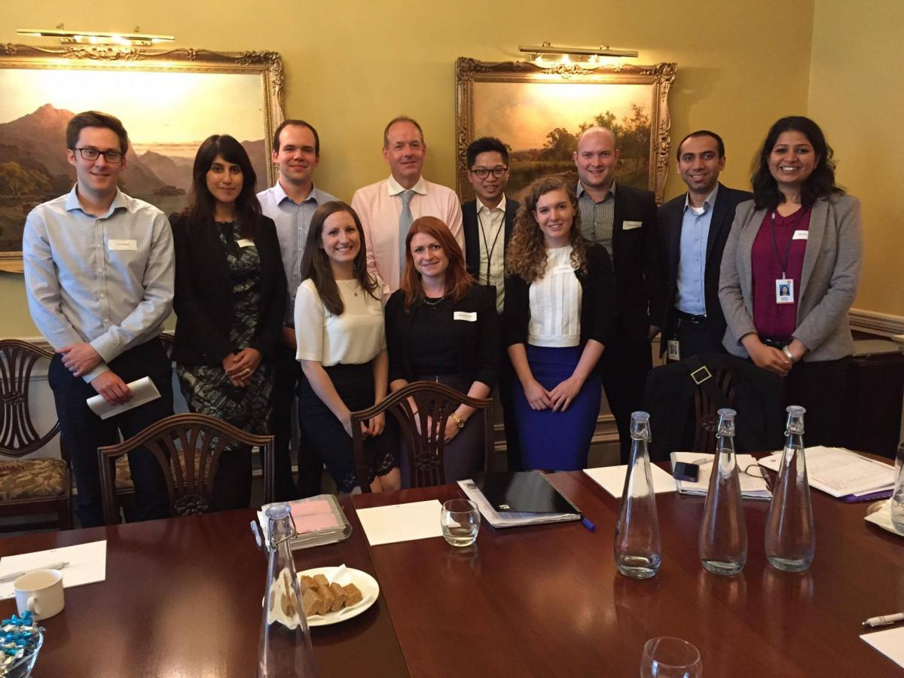

這期間幫助我走出低潮的人非常多，包括在[上一篇](/posts/ernesto-02/)提到的公司指派的導師們（mentor and coach）、在英國幫助我熟悉環境的 FLP（Future Leader Program，是公司一項儲備幹部的計畫）小夥伴（buddy）、同樣在總公司工作的一些亞洲同事、德國老闆，還有後來遇到幾位也在英國工作的台灣朋友（在英國住處的鄰居很巧的也是台灣人，且是有名的美女部落客 QQmei，也算是奇遇之一），在工作上和生活上都給了我很多鼓勵和動力。我突然發現自己很幸運，不管是公司提供的，或是在生活周遭，樂於提供幫助的人、給我的資源都好多好多，如果自己再裹足不前，那真的是白走了這一遭。

**於是我開始改變自己。**

開始積極在會議中發言，即使英文講的不好，也堅持把自己要講的講完，把意思表達清楚。開始規定自己每個星期要跟三個新同事交談，因為總部是採 smart office 的方式，也就是沒有固定的座位，喜歡坐哪裡就坐哪裡，這提供了認識新同事很好的機會。一些 VP（Vice President）或 SVP（Senior Vice President）等級的高層也都是坐在這樣的開放空間，在剛來的時候，自己還是有那種「哇，是某某大官」的心態，不太敢跟他們交談，後來藉著跟他們坐在附近而主動去自我介紹，讓他們也認識我。另外，我也開始積極主辦同事們下班後的活動，跟來自不同國家的同事們打成一片，聽他們的故事，跟他們說我的故事。

過了一陣子之後，我發現因為自己在談吐上有自信了，大家也開始會注意聽我的想法。因為總是掛著笑容跟同事打招呼和積極參與活動，認識的人越來越多，找我加入他們活動的人也越來越多。剛好我所在的那一層樓大部分是比較資深的同事，也是歐洲區的辦公室，亞洲人寥寥可數，所以很容易就顯得突出。有新的亞洲同事過來總部工作，同事們也會請他們來找我聊聊，如果有同事想去亞洲旅遊，其他同事也會推薦他們來問我。就這樣，我從那個害怕發表意見、不多話的亞洲人，搖身一變，變成那層辦公室中有名的「台灣囝仔」。

工作上，因為做事有自信了，也更加敢於分享自己在亞太市場做過第一線業務和行銷的經驗，老闆開始讓我加入更多的專案、團隊，讓我有機會到不同的國家出差，這段期間我分別去了公司位於荷蘭、西班牙、法國、奧地利、加拿大（加拿大在公司當時的組織架構中屬於歐洲區）以及英國不同城市的辦公室和研發中心，甚至有一次受到亞太區同事的邀請回台灣參與 Workshop。在我出差至各個不同歐洲國家的辦公室時，那裡的同事總是非常好奇為什麼我一個亞洲人會到他們的國家跟他們一起討論他們的市場策略和活動。這樣的經歷除了讓我更加了解不同歐洲國家的文化，也讓我因此交到不少新朋友。

然而，我也因此體會到我所屬的公司畢竟是一家英國的公司，在歐洲國家，特別是英國，所配置的資源相對而言還是比亞洲及其他市場多很多，這其實造成不少負面的影響，例如負責全球事務的部門對於亞洲市場的了解相對比較薄弱，在歐洲非常成功的策略，到了其他亞洲市場卻因為水土不服而失敗；又例如總部某些部門同事的工作量，相對於其他地區市場的同事，實是非常輕鬆的。在我的觀察，這些都是因為過度傾向歐洲市場而產生的問題。

公司也許早就已經發現了這些問題，也開始了解到亞洲市場的重要性和獨特性，因此去年（2015）新的總部大樓在新加坡開始動工，預計在 2017 年會完成亞太總部的設置。對於一個歷史悠久的英國企業來說，我覺得這並不是一件容易的事情，也可以預見到時後在公司內部又會是一波不小的變動，不過我私心認為，這樣的變動是好的，因為外在環境變動的也非常迅速，公司必須趕上腳步。我常常形容，公司好像一頭大象，體型太龐大、動作也很緩慢，在變革不斷的時代，很容易會吃很多虧！

在工作漸漸忙碌後，時間好像過的飛快，就在我驚覺自己在倫敦的時間所剩不多的某一天，我突然接到了一個畢生難忘的 email：我和其他九位來自不同國家的 FLP 一同受邀與 CEO 做面對面兩小時的焦點小組（focus group）對談。我當下真的瘋了，不知道為什麼這麼神奇的事情會發生到我身上。一直到現在，我都還記得真正與他見面的那一天，我們一行人浩浩蕩蕩的來到倫敦市中心的一棟維多利亞式的建築等著與他見面，那裡是他與公司重要股東們開會的地方。我們坐在一個大長桌，他開了門，優雅的走進來，請我們自我介紹，然後跟我們侃侃而談。天啊，他是以前只有在公司網站和宣導影片看到的人耶，而且這也是我第一次面對面見到「英國爵士」（註：Andrew Witty 在 2012 年受封爵士），當下真的想大喊：媽！我見到我們公司的 CEO 了！他跟我們談了公司的發展計畫、未來公司的走向、全球醫療環境的問題等等，過程中我一直都滿緊張的，畢竟是全球藥廠的 CEO 呀。不過最後我還是問了一個關鍵性的問題：可以跟我們合照嗎？

與公司 CEO Andrew Witty（後排左四）合照

在倫敦的最後三個月，我被推薦加入一個特別的工作小組，隸屬於 CEO 辦公室下的全球戰略部（Corporate Strategy, Office of the CEO）做一個為期三個月的專案，目的在於診斷公司全球架構性的問題，提出診斷報告。在那個專案小組，我負責專案管理和資料整理（其實就是打雜），與六個內部階級非常高的同事一起共事，也參與了不少高層的會議，除了發現其實高層中大部分還是英國人以外，也跟這些領導者們學到很多，包括他們對於公司現狀的看法、表達看法的方式，還有這些不同事業體管理者間的溝通方式等等。這段期間的壓力和工作量都非常大，雖然只有三個月的時間，卻讓我覺得好像做了半年的工作量一樣，不過這段期間也是我感覺自己在這次英國外派中成長最快速的一段時間。

很多人問我，為什麼在英國也能獲得這麼多不同的機會。我都會說，因為我在之前的工作經驗中，獲得了幾樣寶物。

第一項是**適應改變的能力（ Change Agility ）**：快速適應各種環境和角色的能力。從業務、行銷、市場準入到全球戰略，從台灣到總部，到英國，以及歐洲不同國家的辦公室。Change Agility 是我的筋斗雲，讓我能在公司不同的環境中快速的轉變角色。

第二項是**溝通的能力（ Engagement Skill ）**：跟來自不同背景的工作夥伴合作、溝通的能力。也是因為了解幾個角色不同的工作內容，在地區市場及總部學習到不同的工作方式，往往能用對方的角度與他人溝通，提高溝通的效益。Engagement Skill 是我的金箍棒，可收可放，在遇到不同怪物（挑戰）的時候，可以伸縮自如的收服它。

第三項是**思維（ Mindset ）**：這包含更全面的思考和經過挫折而訓練出來的心智強度，以及很重要的 EQ 情緒管理等等。這是那些在我低潮時幫助過我的人送我的緊箍圈，幫助我在受到挫折時靜下心思考，不受太多負面情緒的影響。

最後，也最重要的一項，當然就是**家人、朋友和公司的同事們（ Supports ）**：他們在我最需要幫助的時候拉我一把，也是這些支持讓我從台灣走出來，順利的完成這次到英國取經的任務，雖然只有短短一年，但我在心靈上已經成長了許多。

我很慶幸自己有這樣的機會，能夠到國外看看，踏出自己的舒適圈。我想，即使未來會遇到更多更多挑戰，只要時時提醒自己有這四項寶物，所有的問題，應該都能迎刃而解吧！
