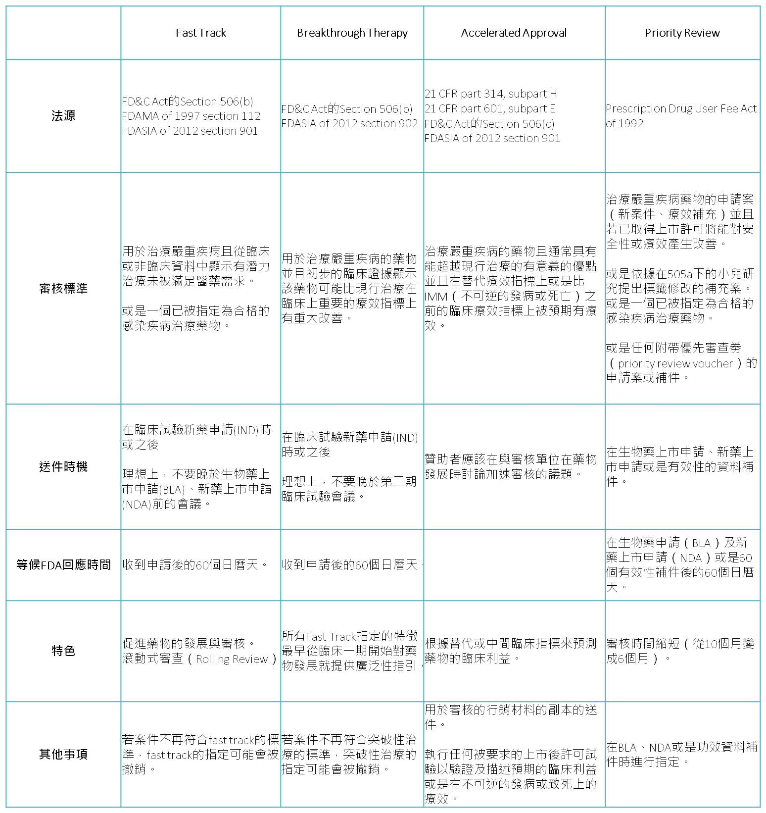

各機制的比較如下表所示：

## **1.快速通道機制Fast Track**

Fast Track藥物發展機制是美國FDA的加速試驗中新藥取得上市核准的方式。這種方式是把新藥審查的時間限定在以60天為目標。通常是給那些有希望治療嚴重、威脅生命的疾病，而且這些疾病目前並沒有其他的藥物可治的。 Fast Track是用來促進新藥開發及加速用來治療嚴重疾病或滿足未被滿足的醫藥需求的藥物的審查的程序。其目標是要使那些重要的新藥能夠儘早讓患者可以使用到。Fast Track可以用於廣泛的各種嚴重疾病（serious disease）上。 美國FDA對Fast Track申請的要求是必須得滿足一個未被滿足的醫藥需求，任何被發展做為治療或預防目前沒有治療方法的疾病的藥物都可以被視為滿足一個未被滿足的醫藥需求。而如果是對於目前已經有治療方式的疾病，要想成為Fast Track的藥物必須展示其與現行治療（available therapy）相比展現出的優勢，例如：展現優於現行治療的療效、能夠避免發生現行治療方式會產生的嚴重副作用、改善一些早期診斷能夠有較佳預後的嚴重疾病的診斷能力、與已被接受的治療相比能夠在顯著減少臨床上的毒性。 若藥物若取得Fast Track的資格就可以得到以下部分或全部的獎勵：

1. 能夠更頻繁地與FDA進行會議討論藥物開發計畫與確認用於取得藥物許可的資料是否適當。
2. 能更頻繁地與FDA書信往來研議例如臨床試驗設計的議題。
3. 有資格使用FDA加速核准（Accelerated approval）程序，如使用替代指標進行臨床試驗等。
4. 滾動式審查（Rolling review），藥廠可以在新藥上市許可申請（NDA, New Drug Application送審資料的一部分完成後就先送件，而不用等到送審資料的每一個部分都完成後才能送件。一般的新藥上市許可申請的審查都是要到藥廠把完整的資料都送件後才會開始進行審查。
5. 若藥廠對FDA的不授與Fast Track資格的決定不滿時的爭議解決。
6. 除此之外，大部分取得Fast Track資格的藥物都可以得到優先審查（Priority Review）的特別待遇。

Fast Track必須由藥廠主動提出申請。在藥物的開發階段的任何時點都可以提出申請。FDA將審核該申請並在收件日起60日內基於藥物是否對一個嚴重疾病滿足了未被滿足的醫藥需求進行確認。當該藥物得到Fast Track資格後，藥廠會被鼓勵於試驗的早期就開始與FDA頻繁的溝通。頻繁地溝通能確保各種問題和議題都能夠儘快被解決，因此能夠使藥品能夠儘早被許可上市並使患者能夠使用到這些新藥。 根據FDA網站所做的統計，從1998年3月到2011年9月的這段時間共有248件Fast Track的申請，其中FDA在60天內完成資格審查的有236件，其中取得資格的有152件、被拒絕的有87件、目前仍延宕中的有2件。審查期超過60天的案子有12件，取得資格的有4件、被拒絕的有1件、目前仍延宕中的有7件。

## **2.突破性治療（Breakthrough Therapy）**

突破性治療是一種加速用於治療嚴重疾病且初步的臨床證據已經證明這個藥物已有遠較現行治療為優的藥物開發與審核的程序。要決定是否比現行治療方式有所顯著改善是基於治療效果的強度，包含效果的期間，以及觀察到的臨床結果的重要性。總體來說，臨床證據應該要能展現出明顯優於現行治療的優勢。 突破性治療的臨床試驗療效指標（Endpoint）通常指的是某個測量不可逆的發病或死亡機率（irreversible morbidity or mortality, IMM）或是疾病的某個嚴重的症狀。一個臨床上明顯的療效指標也可以是在的對IMM或嚴重症狀（serious symptoms）的發現，包含：

1. 在一個已知的替代療效指標上具有療效。
2. 在替代療效指標或是中間療效指標（intermediate clinical endpoint）的表現上可以合理地預測會產生臨床上的利益。
3. 在藥物動力學的生物指標（biomarker）上並未符合一個可接受的替代臨床試驗終點的標準，但已強烈地暗示出可能對疾病產生臨床上有意義的療效。
4. 與現行治療相比在安全性資料上有明顯地改善，而且兩者的療效是相似的。

**藥物取得突破性治療之後可以得到以下的獎勵**：

1. 全部fast track的獎勵。
2. 從臨床試驗一期開始就可以在藥物開發計畫上得到廣泛性的指引。

突破性治療是由藥廠提出申請。若藥廠沒有主動提出申請，在以下的情況時FDA會主動建議藥廠考慮提出突破性治療的申請：a.在審核完藥廠提交的資料後，FDA認為這個藥物的發展計畫可能符合突破性治療的申請標準；b.若得到突破性治療資格能對後續的藥物開發計畫有利。 理想上來說，在突破性治療要求的標準中已有符合的情況下，一個突破性治療申請需要在二期臨床試驗會議結束前提出。因為授與突破性治療資格的目的是在於讓可用來支持新藥上市的臨床證據能夠儘可能有效率地被審核確認。FDA並不會希望突破性治療申請是發生在BLA或NDA或是補件之後。FDA會於突破性治療申請收件後60天內做出回應。

## **3.加速核准機制（Accelerated Approval）**

1992年美國FDA在CFR 21 part314與part 601法案中訂定了加速核准(Accelerated approval)制度。申請加速核准的新藥必須有支持其對嚴重或危及生命的疾病具有療效與安全性，且可提供患者優於現行療法的效益。其特色有四，分別為以替代療效指標代替臨床療效指標、需於上市後繼續執行確認性臨床試驗、限制處方、及有藥證被撤銷的可能性。茲詳述如下：

**特色之一**是可依據過去流行病學、治療學、病理學等領域累積的科學證據篩選出與臨床療效具有一定關連性的替代指標，並藉由設計良好之臨床試驗證明藥品對於替代指標的效果，藥品就有機會取得加速核准上市。

**特色之二**是經由此機制上市的藥品必須執行美國FDA要求之上市後臨床試驗（post marketing clinical study），並持續提供美國FDA試驗報告確認藥物之療效與安全性。由於美國FDA與廠商共同討論這些上市後臨床試驗的試驗設計及療效指標，並設定試驗進度，通常在取得加速核准時這些試驗已經開始進行。美國FDA是根據FD&C Act (Federal food, drug, and cosmetics Act) section 506B的規範來監督藥廠執行上市後臨床試驗，此類臨床試驗又稱為506B studies，此類試驗需每年提供報告至美國FDA。

**特色之三**是，某些藥品經由加速核准制度上市後，為了兼顧其療效及病患安全，必須對處方加以限制，通常以以下方式進行：

1. 限定據特殊設備之醫療院所或具特殊資格的醫師才能開立處方。
2. 經由特殊醫療流程才能開立處方
3. 依據藥品特殊安全性考量增加管控措施。

**特色之四**是撤銷。依加速核准制度取得上市的藥品若出現以下情況，經過公聽會討論的結果，美國FDA撤銷其許可證：

1. 上市後臨床試驗無法證實藥品之臨床療效。
2. 藥廠未執行美國FDA要求之上市後臨床試驗。
3. 上市後雖然執行處方限制措施，但仍無法確保患者之用藥安全。
4. 廠商未遵守處方限制措施。
5. 廠商之宣傳資訊誤導民眾。
6. 證據顯示藥物在現行狀況下使用，無法確保其療效與安全性。

例如以腫瘤反應率（Tumor Response Rate）作為替代指標取得加速核准上市的非小細胞新藥Iressa®(主成分為Gefitinib)，由於在上市後臨床試驗無法證實可改善非小細胞肺癌患者之死亡率，美國FDA已要求廠商建立風險管理系統（Iressa® Access Program）限制Iressa®僅能用於過去或目前曾接受過Iressa®治療，且具療效反應的患者、經IRB同意執行之non-IND試驗之受試者。 不過到2008年為止，美國尚未出現依加速核准制度取得藥證後被撤銷的藥品。

## **4.優先審查（Priority Review）**

在1992年時，在處方藥使用者法案（Prescription Drug User Act, PDUFA），FDA同意取對藥物審查設定特定的目標以改善藥物審查所花費的時間以及建立了兩層式的審查時間系統。這兩層分別是標準審查（Standard Review）及優先審查（Priority Review）。取得優先審查資格者，FDA會以6個月內完成審查為目標（一般的標準審查大約要花10個月）。 優先審查會使FDA集中比標準審查更多的注意力和資源來針對上市後可以明顯改善（significant improved）藥物安全性及療效者進行審查。 **優先審查可以由適用於符合以下條件的藥物發展計畫**：

1. 有證據顯示在疾病的治療、預防和診斷有更好的效果
2. 消除或顯著降低限制治療藥物反應（treatment-limiting drug reaction）
3. 可以增強病人服藥的順從性，而這樣可以預期嚴重的疾病後果可以得到改善。
4. 在一個新的次人口群體有安全性及有效性的證明。

當然，FDA有權決定每一個申請案的審查方式。然而，申請人若有意依照FDA的產業指引（Guidance for Industry）嚴重疾病用要促進方案請求優先審查。而優先審查並不會影響臨床試驗的期間。FDA會在收到第一次的BLA或NDA新藥上市審查申請後60天內通知申請人。此方案雖然有「優先」二字但並不影響新藥上市審核對必要的實證在科學上及醫學上的標準。

## **結論與展望**

雖然以美國為首的世界各國衛生主管機關對新藥的審查標準趨嚴，但美國也針對其有特殊公共衛生需求、能解決嚴重疾病、滿足未被滿足的醫藥需求的藥物開另一扇門在嚴謹把關利益與風險的審核下，使藥廠能夠有比傳統審核更快速讓藥物上市的途徑。加速審核由於使用替代性或中間療效指標來做臨床試驗，因此可以更快觀察到藥物的療效、縮短臨床試驗的時間；Fast Track有滾動式審查可以分次送件節省時間；突破性治療可從臨床試驗早期就可與FDA積極溝通解決問題；優先審查則是可以有效讓FDA集中力量盡可能縮短審查時間。 回顧我國的TFDA其審查的案件雖名為新藥然幾乎不會有全新NCE審查案件，送審件多有其他先進國家已經上市的經驗可供參考，建議我國TFDA除提供如優先審查的機制盡量縮短審查時間外，也可以考慮提供藥廠一些臨床試驗設計上的建議，促使試驗能夠順利地進行並取得確實支持新藥上市的臨床利益證據。

#### **參考資料：**  
1. 林婉婷(2007)。美國新藥加速核准制度，醫界聯盟臨床試驗中英文季刊 2007,08, pp.7-11  
2. Wikipedia - FDA Fast Track Development Program: http://en.wikipedia.org/wiki/FDA_Fast_Track_Development_Program  
3. 美國FDA網站: http://www.patientnetwork.fda.gov/learn-how-drugs-devices-get-approved/fast-track-breakthrough-therapy-accelerated-approval-and-priortity-review/  
4. J.R. Johnson, YM Ning, A Farrell etc.(2011). Accelerated Approval of Oncology Products: A decade of Experience, Journal of National Cancer Institute, 10.1093  
5. 潘香櫻、王兆儀等（2013）。我國新藥審查機制之改革與展望，食品藥物研究年報4，pp.458-468  
6. Center for Drug Evaluation Administration (CDER) Center for Biologics Evaluation and Research (CBER) of USFDA.(2013).Guidance for Industry-Expedited Programs for Serious Conditions - Drugs and Biologics. U.S. Department of Health and Human Services Food and Drug
