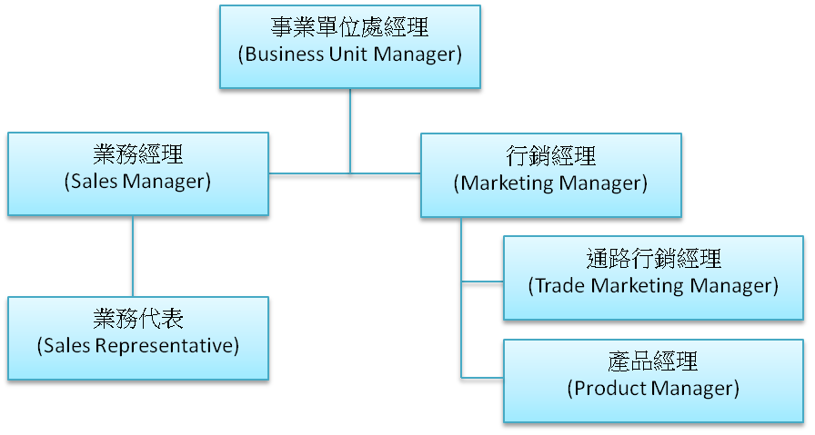
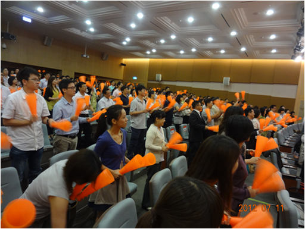
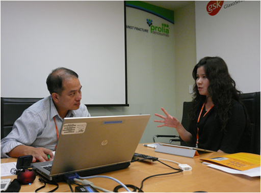
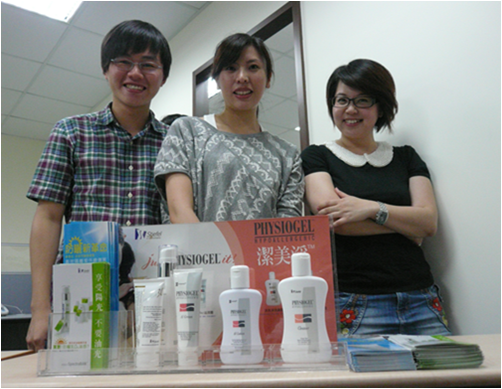
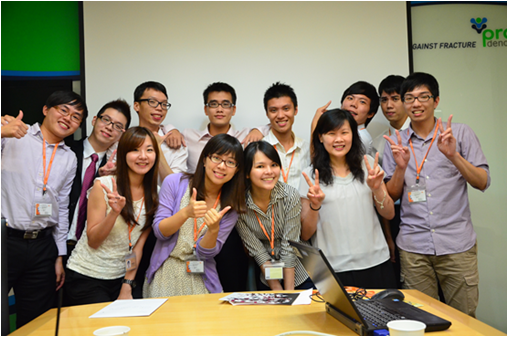

## **公司簡介與實習部門介紹**

荷商葛蘭素史克(GlaxoSmithKline, 簡稱GSK)為[全球前五大藥廠](/posts/top-10-global-big-pharma-1/)，總部位於英國，並在全球37個國家設有製藥廠；而目前在臺灣主要業務為藥品銷售和部分臨床研究，全臺灣員工約360人。GSK每年在開發新藥投資上超過300億新台幣，在疫苗、癌症、心血管疾病、氣喘、憂鬱症…等疾病用藥市場上都具有領導地位。GSK所生產的消費保健產品，如普拿疼、舒酸定牙膏、肌立痠痛貼布更和大眾日常生活息息相關 (全球每年生產60億錠普拿疼和6億條牙膏)。 我所實習的皮膚科部門，自2009年併購皮膚醫學大廠-史帝夫(Stiefel)藥廠之後，GSK 在皮膚醫藥領域的產品便更加多元完善，例如青春痘、異位性皮膚炎、疣、癬…等治療藥品，甚至是美容保養品、潔膚乳、防曬乳…等，產品種類繁多。皮膚科部門的特別之處為產品範圍包含醫師處方用藥、非處方用藥及一般大眾消費品，因此銷售對象不僅含有醫院、診所，甚至是藥局及一般消費通路都有包含到，所以在產品行銷上會因是否能夠直接與消費者(病患)做接觸，而考量到藥品與大眾消費品不同的行銷方式及通路策略。

**GSK皮膚科部門組織架構**：

****  

在運作上，事業單位處經理除了負責訂定與監督部門業績是否順利達成目標之外，也要隨時留意部門行銷計畫是否符合與總部一致的市場策略；事業單位處底下的行銷經理則負責制定整體產品的市場年度行銷計畫，並須隨時與業務經理開會商討策略執行的狀況；而業務經理會依[業務代表](/job_function/業務代表/)反應的市場狀況，和行銷經理進行策略上的調整，以確保策略是符合市場需求的。通路行銷經理及產品經理則會個別針對各產品，在通路及產品方面做全面性的深入調查，與行銷經理達成各項產品在通路上及上市的鋪貨策略。

年度產品策略大會

## 

## **如何獲得實習機會**

據我所知，藥廠所提供的實習機會主要是給藥學系學生及商管學院學生，目的是讓在學學生能提早了解產業狀況，並讓學生有機會學以致用。在 GSK，有半數實習機會為學校與業界簽訂的長期合作，例如這屆暑期實習提供的十個名額中，五位為學校推薦的保障名額，其中有四位藥學系學生及一位商學院學生，另五位則為各自投遞履歷的申請名額，分別有一位藥學系學生、三位商學院學生和一位化學所學生(我)。 究竟是什麼原因讓公司願意收我這化學所學生呢？和人資無意中聊了以後，發現到除了化學和藥學也算是相關科系外，背後實習的動機更是一項關鍵的因素，而履歷上的經驗則讓我想進入藥廠實習的故事更加具有說服力。例如因對於商業及產品行銷有興趣，我從大二開始至研究所都持續地修習管院的課程，並且於課餘時間參加商業競賽活動，藉此了解創業過程及規劃後續的行銷活動，因此利用修課與活動證明本身的確對商業有濃厚興趣。其次，在專業領域上，我利用從事生物奈米材料的研究及選修藥物化學的經驗，說明我對生技醫療產業能帶給大眾更好的生活品質的信念(而這剛好也符合 GSK公司核心價值)，因此讓我在申請該實習機會時具有加分的作用。 最後凸顯人格特質也是讓人資更加深對我的印象的關鍵之一，例如人資在面試的時候曾問我說你是怎麼樣的一個人? 我便利用參加交換學生計畫時發生的故事、研究所作實驗所面臨的挑戰及擔任商業競賽團隊隊長的經驗，來說明我是個勇敢嘗試、樂於學習、不怕挑戰及具有團隊合作精神的人，而這些也符合人資尋找實習生的特質。因此，履歷上展現的雖然只是參加過的活動與經歷的簡單描述，但要如何與申請實習計畫的動機結合，進而展現出一個完整且精彩的故事以包裝出個人特色可說是申請成功的關鍵，而我為此可是花了相當大的功夫來準備。

## **實際工作內容與收穫**

在GSK實習中，有兩種實習機會，分別是業務部門和行銷部門。很幸運地，我被配分派到的是行銷部門，除了有機會讓我將管院所學到的一些行銷基礎知識實際應用外，我也期待能夠看到[產品經理](/job_function/產品經理/)與更高階經理的工作內容，以及內部部門間分工狀況。 在與我的主管討論希望獲得的實習經驗之後，我隨即被分配到一個進行青春痘處方用藥的產品專案，兩個月間的執行過程大致為資料收集、市場分析及尋找機會、擬定行銷策略和營收成長預測。首先，我必須要了解市場上各藥品的特點、治療療程、副作用、市場定位及醫師目前處方藥的偏好與考量的因素，因此需要大量地在網路上收集各個消費者的使用經驗、醫生建議的治療方式，各藥品的價格區間…等，並且主管也安排我和幾位資深的業務代表去拜訪醫生、藥師，除了了解業代的工作內容外，也讓我有機會親自詢問醫生在使用不同青春痘藥品治療上考慮的因素，以及病患使用後的反應，不僅讓我對市場狀況更加了解，同時也嘗試發掘新的市場機會。

楊士平(左一)與產品經理、業務代表拜訪新開業醫生

在此同時公司也請產品訓練經理安排一些基礎的市場行銷課程給實習生上，幫助我們更有系統地分析市場狀況、找出機會點及鎖定目標客群；最後是利用過去的市場銷售資料幫助我們擬定行銷策略並做未來營收成長的預測。藉由一步步與主管討論想法、聆聽前輩分享行銷經驗、下市場拜訪客戶、上基礎的行銷課程及實際[專案](/posts/biotech-project-manager-yenlun-huang/)上的練習，讓我對於一項產品的行銷有更深入的學習。此外，我也了解到藥品的行銷方式和一般保健產品的行銷方式的不同，學習如何在藥品方面，利用有限度的行銷方式建立起品牌口碑，產生產品的差異化，以擁有更高的競爭力。 利用此實習機會，我也有許多機會觀察高階主管的工作內容和所需具備的能力，讓我在未來從技術研發方面轉到管理職位方面有更明確的努力方向。例如：高階主管處理多半是部門間與人方面的問題，而非產品細節的部份；因此，在瞬息萬變的市場中，主管最重要的就是市場洞察力與溝通協調能力，如何快速找出產品的市場定位，整合公司內部資源，組織部門間跨部合作，朝一致目標前進，達成最終行銷目的，都考驗著主管們綜觀全局及靈機應對的能力。讓我了解到一個產品策略能夠成功，絕對不是單一行銷部門或是業務部門就可以達到的，而是公司內部部門間互助合作的成果。

## 

## 

## **給未來想實習同學建議**

在GSK的實習經驗確實給了我很多不同的想法和體會。不論是在台灣[醫療產業](/posts/doctorcareer/)的生態或是在工作上的觀察，**在沒有真正進去公司之前，很多工作內容都是憑感覺幻想出來的**，唯有實際經歷過才能夠了解工作的實際狀況。例如：印象中的藥廠業代就像愛情藥不藥(Love & Other Drugs)裡面詮釋的那樣，俊男美女靠著外貌和高超的口才輕鬆地和客戶談生意，領到業績獎金後把酒狂歡；直到進入公司實際與業代走訪市場後，才發現業代除了每日行程滿檔外，路途中可能還要忙著處理客戶突然打來的疑難雜症，此外，業代更需要會察言觀色，才能挖掘出客戶話中真正的想法和需求，進而提供解決的辦法，才有辦法談成生意。 因此，我建議學生若有機會，可以利用暑假期間尋找符合興趣的產業進行實習，先行了解工作內容和職場所需的技能，一來不僅可以減少對未來就業時的落差感，二來還可以利用剩餘的學期加強自認不足的部分，同時提升學習的動機與意願。但大部分同學可能會因研究室實驗而無法在暑假進入企業實習，那麼在畢業口試過後、當兵前的空檔，不彷把握機會申請實習。以我的例子來看，我便在碩三要畢業的暑假去找實習，雖然被人資反問畢業為何不直接尋找工作，或是直接了當說希望找的實習生是仍在學學生，但事後證明我還是得到了實習機會，因此絕對要記得表現出你強烈的實習動機與工作態度。 

實習結束合照

最後，我不認為自己浪費了兩個月的時間，相反地，我覺得這經歷避免了我未來多花一兩年的時間在尋找適合的工作，也讓我在當兵時好好思考未來工作的規劃以及調整自己對於工作的心態。 此外，還有很棒的一點，實習公司內部的主管都有機會變成未來工作職場上的人脈，就像我利用在GSK實習機會，請教主管們關於之前的工作經驗和當上高階主管所需具備的能力，這些都是我未來職涯規劃上很好的參考依據。實習結束後，部分主管和人資還詢問我當兵過後的規劃，未來要不要考慮進入GSK工作，甚至依照我的工作偏好，主動要幫我介紹他們在其他公司任職的朋友，因此實習也是個提前培養職場人脈的好機會。

**這麼精采的實習故事讓你心動了嗎?** **快看看 [2013 暑期實習機會](/posts/2013-summer-intern/)介紹並且把握機會報名吧!**
