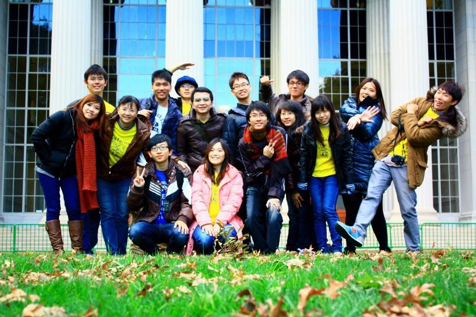
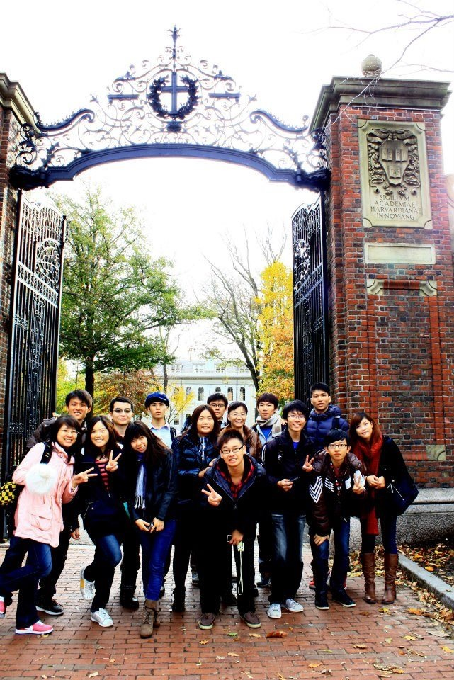
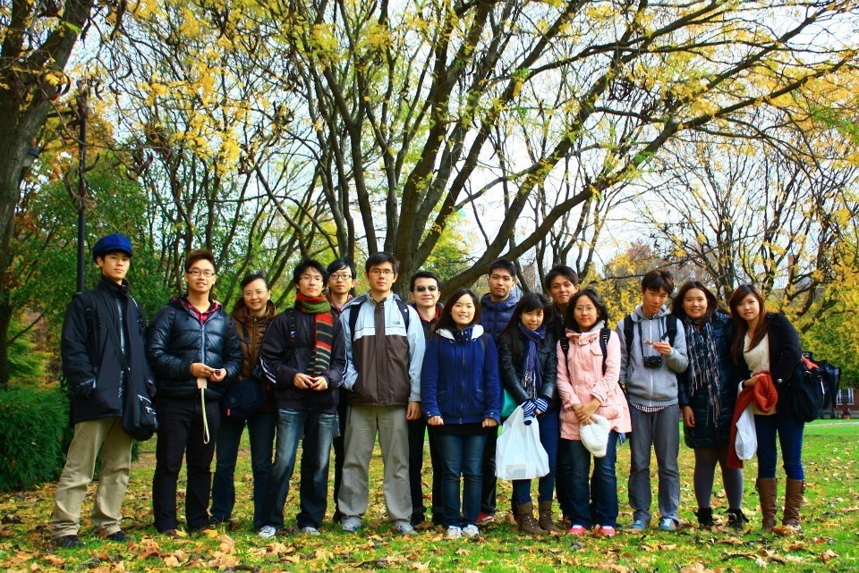

採訪當天陳老師不但親自開車迎接還帶領大家參觀剛落成的科學教育大樓，其中嶄新的微生物實驗室和一整排蓄勢待發的儀器，令人看了驚呼連連!但是陳老師說，這樣的榮景背後，有著ㄧ段篳路藍縷的努力時期。交大的 iGEM 由曾慶平教授李曉青老師一手拉拔長大，由於交大科系以理工為主，生物相關的系所並不多，因此知道這個比賽的人少，尋找贊助並不容易，初期經費極度不足的情況下，實驗與出國的開銷幾乎仰賴學校與系上的大力支持。

**然而失之東隅收之桑榆，處處受限的情況下，同學和老師們仍非常爭氣，從 2009 到 2011 年，每年都在亞洲區得到了銀牌的成績。屢創佳績的成果，加上吳校長的大力支持，終於在今年獲得經費，未來的學弟妹們將在完善的實驗室進行更棒的實驗。** 最初，大家加入 iGEM 的理由都不盡相同，大多數人在學長姐們的介紹下認識了這個比賽，但也有人在高中時便透過演講認識了這個比賽，早就立定志向要參加。**有鑑於大家一開始對實驗都不熟悉，李曉青老師建立了一套標準作業流程，大大降低了基因工程操作門檻，讓大家可以更快上手，將時間花在腦力激盪上而非不斷的解決實驗問題。**同時陳老師也專門為 iGEM 開設相關課程，不管一開始認識多少，大家撥出下班後的時間一起努力，在課程中從最基本的實驗概念發想開始，動手操作實驗，為了參加 iGEM 做了充足的準備。

## **承先啟後的腦力激盪**

**從過去 iGEM 比賽中可以發現，許多優秀的得獎作品往往不是因為複雜的技術，關鍵都在於有好的構思。**陳文亮老師加入指導老師團隊後，給了大家很多想法上的突破，讓交大團隊更改以往只有一個大團隊構思的模式，利用分組讓有經驗的學長姊帶領，從回顧分析往年優秀作品開始，訓練大家思考，接著各自提出想法討論，在這激盪的過程中可以透過看見別人的概念和優點，一步步構思自己的題目。中途難免天馬行空，此時有經驗的學長姐們會適時提醒，點出問題，讓大家可以繼續討論，教學相長的結果，有收穫的將不只是參賽同學。 .

## **Ecoline 丁醇生產的最佳化**

在這樣的腦力激盪下 2012 交大 iGEM 團隊獲獎的作品為 "[Ecoline](http://2012.igem.org/Team:NCTU_Formosa)" - "希望以合成生物學的方法，創造能夠大量生產丁醇的大腸桿菌" 。這樣想法始於2011年競賽中，學長姐建構的溫控代謝路徑，透過建構在不同溫度下而有不同活性的啟動子，來建立可以最佳化表現基因的平台。且**跟其他參賽團隊最大的不同是，交大希望能把這個平台擴大，能更廣的應用，甚至實際運用於商業上。**於是今年在分組討論及學長姐的帶領之下，他們結合現在最紅的生質能源，希望透過這個最佳化的平台，大量的生產生質酒精。 .

## **學校的支持**

在參訪過程中陳老師不斷提到，除了同學及老師的付出外，在吳校長上任後，積極推動 iGEM，也讓他們有更多的經費和資源。從映入眼簾的儀器設施，還有經多年淬鍊的學生團隊，明年的交大可說是非常令人期待。 有了學校支持，比賽也更廣為人知，今年除了生物背景的本科生之外，許多不同系所的同學也對比賽產生興趣。李老師認為，合成生物學類似邏輯調控路徑的概念，本來就需要很多跨領域的人才，對工科基礎深厚的交大而言，是一個很好的利基。

## **走入社會**

科學最終目標是為了解決生活上的遇到的問題，因此 iGEM 主辦單位非常看重 **Human practice** 的部分，希望每個參賽隊伍都能思考所做出的成果是否能增進人類的福祉？交大在這個部分，是站在推廣的角度來對社會有所貢獻，因此他們透過舉辦營隊及參訪不同單位來讓大家了解他們的構想。未來他們也希望能更進一步結合交大本身的資源，在當地推廣、深化大家對合成生物學的認識。 .

## **洗禮過後**

在出國競賽的過程中，感受到的文化衝擊也讓大家印象深刻，在 MIT 貼海報時，來聽大家講解海報內容的參賽者，都會提出具體的建議和看法，可以感受到他們誠心誠意、敞開心胸的討論問題，如此正面的學習態度必定能收穫良多。如同上回專訪的陽明團隊，交大的成員也對穿著傳統服飾推銷成果的德國團隊印象最深，這樣令人眼睛為之一亮的行銷方法，也讓大家能馬上記得他們的題目並被吸引，而想進一步了解。 經過一年 iGEM 的洗禮，多數同學對研究都有了更深的見解，他們認為最大的收穫在於可以從無到有構思一個概念並將它付諸實行，並且和一群人共同完成，這與在研究室中，老師決定研究方向、一個人可能只進行部分實驗的感覺非常不同。此外，因為**交大本身有豐富的電子產品商品化經驗，所以老師們也積極的想引領團隊透過類似的模式，將有潛力的成果轉換為更實際的商品，然而，這需要更多分析與專利人才的輔助，意味著在未來，交大團隊的組成將朝向多元化邁進！**

- 此篇為iGEM 系列報導  2012 交大隊專訪 -

 

**相關報導：**

1. [NCTU Formosa團隊獲2012年亞太區國際基因工程競賽金牌獎肯定](http://www.pac.nctu.edu.tw/files/enews/html/2012/129/129.html#news_01)

2. [iGEM @ Taiwan – 參賽現狀與競賽本質](/posts/igem-taiwan/)

受訪者: 陳文亮老師 李曉青老師 劉文堅 張舒涵 張庭 彭凱駿 吳政軒 

採訪者: Connectome 團隊 蔡宜璇 吳婉甄 蘇怡嫻 陳明正 鄒昀廷 黃泓軒
