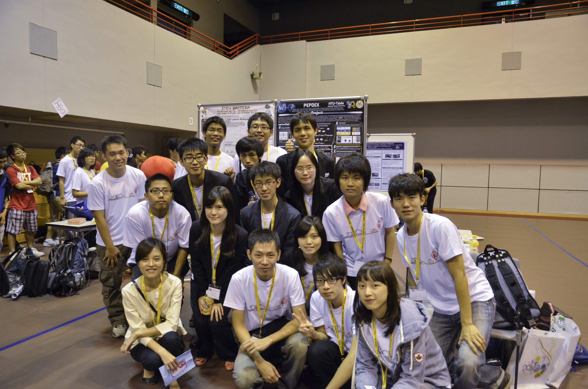

## **草創**

**2011 年，醫學系大四的曾思宜與大六的吳岸叡同學得知陽明大學已多次參與 iGEM，在持續關注下，認為這個競賽很適合醫學生投入，是學習跨領域合作、走上國際舞台的好機會，因而萌生組隊參賽的想法。**為了在尋找指導老師前就能有較為完善的想法，思宜與岸叡先從身邊有興趣的同學朋友開始，著手找尋組隊夥伴，而後再到其他系所舉辦說明會，最後組成了以醫學系學生為主、加上來自電機、生技系成員的 "iGEM NTU-Taida"。  
**iGEM 的主軸－合成生物學本身就是一門橫向連結的跨界學門，而參加 iGEM 就像在玩“樂高積木＂，參賽者必須將許多不同的標準化元件利用各種方式組合成一個可運作的系統，並加入設計創造與腦力激盪的元素。**NTU-Taida 團隊中的許多成員都具有跨領域的背景，例如團隊中負責 modeling 的童文，本身就在電機系內、生醫相關的實驗室做研究，同時也輔修生命科學；醫學系的彥德與思宜則雙主修物理，因此，合成生物學與iGEM競賽對他們來說，可以說是一個整合跨領域所學，並真正嘗試去解決一些現存問題的絕佳契機。 .

## **PepdEX 啟動**

聚集了一群有興趣的成員並集思廣益後，團隊初步選定了三個可以發揮的方向：“癌症偵測”、“體重控制” 及 “免疫調控/減敏”，在分組進行文獻回顧與討論企劃後，決定了第一版本 “減肥菌” 的構想，試著利用轉殖特定基因的細菌在腸道感應脂肪酸，進而表現抑制食慾的賀爾蒙來達到體重控制的效果。但後來發現選定的主題與其他學校的隊伍重疊，因此進行了進一步的調整與包裝，最終版本的 “[**PepdEX**](http://2012.igem.org/Team:NTU-Taida/Project/Introduction "官方網站與詳細介紹")” 遂才誕生。“PepdEX” 是以細菌建立一個感應特定刺激與表現特定短鍊胜肽的平台，整個系統可概分為五個部分：“sensor”、“effector”、“main circuit”、“stability module”及“safety module”，期許能直接偵測生理環境，並進行精密的調控，進而應用於藥物遞送與生理調控等方面。 **值得一提的是，台大隊在 modeling 及 simulation 的部份下足了工夫，有別於一般生物研究著重於性質與現象，modeling 最核心的目的就是進一步“量化”。為了讓整個系統確實能夠在人體中運作，團隊在 simulation 上做了許多 paper work，全面性的測試各種生理環境下可能的影響因子，如參與反應分子的碰撞機率、某種刺激能夠激發出多少量的表現等等，進而找出特定的參數，再與 wet lab data 相互應證，確立一個標準化且符合實際現象的數學模型，提高整個系統的可行性。** 至於 iGEM 相當重視的 human practice，作為一個以醫學生為主的隊伍，加上主題又與 drug-delivery 有關，NTU-Taida 希望成果能有機會應用在臨床上，因此向多位臨床醫師討論、請益，令團隊振奮的是，醫師們對此多抱持著正面的態度，認為只要通過[臨床試驗](/industry/cro/ "觀看所有含\"臨床試驗\"標籤的文章")的考驗，這個以細菌作為治療平台的點子極具價值。此外，團隊也引進了 design-thinking 的討論模式，以期在做訪問與討論時，能夠讓參與群眾更快釐清核心概念，並能確實提出自己的看法，經過實際運作後，發現效果相當不錯，故此，團隊也希望未來能夠與 design-thinking 社團進一步合作，激發出更多不一樣的火花。 .

## **困難**

第一次參賽的台大隊，在經驗與資源上都充滿了不確定性，例如人員實際 wet lab 操作經驗普遍不足、連無菌操作台都沒有的陽春實驗室等等，讓團隊從一開始的 cloning 就遇上重重困難，加上成員們的時間無法契合，導致時程上非常匆促，最後兩周，成員們更是不眠不休的奮鬥。幸虧有老師們四處奔走，為團隊爭取資源作為後盾，以及成員們在最後共同為實驗勞心勞力，總算趕上最後的期限，也獲得相當不錯的成績，讓成員們體會到整個團隊一起合作努力的效率與無可取代的感動。 有了這次參賽的經驗，成員們都認為在台灣的教育體制下，[iGEM](/posts/igem-taiwan/ "iGEM @ Taiwan – 參賽現狀與競賽本質") 較適合高年級且具實際實驗室經驗的同學參加，如此不但能有更多的收穫，也可以縮短一開始的摸索撞牆期；此外，在下一屆的成員招募上，由於台大的系所多元，將能引入其他工程相關、甚至管理領域的人才，期許能有更全面性的思考、激盪與成果包裝。 .

## **多元學習與衝擊**

在 iGEM 競賽從無到有的過程中，對團隊中的每個成員而言，都是很寶貴的學習經驗。來自生技系、對於合成生物學相當有熱忱的謝善棋認為，參加 iGEM 讓他能夠接收到全球合成生物學的最新發展，並從各個隊伍的作品中體會到不同的研究思維；思宜則發現，iGEM 的參賽作品可概分為兩種趨勢：“**規模小但完成度高的應用性成果**＂及“**真的走在最前端的新穎基礎研究**＂，而這兩種類別則可作為未來參賽團隊規畫時的參考。 **面對來自亞洲甚至全球各地學生的競爭，成員們認為台灣學生除了英文發表能力外，在實力上並沒有較其他國家的學生差，但領隊岸叡也提出了台灣學生較容易忽略的兩個部分：**

1. **看事情的角度**－面對一個問題，不只是當場解決，同時更要進一步思考，例如為什麼一定要做這個部分？這個問題的前因後果在整個體系中的意義等等，培養深入看待事情的能力。
2. **正確的努力方向**－亞洲學生個人能力都很優秀，但在團隊合作上，效率常常輸給歐美學生，這或許肇因於台灣的教育環境，“團隊”常常流於單兵作戰、甚至內部競爭，缺少共同合作、集思廣益、朝著同一個方向努力的訓練，如果台灣學生在團隊中，除了能夠指出問題所在，還能夠學習如何共同討論出具建設性的方向，必定能發揮 1+1>2 的實力。

.

## **展望**

在未來參賽的規劃上，NTU-Taida 將嘗試招募更多[跨領域](/posts/share-bio-medical-work-experience/ "跨領域學習後的醫材工作經驗分享 – 羅曉嵐")人才，並在對內與對外討論時，引入 design-thinking 以刺激更多元、更有創意的想法，也期許台灣學生對於未知的領域能夠更勇敢的跨界挑戰，真正嘗試去解決問題。 雖然國內合成生物學領域的研究尚未有顯著的成績，但隨著各隊伍陸續在 iGEM 競賽中取得佳績，也讓更多人對於合成生物學這門跨領域科學有所認識。“合成生物學之於傳統生物研究，就像是電機工程之於物理學＂，目前國外的相關研究正蓬勃發展，相信在這些勇於挑戰的同學們的努力下，能夠讓國內產學界注意到合成生物學這塊值得關注、發展的新天地。

受訪者: 童文 彥德 思宜 善棋 亮博 岸叡 

採訪者: Connectome 團隊 蔡宜璇 吳婉甄 蘇怡嫻 黃聖富 黃泓軒
