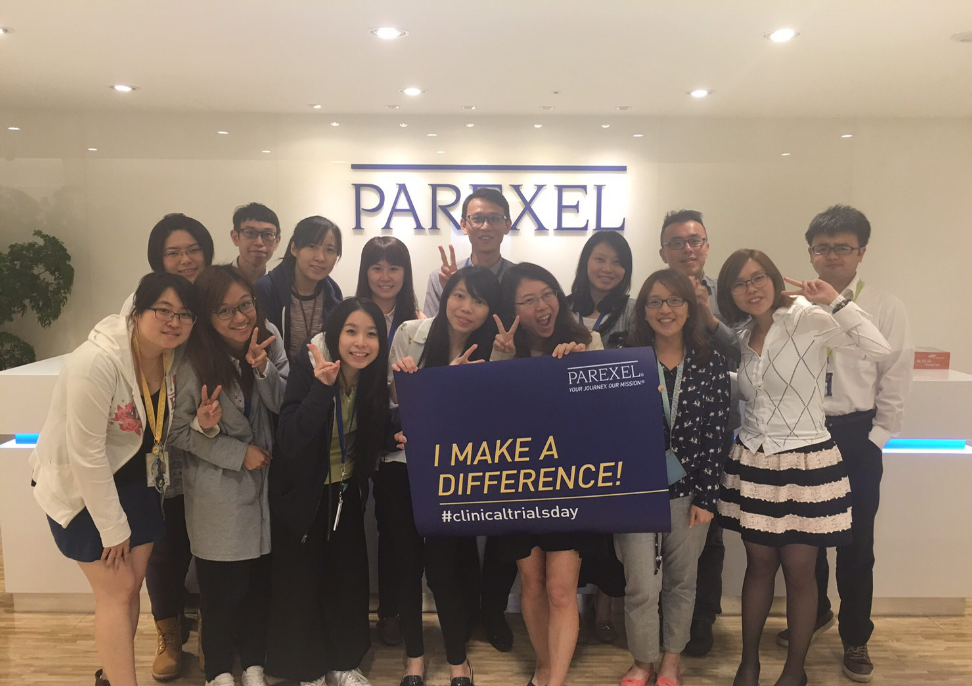

**公司介紹**

百瑞精鼎國際股份有限公司，成立於 1982 年，目前總部位於美國。百瑞精鼎國際主要服務內容為協助世界各國大藥廠從事新藥開發及臨床試驗的臨床研究委託機構（Contract Research Organization），包含: 新藥開發策略的擬定與計劃，國際臨床試驗規劃及整合，臨床研究資料處理與分析，引薦、甄選試驗計劃主持人，受試者同意書之設計，人體試驗委員會之送審，最高衛生主管機關之送審…等等。百瑞精鼎國際目前已成為國內規模最大、服務項目最完整之專業國際 CRO 公司，並已在業界建立高品質的專業形象以及良好口碑。

**如何獲得統計程式實習機會 ?**

在就讀研究所時，我跟著教授承接不同領域的案子，主要工作內容以資料分析為主，在個人成長上訓練自己邏輯能力、獨立思考及細心縝密，在團隊成長上也培養了團隊溝通及默契配合，能最有效率處理案件。此外，要能積極充實自己的英文和程式撰寫能力。能獲得此次實習機會，主要是因為有積極的學習態度、良好的時間管理及承接專案的能力。最重要的是了解自己的興趣所在，並了解在相關企業上班需要的技能和態度。

**實習內容與收穫**

主要實習內容為線上訓練課程，了解公司中各個部門的責任範疇、及其 SOP 流程， 還有 SAS 語法教學，以完成臨床試驗的分析報告書 (Table、Figure、Listing)。我認為公司線上的訓練課程多元且細膩，課程內容清楚明瞭。關於 SAS 語法教學，公司特地請資深員工或主管幫我們進行小班式教學，並且出作業讓我們實做，其實做作業的時候，提出許多問題，許多人都不辭辛勞的告訴我們解決的法，真的相當感謝有這麼一群好同事。我認為每個 programmer 都要有自己獨立思考和撰寫程式的能力，這樣的能力是一點一滴累積來的，從不會到會的過程，你可能會模仿或學習，但是你要從中找到自己的風格，並且在不同的案件中運用，使之成為自己的知識。

**給在學學生的建議**

在百瑞精鼎的實習過程中，我認為最重要的就是「態度」和「溝通」，在心態上必須把自己重新歸零去學習專業領域的知識，但也別忘了一定要有自己的想法和作法，在待人處事上，行有餘力時多幫忙他人，這也會讓你進步更快，有不會的事，也要能虛心求教。

