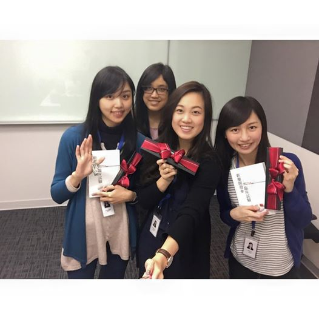

## 實習公司與部門簡介

百瑞精鼎國際股份有限公司(PAREXEL) ，成立於 1982 年，目前總部位於美國。為協助世界各國大藥廠從事新藥開發及臨床試驗的臨床研究委託機構（Contract Research Organization），全球前三大且為台灣規模最大、服務項目最完整之專業國際 CRO 公司，全臺員工約 400 人。2014 年，更獲台灣醫界聯盟基金會評選為台灣表現最佳的 CRO 公司。

## 如何獲得這個機會

大學時期積極參與社團活動，並爭取在藥商、醫院、社區藥局的實習及工讀機會，不僅可訓練自己團隊合作、邏輯組織及專案管理能力，也可以觀察並實際體驗，找尋自己職業熱情所在。能獲得這次的實習機會，很大部分在於積極，積極去安排自己的時間、積極參與業界相關的活動、積極去了解每個職業所需的特質與工作內容，並且**在平常定期維護自己的履歷**。另外，**在積極的嘗試與了解後，對自我的反思也很重要，了解自己的優缺點與熱情所在，在面試時盡量凸顯個人特質，把動機、優缺點與面試 的職位做結合，包裝成一個好故事，會讓大家印象深刻。**

## 實際工作內容與收穫

實習的實際內容上，主要分為三大部分：第一部份公司安排不同部門的主管演講，介紹 CRO 公司的組織架構、升遷管道以及各個角色主要的工作內容。第二部分介紹並探討一個臨床試驗從 Feasibility -> Qualification visit -> Site initiation visit -> Monitoring visit -> Termination visit 各階段的準備與執行，第三部分分小組針對一項試驗計畫書做模擬 Site initiation visit 的報告，這樣的課程壓縮在四周內完成，非常精實且收穫滿滿。

第一部份的課程中，除了對組織架構的基本認識、未來發展方向的了解外，更進一步可觀察高階主管的工作內容及所需能力。在此過程中我發現，CRA 所需的人格特質某 種程度是滿衝突的，在做案件送審及監測臨床試驗時，需要細心與很快速的邏輯思考、判斷能力；在面對主持人、研究護士與倫委會行政人員時需要很強的溝通與社交能力；在個人晉升的階梯上，則要顧全大局，有宏觀的思考與眼光，此時太過著眼於小細節 的細心反而會有反效果。如何靈機應變，在對的位置做對的事情，並符合試驗委託者 與查核者的期待，我想是一個 CRA 是否成功的關鍵。

第二部分的介紹也結合了很多的模擬演練和實作，也是最主要 CRA 工作的核心。概念的了解有時看似簡單，但背後的細節與實際執行內容要在實作後才更能體會，在此階段我們實際進行 Qualification visit 的模擬、受試者同意書翻譯的 Validation、變更案件 的送審，更加了解此工作對於細節的要求。在過程中我也發現，**很多狀況下每個 CRA 的處理方式可能會有差異，沒有絕對的對與錯，但要謹記在心的是「病人安全」與 「資料完整」，只要我們知道自己在做什麼，確保十年後的人回頭來看這些資料可以完整地了解當初發生的事，並且在執行當下我們無愧於心，就該多給自己一些自信， 堅定自己的決定。**

第三部分的上台報告，針對一份實際執行中的臨床試驗做 Site initiation visit 模擬，這樣的訓練讓我們更能抓到一份試驗計畫書的重點，並學習從聽者的角度去思考，了解試驗實際執行上主持人最想了解的部分。我想，不管是哪一種工作，抑或是在人生中其它方面，都該思考對方的立場與關心的重點，如此說出來的話語才更能切符人心。

## 給想實習的人的建議

在百瑞精鼎的實習過程中，我認為最應具備的條件就是「態度」，把心態調整成是做自己的第一份工作，主管交辦的任務盡快去完成，並主動幫助他人。**以一個新人來說，不管是專業領域還是雜事、人際上的應對進退都是學習，在完成任務後回頭思考整個流程，下次該如何處理會較有效率，重複這樣「計畫-行動-修正」流程，對往後工作速度上會有很大助益。**
