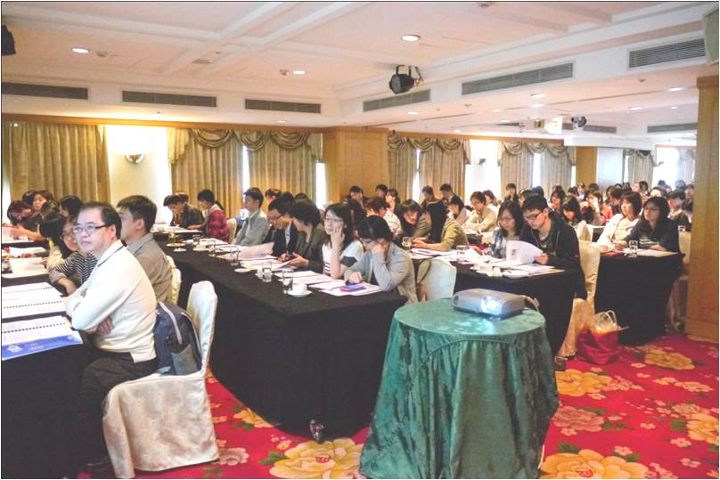

大三一次家族聚會，我認識了一個媽媽年輕的朋友，她說她在藥廠上班，因為深得經理信任，所以她跟著飛遍亞洲、歐洲開會、辦活動，平常沒事就跟醫師朋友聊聊天、約吃飯，當時的我覺得：哇！實在太拉風了，我以後也要當藥廠產品經理 ([PM](/taxonomy/term/117/), product manager)；你是不是也如是以為。 研究所畢業前就開始遍尋各大藥廠的 marketing 職位，除[外商](/taxonomy/term/94/)原廠外，[本土廠商](/taxonomy/term/24/)就以上市公司為考量，期間經過八次面試、五家廠商的失敗 (是的！**永遠不要放棄**)，終於有幸進入一家上市的本土藥廠擔任行銷工作，我的部門是機關醫院事業部，產品是處方用藥而大部分的客戶是醫學中心 (MC, Medical center ) 和區域醫院 (RH, Regional hospital)，一開始的職稱便是產品副理 (Associated product manager, APM)，這頂高帽子讓我以為我就要開始光鮮的應酬生活了，但沒想到是從影印小妹開始... .

## **關於工作: 魔鬼就在細節中－進藥與教育訓練**

第一個月都在整理文件和影印，如山的紙張堆積，無數的副本，為的是進藥 (listing, 讓自家產品申請列入醫院的正式品項)，處方藥的進藥是比選舉還要競爭的事情，因為當選率可能只有1/100，每家醫院藥委會成員可能是五個，也可能是50個，你必須要跟業務代表一起去說服藥委拜託拜託投你一票，我曾經為了等一位醫師下診等了4個小時，等到花兒也謝了，被冷言冷語或當面拒絕更是家常便飯 (是的！也要做跟業務很像的工作，行銷和業務緊密連結)，百般努力只是因為如果某家醫學中心今年沒成功，可能這個產品就會因此少掉2%的業績。 一開始就能製作進藥資料是一件很幸運的事，代表你手上有新的產品，如果是老藥 (mature product) 或過[專利](/taxonomy/term/114/)保護(off patent) 的產品，很可能你只會遇到議價，不管是醫院年度議價或是突然醫院覺得你們產品賣太好的議價，這時候，對市場和競品的熟悉可以幫助你訂定一個良好的訂價及議價策略。 (延伸閱讀: [臺灣低廉藥價的另一面](/posts/taiwan-drug-lowprice/ "臺灣低廉藥價的另一面")) 另外一個魔鬼是你產品的仿單，它就像產品的身分證一樣，你可能從接手產品就沒有好好看過仿單，然而作為一個marketing person，產品經理必須擔任研發部門和業務部門的橋樑，把艱澀拗口的文獻、paper、實驗數據、列在仿單上的事實，清楚明快的用快狠準的句子展現在行銷工具 (promotional material) 或提供給業務的說帖上。舉例來說，你要把”使用產品A七天之後，治療組的腹瀉時間 (h) 顯著小於安慰劑組”寫成”產品A可以有效改善腹瀉，縮短病程，減輕患者的痛苦” 這樣淺顯易懂的表達方式。 平常對業務的教育訓練也是重頭戲，除了固定的週會，月會、POA (plan of action) 都是你的舞台，如果你賣的是抗生素，你就要從細菌的分類開始教，如果你賣的免疫抑制劑，恭喜你!你得讓每個人都了解 cytokine 是什麼、白血球有哪些，一個好的行銷人員，要有淺顯易懂教學能力。 .

## **行銷的方法: 三井 vs 三明治，達到目的就是好方法**

除了上述的工作外，我之所以喜歡 marketing 是因為大概有30% 的時間你可以拋下公文、powerpoint 和數字，到醫院去認識你的客戶，介紹你的產品、解答他們的問題，這時候堅強的產品或專業知識就是你踏實的基石，產品介紹分成幾種形式：一對一的說明 (detailing) 和 團體介紹 (GPP, group product presentation) 或是邀請醫師來介紹的科會介紹 (CM, clinical meeting)，重點是在每次制式的產品介紹之中，因科別制宜的方法引起他們對產品內容的興趣，一次失敗的 CM 可能即使請他們在豪華的三井吃飯他們都只專注在數有幾片生魚片，但如果你夠生動、掌握到需求，一個三明治就能達到你的效果。

最可憐的莫過於還要上班的週末了，偏偏各種大大小小的醫學會都只能辦在週末，但只要想想辛勤工作的醫護人員，週末也要被迫來上課、演講，你就會心甘情願為他們服務。

**行銷的重要利器－醫學會與研討會**

在醫學會擺攤或贊助演講目的是增加你產品的曝光度，如果有新的文獻支持，邀請一個了解的醫師來分享研究結果更是加分的不二法門，如果你能提供更多相關的疾病或產品資訊，或你夠面子請重要的意見領袖 (KOL, Key opinion leader)來站台，你們更可以主辦一場大型的研討會 (workshop/ symposium)，申請學會學分讓醫護人員花一整天或半天聆聽你準備的資料，這種時候就會是你最慌張的時候了：晚宴菜單是什麼?桌花要不要放？演講資料準備了沒？主持人誰去接送？邀約的達成率多少？每場活動至少都要一兩個月前開始準備，當活動，結束後查克拉耗盡但現場座無虛席的畫面還是會讓你只喊痛快。 (延伸閱讀: [醫療業的市場活動操作大綱](/posts/sales-rep-medical-professions-marketing-activities/ "業務人生 – 醫療業的市場活動操作大綱 "))

### .

## **結論**

產品經理除了上述工作職掌外，你可能還要設計包裝、參與[臨床試驗](/posts/taiwan-clinicaltrail-problem-future/)討論、接待原廠、編列預算、撰寫說明書/信函/公文、跟媒體合作、跟病友會合作…etc，有太多事等著你去學習，因為行銷是所有努力的集大成，要在產品的未來制高點往回看，必須緊緊串聯業務、研發、財務每一個團隊。因此，培養可以柔軟的放下，也可以堅毅的扛起的**溝通能力**是最重要的課題，它將是你最需要的武器，雖然在藥廠三年還是菜鳥，但以下建議可以提供給想進入這個領域的朋友：

* **事情永遠可能在最後一秒改變，不要著急就可以隨機應變。**
* **充實多種興趣**。這點跟業務一樣，你永遠不知道你哪個冷門的興趣會引起哪個客戶/合作夥伴的興趣。
* **善用聯絡簿與行事曆**。用你自己的方法，把手上需要做的事情條列出來，再排優先順序，不然你會發現你有90%的時間再應付突然來的電話和突然被經理交辦的事情。
* **整理你的檔案夾、信件和名片**。系統的整理這些雜亂卻又重要的東西，每個文件都留下電子備份，不然會找公文或找一個人的電話找到哭出來。
* **喜歡你的產品/相信他的效果**。只有喜歡它你才會有辦法行銷他，既然娶進來了就要讓它漂漂亮亮，但如果你還是不喜歡就想辦法換部門吧..

. 希望以上文字對你/妳有些幫助，也希望未來十年二十年可能繼續留在這個產業的我，也能分享到你/妳的經驗談喔! .

Connectome 致力於增進讀者對生技產業的了解，而職場見聞與職涯心得更是我們努力推廣的內容，在此感謝 Carolyn 與我們分享熱情、生動的職場見聞，期待更多讀者加入分享的行列，幫助年輕學子的生涯規劃與發展，歡迎主動[來信接洽各種合作機會或投稿](/connectbar)! 
