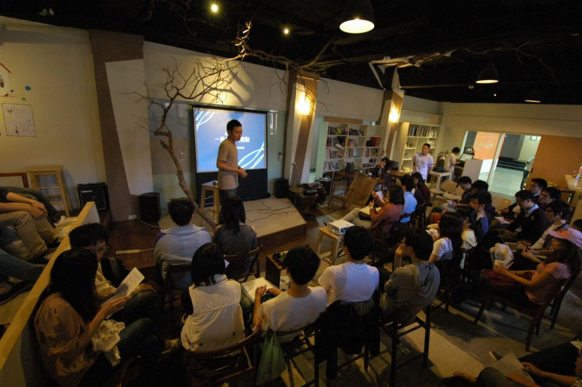
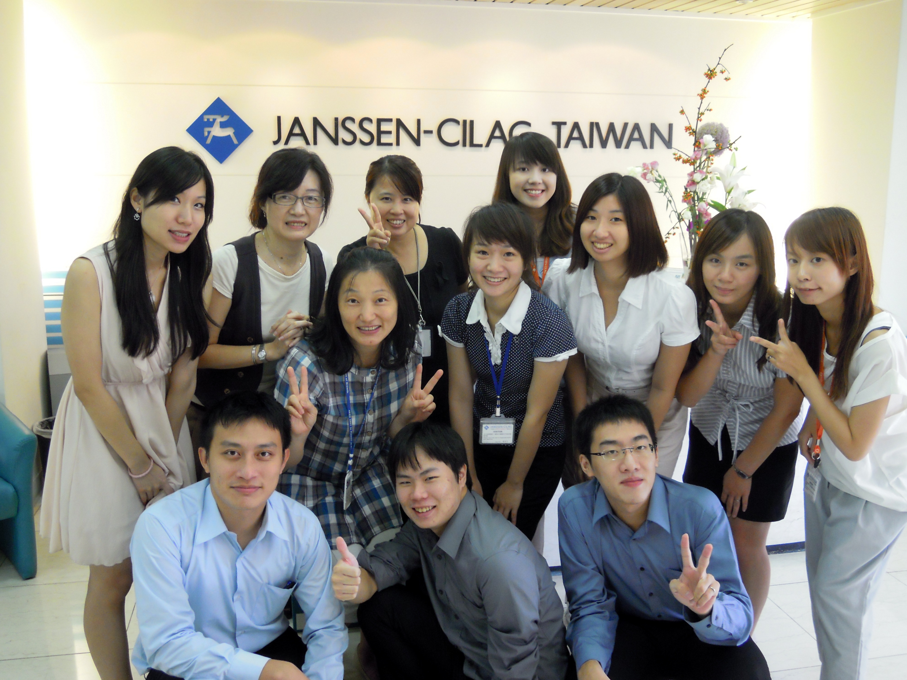

## **個人簡歷**

陳明正同學是 [Connectome](/about/) 的創始成員之一，他畢業於台大生技系，曾在台大藥理所陳青周老師和化學所方俊民老師實驗室進行暑期實驗室研習。生技系畢業後進入台大化學所攻讀碩士學位，研究主題為多醣疫苗的合成開發。學期間曾於瑞典斯德哥爾摩大學交換，目前則在服替代役。 除研究經歷之外，陳明正在就學期間也曾參與許多社團活動；曾參加過台大慈幼義光團、攝影社等。另外在青年社會參與方面，曾在龍應台文化基金會擔任志工、參加以立國際服務的計畫籌備、YEF創業競賽、以及台灣諾華製藥舉辦的 Biocamp 生技領袖營等等。

**實習動機與對生技業的期許**

在正式開始以前，明正首先和大家分享自己在求學過程中對於生技產業的認知與期許。在大學時期，由於對藥物開發的興趣，他一頭埋進了藥理所、化學所的實驗室。然而，在做實驗的過程中得知：自己似乎對於實驗室工作不是這麼感興趣，想要嘗試實驗室以外的不同可能性。他想知道，每一個人都說生技產業很慘澹，但實際上的情況又是如何呢？參加台灣諾華製藥的 Biocamp 以後，明正受到了許多不同的衝擊；他認為在應該要對產業界和實際的工作有更多的認識，因此決定利用自己僅剩的最後一個暑假進入企業界實習，希望能在兩個月的時間內對國內生技製藥產業有實地體驗，了解之後再決定自己未來是否要投入相關產業。

## **實習前的準備**

明正首先和我們分享如何找到適合自己的實習機會。每年的3月到5月，國內外企業皆會透過網站、BBS或是學校（例如[台大 TIP 平台](http://www.104.com.tw/area/tip/index.cfm "臺大管院實習計畫(TIP)")）進行實習徵才。想尋找實習機會的同學即要把握機會了解自己想進的產業或職位。在充分收集資料，鎖定目標企業後，最重要的就是如何透過履歷介紹自己，寫出屬於自己的故事，在應徵的第一關就給人資部門令人難忘的印象。在爭取外商藥廠暑期實習機會的過程中，要先思考：相較於具有商學背景或是藥學系的同學，自己有什麼優勢呢？明正認為，除了自身的科學背景，平常也要積極涉獵不同領域的知識，可以趁學生時期選修一些外系課程，最後也要回想以前所參加過的活動、社團等能和實習工作有關的個人特質。 他舉了自己曾與朋友舉辦「千人百元助海地」活動做為例子；在此活動中他和幾位好友在海地地震後，希望能透過資訊平台建立、尋求企業的贊助加碼，鼓勵年輕人透過小額捐款來幫助賑災。因此在活動籌辦的過程中，除了觀察問題、進一步提出解決問題的行動著力點，過程中也展現了團隊合作的能力。最後在通過面試關卡，並在指導教授的首肯和協助下，終於在完成畢業論文、前往瑞典交換學生以前，順利得到暑期實習機會，能夠前往楊森大藥廠實習。

## **公司簡介與實習工作介紹**

嬌生集團（Johnson & Johnson）是一跨國大型消費性產品與醫藥集團，產品包括醫藥、醫療器材、隱形眼鏡和其他消費品。此次明正所實習的單位即屬於嬌生集團旗下，名列[全世界前十大藥廠](/posts/top-10-global-big-pharma-1/ "全球十大藥廠介紹")的楊森大藥廠（Jansen-Cliag）台灣分公司，實習內容為協助醫藥事務部門底下新產品評估計畫（New Business Development）的進行，主要參與的專案為兩款分別屬於抗憂鬱和抗癌的新藥，看其是否適合公司後續引進台灣市場。 新產品評估的計畫希望透過推出品牌學名藥，或是取得國外已累積足夠臨床數據且上市的[新藥](/industry/製藥/)授權來增強公司的產品線。評估的方法是以市場調查、專利評估、該疾病的臨床趨勢發展和競爭者分析等，對欲引進的藥品有全方位的檢視，希望擬出進入台灣市場的切入策略。 明正和大家分享的第一個案例為一抗憂鬱症學名藥進入台灣市場的評估過程。先從台灣地區中樞神經類藥物及其適應症進行大致的市場分析：例如可分為止痛劑、抗帕金森氏症藥物、抗癲癇藥物、抗精神病藥物、麻醉藥及其他等數種。歷年市場調查的結果發現，目前台灣抗憂鬱症藥物市場仍具成長潛力，加上或許引進抗憂鬱藥物能加值目前公司的行銷能量，使總體營業額成長。接續確認哪一種類抗憂鬱學名藥可以引進市場後，即需要對專利即將過期的類似藥物展開專利分析，確認各競爭者公司的專利內容和專利到期日。綜合所有分析步驟後，決定最適合引進的標的。 第二個案例為抗癌藥物之授權引進。該藥物最先在德國上市，是用來治療多種血癌的藥物。最後進一步分析該藥物全球授權狀況、適應症一覽、在台灣的[專利](/industry/智財/)申請現況等等，總結出公司若要切入此塊市場可能的進入方式。此外除了上述兩個專案參與，明正在實習期間也有幸見習了部門內會議、與外部合作者的會議以及醫院的業務拜訪等，得以一覽藥品上市前所需的協調與準備工作，並從旁觀察外商藥廠人員在不同角色的工作實務。

## **實習心得**

經歷了兩個月的藥廠實習，明正認為可以藉由短期的暑期實習了解自己的不足，並籍由和主管、同事或跨部門間的連絡，培養自己的溝通能力。明正同時也認為未來在產業中最重要的，是具有整合學習與應變能力的人；除了會作研究，也需要對其他領域知識有初步認識。對於[國內生技產業的未來](/posts/asiabiotech-response/ "當邊界被跨越 – 亞洲生技業該如何因應")，明正認為雖然大環境的氣氛仍不熱絡，但對於有志踏入產業的人而言，也得「先問問自己對這個產業了解多少，再評斷機會何在」，在無論是考慮深造或者規畫有興趣的職涯道路之前，也值得先思考：每個人都有屬於自己故事的起點，可能是實驗室經驗、社團活動、修課的啓發，但在探尋起點的過程中，也要多留給自己一些空間，對於大多數的生技相關領域的學生而言，實習是個幫助自己發掘起點很值得的選擇！ .

**這麼精采的實習故事讓你心動了嗎?** **快看看[2013 暑期實習機會介紹](/posts/2013-summer-intern/)並且把握機會報名吧!**

分享者：陳明正，台大生技系、台大化學所畢業，後至瑞典斯德哥爾摩大學交換學生。喜好在不同領域間嘗試發想，也對公益活動充滿熱情，未來希望能結合社會企業與生技產業，創造更普及的醫藥環境。相信將理念付諸行動，或許再加上一股澆不熄的傻勁，能為週遭的議題帶來改變。曾於台大藥理所專題研究、嬌生公司楊森大藥廠實習，並曾參與龍應台文化基金會、BioCamp 等活動。

- 本篇為陳明正同學在 Connectome 10月13日「生技人，實習做什麼？」職涯沙龍的分享整理 -
