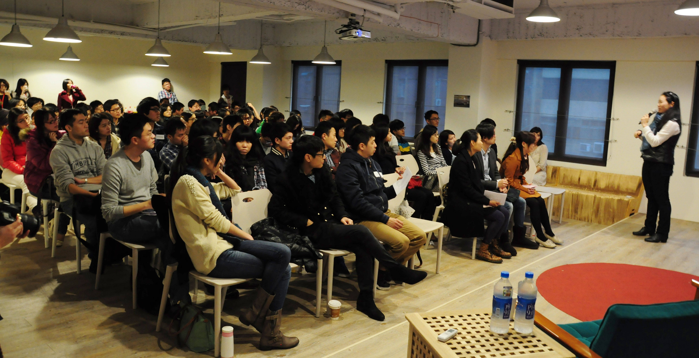
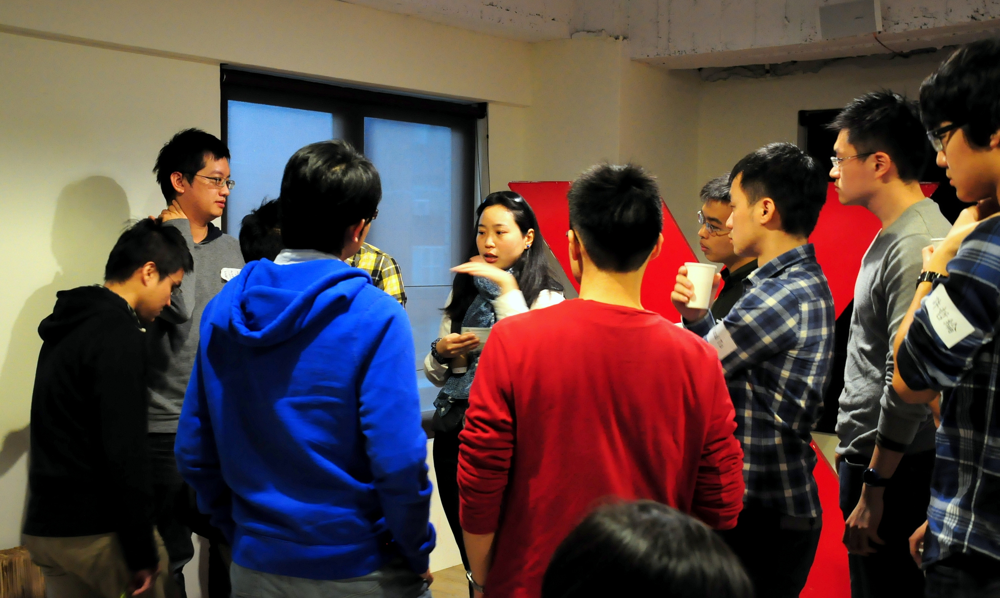

## **My Previous Path -** **從學術到業界**

***『你的未來是由現在所做的一切決定』--梅格．潔伊***  

「我為什麼選擇動物系呢？原因很簡單，就是喜歡動物。」凱雯學姐依照自己的喜好，選擇就讀台大動物系 (現為生命科學系)，系上著重研究人才的培育，因此凱雯學姐雖然不太確定自己是否適合研究工作，但依然跟隨系上風氣計畫出國取得博士學位、成為教授。直到從動物所(現為生命科學研究所) 畢業之後，她才開始認真思考：「自己是否真的要踏入學術界？」此時，學姐申請到 UC Davis 的研究助理職位，於是到了 UC Davis CCM (center of the comparative medicine) 進行 CMV (CytoMegaloVirus) 疫苗研發，給自己一個機會嚐試國外的研究環境是否是她所想要的。經過兩年多的研究生活，凱雯學姐決定離開學術圈，投入業界。 在這之前，凱雯學姐來到 Johns Hopkins University，進修 Biotechnology Enterprise。由於校方體認到生技產業未來除了研發之外，還需要懂得商業、智財的人才，於是設立了此學程，讓學生在了解最前端的科學新知之外，還能學習財務、[行銷](/job_function/行銷/)、產品開發等知識。畢業後，凱雯學姐回到加洲，加入丹麥公司 Bavarian Nordic 位於北加灣地區的藥廠任職研發。 當前的製藥產業可粗略分為傳統與生技[製藥](/industry/製藥/)，傳統製藥根據歐美日大藥廠的藥方進行研究，透過化學合成生產；生技製藥則可透過細胞、病毒製藥，兩者同樣都要通過有效性、安全性的證明，但因製法不同，需要符合的法規與測試項目亦不同。凱雯學姐也指出：「藥物研發的 life-cycle 很長，可能幾年以來都在做同一種藥品的研發」，認為自己更傾向常有新挑戰的環境，因此轉換跑道加入美國 Life Technologies 公司，負責商品客製化與開發。 Life Technologies 為一相當有規模的企業，不同於學界的鉅細靡遺，業界的研發具有強烈的功能性、市場性，兼具效率並要求足夠的利潤，更需要快、好、準的生產。對於員工來說，加快作業速度的不二法門就是不斷學習新知，增加自己對各種背景的認識，具體的措施例如公司會固定舉辦 Journal Club ，分享新發現或同業發展方向，此外也相當重視個人和其他部門的協調和合作能力。 在 Life Technologies 的團隊組織雖然有階層之分，不過上司下屬間有暢通的管道可以直接進行溝通，為了要快速生產出客製化產品，團隊中人人身兼多角，工作內容多樣，有別於發展標準化產品的 R&D 部門專工專職的模式。客製化的另一個重點在於客戶需求，需要透過拜訪與積極了解，並偕同 marketing 部門合作進行初步市場調查，藉此了解該需求是否值得開發為標準化產品，再決定要投入多少資金。此外，也需設計符合該產品的特殊測試，待產品通過測試後才能安心交付客戶。

## **Pursue your career - 求職規劃兩三事**

先後在歐洲與美國公司任職，學姐發現美國公司的步調快速，常有新的任務；歐洲公司福利好、步調慢，然而升遷速度也相對緩慢，「每個公司都有自己的文化與風氣，在加入之前要先打聽清楚」。 若想在美國找工作，擁有美國學校學歷並非必要。求職時可以自己投履歷，也可透過求職網站，如：Monster、Craigslist，具生技背景的學生則可使用 Biospace、LinkedIn。學姊同時建議，不管是在國內外找工作，平時就要拓展自己的人際網絡，積極傳遞自己正在找工作的訊息。 若目標為進入R&D相關部門，PHD 甚至雙 PHD 學位確實能增加自己在同儕中的能見度與競爭優勢，對職涯升遷也有助益；對生物有興趣，但不想做研究的人，則可以選擇專利、市場研究或業務。但學姊也再次強調：「請先想請楚為何要唸 PHD，而非盲目的去唸。」，詢問自己「我自己是誰？我擅長什麼？我喜歡什麼？」再做出選擇。凱雯學姐經過審慎思考後，確認自己傾向從事市場開發及產品管理等相關工作，才決定申請 Berkeley MBA，學習更高階的商業技巧。 關於個人職涯常見的跳槽議題，學姊也提醒，踏入業界之後如果想要嘗試新的工作環境，須注意在生技業圈子很小，可以試著在求職時請求未來雇主先不要告知現在雇主，但這樣也可能會造成新雇主對你轉換工作的原因有所疑慮；或者也可以選擇和現在的雇主溝通，讓現在的雇主知道你有轉換工作的想法。最好能讓未來的雇主了解你的狀況，也提前跟現在的雇主溝通，預防轉換工作時與前後雇主之間產生不必要的誤解，甚至影響個人在業界的評價。

## **Brand New Stage -** **從研發到 MBA**

****

**「學歷只是一種證明方式，並非人人都需要 MBA。」**

不同學校的 MBA 課程具有不同的特色，建議思考自己所需要的來進行選擇。學姊所申請的UC Berkeley，其 MBA 又分成三種類型，依照不同的類別需要提供的申請資料也不同。 以學姐申請的 Part-time (具有 5 - 10 年工作經驗者) 為例，除需提供成績、以 assay 介紹自己、說明為何進 HAAS MBA 幫助你實現你的夢想，也要能提出在自己過去的經歷中，有哪些事情符合 HAAS School 的四個原則 (Question the Status Quo、Confidence Without Attitude、Students Always、Beyond Yourself )。 學姐的申請過程中，Committee 曾詢問「五年之後要做什麼？十年後、十五年後呢？」，以及「想達成未來的目標，現在需要做什麼樣的努力？」等職涯問題。「就我自己而言，我喜歡動物，因此這部分的問題我的回應是希望能對環境盡一份心力，面對這麼複雜的全球性議題，需要多方跨國合作才能解決，因此才會選擇進修國際貿易及創業相關，希望能夠讓自己具備創造機會與資金的能力，同時了解國際間複雜的商業互動與政治角力，進而說服眾人合作來解決問題。」 最後，凱雯學姊順利錄取了 UC Berkeley 的 MBA 學程，學姐事後思考自己能入選的原因，一部分應是因為自己的生物背景能增加該系所學生組成的多樣性，再加上經過認真思考的申請動機，並且能清楚論述如何利用在 HAAS School 的所學來完成自己的目標。 在 Part-time MBA program，凱雯學姐利用週末整天修課，平常下班後也犧牲休閒娛樂，把握時間唸書。「唸好學校的 MBA 絕對有它值回票價的地方。」，遇到了許多強者並自我砥礪、增加自身的 presentation skills、也勇於開口發表意見，和其他人一起討論。「台灣學生普遍不敢發問，然而不開口，別人很容易以為你不懂。」學姐呼籲大家，要鞭策自己有想法勇於表達，有問題勇於發問。 「如何說服公司，生技背景的人也可以擔任管理、行銷的工作呢？」，面對現場聽眾的提問，凱雯學姐建議除了要先做好功課，也要找機會展現自己的能力。進入公司後適時毛遂自薦，由小專案做起，累積成果並爭取信任；例如學姐本身就曾主動向公司提出，願意在返回亞洲探親時順道拜訪亞洲客戶，其後亦主動為亞洲團隊進行訓練課程，從小地方開始累積經驗。勇於發現機會，勇於嘗試。

## **What do you want ?**

最後，學姐推薦「從A到A+ (Good to Great)」這本書，依照其中的人生發展概念試著**「找到自己的優勢、喜歡做的事情及熱情所在」**，了解**「自己是誰？擅長什麼？喜歡什麼？」**，並且思考**「想達成未來的目標，而現在需要做什麼樣的努力？」**。有了計劃，才能一步步達成自己設定的目標！

 

※    凱雯學姊目前受邀為 Connectome 部落格撰寫「[**來自加州生技產業的十二封信**](/columns/來自加州生技產業的十二封信/)」專欄，歡迎追蹤閱讀。

※    演講中提到的求職網站連結：  

      - Monster: [http://www.monster.com/](http://www.monster.com/)  

      - Craiglist: [http://www.craigslist.org/about/sites](http://www.craigslist.org/about/sites)   

      - Biospace: [http://www.biospace.com/](http://www.biospace.com/)   

      - Linkedin: [https://www.linkedin.com/](https://www.linkedin.com/)
