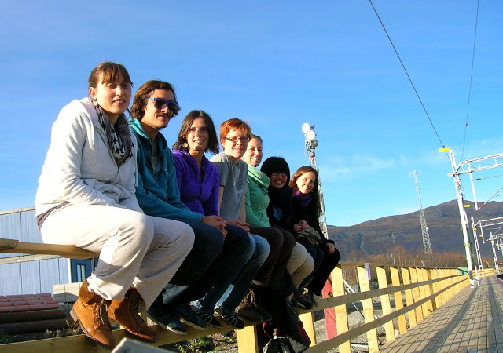

## **以嘗試取代疑惑**

雖然我一直都很享受學習生命科學這個領域，但是我一直提不起勁去實驗室，或是開始自己的研究，於是我瞭解吸收知識和創造知識是兩件截然不同的事情，喜歡念書拿好成績，和有沒有興趣做研究以及做好研究，是截然不同的兩件事。在一個偶然的機會下陪朋友去看交換學生姊妹校的博覽會，我開始思考在我還沒有確定未來的方向以前，也許交換學生會是一個不錯的緩兵之計，在新的環境生活，離開自己的舒適圈，學習新的東西，這些未知的刺激也許可以幫助我思考下一步，而在交換學生之前，大三大四我也盡量去修各個系的課，我一直都相信，只有真的去嘗試和瞭解，才知道那是不是真正適合自己的，也許過程迂迴，但是卻不會白費。 .

## **交換學生: 轉換領域的契機**

決定要去交換學生以後，我覺得最關鍵的是學校的選擇，如果交換學生的目的是想修課，那可以先看看那間學校的課程是否有自己想修的課，我會選擇 Umea 就是因為那邊的設計學院很有名，想修一些在臺大沒有機會上的課，但如果目的是想旅行，那麼學校的地點就很重要，最好是位在一個進可攻退可守的地理位置，交通的便利性就會是一個重要的考量因素 (當然最完美的情況是兩者兼得，可是像 Umea 就是在超偏僻的地方，旅行非常不方便)。

回顧在瑞典交換的一年，真的是一段很不一樣的經驗，這也跟我之後能夠轉換領域有密不可分的關係，在 Umea 我申請了一個年的設計課程 – Introduction to Industrial Design (IDI)，在這一年的 IDI，主要分成四大領域的課程：工業設計，汽車設計，互動設計和服務設計，這個課程是專門開給沒有設計背景但是想學設計，或是有設計背景但是想要豐富自己的作品集或是接觸看看其他的設計領域而開的，對我而言這簡直是完美的課程，可以利用交換的這一年去學習新的東西，瞭解設計領域的大概輪廓，然後邊想下一步應該怎麼走。 在 Umea 念書的一年中，是我第一次接觸到互動設計 (Interaction Design)，而在學習的過程中，我發現到這是一個可以結合很多不同領域，例如人類學，心理學，行為學等等，而生命科學背景的我想這也許是可以結合設計和生命科學兩種不同領域的機會，所以在結束瑞典一年的交換以後，我就開始準備申請互動設計的碩士班。 .

## **傾聽自己的聲音**

其實在決定是否要繼續申請生科領域的研究所或是轉而申請設計領域，真的是一個很難的抉擇，畢竟兩者之間的選擇，一個是很熟悉的領域，而另一個卻是截然不同而且陌生的領域，現在回想起來我也不知道當時我為什麼會有勇氣做這樣的決定 (我覺得應該就是一種傻勁吧哈哈，但其實我是申請上了以後才開始覺得很可怕...) 。 對於要轉換領域的人，我覺得最重要的就是先瞭解自己，知道自己的興趣和優勢在哪裡，並且聽自己內心的聲音，雖然講得很老調重彈，但是真的一點都不容易，下定決心的過程，內心掙扎和煎熬真的是蠻痛苦的，當時我只告訴自己，寧願自己跌跌撞撞滿身是傷，也不想選一條舒適安逸但是卻會令我自己後悔的路，我並不是特別有勇氣，而只是不想後悔。其實決定沒有所謂的好壞，最重要的就是選了以後，堅持並且認真的走下去，且走且看。

另外很重要的一點，就是對於自己轉的領域要有一定程度的瞭解，不能單純依靠著心中的對於那個領域美好憧憬而決定轉換跑道，不然很有可能轉了以後才又發現這跟之前想的有所出入。 .

## **是否有來自外界的質疑，如何面對它們?**

我的家人和朋友其實都蠻支持我的。除了大三放棄推甄生科研究所的機會並決定去瑞典交換學生的時候，家人當時比較難以理解，但都是出於關心， 擔心我換領域以後會很辛苦，並不是激烈的反對。我覺得在面對家人質疑的情況下，溝通是很重要的，但這也是我覺得我做的不夠好的地方，我是習慣一路上自己邊走邊看慢慢思索下一步應該怎麼走，偶爾和家人分享我的心得，但是很多時候都是心裡大概有百分之八十確定應該會怎麼做，才告訴家人，過程中家人當然會有遲疑和勸退，但是最後都還是相信並且支持我的選擇。 除了家人以外我也很感謝我身邊的朋友，我並不是一開始就知道我會想念設計，我也不知道我最後會選擇互動設計，在我困惑的時候，朋友真的給我很多支持，願意聽我說話，和我討論以及給我一些意見，每一次的討論都有很棒的收穫，真心的感謝一路上支持並且給我許多幫助的朋友們。 . 

## **轉換跑道後，如何看待大學四年**

大學四年裡，我覺得最重要的就是去嘗試很多新的東西，對於還不確定自己興趣的人，接觸不同的東西可以幫助發掘興趣，有些新的領域可能是以前從來不知道的，有些領域可能是以前知道，但卻從來沒有機會接觸，大學就是一個很好環境可以去修不同系所的課，去參加各種社團和活動，因為只有真正去學習和嘗試，才知道自己想要什麼，並且在過程中一點一滴瞭解自己更多。 除了修不同的課，有機會認識不同的人也是大學四年裡很重要的一個部份，在大學有機會接觸到不同科系，不同背景的朋友，聽他們的故事和人生經驗，也會得到很多意想不到的收穫。 .
