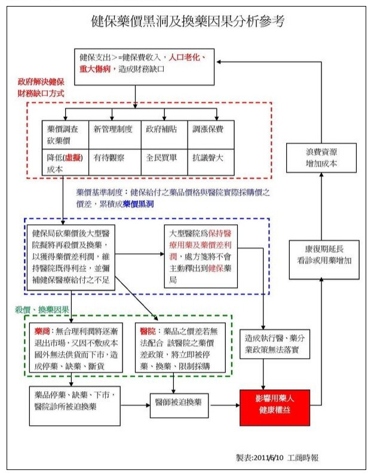

## **<span style="color:#333399">何謂藥費支出目標制 </span>**

健保財政不良已非新聞，醫療資源浪費的情況也時有所聞，因此為了改善健保財政體質，政府在一片爭議聲中推出了二代健保，在經濟狀況不佳下即使民眾百般不願也只能強迫中獎、共體時艱。而除了二代健保外，健保署在今年三月宣布試辦的藥費支出目標制，恐怕更將挑起藥商們緊張的神經，也將對醫藥產業造成不小的影響，然而什麼是藥費支出目標制呢?

> ```
> 為了使藥費支出成長在合理的範圍內，自102年1月1日起，健保將試辦「藥費支出目標制」
> 二年，將藥費支出先預設一個目標值額度，年度結算藥費超出目標值，就啟動年度的藥價
> 調整。因此，未來除對於藥品單價的合理性進行調降外，也會加強藥品使用量的管控，減
> 少外界對於藥品浪費的疑義。
>
> 實施藥費支出目標制，主要是以前一年的藥費(不包含中醫)為基礎，並給予成長率（102
> 年醫院、西醫基層及牙醫合併之成長率，合計為4.528%），預先設定藥費目標值，在年度
> 結束後，如果實際藥費的支出超出預先設定目標值時，於下一年度調整藥價。舉例來說，
> 如果一年的藥費目標值為1,400億元，實際藥費的支出為1,430億元，藥費超過30億元，
> 則下一年必須調整藥價的額度為30億元。
>
> 實施藥費支出目標制後，健保局仍然會繼續進行藥價市場調查作業，以了解市場實際交易
> 情形，並合理調整藥品單價，同時也會強化用藥量的管理，對於不合理的用藥及藥品浪費
> 進行審查及核減，以扣除掉浪費及浮濫使用的藥品費用。
>
> 實施藥費支出目標制對於保險對象就醫權益不影響，醫療院所仍依目前相關規定，提供醫
> 療服務，藥品給付情形與現行作法相同，本試辦方案合理的成長率及調整後節省金額將作
> 為新藥及新科技納入健保給付之用，並不影響民眾用藥權益。
>
>                                         衛生福利部中央健康保險署 新聞稿
> ```

然而藥費支出目標制一旦施行真的不會影響民眾用藥權益，達到健保藥費支出合理化、病人不受影響的美好願景嗎? 這恐怕是個大問號。事實上，長久以來健保透過各種方法的藥價管控，讓藥價幾乎只能降不能升，已經產生了許多不良的影響，而這些影響在藥費支出目標制的設計上，似乎並沒有被妥善的納入考慮。

[](https://forum.doctorvoice.org/viewtopic.php?f=24&t=59901 "藥價黑洞擴大 無辜民眾被迫換藥")

## <span style="color:#ffffff">.</span>

## **<span style="color:#333399">管控藥價的負面影響</span>**

<span style="color:#3366ff">**以藥養醫，惡化醫院財政與勞動關係**</span>

在健保實施總額給付的情況下，醫院被迫以藥養醫，透過藥價差來補貼醫院其他營運 (如醫護人員、病床等財務缺口)，故在採購以及開立藥品時，可能會傾向選擇藥價差大的藥品，意即同樣成分及療效差不多的甲乙兩藥物，若甲藥物健保核價為 10 元，乙藥品核價為 20 元，若藥商售價皆為 8 元，則醫院會選擇採購乙藥品藉此獲得 12 元的藥價差而非較便宜的甲藥物，造成<span style="color:#800000">藥費支出的浪費，導致藥價雖調降但費用卻不見的減少的現象，更進一步惡化健保與醫院財政，連帶影響醫療從業人員的勞動條件</span>。（資料來源：[醫療崩壞－醫院「以藥養醫」](http://www.commonhealth.com.tw/article/article.action?id=5042947)、[健保藥價連七砍，藥費支出卻更多](http://www.new7.com.tw/coverStory/CoverView.aspx?NUM=1311&i=TXT201204181453564I9)）

**<span style="color:#3366ff">影響醫生與病人用藥選擇</span>**

藥費調整後，若藥品核價降太多，可能造成廠商不願意販售 (2011年10月藥價調整後，即有藥廠表示近七十種藥物由於不敷成本計畫將退出台灣市場)，使得醫院被迫換藥甚至無藥可用，或在藥價差的考量下選擇採購其他藥物，夾在醫院與病患之間的醫生，則必須負責與病患溝通換藥考量以及可能造成的影響。部分病患在換藥後必須重新適應不同的藥物，更有可能發生必須追加劑量、重複回診等不良後果，尤其慢性疾病患者更有可能得改變長期以來的用藥習慣。更糟的是，部分藥品推出台灣市場但卻沒有可以取代的藥物，造成即使有錢也買不到藥的現象，看似調降的藥價，卻帶來不可輕視的負面影響。（資料來源：[醫院換藥險害死病患](http://mag.chinatimes.com/mag-cnt.aspx?artid=11066&page=1 "醫院換藥險害死病患")）

**<span style="color:#3366ff">劣幣逐良幣、藥品安全亮紅燈 </span>**

健保局給付價格越來越低，部分藥品的價格甚至可說是殺到見骨，直接與間接的導致廠商間陷入殺價競爭的割喉戰，或是劣幣逐良幣造成部分藥品退出臺灣市場。<span style="color:#800000">然而低廉的藥價卻不盡是民眾之福，因為這樣的競爭已讓藥品安全亮起了紅燈</span>。為了降低成本，藥廠委託食品廠代工包裝的新聞時有所聞，甚至還有將賦型劑從藥典級改成工業級等傳聞，都讓民眾與醫生陷入用藥安全的疑慮，更增加藥品監督與管理的成本，造成廠商、醫療機構、政府、民眾皆輸的情況。 （資料來源：[成分不知道、品質放兩旁 「藥」命的危機](http://mag.udn.com/mag/newsstand/storypage.jsp?f_ART_ID=470298)）

**<span style="color:#3366ff">藥商與醫院墊高藥價</span>**

雖然依健保法規定，醫院必須據實呈報藥品採購與交易資料，但由於罰責最高僅為 5 萬元罰款，加上醫院必須以藥價差填補因健保給付不足而造成的財務缺口，造成醫院不實申報採購價、藥商以各種手法墊高藥價再給予醫院折扣等現象。部分藥商則以買一送三、現金折讓等方式販售藥品，再提供醫院不實發票以供查核，導致實際藥價差進一步擴大、健保藥費支出損耗。（資料來源：[藥價黑洞到底是什麼](http://www.gvm.com.tw/Boardcontent_12551.html "藥價黑洞到底是什麼？")、[藥價吃健保 全民買單](http://www.cw.com.tw/article/article.action?id=5012652&page=3)）

> ```
> 「就像賣車，中間商能從轉手中得到利潤，但中間商也要回報以服務、維修等一樣，
>   藥價差的利潤應該是透明、可追蹤、可要求的，」    - 和信醫院院長 黃達夫
> ```

## <span style="color:#ffffff">.</span>

## <span style="color:#333399">**健全的健保與健全的產業**</span>

健全的健保才能讓產業健全的發展，吾人雖肯定健保局管控藥價的用心，以及讓民眾享有高品質醫療的貢獻，但卻必須思考健保局視藥價差為藥價黑洞、藥價只能降不能升對社會以及產業的影響，畢竟近年物價上漲明顯，藥價卻相反，這背後的代價除了上述的負面影響外，也反映在近年廠商縮減人事開支上，讓原本就艱困的生技人員就業環境進一步惡化。

> ```
> 政府強調扶植生技產業發展，而在業者投入 PIC/S 、c-GMP 的巨額投資來提升品質的
> 同時，更在目前社會及民眾關注品質的當下，政府實不應便宜行事，從「價格」調降著手
> 為主。如果以價格做為決策，會錯失許多價值的貢獻，更容易曝露在高風險的政策中。
> 　　　　　　　　　　　　　　　　　　　　　　　　　　　改革藥價 才能談生技
> ```

<span style="color:#ffffff">.</span>

<span style="color:#3366ff">**延伸閱讀**</span>

1. [臺灣低廉藥價的另一面](/posts/medical-price-expenditure-cut/)
2. [藥價黑洞擴大 無辜民眾被迫換藥](https://forum.doctorvoice.org/viewtopic.php?f=24&t=59901)
