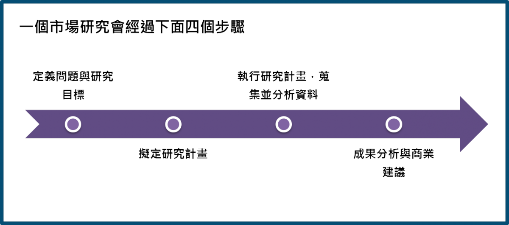
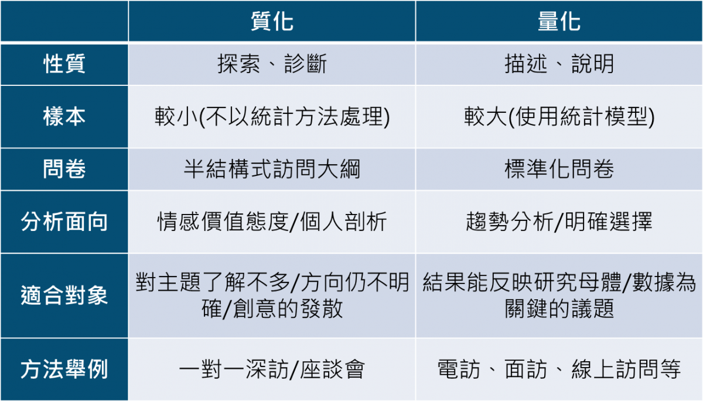

> 維基百科說：  
>       "市場研究是市場行銷學、傳播學、廣告學或統計學當中一門重要的科目"。著重在於資料的取得，分析與預測。

## 

## 市場研究是用來解決商業問題的

你或你的團隊在公司裡每天做出無數決策，有時候可能會依自身的經驗或感覺判斷，或是你們可能會蒐集一些網路上的資訊或聽聽其他人的看法，然而，我們要如何確認這種”拍腦袋”想出來的解決方式是最適合你的消費者或團隊，一個全面及結構嚴謹的市場研究可能就是你所需要的。

以下這些問題可以藉由市場研究回答：

• 我們家產品的市佔率有多大？

• 什麼樣的消費者會購買我們家的產品？

• 產品訂這樣的價格OK嗎？

• 我的廣告投放或訊息傳遞夠精準嗎？要怎麼修改？

• 我這次的行銷活動成功嗎？客戶對活動的評價如何？

• 我要透過什麼樣的媒體才能找到我的目標客戶？

• 我的產品與競品的關係如何？消費者怎麼看我的產品與競品。

• 我的新產品/新概念上市後會成功嗎？

• 還有好多好多問題

(註：由於醫藥產業的特性，上述的”消費者”及”客戶”可能可以替代成”醫師””藥師”或”病患”)

一但你知道公司目前知道面臨的狀況，市場研究分析師就能依照您的需求，設計出能回答這個商業問題的研究方法。

## 研究計畫擬定

現在我們已經定義出要解決什麼問題了，接下來就要考慮怎麼執行研究、蒐集，選擇什麼樣的受訪者要跟你的研究目標環環相扣，如果你想問某藥品品牌的知名度，選擇普羅大眾作為受訪者才能反映出廣告行銷是否成功，但如果你想詢問某種疾病的治療選擇考量，受訪者則需要為該疾病的患者或治療者才能回答你問卷中的問題。

在開始訪問之前，你需要依照以下的確認表(check list)做出完美的計畫

> 1. 決定受訪者條件(如普羅大眾、疾病患者或品牌使用者等)  
> 2. 決定分群和配額(如男女、年齡範圍與分層、地區或產品使用習慣等)  
> 3. 決定人數  
> 4. 決定問卷及訪問長度  
> 5. 評估執行預算及時程

## 質化或量化研究

以數字呈現的研究，一般稱之為量化研究(quantitative research)；以文字呈現的研究， 則稱之為質化研究(qualitative research)。以下用表格的方式，說明兩種研究方法的不同。

## 

## 跟我生技醫藥人有什麼關係？

不論是哪個產業，只要有產品或服務的提供，就會有顧客與市場，有顧客與市場，就需要深刻洞悉您的消費者(customer insight)，用最能影響目標客戶(target customers)的語言影響他們的購買行為。生技醫藥產業最特別的地方是由於處方藥不能打廣告，它的目標客戶可能就變成醫師或藥師，即使如此，能進行的研究方向還是包羅萬象，以下列出部分處方藥可以進行的市場研究：

   -患者：疾病歷程/治療選擇行為與態度/對疾病或藥物的認知/衛教資訊測試/產品概念測試/  
              醫療資訊來源/醫病關係/病友會或支持團體的角色/自費產品的訂價策略等

   -醫師/藥師：病人組成/治療選擇行為與態度/新產品概念測試/品牌定位/  
                      溝通策略/市場預測/醫師滿意度/行銷活動追蹤/訂價策略等

若您的產品是非處方用藥或保健食品這類可以上廣告及行銷活動的品類，則除了上述處方藥可以進行的研究之外，還可以加上：媒體投放策略/廣告測試/門市神秘客調查/包裝測試等屬於消費品的研究策略。

現代的醫藥行銷是講求精準行銷的時代，生技科技日新月異，產品週期縮短，如何能以最精準的資源，提出最貼近目標客戶的心理，更是百家爭鳴的產業中，人人都想習得的武功秘笈。
