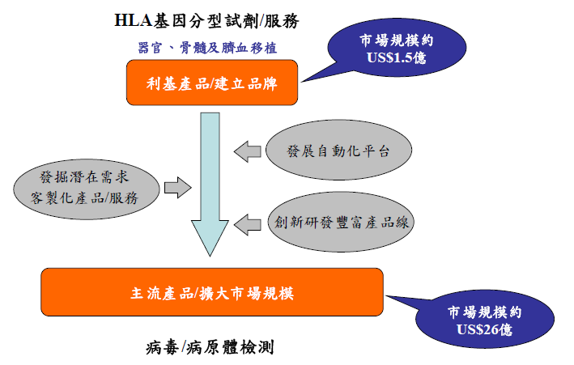
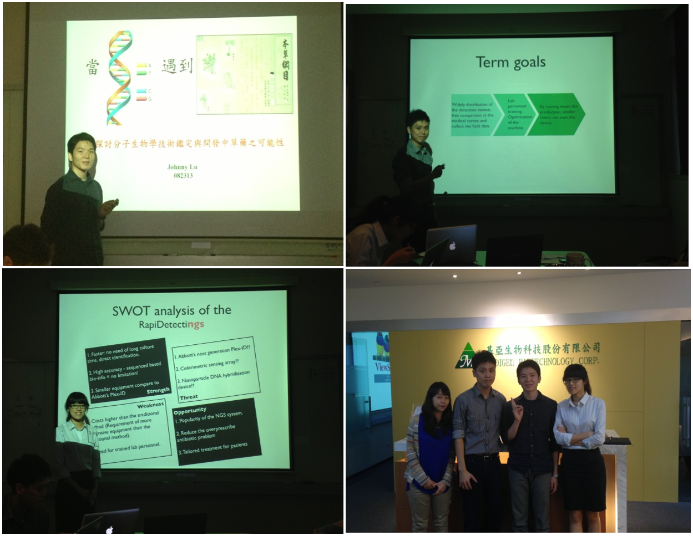

政緯和聖華在這次實習主要的時間都於[核酸檢驗](/posts/taiwan-diagnostic-device/)部門中。[新藥研發](/posts/cancer-new-drug-development-zhang-hui-ling/)是需要長時間的投資及研發，故為了使公司有正常的業務收入，基亞生技投入核酸檢驗市場來做為建立公司穩定營收的基礎，主要發展的項目是 Human Leukocyte Antigen, HLA，為一可應用於器官移植的技術。此外基亞生技也著重於全球人口最多的大陸市場，於2008 併購上海浩源生技，進入中國(HBV/HCV/HIV)血液市場 發展核酸檢驗試劑與自動化設備。雖然基亞生技已將上海浩源生技賣出，但投入的人力和研發的能量還是保留著，等待著下一次進入大陸市場的時機。

**↑ 核酸檢驗產品開發策略**

這次實習的機會主要來自於台灣大學生技中心的產業實習課程及陽明大學的”轉譯醫學及農學人才培育先導型計畫”。此計畫中產學實習的廠商有許多，其中也包含了基亞生技公司為期兩周的實習計畫。 在這短短的兩個星期裡，我們並沒有實際參與基亞的工作內容，主要是以講課的方式來瞭解基亞生技公司。在實習的過程裡，我們所學的主要分為三個部分，第一，各部門的中階主管和我們介紹工作內容與分享工作經驗。第二，實際操作基亞的HLA typing kit 檢測自己的 HLA genotype。第三，學習如何找尋一個疾病基因作為目標，開發一個核酸檢驗試劑的產品。在這次的實習裡，最大收獲就是瞭解到產業界需要何種人才。 在這次的企業實習前，對於產業界的工作馬上想到的就兩種，一是研發人員、二是業務員，對於這兩項工作都不是很有興趣，但在進入基亞生技實習後，瞭解產業界並非只有這兩種工作，還有[行銷](/job_function/行銷/)、[業務](/job_function/業務代表/)、品管、[法規](/job_function/法務與遵循/)等工作，而這些員工都具有兩種能力，**一是在學校學的生物相關科系的知識，二是生技公司中各部門所需的專業能力，**市場部門需要洞悉產業的趨勢、法規部門需要瞭解各國法條、產品開發部需要站在用戶端思考，這些各部門的專業能力若可以在進入職場前先培養，在未來步入職場找工作時勢必有很大的幫助。

生技產業是一個多元分工的產業，包含了研發、法規、專利、財務等等許多的面向，然而台灣生技基礎研發人員絕對不缺乏，缺的是其他相關領域的人才。所以近年來政府與報章媒體都著重於跨領域培養的重要性，開設一些課程或訓練來提供這些需求。而會參加這些課程的人員，我想大多是想要在生技領域中貢獻自己一份心力但又對生技領域徬徨、迷惘的，所以對”跨領域人才”有著無限美好的憧憬，但其實本身不是很了解其工作內容為何，到最後花了時間和金錢才換得一個領悟:自己不適合這個行業。所以產業實習的重要性就在於此，你可以在產業實習部門學到許多部門的合作，深入了解每個部門在產業中的實質工作有那些，藉由這樣的學習，可以使自己了解自己適不適合這個領域，減少走冤枉路的時間。此外經由這次的實習也使我了解產業界的思考和學術界是截然不同的，成本控管、協調溝通、跨部門合作的能力都是產業界強調的，所以有心往產業發展的人真的滿建議盡早進入職場，因為學歷在職場沒有決定性的影響，能夠為公司創造價值才是公司願意雇用的依據及原因。   實習，是學生時代想要瞭解產業概況的最直接方式。

然而，當你確定要實習時，必須考慮以下幾件事，才能在實習中獲得最大的收獲。

1.實習企業的選擇

一家大企業，公司內部制度相對較完備，分工也較細，在大企業實習，可以瞭解各部門是如何在制度下互相分工合作，但能學習到的可能就專精於某個工作。而在小企業實習，規模不大，無法分工很細，每個人都扮演不止一個角色，因此可以學習到較多元的經驗。

2.實習時間的長短

實習時間的長短影響瞭解企業的深度。在這次的實習只有短短的兩個星期，因為時間短，無法實際參與公司工作，只能借由各部門主管的介紹來瞭解基亞。所以主動提出問題就顯得重要許多，藉由問題可以讓故主管了解到你想要知道哪些部份進而可以帶出一些重要的經驗分享，這都是很好的良性互動。所以實習時間長短應人而異，但做好實習準備，了解自己想要從實習中獲得什麼才更顯重要。

3.人脈

建立人脈也是在實習中重要的課題，在實習的過程裡要盡可能的認識人，不管是公司裡的員工、組管，或是一起實習的夥伴，這些人在未來都有可能會是同事、上司甚至是貴人，因此在實習中也要建立自己的人脈。

Connectome 在部落格建置了實習故事專區，我們號召有參與產業實習經驗的朋友撰文分享自己的經歷。我們相信，有更多人的分享、關注，將可帶來更多討論！填寫問卷，一起分享自己的實習故事：[【實習分享計畫】](/posts/intership-sharing-recruit/)
