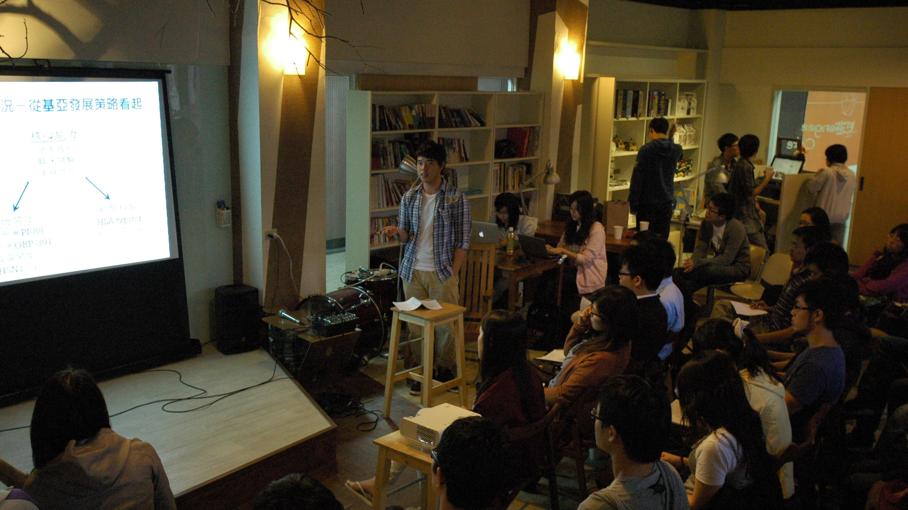
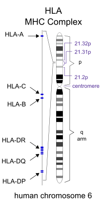
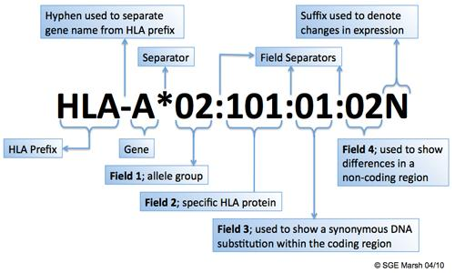

## **基亞公司簡介**

基亞生技公司成立於 1999 年，專注於肝病新藥的研發，目前主要的業務還有核酸檢驗與疫苗事業。而聖富本次實習主要的時間都在核酸檢驗部門中學習。 核酸檢驗究竟是什麼呢？從最廣義的定義來說，算是醫療器材中的一環，屬於[體外診斷](/posts/taiwan-diagnostic-device/ "臺灣體外診斷試劑產業概述") (In Vitro Diagnostic Device, IVD)，體外診斷有很多方法，如免疫血清方法學、核酸方法學、以及其他物理化學方法與儀器的應用，就台灣來說，在 2010 年的統計資料顯示，體外檢驗[醫材](/industry/醫材/)的出口總值為 71.5 億，其中檢驗試劑就佔了 51.2 億。 而基亞目前在核酸檢驗所發展的項目是 Human Leukocyte Antigen, HLA，為一可應用於器官移植的技術，為了更精進基亞在這塊領域上的能力，於 2004 年併購美國 TexasBioGene 公司，並取得 ASHI (美國組織相容性暨免疫遺傳協會) 認證，一步步做好技術與市場布局；此外核酸檢驗技術也可應用於血液病毒篩檢，在這方面基亞認為中國大陸是很有潛力的市場，因此 2008 年時基亞取得上海浩源生技控股權，積極搶進對岸市場。

## **實習見聞**

雖然聖富僅在基亞實習了兩個星期，不過他認為這段時間在公司內實際走訪、探索，帶給他的收穫超出預期。 首先，進入一家公司最能觀察到的就是產業現況，聖富認為他觀察到了基亞的核心能力主要在於分生技術、臨床試驗、法規認證，憑藉著這樣的基礎，一方面延伸至藥物開發的部份，如肝癌新藥開發、疫苗開發等，另一方面則走向醫療器材領域，也就是前面所提過的核酸檢驗技術，目前將火力集中於 HLA typing 與血液病毒篩檢。 新藥的部份，基亞可說是交出一張漂亮的成績單，PI-88 肝癌新藥獲美國食品藥物管理局 (FDA) 通知, 正式取得肝癌「孤兒藥」資格認定 (Orphan Drug Designation) [註1]，目前陸續取得台灣、韓國及中國大陸主管機關核准，目前在20個醫學中心執行肝癌第三期臨床試驗。 核酸檢驗的部份聚焦於利基產品與該品牌建立，以發展客製化服務、建立自動化平台、新研發標的搜尋，進而在主流市場中佔有一席之地，擴大市場規模。 除了主要公司方向的觀察學習外，聖富也提到，在實習過程中和公司內人員談了許多，當然大家最關注的必定是「[新鮮人的機會在哪裡](/posts/biojob-informations-taiwain/ "從數據看台灣生技就業現況")？」根據基亞的人員分享，像是行銷、[業務](/job_function/業務代表/)、研發、法規、品管等都有機會，只是各個工作需要的能力、工作性質也各有不同，舉例來說，由於基亞的客戶遍布全球，所以身為行銷、業務常常都要成為空中飛人，為各地客戶排疑解難，而要能夠排疑解難固然需要一定的專業能力與知識，此外語言能力更是不容忽視的一點；而研發人員除了純熟的實驗能力之外，如何優化各產品也是工作重點之一，另外公司也注重新產品的開發，而新產品常常是由行銷、業務在外接觸業務，研發人員接觸相關[產學合作](/industry/育成/技轉/)，互相交流產生新想法，因此各工作人員都要有良好的溝通能力才能發揮最大價值。另外像是法規、品管人員也相當重要，必須有優秀的溝通能力，能處理好上下游的溝通協調，方能將產品順利通過法規驗證，另外一些跨領域如機械、資訊程式等，也是未來產業中急需要的人才。 從這次的實習經驗中，聖富認為實習可以帶領學生更早認識產業，也更早知道自己欠缺哪些能力，像是語言能力要及早準備、廣泛涉獵取得更多跨領域的能力，這些雖然都是在校園之中的老生常談，但是真正進入業界窺知一二後，更有深刻的體驗，也更有動力去鞭策自我。

## **Q & A** 
**1. 請問一下關於公司人員和一般本土的生技公司相比待遇大約是在哪個水準？**

在實習的這短短兩周，在和不同部門的員工們的聊天過程中，大概可以知道基亞在本土的生技公司間，評價相當不錯。因為還是一間年輕的公司，所以我認為可以從公司未來發展性的觀點來看待，就目前的營運狀況來說，在分子檢測這塊亞洲市場已經站穩了腳步，而孤兒藥又通過美國方面的認證。而他們因為時常要到美國分公司出差，公司在那邊也特別買了一棟出差員工住的房子，可見他們對員工是願意投資的。因此我認為在這裡工作前景可期。 

**2. 公司的員工組成年齡？** 

在各部門四處實習，常常遇到的都是大約 20 幾 30 出頭的年輕人，而他們也在積極尋覓年輕人來加入，希望在公司裏頭能夠有許多不同年齡層的員工，能激盪出更多不一樣的火花。

**3. 員工主要都是那些大專院校學歷，學歷在他們挑選員工的過程中重要嗎？** 

公司內員工大多是碩士畢業，但並非都來自一般人印象中的頂尖名校，因此在人才挑選時應該還是以個人能力與特質為重。倒是公司內台大畢業校友不多，這讓我們在上台報告時都有一股莫名的壓力（笑）。在面試時，他們更要求的反而是英文能力，尤其是和外國人口語溝通以及介紹產品。這在他們挑選員工時反而是最重要的一項指標！

---

[註1]經美國FDA認定為「孤兒藥」的 藥品，除可獲得美國研究經費補助外，藥物主管機關更給予行政協助及市場專賣保護期等優惠措施。未來 PI-88 獲得上市許可後，將有七年的美國市場專賣獨占權，擁有專利保護以外更具價值的市場專屬保護。 **《延伸閱讀 ─ HLA gene introduction》**

HLA 即 ”Human leukocyte antigen”，為人類的 MHC (major histocompatibility complex) 分子，在免疫系統抗原辨識中扮演了重要的角色。 HLA complex 的基因位於人類的第六條染色體上，為人體基因多態性最豐富的區域之一， HLA 分為 Class I 及 Class II ，在免疫系統中分別肩負自體抗原標記及外來抗原呈現的相關功能，而所謂的「 HLA typing 」，其所要定型的即是 HLA 上分子結構的些微差異。如圖一所示， HLA-A, B, C 等 locus 隸屬於 Class I 分子的序列，而 DR、DQ、DP 等則屬於 Class II ，所謂定型即是針對這些對 HLA 分子結構有決定性影響的序列去做區分 (詳細的定型規則如圖二)。 (圖一、HLA Complex 基因圖譜。)

(圖二、HLA typing規則。) HLA 定型最重要的臨床應用在於器官移植的配對， HLA 型別吻合的配對其移植後的排斥作用較小，進而提高移植手術的成功率。此外近年來也發現部分 HLA 的型別與特定疾病有某種關聯性，待更深入研究後，也許能藉以發展出疾病診斷的方式。 .

**這麼精采的實習故事讓你心動了嗎?** **快看看[2013 暑期實習機會介紹](/posts/2013-summer-intern/)並且把握機會報名吧!** 

分享者：黃聖富，現為台大生化科技研究所碩士班研究生。

- 本篇為黃聖富同學在 Connectome 10月13日「生技人，實習做什麼？」職涯沙龍的分享整理 -

撰稿者：Connectome 團隊 周珮祺、黃泓軒
