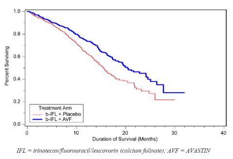

 (Photo credit：http://goo.gl/YPBi6j)

## **選題**

PI-88 的藥理機制是血管生長因子的抑制劑。血管生長（angiogenesis）的促進對於癌症生長有很關鍵的作用，也因此血管生長因子的抑制劑一直都是癌症新藥的熱門課題。目前常見的領域包含了免疫抗體（Monoclonal antibodies）與小分子激酶的抑制劑（small molecule kinase inhibitors）例如：sorafenib，sunitinib 。其中最有名的莫過於 2004 年被美國 FDA 核准的 Avastin（Bevacizumab），作用機理是通過特異性結合併阻斷 VEGF (血管內皮生長因子），以抑制腫瘤血管生成。 這個 Genentech 的暢銷商品，上市以來每年都有十億美元以上的市場銷售。PI-88 的藥理機制與 Avastin 大不相同，這點符合 FDA 審核新藥的偏好（癌症通常有復發的問題，因此不同的機轉可以提供更廣的應用，對FDA而言屬於未被滿足的醫療需求），因此未來被核准的機會也增加不少，如果能順利上市可以預期是下一個市場銷售的明星商品，這也難怪大家對於 PI-88 的期待會如此的高了。 另外血管生長因子的抑制劑是一個延生性很好的題目。以 Avastin 來説，目前的適應症已經從惡性的大腸直腸癌推廣到乳癌，腎臟癌，卵巢癌與肺癌。因此可以預期 PI-88 如果研發成功，基亞未來也不用擔心沒有下一個題目可以做，以公司發展的角度來説是滿正面的消息，比較不會發生很多新藥公司一個藥品上市後，就難以尋找下一個熱門標的之困境。

## **罕見疾病的策略**

許多人質疑基亞罕見疾病的研發策略，認為罕見疾病的市場小，可能誇大了藥品的未來發展。但是其實以我之見，這其實是不錯的策略。大家都知道藥物研發成本大，但是成功機會卻不高。罕見疾病新藥由於初期開發的意願低卻有未被滿足的醫療需求，因此在法規上US-FDA給予的要求較爲寬鬆。隨著藥物開發成本的上升，罕見疾病新藥在所有通過新藥的比例持續上升，超過1/3的新藥已經是以罕見疾病新藥的模式開發了。

罕見疾病的病人較少，因此通常可使用較小的臨床試驗來證明藥物的療效。例如治療 NAGS deficiency 的藥物Carglumic acid，在開發的過程中，主要的試驗（pivotal study）是一個開放、歷史回顧、23個人的小臨床試驗（OL, historically-controlled, retrospective case series, n=23）。簡單來説，如果符合罕見疾病的條件，開發成本可能可以降低，上市的希望也比其他藥物大一點。許多開發商計劃以藥品先上市爲目標，有收入以後再開發其他適應症的策略其實并不罕見。法國的AB Science的癌症新藥 Masitinib 甚至是從寵物癌症用藥開始，再開始人類用藥的研發（狗的標靶藥比人的新，真是難免覺得人不如狗。總的來說，小公司沒有大藥廠的資源，開發策略本來就應該要靈活。

## **數據會說話，然而需要耐心**

PI-88 在二期臨床試驗的結果 48 周的肝癌復發比率（Disease recurrence）爲 29%，對比沒有用藥的對照組 45%，在臨床結果分析上是相當不錯的，也因此基亞設計了三期的臨床試驗。第三期臨床試驗一般為關鍵試驗（pivotal trial），關鍵試驗的研究成果通常會用來作為新藥申請上市的依據，因此也可以説是藥物研發最重要的階段。臨床試驗中爲了確保試驗的品質與安全性，大規模的試驗常常會設計所謂的期中分析（interim analysis）以幫助我們瞭解試驗未來的成功機會與可能風險。也就是基亞在這次試驗的發布的期中分析的解盲報告。

**基亞在公開資訊觀測站分佈的三期的 PI-88 期中分析結果如下：**

一、 PI-88 安全性無虞。

二、依據各臨床中心醫師個別判斷肝癌復發資料顯示，主要療效指標「無疾病存活期」（DFS, Disease Free Survival） 尚未達到預期療效。進一步資料分析，將由美國獨立影像判讀機構 BioClinica 確認後，請獨立資料審議委員會再次審議資料。由獨立審議委員會針對 PI-88 第三期臨床試驗中首先復發的 136 個病例（約佔總分析病例數之 60%）進行資料解密及分析。分析結果顯示主要療效指標「無疾病存活期」（DFS, Disease Free Survival）之差異尚未達統計上顯著。

另外，我們可以從其他發佈的消息得知： 期中分析及期末分析皆依統計學上雙尾檢定 p 值來檢驗治療組與對照組間差異的顯著性。當檢驗的 p 值越小，則代表差異越顯著，亦即療效越明顯。一般而言，當檢驗 p 值小於或等於 0.05，就代表兩組在統計上有顯著的差異。依 PI-88 第三期臨床試驗設計，期中分析僅分析 60%的可分析病例，因此設定了高標準的 p 值（0.01806），用以檢定是否已達統計顯著性。 其實臨床從業人員大多知道常常試驗未達標到統計檢定標準也不能確定研究結果不好，很多時候常常因爲臨床試驗統計分析上樣本數目的不足所以沒有辦法得到統計意義上的顯著（但是臨床上卻是有顯著意義）。因此我們可以這麽說除非結果非常非常的好，不然在期中分析拿到顯著結果的機會是很低的。另外，基亞在期中設定了一個非常高的標準（P<0.01806,一般新藥標準為<0.05），更讓這變成一個幾乎不可能的任務。 另外由於該研究的目的是肝癌病人在切除手術後的無疾病存活期（DFS；disease free survival），也就是比較 PI-88 與未用藥病人的癌症復發時間差距，一般這種臨床試驗在第一年的時候由於多數的病人都沒有發病，因此很難看出效果的差距。然而，在期末分析時，如果分析三年的資料，抗腫瘤復發的效果將更為明顯，統計檢定也會更加顯著。舉例來説，下圖爲 AVASTIN 在試驗 AVF2107g 的存活分析，由於在初期的時候（10 個月以前），兩組的差距比較小，因此統計分析比較難達到顯著。

因此我們其實不應該關注在期中統計上是否達到顯著，我們更重要、更應該關心的是這個藥在期末分析是否可以達到新藥上市的標準。在期中人數不足的條件下基亞的期中分析雖然沒有達標，但是其實結果可能是相當不錯的。雖然我們沒有辦法憑藉新聞提供的資料得知基亞臨床三期的結果到底好不好，但是我們依然可以從一些地方推敲出基亞目前研發的進度，因此現在對 PI-88 悲觀似乎還太早。 倒是令人注意的是，基亞的非專業投資人持有比例比較多（>70%），也許藉由這次的股價修正，讓對於新藥開發有信心的人可以趁機加入，也排除一些投機分子，對基亞的長期發展反而是正面的。不管怎麽説，明年的期末分析結果就會有答案了。

**延伸閱讀：**

* [臺灣生技醫藥企業介紹](/region/台灣/)
* [醫藥研發的新思維 – 及早納入付費者的考量](/posts/biomedical-development-thinking-consumer-issue/)
* [臺灣臨床試驗的問題與未來](/posts/taiwan-clinicaltrail-problem-future/)
