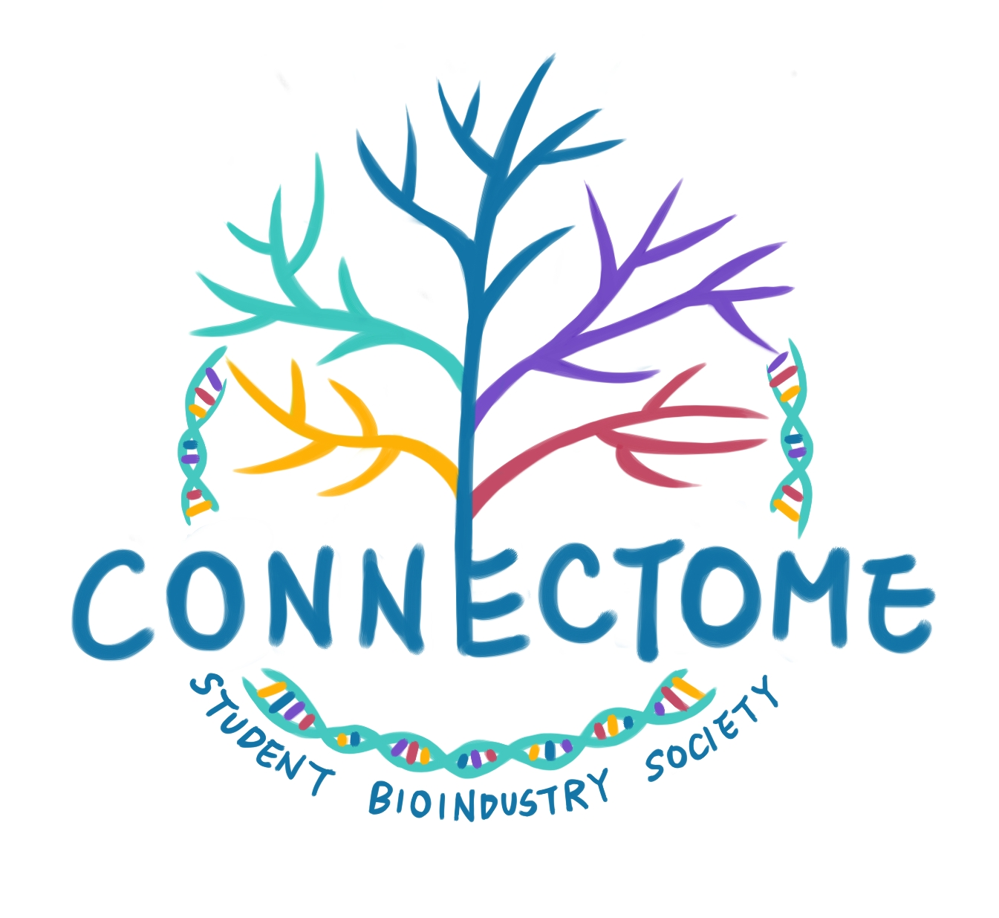

跨領域學習的第二篇將為您介紹「**科技管理**」與「**醫療器材產品設計**」的培訓計畫，訓練科學人才的管理能力、激發學術研究者的設計潛能！有鑒於一般管理背景或科技背景的人才對雙方專業的不熟悉，因此在科技產業中著實欠缺能掌握關鍵的管理者；此外，醫療器材背景的人對工程設計、創新專利的不甚了解，也阻礙了該產業發展的腳步。想要成為產業中的推手嗎？[跨領域](/topic/學習與跨領域/ "觀看所有含\"跨領域\"標籤的文章")學習就對了！

## 科技管理

科技產業是全球經濟發展及市場供應鏈中極為重要的一環，為了平衡台灣整體產業結構與各產業的發展，近年來經濟部特別針對涵蓋生物科技、綠色經濟、精緻農業、醫療照護等之六大產業，實行相關措施、促進產業增值，希望能因此吸引國際合作及投資，布局海外市場。 由於國內過去對智慧財產權及科技管理策略所投注的心力相對較低，造成與國外科技貿易往來時，每每處於劣勢。為了改善這樣的現象，經濟部技術處提出了「跨領域科技管理國際人才培訓」的計畫，希望藉由國內智慧財產、技術移轉、投資評估等先修課程，以及國外進階專題的實際演練，協助業界培養跨領域人才，同時瞭解國外企業的運作與市場大環境。其中，國內培訓部分邀請到政大、工研院與產業界等精通智財、科技管理等專業師資授課，國外部分更給予美國、日本、中國等國際化的專題討論訓練，內容非常充實，以最近一次的國外課程公告為例，學生能夠選擇德、美、日與中國著名的大學進行以當地現況為主題的研習，對於當地的情況能夠有深刻的了解。國內、外課程是分開報名的，可依自己的需求與情況選擇。 此項計畫供予生技、資訊、光電、通訊、材料、綠能、數位內容、文化創意、精密機械等領域的人才參加，以生技領域而言，無論是已從事或即將投入業界就業者，或是在學術界執行計畫的研究者，皆可參與這項計畫，而一旦符合認證條件，便可進一步接受國外培訓。這項計畫從民國80年代末開始實施以來，已舉辦十餘屆，成效可期，這樣的訓練能讓參加者學習到生醫相關產業中，企業商業化的智慧財產策略布局及營運模式，並得到許多實務經驗，了解到品牌經營及行銷策略越來越受到國際企業的重視，經由培訓學習到如何在適當的時機擬定恰當的經營策略，除此之外，也會對產業及產品有更開拓的視野和思考模式。而這正是擁有滿腔熱血、亟欲學習的你一個極佳的選擇！

**課程連結**：[跨領域科技管理國際人才培訓計畫](http://www.mmot.org.tw:8080/mmot/home "跨領域科技管理國際人才培訓計畫")

## **醫療器材產品設計**

有鑑於台灣醫療器材跨領域人才捉襟見肘，財團法人國家實驗研究院希望透過與美國史丹福大學合作的「台灣 - 史丹福醫療器材產品設計之人才培訓計畫」(Stanford-Taiwan Biomedical Fellowship Program；簡稱 STB)，讓工程、醫學、生命科學、商務管理等不同領域人才，經由各種專業的角度，自多面向挖掘臨床醫療運用上的創新價值，激發創意的改良設計，進而獲得創業機會，此計畫每年有兩個梯次，為台灣高階醫療器材產業培育人才。 STB 培訓計畫延攬了美國史丹福大學生物設計課程的師資，不但能學習醫療產品設計及商業化運用的實務訓練，也能自己嘗試產品研發，更重要的是，在培訓期間完成一份商業計畫書。因此，STB 非常適合具有[醫療器材](/industry/醫材/)產品設計相關專長或經驗的人參加，也適合擁有創業、育成商務經驗者，若你同時具備良好的語言能力，且在受訓之後有意願回台灣發展，更是本項計畫的不二人選！ 目前台灣醫療相關的人才缺少對不同領域的專業，而 STB 這樣的培訓過程包含了工程設計、臨床實務運用、創新醫材[專利佈局](/industry/智財/)訓練及詳細的實務討論訓練，也能讓參加者從臨床觀察、專案執行、產品專利佈局及法規認證等過程中，增加與產業界之間的互動，皆有利於提升將來對產品或創業的敏感度。 若您對這項培訓計畫深感興趣，請務必鎖定 Connectome 近期的實體活動資訊，我們即將邀請曾參與此計畫的著名業界人士分享心得，可以為您提供更多一手消息！

**課程連結**：[台灣 - 史丹福醫療器材產品設計之人才培訓計畫](http://www.stb.org.tw/Page_Programs.aspx)

其實參與課程不只是能夠學習最新知識並且得到實作經驗，還有很多的機會能夠跟優秀的學員、教師一起共事，**產生人脈連結，遇見更多機會**，這樣的好處更值回票價，是十分難得的機會！有機會參加的人千萬不要遲疑了！

  

看完本篇介紹，不知道大家對於自己的跨領域學習計畫是否又有更多的想法與更實際的規畫了呢？

本系列文章接下來還會介紹更多有趣且能夠拓展職涯發展可能的學習資源，敬請您持續鎖定！也歡迎您分享其他學習資源給我們！
