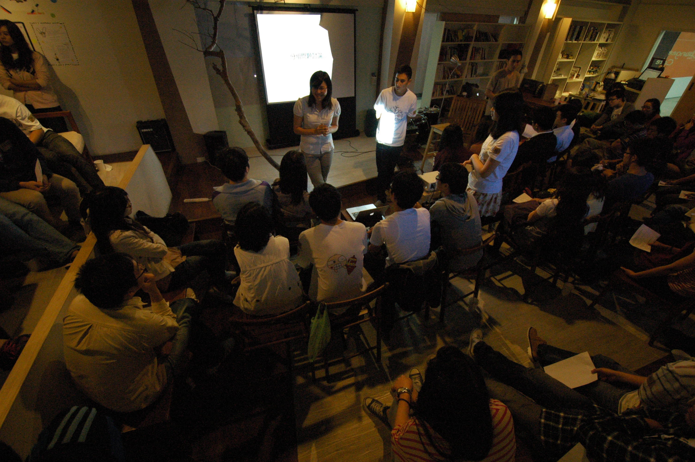
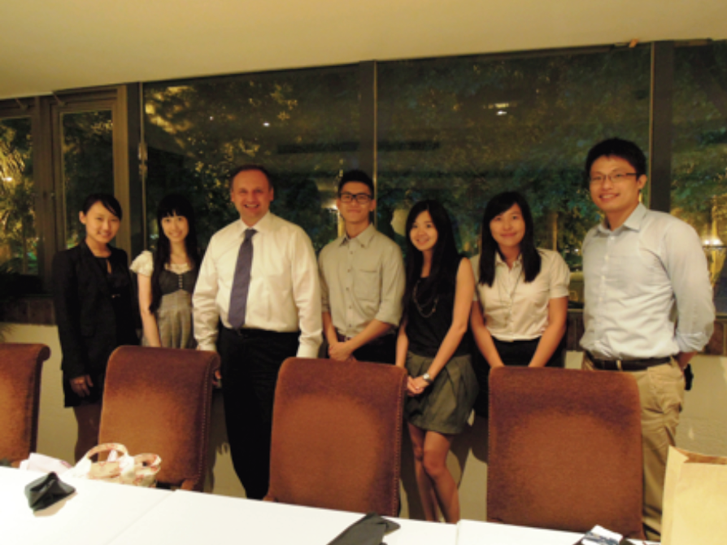

宇瑄比一般生科人更早進實驗室，從大一就開始進實驗室實習，經過兩年的嘗試後，她覺得在實驗室的生活較為侷限，和外界的接觸不多，於是她決定利用大三大四課比較少的時間去修了許多其他系所的課程，也是後來選擇修讀跨領域研究所原因。宇瑄說，不要因為課多就給自己藉口，要學習如何安排自己的時間，看似零碎的時間也可以去實習，舉本次諾華實習為例，報到時間為五月，於九月初劃下句點，共計四個月，然而碩二下的她仍有許多課程正在進行，當然，除了實習以外，曾於校內參與專案的經驗也可以在履歷上為自己加分。

## **在實習之前該如何準備?** 

**時間管理的部分**

其實每個公司在招募實習生的時間是差不多的，大約從每年的三、四月開始，最晚曾看過五月發出招募訊息，通常會和學校的正職招募活動結合，但是希望大家能早一些做準備，例如能早一些知道產業界的需求，或是提早找公司，確認自己想要去的公司是否有實習的機會。

**實習資訊-競賽、營隊、學校公告、網路、校園徵才**

宇瑄告訴大家很多獲得實習機會的小技巧，例如多參加[競賽](/topic/學習與跨領域/)、營隊等，針對生科相關的競賽與營隊因為活動舉辦單位多為生技公司或藥廠本身，可就近瞭解是否有實習的可能，另外許多公司也會從學校直接發布公告、寄送email，透過校園的管道比起人力銀行來得更有效率。 另外，主動出擊也是一個好方法，她舉例，像是陽明大學暑期常常會開授一些演講的課程(如轉譯醫學工程)，去上課並不只是聽課抄筆記，而是可以帶著自己的履歷或者預先思考過的問題，和這些來演講的「大人物」們詢問、討論，甚至可以「丟直球」的問對方是否有機會[實習](/columns/實習故事/)、留下聯繫的方式。而每年各校所舉辦的校園徵才博覽會，也是一個可以接觸各公司人資的大好機會，他們樂於與學生分享，這些機會是只有在學生時期的特權，請大家務必把握。

**履歷的準備**

宇瑄鼓勵大家平時就要整理履歷，可以利用excel或是其他自己擅長的軟體，把參加過的重要演講，會議，研討會都記錄下來，儘量不要等到實習前或大四再開始弄，不僅來不及且效果不好，況且平時就記錄下來自己的軌跡，也可以看到自己的成長，表格化的整理能讓之後面對各種不同的工作性質做更彈性的調整，也可以幫助在自傳或面試中提到自己熱衷該產業的時候提供相關佐證或例子。 平時可多練習寫cover letter，內容儘量精簡扼要，標準為一頁，最多不超過二頁，內容要寫得吸引人且有你的獨特之處。投遞履歷時，針對每間公司都要做修改，不要一式多投，同時，也不要覺得丟了二十間公司都沒錄取就喪失信心，這是很常有的事情。

**面試小技巧**

面試的時候，主管想要了解你，你也應該要想了解這家公司，行前先準備一些「口袋」問題，在面試過程中，若有時間，便可問一些之後和你想知道的事情，就算是實習，也應該簽訂正式契約，只要開口就有可能將問題變成「選擇題」而不僅僅只是「是非題」，很多事情都是如此，不是只有好不好、喜歡不喜歡兩種選項。自己要去衡量究竟是要堅持拿到這一條履歷，或者另尋伯樂。

## **實習時…**

宇瑄以她自己的經驗來說，她在公司時，常常與不同年齡層的人接觸，看看他們現在的生活型態，聽聽他們的看法和心聲，把公司那些不同年齡層的人作為參考指標，他們現在的生活是你想要的嗎?如果不是，那就要考慮之後的安排，也許再看看其他地方。辦公室文化，人員組成等都是在網路搜尋中無法得知的隱性訊息，唯有透過實習，進入公司體制中才能有所瞭解。 宇瑄實習的公司是諾華藥廠，普遍大家都嚮往[外商](/search/?q=外商)公司的自由風氣，但其實要做的事情挑戰性也高，責任制的做法除了給予很大的自由度，同時也代表自己要有充足的時間規劃跟自制。 她提到在諾華實習還有一個好處，台灣諾華擁有完整的組織配置，因此有更多的機會可以走訪不同部門，除了行銷相關的部門外，她也須和醫療學術部有業務上的合作，並和法務討教所學的智財知識在實際產業的運用。

**實習內容**

MSO策略規劃暨業務營運事業部是宇瑄此次在諾華實習的部門，實習內容為輔助進行新產品規劃，講求的是策略與時機，藥物的市場只要能搶先做好決定，就能夠多佔據一至兩年的市場。她表示在實習過程中瞭解到台灣的藥物市場較為特別，我們的藥價因為[健保](/search/?q=健保)的相關控制，和他國自由競爭的景況十分不同 。另外，由於評估過程需要許多跨部門的協調合作，溝通技巧，尤其是如何使用「不同領域的語言」顯得十分重要，此時，具有生物背景就會比較好理解學術部的考量是什麼，可以找出在雙方都可以接受的最終合議 。宇瑄說，這個部門的名稱和工作聽起來很像是要有商學背景的人才能勝任，但她認為其實不需要畫地自限，生科背景的人當然可以做生科以外的工作，實驗室的訓練不只是培養抗壓性，也習慣在未知當中尋找方向，商業方面不夠的專業知識可以留待進入公司後再盡快補足。 宇瑄更進一步表示，其實實驗室專題也算是一種實習，是一個決定要不要走學術的試驗。只要是可以幫助自己確定未來要走哪一條路，什麼型態的實習都是很好的！在場有人已經開始擔任研究助理，其實也還有實習機會，她希望大家要妥善利用這段較有彈性的時間來規劃未來的工作藍圖或是多去進修，不要白白浪費了時間。

## **實習後的心得**

她說，實習是一段可以多去體驗和學界截然不同的生態和生活的時光，可以提升對產業的了解，建立更多的人脈，還可以重新審視自己的規劃，看要不要更改修課的內容或是確立未來找工作的方向。在實習時如果確定不喜歡這一類型的工作，也是有用的訊息，花二到三個星期確認一個不喜歡的工作，總比之後應徵上，才發現不喜歡要好的多。選實習時不要擔心「能不能做?」只要公司敢錄取你，就勇敢地去做。先去搶、再去想怎麼跟上；「相不相關?」可能實習的工作內容不是自己的本科，但是如果對於未來履歷有加分，那就該去做！而且在這趟實習的旅程中若能好好經營各段時間認識的朋友，他們都會是你一輩子的人脈跟貴人。

## **Q&A 摘錄**

**1.** **實習有沒有甚麼條件?**

英文一定要好，這是無法逃避的事情，以諾華Biocamp為例，整個營隊都是用英文交談。就算不實習，只要以後想要往外商公司發展，英文能力是必須的。如果可以，儘量多培養第二甚至是第三外語，有時後台灣把英文看的太重要了，好像學語言就只能選擇英文，但其實歐洲國家的強勢語言是德文和法文。

**2.** **當初為何選擇智財所，與科法所的差異?**

當初會選擇智財所其實是因為他它可以選考生科，不用考民法，準備起來相對容易，且不用放棄原本所學，只要多念商即可。且從生科跨足商容易，反之，要在兩年的時間把生科四年的東西念完，其實是很辛苦且困難的。且非生科背景的，沒有進過實驗室，光靠看PAPER其實不能真正了解實驗。 科法所主要是以法律為主，除非希望之後進入司法體系或是成為律師，否則不大建議。因為除了要在三年內把法學系四年艱澀的科目全部念完，之後的國家考試及接續而來的律訓等都十分耗費心力。

**3.** **如何選擇要實習的公司?**

如果要實習，只要是對自己未來規劃有幫助的工作都可以，不見得要限定職位，若非要限縮目標，對職場新鮮人來說，決定產業別比職務內容來的實際。如果要選公司，大公司能夠提供的資源及實習計劃的完整度通常較理想但範圍較限縮，小公司則有機會接觸到各式不同的業務，各有利弊 。

**4.** **有提到可以去國外找實習工作，哪個國家比較推薦?適合的時間點?**

沒有比較推薦的國家，因為這完全因人而異，宇瑄建議可先從跟台灣寒暑假的時間接近的國家著手，利用寒暑假的時候去實習，也許三個禮拜、也許一個月，感受不同的工作文化，確認這是不是你想要的。 每個人的語言能力不同，有人問到日本，因為沒有去過沒有辦法評論，但宇瑄提醒生活物價，還有該國對自身所有的語言能力的接受度列入考量。最重要的是要提早準備，因為比起國內實習，國外實習還有機票跟安頓生活的問題，另外，因為實習招募的時間並不長，有些公司甚至要求提前半年提交履歷，如果等到暑假將至或是看到招募訊息才開始準備，往往會因為沒有足夠時間準備而放棄實習機會，這是很可惜的。

**5.** **可以利用當交換學生時實習嗎?**

以德國的狀況是可以的!德國學生簽證的內容是接受工作的，180天的學生簽證規範可工作90個整天或180個半天(詳細內容請參考德國在台辦事處相關公告)，如果利用課餘或是撥出數天的時間去實習，簽證給的時間其實是綽綽有餘的。如果語言能力可被外國的公司接受，很鼓勵大家趁著在當交換學生的空檔多去看看。可以多去試試看，如果被拒絕了也不會有損失，就繼續當交換學生即可，但如果成功，不僅是難得的經驗，也會為自己的履歷增加有力的內容。

**6.** **建議念MBA嗎?** 可以，但是要謹記一點，MBA跟生科一樣，沒有一個固定的職位是給MBA畢業的人，不像是醫師，律師等證照相關的工作有比較明確的工作職位。MBA畢業之後和生科面臨的「好像什麼都可以做又好像什麼都不行做」的處境並無不同。比較建議工作後，發現有需要再去進修。 .

**這麼精采的實習故事讓你心動了嗎?** **快看看[2013 暑期實習機會介紹](/posts/2013-summer-intern/)並且把握機會報名吧!**

分享者：潘宇瑄  陽明生命科學系畢業，現正就讀政大智財所。  曾於德國科隆大學管理經濟社會科學院交換學生。  具有國際觀。除了專業領域跨足生科及智財，課外之餘也積極開拓視野，  曾赴英國擔任世界露營國際服務隊、韓國日韓青年論壇之工作人員等。

- 本篇為潘宇瑄同學在 Connectome 10月13日「生技人，實習做什麼？」職涯沙龍的分享整理 -
