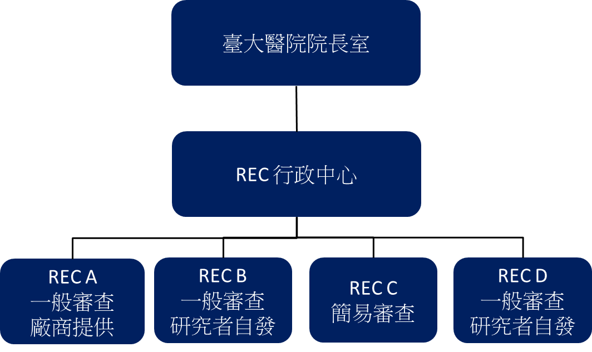
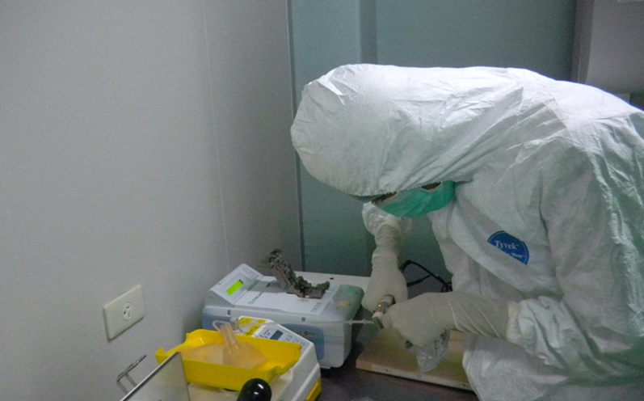

## **實習公司與部門簡介**

這次去的兩個地方都隸屬台大醫院之下。分別是研究倫理委員會行政中心及國家級卓越臨床試驗與研究中心內的幹細胞實驗室。 研究倫理委員會 (Research Ethics Committee，簡稱 REC) 主要職責為審核並監管與人體相關之研究，不論是[臨床試驗](/job_function/臨床研究/)、病例回溯甚至是問卷調查等行為學的試驗，皆受倫理委員會管理；其宗旨主在保障受試者權利與福祉。確保在任何研究案執行前，都有一定數量的專業人士進行把關。避免有缺陷的計畫危害到受試者。同時，委員的組成也分成醫事與非醫事兩種。非醫事委員的設立能確保計畫從受試者/一般大眾的角度來看也是可接受、可理解的；委員會的舉行則每月有固定時間，由於委員們本身都有自己的工作，並非天天審理案件。而在案件進入委員會審核之前，倫理委員會的行政中心會負責諸如收件、整理文件摘要簡報、分類提交審查委員、倫理委員會審查會議記錄及保存過往文件等工作，可說是確保研究倫理委員會順利運作的重要行政單位。 在實習期間。我所待的單位便是 REC 行政中心。內部由院派長官與組長帶領，平時維持在十人上下，各自負責不同類型計畫的審查。研究計畫的審查簡單可分為兩大類：簡易審查與一般審查。若是像查閱病歷、填寫問卷等風險極低的計畫，便屬於簡易審查的範圍，不需要委員會開會討論，只要單獨的審查委員通過即可；相對的，一般諸如新藥試驗、新技術測試與新療程開發等風險較高的實驗計畫，都需要召開審查會討論後才能通過，需要的時間也長上許多。REC也相對應分成四個委員會，分別審理簡易審查與一般審查，其中一般審查又分為廠商發起與研究者自行發起兩種。行政中心的人員也分別負責不同計畫案。由於一份完整案件所需的資料眾多，其實驗內容也往往無法迅速取得眾審查委員的共識，因此計畫主持人常常會在送件與等待的過程需要行政中心的解釋與幫忙。而連結計畫主持人 (PI) 的投案與審查委員兩者之間的橋樑，便是REC行政中心所扮演的角色。

國家級卓越臨床試驗與研究中心設有臨床試驗中心、早期臨床試驗病房、轉譯研究中心… 等各個臨床試驗相關機構。同時，臨床治療相關的實驗室也設置其下。我這次所前往實習的幹細胞實驗室實際上就是細胞治療實驗室，主要工作在純化周邊血造血幹細胞 (Peripheral Blood Stem Cell，簡稱為PBSC) 並保存之，以供造血幹細胞無法正常運作之病人進行移植使用。由於主要的病人為血癌相關的病患，整個研究室與癌症治療與臨床醫療的相關部門也密切帶有關聯。 實驗室主要由一名實驗室主持醫師與兩到三名技術操作員組成，再外加幾名其他單位的同仁支援。實驗室內部分為行政區與實驗區。前者為一般辦公、維修儀器、收件之區域。後者則是介於P2～P3之間的生物性實驗室。並區隔為外走道與潔淨區兩塊。潔淨區擁有數個可獨立操作實驗的實驗間。由於臨床治療最需要的就是確保細胞不受汙染並且具有功能，因此整個實驗室層層關卡的換裝、潔淨措施、空間區隔及各項汙染與藥品確校的監測都是為了確保這兩點。裡面的主要工作也就是確保這幾項品質監測能順利運作並有清楚明瞭的SOP。

## **如何獲得這個機會**

說起來很簡單。只要報名台大生技中心每年開辦的暑期生技課程，並選擇 「幹細胞與再生醫學產業實習」便能前往。比較特別的是，這個課程原本都是到食品工業研究所去進行一個月的實驗室實習。今年課程臨時做了調整，所以安排到台大醫院的這兩處實習可以說是預料之外。我想平常應該是很難獲得這樣的經驗。畢竟這兩處並沒有特別開收實習生，也不太會是一般人實習的首選。同時，由於這個實習是和公家機關打交道，在溝通實習時間、場所以及細節等等其實是需要些耐心的。除了要提早聯絡辦妥一切手續之外，還得等待公文跑送與內部行政處理，很多時候盡了人事還真的要賭點運氣，畢竟自己算是給實習單位額外增加工作量，這部分恐怕需要點心理調適。其他應該沒什麼特別需要注意的。報名繳錢就對了(笑)。

## **實際工作內容與收穫** 

受限於最後談妥的實習時間以及我自己的計畫安排，兩個單位都只待了短短的四天。實習的內容也多半以聽課了解工作內容為主。實際上動手的機會並不多。重心主要在了解兩單位的分工架構與行政工作上。 在REC行政中心,我主要跟著戴組長了解每個行政人員的工作，並且參與REC的會議。從一開始的組織架構、計畫分類與審查SOP、各種審查 (簡易、一般、持續、醫事角度、非醫事角度) 的簡介與實際作業以及練習申請計畫案等，一路上都圍繞在「研究計畫與受試者的關係」這個重心之上。一個申請得快、文件往復少的研究計畫通常都有幾個特點：低風險的實驗設計、合理的受試族群、詳盡的計畫說明以及最關鍵的「從受試者觀點出發撰寫成的受試者同意書」。風險的高低往往取決於實驗的內容，涉及到藥品、療程、輔具使用的研究勢必都伴隨著一定的風險，因此審查時間也相對較久。受試族群若是包括孩童、懷孕婦女、嬰幼兒、學生或受刑人等，其實驗也相對需要更嚴謹的風險評估。這些族群亦受外力操弄的特性也得考慮進去；計畫說明則牽涉到審查委員的理解程度，若一個計劃連審查委員都看不懂，在招募受試者的時候勢必困難重重。這樣的計畫就算過了，也往往無法完成。 然而最重要也最容易被忽略的，還是受試者同意書。今天實驗者面對的主要是一般大眾。若計畫簡介中專有名詞太多，別說民眾，就連非該領域的專業人士也難以理解。這麼一來，收到的受試者要不然對該領域有所涉獵，要不然多半都會是抱持著「參加實驗可以救命」這樣的想法加入，而忽略了與自身相關的安全風險，也不細究這樣的實驗是否有助病情改善。因此，REC 行政中心便需要站在受試者的角度來為受試者把關。而受試者同意書往往就是審查通過與否的一個重要關鍵。 從申請者的角度來看，文件往復的麻煩與溝通不良造成的時間浪費我想是計畫主持人不樂見的。就 REC 行政中心內部的實習經驗來說，每天每個專員實際上要負責的案子都在一、二十件以上，舊的案件還沒送審、更正，新的案件就又馬上湧入，工作量累積下來是相當驚人的；再者，為了維持機構的中立性，對於錯誤的地方，行政中心是不能直接更改在文件上的。只能用建議的方式希望計畫主持人更正，也因此往往在溝通上需要花費更多時間。而審查委員也不是隨時坐在辦公桌前的行政人員，多半都是醫院內部的醫師自願擔任。扣去其一般日常工作時間，要天天開會不但不可能、每個審查委員還要撥時間出來看完計劃挑出問題，行政中心又沒有直接催促的手段 ...。這是我在實習前完全料想不到的。過去的我都是從計畫撰寫人的角度來看效率低落這個問題，卻忽略了從行政人員的角度來看這樣的要求是否可能。 在REC行政中心其實還學到很多審查的技巧與許多行政事務處理上的小訣竅。雖然和我平日的實驗室生活相當不同，但也讓我體認到許多問題都是共通的：如何整理好檔案、如何和各個層級的人溝通、如何在計畫撰寫時用不同的角度思考 ...等，都讓我受益良多。而這四天也讓我了解到一個行政中心的真正面貌與其運作內容。比起以前道聽途說的猜測，這段時間是相當難得的體驗。 另一方面，在細胞臨床實驗室的實習相對來說比較接近我的本行，也就是一般的研究生實驗室生活。一天下來不外乎處理行政事務、做實驗、檢查耗材或是保養儀器。受限於高昂的治療費用，臨床實驗室的「客戶」並不多。很不巧的，我前去實習的時間剛好與病人的血液純化時間錯開，因此無緣看到整個實驗室最主要的純化分離實驗。但在四天的時間內，也體驗到何謂穿防護裝進到真正「潔淨」實驗室做實驗，這是學校實驗室的財力所不允許，也是學校實驗室不會擁有的裝備。由於臨床實驗處理的是要治病的造血幹細胞，整個管理與清潔指標的監控實際上是相當精密細心的。從落塵取樣到環境微生物培養、從溫度控管到獨立不斷電系統，甚至是藉由空間的區域區隔來避免交叉污染。這些手續固然繁複，卻一個個有其必要。這些概念對一般實驗室而言也相當重要。也是我實習期間印象最深刻的地方。

## **給想實習的人的建議**

學校提供的實習課程其實是個開拓眼界相當方便的一個管道。相較於一般實習需要相對繁複的報名與面試程序，學校課程的競爭者少，因此也省下許多資料準備上的麻煩。當然，這樣的課程所能提供的經歷也相對有限。與業界相比，能夠真正動手實作的機會也較少。充其量只能算是了解一下不同面向的工作。在未來遇到工作抉擇時有不同的思量角度。 對我而言,當初會選擇這樣的實習機會，是礙於暑假無法撥出完整的一個月時間來進行實習，因此選擇了較短的八天兩地而非原本的三周單一實驗室。我的目標則放在多看多聽多問，了解除了學校之外，若未來要在公務機關工作還有什麼樣的選擇。這兩個地方相對業界是相當不同的工作環境,也是一般人平常很難接觸到的實習地點。因此對我而言，這是一個相當難得的經驗，也提供我不同的面向去思考許多平常認為理所當然的事物。譬如對行政工作輕鬆無聊的刻板印象、對臨床實驗室工作量的諸多誤解等。這些東西都是沒有實際走一遭不會了解。若是不想花上更長時間來體驗，這時候實習便是一個很好的方式。 或許在這兩處的實習，並無法對我的生涯規畫造成太大的影響，但卻讓我確認實際上，學校所學與工作所用並非完全風馬牛不相干。在 REC 行政中心審核計畫時，生物方面的背景知識有助於對審查內容的了解，更能進一步去判斷出審核的種種要點該計畫是否符合。就算行政中心所要求的只是格式與資料齊備的正確性，但若能為計畫主持人多檢查一些，或許就能避免掉審查時間與實驗時間的浪費。在細胞治療實驗室更是如此。對於實驗操作的經驗與背景知識，能幫助我更快的了解他們所講述的重點，進而做更深入的瞭解。除此之外，與實習單位的同事們保有良好的互動，也會讓對方更願意跟你多分享一些實務上的經驗。這些經驗很可能是一項新工作能否快速上手的關鍵，同時也是高工作品質維持的關鍵！ .

**這麼精采的實習故事讓你心動了嗎?** **快看看[](/posts/2013-summer-intern/)[2013 暑期實習機會介紹](/posts/2013-summer-intern/)並且把握機會報名吧!**
