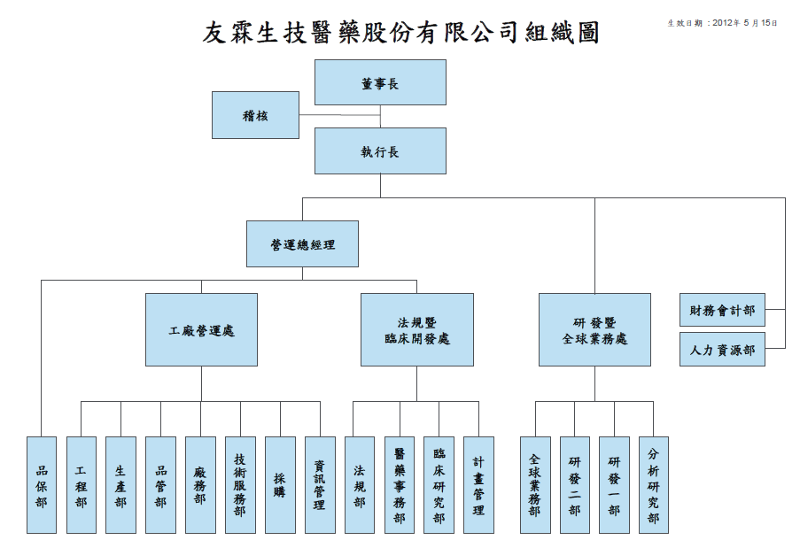
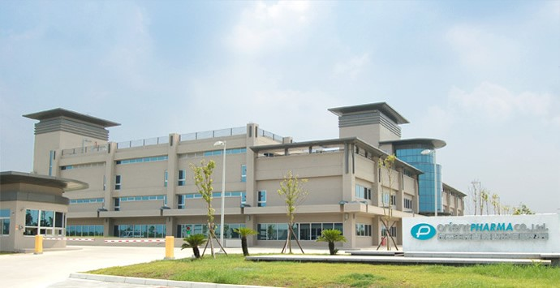

## **實習公司與部門簡介**

「[友霖生技醫藥股份有限公司](http://www.oppharma.com/index.php/cht/company/introduction)」是友華生技醫藥股份有限公司於 2008 年成立的子公司，專注藥物研發及製造。位於雲林虎尾科學園區之新藥廠，是台灣第一家全新依照 PIC/S GMP 、歐盟 GMP 及美國食品藥物管理局 (FDA) 21CFR 國際標準所興建的藥廠。 友霖和其他藥廠最大的不同，是廠房設計以及新藥開發。廠房設計方面，除了高檔的器材、製程，還有獨立的集塵系統，是製藥界難得的大手筆，花了不少心思建立足以說服各國衛生主管機關的設備。新藥開發方面，友霖是較早投入新劑型平台技術、paragraph IV查驗登記的廠商，與外國藥廠的接觸也非常積極，和其他以學名藥為主力的傳統藥廠，有著不小的差異。 **法規登記部**，對內提供藥事法規相關諮詢，並且在決策上扮演非常重要的腳色；對外則代表公司，與各國的衛生主管機關、上下游廠商溝通協調，進行查驗登記。由上可知，法規部是公司資訊的匯集之處，也是少數能夠綜覽產品開發的部門。包含原料藥/賦形劑種類選擇、工廠建置、臨床前/[臨床試驗](/job_function/臨床試驗/)、試驗目標、試驗結果編排、上市到上市後的變更登記，都有法規部參與。

## **如何獲得這個機會**

陽明大學的基因體與蛋白質體之臨床應用教學資源中心，每年都會開設實習課程，而其中友霖生技的法規部，提供兩個月的長期實習。 在申請實習的前兩年暑假，我在陽明大學接觸了新藥開發、臨床前安全性試驗、臨床試驗設計等不同的課程，接觸來自友霖的講者，引起我對查驗登記的濃烈的興趣。之後，我利用課餘時間，參加產業界的法規說明會，以增強對於法規的敏感度。在因緣際會下，更在研究所期間參與國科會計畫，研究藥品查驗登記與相關專屬權的法制。 在準備履歷時，我將重點放在自己對查驗登記的強烈興趣，說明想要到部門學習的知識，並羅列選修過的產業相關課程，說明對於藥品產業的基本了解。而在面試時，我也陳述在研究時所遭遇的問題，讓法規部主管能充分了解我實習的動機，以及對產業知識的渴求與急迫。

## **實際工作內容與收穫**

在法規部實習，大致可以分為課程、實作與參加研討會。

**(1) 課程方面**

課程方面，每個星期都會安排一個半天，就一個特定主題，由公司內部的人員分享，或由實習生報告所學。在數周的實習中，從查驗登記簡介、藥品查驗登記審查準則、臨床試驗法規、生體可用性/生物相容性試驗準則、智慧財產到美國FDA Guildance，以及實際的產品分析、案例閱讀，都有所涉獵。 在開始的幾個星期，我閱讀並整理了許多藥事相關法規，實習的好處，就是將法規與實際的查驗登記文件對照理解時，才能真正了解重點所在。而在報告時，主管也會舉出各種實際案例，來說明不同的法規，會對藥品上市有何種程度的影響，如便民包裝、藥廠品質認證與健保核價的關係等。 案例閱讀是最有趣的部份，讓我研讀一個藥品的資料，嘗試提出是否應該繼續投入資源在台進行臨床試驗。在過程中，我學到了如何運用之前每個禮拜的課程所學，去判斷藥品在台灣上市的可行性，比方專利是否到期、在那些國家上市、能否符合台灣法規、如何進行臨床試驗、能有多長的獨佔期等。

**(2) 實作方面**

實作方面，大部分著重於檢索與文書撰寫。檢索的範圍很廣，包含美歐專利、美國21CFR法規內文、FDA藥品資料的檢索；文書撰寫大多是公司內部的查驗登記文件。有時候，公司其他部門也會有需要支援的工作，比方主管所要使用的簡報製作、對外商的說明文件撰寫，以及臨床試驗資料的統計。 我印象最深的是查驗登記文件的製作，包含格式編排與翻譯，雖然沒有機會與能力去撰寫類似文書，但在整理的過程中，我學到台灣與美國查登文件的差異，以及兩國對於藥品不同的專注與重視。比方，台灣的控管比較制式，美國相對雖然嚴格，但注重透明、邏輯與溝通。 臨床試驗相關的資料整理也很有趣。其中一次是是挑出有疑問的數據，這時候生物統計知識就非常的有用，可以從中看出較為特殊、偏差較大的數據，以便回頭和原始資料確認。過程中，也可以看到臨床試驗的設計，以及藥物在不同病人有效性的差異。另外一次，則是臨床試驗計畫書的試閱，已受試者的角度，去檢驗文書是否有確實、充分告知試驗風險，是很特別的體驗。

**(3) 研討會**

外出參加研討會，是法規登記部非常重要的行程。由於食品藥物管理署常常會在新法規頒布前後，舉辦政策宣導活動，業界也會經常透過製藥公會等組織，分享外國法規變革，或向主管機關提出產業建議，公司勢必每次都要派法規登記部代表出席，獲取最新的資訊和趨勢。 我印象最深刻的，是在藥事論壇上，政府就未來專屬期的可能修法方向加以說明，席間國產學名藥廠和外國輸入藥廠激烈攻防，甚至智慧局也加入討論。會後，在業界導師的帶領之下，可以馬上知道對產業的影響或衝擊，以及較為細節的操作與因應方式，當然也預測了國內廠商將採取的立場，讓我收穫很多。

## **給想實習的人的建議**

**選擇實習藥廠與部門**

藥廠是一個很好的學習場所，身為這個領域的主要玩家，除了掌握豐沛的資源、技術，以台灣生技產業成敗的關鍵。但即使是藥廠，仍然有目的上的區別，同學在實習的選擇上也可以特別注意，如果是想要了解藥品開發的完整面貌，在友霖這種投入新藥研發的國內PIC/S GMP藥廠，獲得的收穫與體會，肯定比研發型生技公司、行銷導向的外國藥商或單純代工的學名藥廠更多。 在部門的選擇上，藥廠的分工很細緻，從研發、生產、品質控管、品質保證、法規、法務、行銷、會計到專案管理，且各有專攻，可以視科系背景的不同，以及想要發展的方向去挑選，即使是只進入其中一個部門，也可以把握機會了解其他部門的工作內容。

**進入法規登記部前的準備**

進入藥廠實習前，不妨利用時間，在暑期參加各大學開設的產業課程，或是利用課餘時間參與政策說明會、論壇或研討會，掌握藥廠的思維與語言，相信可以在實習中有更多的收穫。法規登記部的要求要比其他部門來的高，由於要與各國主管機關溝通，提出說明，甚至協商臨床試驗的進行細節，該部門成員對藥品的理解度往往是公司內最高的，從基礎的作用機轉、相似藥品、臨床反應到生產，都要有涉獵。也因為這樣的特性，只要想要進入生技產業，若有機會到法規登記部學習，都會有很大的助益。 最後，也是最老掉牙的提醒：態度。公司在挑選實習生、同仁，在專業差距有限的情況下，態度會變成很重要的關鍵，因為只要牽扯到團隊合作，人與人之間的相處往往決定成敗。在公司內，除了要表現出積極的學習態度，同時也要注意思考，去傾聽、溝通，了解不同意見背後的原因，增加部門間彼此的理解。這樣的要求，在需要和主管機關協調法規登記部，更顯得重要。

2013 年開始，Connectome 在部落格建置了實習故事專區，我們號召有參與產業實習經驗的朋友撰文分享自己的經歷。

我們相信，有更多人的分享、關注，將可帶來更多討論！

[填寫問卷](/events/intership-sharing-recruit/)，一起分享自己的實習故事
