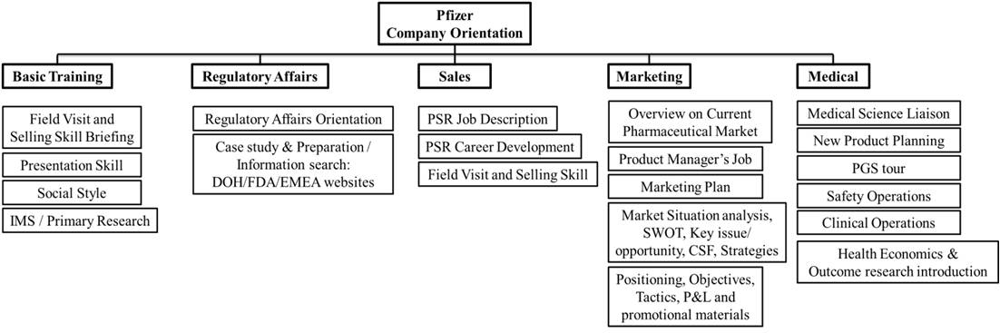
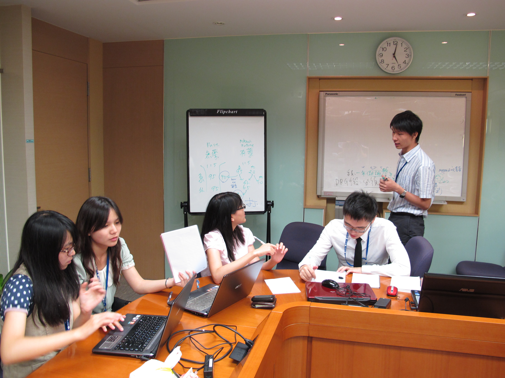
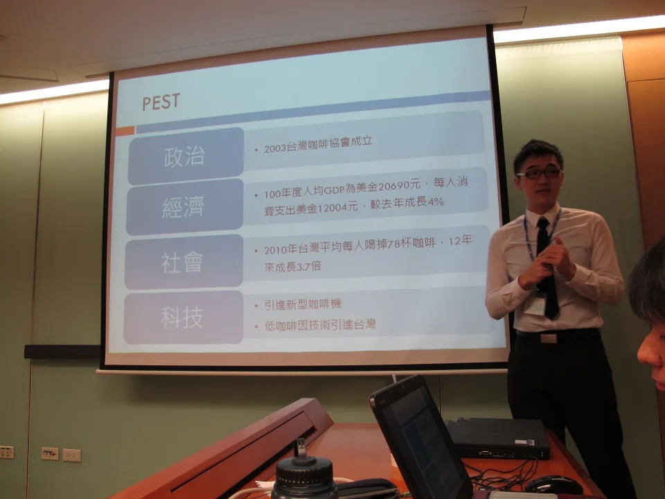
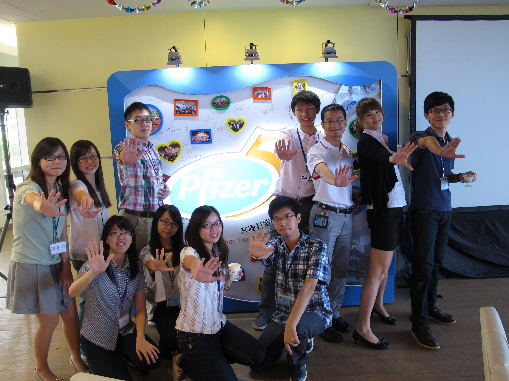

## **實習公司與部門簡介**

美國輝瑞藥廠 (Pfizer) 成立於1849年，總部座落在美國紐約市，主要的研發中心則位於美國和英國各地區。2009 年在全球 150 多國的員工總數達 10 萬人、營業額 500 億美元，研發經費高達79億美元，而研發中新藥的治療領域多達十項，包括：過敏症與呼吸道、心血管及新陳代謝、胃腸與肝臟、泌尿生殖、感染、發炎、中樞神經系統、癌症、眼科以及疼痛，是目前[全球第一大跨國生技藥](/posts/top-10-global-big-pharma-1/ "全球十大藥廠介紹")[廠](/posts/top-10-global-big-pharma-1/ "全球十大藥廠介紹")。台灣輝瑞大藥廠，全臺灣員工數約 1000 人，主要業務為藥品銷售、部分藥品製造、臨床研究，目前是國內最大的跨國性藥廠。Pfizer 最為人所知的藥品 Lipitor 利普妥、Norvasc 脈優，在心血管疾病用藥是目前市場的龍頭，治療男性性功能障礙的 Viagra 威爾鋼，更不用說，還因此成為電影的題材。

在 Pfizer 為期一個月的實習期間是以安排課程的方式進行，每個禮拜輪調一個部門，分別為：Sales 業務部門、Marketing 行銷部門、MA 醫藥事務部門、RA 法規部門。詳細的課程內容如下

.

每周五會進行一次驗收，針對這個部門所學所見的內容做為題目，可以用任何形式呈現；在實習期間可以充分利用公司的資源，如果想多了解哪個部門，可以直接詢問上課的老師，或是透過 HR 聯繫。

### 

## **如何獲得這個機會**

Pfizer 長期與各大藥學系合作，透過學校推薦的方式，每年收 10-12 位不等的藥學系實習生，也是唯一能進入 Pfizer 實習的管道；學校的評核標準包括：「課業成績、參與社團活動、服務學習活動…等」，經過學校的初步篩選後，才能投履歷至 Pfizer，再由 Pfizer HR 部門進一步的篩選。

在同儕中是什麼樣特色讓我能進入Pfizer 的實習計畫，我想主要的因素是參與的社團與修習的課程跟藥廠的工作環境息息相關；在大三時擔任了「DREAMERS 藥學企業管理研究社」的社長，社團的成立宗旨就是建立校園與企業 (藥廠) 唯一且直接快速的管道，而在社團開設的課程中，請來了中華民國藥品行銷暨管理協會之理監事來替我們上行銷及銷售實務的課程，經由模擬演練的方式，實際操作如何銷售藥品，學習基本的行銷概念及分析方法 (SWOT、PETS)；與各大藥廠舉辦徵才說明會，如：「[GSK](/posts/gsk-internship/ "GSK暑期實習分享 – 楊士平")、Sanofi、永信藥品、[J&J](/posts/janssen-pharma-intership-chen-ming-cheng/ "嬌生公司楊森藥廠實習分享 – 陳明正")」，從企劃書撰寫、提案、與 HR 討論，皆由 DREAMERS 一手包辦。再者，就是你想進入藥廠的企圖心，你對於藥廠生態的了解有多少，未來是否有往藥廠發展的可能性，更進一步地可以明確地寫出自己將來在藥廠的職涯規劃。

展現自己人格特質，除了上述的經歷和動機以外，人格特質也占了很重要的一部份，從參與活動或社團的描述當中，可以凸顯一個人處理事情的態度；在撰寫的時候是秉持著 **STAR**的原則，會讓文章看起來更有條理 (**S**ituation, **T**ask, **A**ction, **R**esult, 在什麼情況下、接下了什麼任務、做出了什麼行動與計畫、結果如何)，可以詳盡的描述自己做事的態度，與別人合作時產生的衝突，事後檢討也是非常重要的，不用怕寫自己失敗的經驗，從失敗過程中的轉折，反而會成為展現你在壓力下表現的最佳方式，這是曾經我在 Bayer 實習面試時被問到的題目：「在這些經驗當中，當你遇到失敗或挫折你會如何處理？」，提供大家一個反向思考的表達方式。

### 。

## **實際工作內容與收穫**

Pfizer 的實習為各個部門的職涯導覽，內容大致上為藥學系畢業生未來在藥廠[可擔任的職位](/posts/pharma-job-introduction/ "外商藥廠職位概述")和新進人員的基礎訓練，實習的方式為分成兩組，以團隊競賽的方式進行。

在基礎訓練的部分，分為四個部分：「探索自己的人格特質、簡報技巧、IMS 等常用資料庫、銷售實務概論」，可以很快速的進入實習的狀況，自己是屬於哪種類型的人格：「領導型、孔雀型、分析型、隨和型」，適合怎麼樣的簡報風格，IMS 資料庫讓我們具備基礎市場分析的能力及讀報表的能力，銷售實物概論學會基本的問話技巧。

**RA (Regular affairs) 法規部門實習**： 針對 RA 的工作全面性的了解，從藥品的查驗登記流程、藥師法、藥事法的應用、產品包裝規格限制、與行銷 DM 的審核，還有與各部門之間的聯繫與合作，可以很完整的了解實際 RA 的工作內容。

**Sales 業務部門的實習**： 首先讓我們了解 Pfizer 主要的產品線，對產品有基本的認知後，練習在五分鐘內，介紹一個產品使人印象深刻；如何拜訪客戶，從Opening、Probing、Supporting、Closing的模式，開放式/閉鎖式問題的使用時機，再實際演練一些例子；隨後實地進入市場調查，由經驗充足的學長姐帶領，分別到不同院所層級實習。

**Marketing 行銷部門實習**： 在開始課程以前，部長先提出一個思考性的問題：「假設你是賣鞋子的廠商，到非洲做市場調查，發現全部的人都沒有穿鞋子，你會如何處理和制定策略？」分為正方與反方討論後，最後以辯論的方式，支持自己的論點；爾後教授基本的行銷概念，並實際做出一個行銷計畫，以 PPT 的方式在行銷部主管們面前報告，是非常紮實的訓練。

**Medical醫學部門實習**： 分為以下幾個大項：Clinical Research Assistant (CRA) 臨床試驗專員、品質管理與風險評估、Health Economy and Outcome Research( HEOR )、產品醫師會談；CRA [臨床試驗專員](http://tinyurl.com/d2acfuf "臨床試驗專員簡單講")，主要職責是管理與執行 Protocol，負責收發案子，與醫院端溝通協調，撰寫結案報告和問題回報，需要什麼樣的能力與個人特質，都有非常詳盡的介紹，但 Pfizer 目前的 CRA 部門已經賣出，只剩少數幾人作為與醫院端或外包廠商 [(CRO公司)](/posts/difference-biotech-pharma-cro-cra/ "生技藥廠與 CRO 之臨床試驗專員的差別") 的溝通橋樑；HEOR 是藥廠較新的一個部門，目前在 Pfizer 編制只有一位，主要負責的是藥物經濟學的評估、向健保局申請[健保價](/posts/medical-price-expenditure-cut/ "臺灣低廉藥價的另一面")等，也是未來可能會擴編的部門。

在 Pfizer 的實習期間，最大的收穫便是可以了解藥廠的所有面向，老師們不吝嗇地教導，愈主動提問，收穫愈多；團隊合作也是重要的學習，在團隊中如何表達自己的意見、有衝突時該如何解決，怎樣的分工才能將團隊合作效率最大化；與高階主管談話的經驗，讓我印象深刻，是個培養洞察力與說話技巧的最佳學習。

### 。

## **給想實習的人的建議**

在輝瑞實習中，學到最重要也是最基本的一件事情就是「禮貌」，台灣輝瑞大藥廠在台灣深耕多年，已經邁入 50 週年，不同於我們印象中的外商藥廠，Pfizer 在全球最大的跨國性藥廠名號的壓力下，成為所有藥廠的楷模與規範，所以在體制上是非常嚴謹的，有點像「外在是外商，內在是台商」，因此，在輝瑞的員工都有非常高的水平，對「禮貌」的要求上也是非常高的，所以要時時刻刻的注意自己的言行舉止，可以玩樂、可以笑、可以鬧，但要掌握該有的分寸，對於這個部分非常有感觸。

在外商藥廠的實習，可以拓展國際視野，取得國外的第一手資訊，輝瑞的[全球求職資訊網](http://pfizercareers.com// "輝瑞全球求職資訊網")，可以在網站上應徵世界各國的職位，只要你有足夠的能力，就可以得到你想要的機會；準備好對於藥廠所有的疑問，跟上課的學長姐討論，聊他們自己的職涯跟經驗，可以馬上解惑，對於自己的未來的規劃很有幫助。

秉持接受所有新知的心態，不要排斥去認識藥廠業務的職位，他是攸關藥廠營收的最直接單位，而業務已經不同於我們以往所想的需要每天上酒店應酬、對於醫師阿諛奉承、送禮物、接送家人；他是擁有藥學專業，可以與醫師討論新藥的使用方式及臨床可行性，在學術上、提供更好的醫療服務品質是可以有所貢獻的。

在實習期間不斷的探索自己的興趣，多方嘗試、詢問，你可以發覺你最適合的是哪個領域，或是發現自己的個性可能不適合藥廠，在這一個月的時間，是可以最快了解藥廠的生態，接收最完整的藥廠基本知識的訓練，付出一個月的暑假換取人生未來明確的目標，我相信是物超所值，對我來說，是非常值得的一次實習經驗，歡迎大家來輝瑞藥廠實習！

**這麼精采的實習故事讓你心動了嗎?** **快看看 [](/posts/2013-summer-intern/)[2013 暑期實習機會](/posts/2013-summer-intern/)介紹並且把握機會報名吧!**

** **
