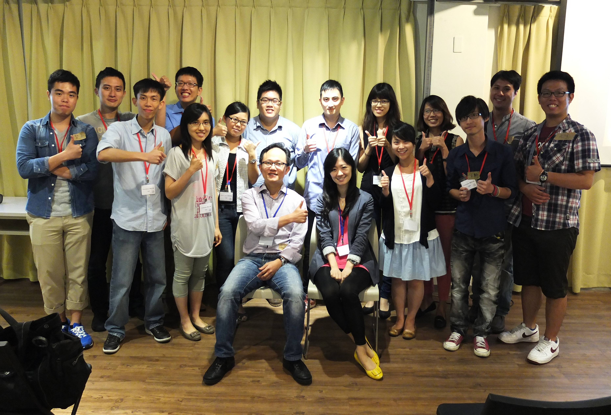

## **由在校經驗認識自己**

兩位經理都從自身的學歷還有做為社會新鮮人的那幾年談起，重要的並非有多顯赫的學位，而是在那些年，你對自己認識了多少。傅經理談到，他跟大家一樣，是生醫相關的背景，並且有研究所的學歷，但畢業之後卻不知道應該往哪一個方向走，出身在空軍飛官的家中，他曾經嘗試過參加航空公司機師的考試，並得到家人的支持，雖然過程中難以克服對於複雜機械操縱與壓力的恐懼，最後遭遇失敗，但卻從此上了一課，除了心中對自己的父親由衷的佩服，傅經理也回想到父親常提到的觀念──**勝任愉快**──事情必須要做的上手，才能做得愉快。 傅經理回到原點，試想自己至今的表現，是否可以看出自己擁有哪些不同於同儕的特性。傅經理分析，認為無論課內的學習、人際交往、社團活動，只要是她想要並且應該做的，都會全力以赴，讓所有的事情都維持著不錯的成果，也就是對於眼前的事情總是充滿熱誠。傅經理強調，很多公司逐漸不喜歡用新鮮人，因為常常新鮮人需要加倍的學習時間才能夠做到與有經驗者相當的貢獻，因此，沒有工作經驗的人，你的武器就是熱情。面試時，傅經理整理出她在社團活動裡的事蹟，用許多的故事證明她的能力與熱誠，讓她在面試官心中留下印象，順利得到第一份工作。傅經理強調，無論你的興趣是什麼，請都用心的投入，並且從中獲取價值。 傅經理也說到，在學校的日子，不一定有機會認識各行各業，無從知道自己到底喜歡什麼，但你可以知道自己「不喜歡」什麼。大學主修營養學的傅經理，在醫院實習時了解到這個工作並不適合自己，對她而言，醫院裡的營養師編制很小，升遷機會侷限，且病患的「菜單」也是由醫師的建議為主，營養師難以發揮，再加上薪資不高，沒有成就感；研究所時，傅經理做的是基礎醫學的研究，每天只能跟實驗動物還有細胞們對話，甚至三更半夜需要到實驗室照顧牠們，雖然當時的她十分投入研究，但比較起來，始終較喜愛與人互動。這段反省讓傅經理了解到自己是一個外向、喜愛溝通與創意、樂於挑戰、並且期待高薪與成就感回饋的人。在詢問前輩的意見後，她了解國際藥廠的業務代表一職正適合如她這般特性的社會新鮮人，醫藥業務的職涯旅程就此展開。

## **不斷反省 ＋ 擬定目標 ＋ 全力衝刺**

就如傅經理，邱經理的學涯分享也不在於得過幾次書卷獎，而是經過不斷的嘗試、挑戰與反省，來理解自己的優勢與特性。因為喜愛翹課而得到綽號「Chalk」的邱經理，首先分享了他為了到最高端的實驗室學習生物實驗而做的努力，他曾跑到中研院的走廊徘迴，只為了找到暑期實習生的機會，雖然順利進入知名外籍教授的實驗室，但卻因為英文不佳，太過痛苦，而換到別的實驗室做免費的工讀生，只求持續學習的機會。邱經理因為有這些經驗，最終如願以償有機會到交大生技所繼續學習他所喜愛的的生命科學，然而，在這一階段的真正收穫，卻是來自學術以外的感受，邱經理所待的實驗室是全新的，什麼都沒有，唯有依靠教授與當時的邱同學一步步取得所有研究器材，建立能夠做研究的環境，就在這個時期，邱經理發現他善於溝通與挑戰新事物的個性，似乎適合商業開發的工作，因此轉換跑道而到了企管研究所就讀，期間他也兼職做科專計畫的申請工作，從小計畫寫到大計畫，最後可以獨當一面，成為科專計畫申請的專家！而邱經理的下一步又是一個轉折，他到了知名的生醫產業數據分析顧問公司擔任客戶經理 ( Account Manager )，以學習行銷、資料探勘 ( Data Mining )，也希望藉此建立自己在業界的人脈和名聲，最後，才因緣際會的來到輝瑞，從助理產品經理開始，一步一步到今天的資深經理。邱經理的經歷是豐富且曲折的，他所要分享的概念是我們應該要好好面對自己的目標，並且花心思去達成，在他的經驗裡，我們也看到他的認真與反省的能力，從歷練裡了解自我，並且勇敢的調整步伐，往下一步前進，以填補自己的不足。

## **業務專員的每日點滴**

雖然每個人都知道有醫藥業務這個職位，卻不一定清楚他們每日的工作內容，兩位經理也詳細的分享了他們的經驗。經理們提到，許多疾病都有多種藥物可以選擇，因此要讓醫師選開你的產品，70%取決於藥廠所提供的「軟性服務」，因此面對醫師時，業務們一天的服務工作就包含準備早上的咖啡、中午配飯的飲料、門診所需要的物品、協助醫師尋找所需的期刊論文、安排演講活動、交通接送，甚至需要時常吸收最新的娛樂八卦消息與好吃好玩的好康，讓醫師排解高度壓力的生活。而面對公司內部，業務則需要接觸各個部門，如市場策略、市場准入、醫學、法務，甚至是財務與人資部門等都需要協調，讓你所負責的產品，在所有環節都得到最好的支持，以順利的銷售出去。因此藥廠所希望招募的業務代表，有無醫藥背景往往非主要的要求，但擁有銷售經驗則可以加分不少。經理們提到，業務代表，就像是產品的CEO，你需要細心、親和力、多功、組織協調、耐心與熱誠等，才能夠在這個崗位上有好的表現。

## **高淨利與高研發經費為製藥產業的特性**

談完自身的經歷，講者們接下來為聽眾帶來醫藥產業發展的近距離觀察，並敘述醫藥產業在台灣當前所面臨的現況，以下為邱經理的分享： 身為全球第一大藥廠，輝瑞的年營收總額約為 612 億美金，這樣的成績在全球五百大企業中僅僅位於第 148 名，大不如排名區居首位的石油產業；然而，輝瑞藥廠一年的利潤卻可達 14.6 億美金，擠身企業前 20 名。上述現象反映出製藥產業與一般其他產業大相逕庭，間接顯示出製藥業單位利潤高的特色，以輝瑞而言，其淨利占所有營收的比例高達近四分之一，在全球企業的排行因而晉身至第 11 位。此外，製藥產業的資產比例及所需的資金較高，需購置許多昂貴的製藥儀器及工廠，並投入大量的研究經費，因此淨利與資產的比值僅有 8%，遠低於研發取向的資訊產業。 製藥業便是利用高利潤來支撐龐大的研發費用，而後產出具市場價值的產品來成就整個銷售循環。

## **台灣醫藥產業的現況**

由於台灣健保給付涵蓋範圍完整，且多數民眾皆有加入健保，因此製藥產業的市場幾乎由健保局所掌控，導致整體藥品的銷售業績在近 5 年來幾乎未見明顯成長，甚至在 2011 年到 2012 年間還出現負成長；同時藥品價格在中央政策的限制之下，與日降低，造成外商藥廠在考量成本效益之後，可能不願在台灣上市新藥。 台灣民眾即便僅是小感冒仍至大型醫療院所就醫的特殊情形，也使得各家藥廠不約而同將業務著眼於醫療中心，這樣的現象在外商藥廠中尤為明顯，統計發現，大型醫療院所的藥品費用約占總額的 77%，印證了台灣民眾特殊的就醫習慣，其中，外商藥廠藥品的銷售額占了八成以上，這不但是因為大型醫療院所擁有較多重症患者，而須使用費用較高昂的藥品，亦可看出多數台灣民眾偏好使用原廠藥治療；反觀基層診所更為利潤導向、更在意藥品的費用，而本土藥廠通常能夠給予較低的價格，故台灣基層診所，則是使用本土藥廠的藥品為主。

## **製藥產業在台灣的未來發展**

比較台灣各藥廠的市占率發現，前十大皆為外商藥廠，而輝瑞雖居各家之首，近來成長率卻大幅下滑了 7.8%，細究原因發現，銷售業績最好的前幾項藥品之銷售數量雖然屢創新高，但在健保局不斷壓縮藥品售價的政策之下，業績卻是不升反降；台灣最大的本土藥廠永信的市占率雖然僅有 2.2%、排名為第 11 位，但成長率高達 10%，由此可見，目前台灣的健保制度較有利本土藥廠的發展。此外，近年來外商藥廠紛紛遭遇產品專利到期的問題，學名藥的市場隨之崛起，其成長速度也逐漸增加，對此，外商藥廠也積極擬定付費者導向的策略，希望在這場原廠藥與學名藥的戰役中，保有一席之地。 不同類別的產品，擁有不同的特性，心血管疾病等大眾用藥，即使患者數眾多，卻因藥品價格低廉、受到許多政策的限制，又加上經過長期研究，創新研發越趨困難，造成業績節節敗退；另一方面，由於台灣政策及法規對癌症用藥的總額較無限制，使得這類藥品的患者數雖少、單價卻高，在市場上占有不可或缺的特性，未來將展現舉足輕重的腳色，對此，具有研發能力的外商藥廠也將角逐這類藥品在市場上所釋出的大餅，有鑑於這類藥品的研發技術較為專門，許多大藥廠也開始併購具有特殊研發技術或產品的生技公司，以增加自身的“戰鬥力＂。

## **中國製藥產業急速成長**

相較於台灣製藥產業幾乎持平的成長率，中國製藥產業在過去 5 年以 25% 的速率快速成長，並預估在未來 5 年至少達到 16.7% 的成長率，此外，中國地區最具潛力的藥品類別則是感染科及癌症用藥，顯示不同地區的產業狀況並無法一概而論，經營方式也須因地制宜。 由於台灣與中國就業市場的流通度高，對欲投入製藥產業工作的台灣新鮮人，更應及早培養自己的能力及競爭力，同時瞭解地區產業的特色與需求，為未來的機會做好最充分的準備。

## **困境下的生存之道**

如以上的分析，近年來環境的巨大變動，如健保藥價管理改制、藥品銷售規範建立，業務代表的工作比起以往有更多的挑戰，產品更難銷售，因此每一位產品經理所分配到的產品品項、客戶與區域就會比以往更多，如今已經沒有簡單的工作可言，競爭來自各處，每天都有大大小小的事情需要快速安排與嚴謹的執行，確實是十分具有難度的工作。 雖然挑戰巨大，經理們也提出了建議，如何讓成功來的更容易。經理們提到「環境在改變，我們必須站在改變的浪頭」，即是應變要比改變還快，才能夠領導改變。例如，對於業務新鮮人而言，雖然實戰經驗較少，但若能利用優勢發揮創意，如年輕人對於電腦程式應用較熟悉的能力，做出比前輩更棒的銷售資訊報表，就可以在眾多資深前輩中脫穎而出，展現影響力。當然，作為新鮮人，我們也務必要讓上司看到自己的熱誠，例如報名周末的大學進修管理學程，另外也要表現出對於部門與上司的忠心，主管才會對你充滿信心。

## **對新鮮人的忠告**

面對險峻的環境，每個業務所會遇見的問題與麻煩各有不同，要如何在這樣的情況下做為公司裡最有價值且最有獲利能力的員工？員工本身的特性就佔了更重要的位置，傅經理提到，在工作面試時，最常問到的三項問題是，一．你是否有任何正面影響他人的作為？二．你是否有團隊合作並且得到好結果的經驗？三．請分享你面對困難與挑戰，並成功解決的經驗。可以看出公司對於業務人員正面能量、解決問題和團隊合作等能力的重視。在通往成功的路徑中，我們發現自我反省、努力達成目標、遇見趨勢、利用創意解決問題的能力缺一不可。在劇變的時代投入劇變的產業，經理們提醒大家，請務必盡早積極準備，當機會來臨，才有發揮的舞台！

