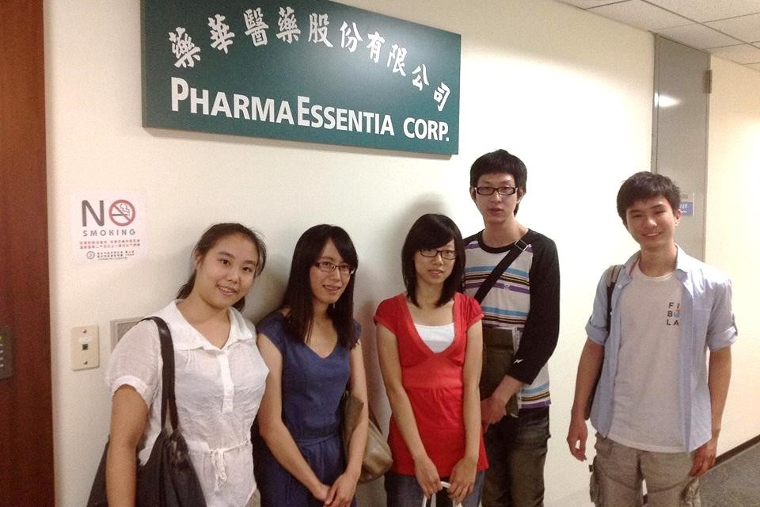
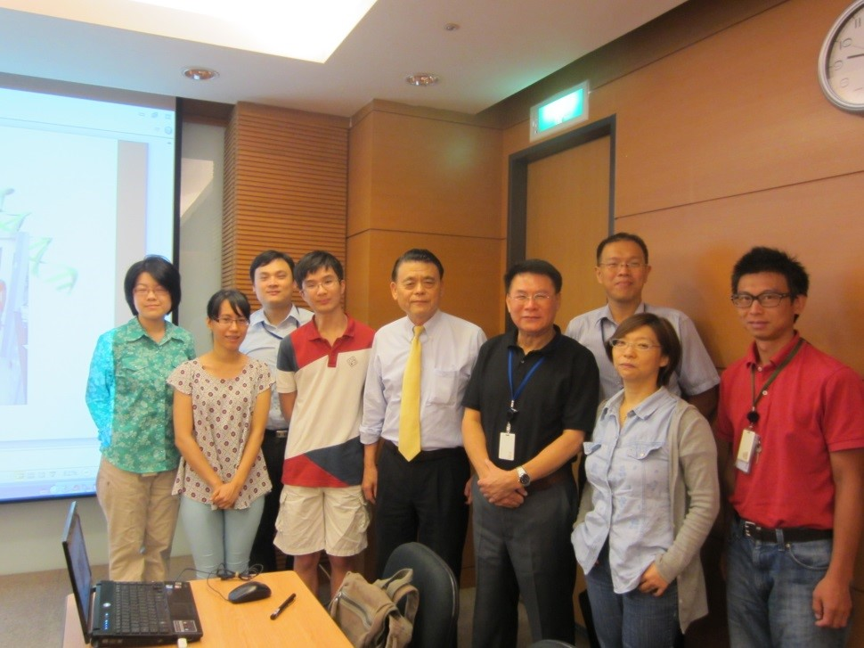

## **實習公司及部門簡介**

藥華醫藥股份有限公司(PharmaEssetia)，於2000年開始籌備，並於2003年正式營運，是一個以台灣為基地從事新藥研發、試驗及生產的公司。藥華醫藥利用其獨特的PEGylation技術平台，致力於長效型蛋白質新藥的開發，而目前開發中的藥物含括許多領域，包括：血液疾病 (血液增生疾病、白血球缺乏症及貧血)、病毒感染疾病 (B型肝炎及C型肝炎)、皮膚疾病 (銀屑病) 及自體免疫疾病 (多發性硬化症)，是非常有前景的一間藥廠。而目前公司主打的新一代PEG長效型α干擾素新藥 (產品代號P1101)，已於2010年在加拿大完成第一期臨床試驗，而目前進行的人體試驗包含罕見血液增生疾病，例如慢性骨髓細胞性白血病、血小板增生症及真性紅血球增生症等，2009年授權給奧地利的AOP公司治療罕見血液增生疾病，並於2011及2012分別獲得歐盟 EMA 及美國 FDA 孤兒藥資格認定，在治療真性紅血球增生症上，則已著手進行第三期人體臨床試驗。

在藥華醫藥為期六周的實習期間，第一周是以課程的方式，介紹每個部門的工作內容，分別為臨床試驗、GMP規範、專利申請、QC/QA、小分子藥物、哺乳動物表達系統及董事長的經驗分享，而公司也會請每個部門的主管詳細的為我們介紹藥廠的部門及工廠部分，若有任何的問題也都可以直接詢問部門主管，對於在學或是即將畢業的學生，都是很好的學習管道及經歷。

**如何獲得這個機會**

過去在大學期間，由於學校鮮少與業界簽約合作，因此較難找到相關實習機會，而陽明大學蛋白質轉譯中心，以教育部「轉譯醫學及農學人才培育先導型計畫」和業界合作，並簽訂許多實習計畫，首先會由學校進行初步的篩選，繳交的資料包括個人資料、成績單、專題經歷等等，最後則將名單送交至藥華醫藥，等候實習通知。 除了在大學期間所參與的社團活動，能夠訓練團隊合作及口才，在研究所期間，把握機會並積極參與新藥相關課程，則是讓我踏入這門領域的最大關鍵。2011年，參與了由中研院、財團法人生物科技教育基金會(BTEF)及生技醫藥國家型科技計畫(NRPB)所共同舉辦的「生技藥物之開發與管理-培訓課程」，並邀請國際藥物開發顧問公司Kinesis來開授此次課程，從臨床試驗到專案管理，並針對不同時期所遇到的可能問題給予概念及建議，這也是我第一次接觸到新藥開發的相關課程。 我想：**「積極」**，是獲得實習機會的最重要關鍵，如果沒有修習過相關課程，或許我不知道我會不會對新藥的領域有興趣，如果沒有去注意陽明大學所提供的實習機會，我也不會有機會在這邊分享實習心得，如果我沒有向老師提出實習得申請，我也不會知道在畢業前夕能有實習的機會，機會是自己去爭取的，如果你積極地搜尋產業實習，並果斷的投出申請表，機會就是你的。 2014 暑期實習資訊:Click [Here](/posts/2014-summer-internship-opportunity/)

## **實際工作內容與收穫**

 藥華醫藥的實習第一周由各部門主管為我們講解每個部份的工作內容，而第二週至第六週則是進入蛋白質新藥研發部門操作相關實驗。另一位實習生是進入QC部門學習相關儀器操作及邏輯，而我則是進入細胞株開發組，操作分生實驗及細胞培養等相關技術。 在藥華醫藥實習有一個很大的好處，你能看到公司研發部門的整個運作及流程，並有機會進行直接接觸，對於了解藥廠的結構及部門有很大的幫助。在藥華醫藥實習期間，帶我的主管給了我很多機會去接觸不同的實驗，包括細胞株的維持、Electroporation test、及建立檢驗病毒株的PCR assay等。 和實驗室很不一樣的地方是，在藥廠研發部，很講求紀錄，你所使用的buffer或medium都要詳細的紀錄藥品的Lot number、Catalog number、名稱及保存期限，且不能使用修正帶，若有任何的更動，皆須簽名註記。在分析實驗數據上，也有許多差異之處，在實驗室進行蛋白質純化時，只要其純度大於90%，對我們來說就已很足夠，然而在藥廠，不純的那1%，卻是非常的重要，除了要利用不同的機器去分析不純物以外，也需做各種測試，看此不純物是否會有其他影響，這些想法及概念和在實驗室操作實驗有著截然不同的地方，對我來說，也是非常好的經驗。

## **給想實習的人的建議**

在藥華醫藥實習的過程中，我認為最重要也最應具備的條件就是**「態度」**。聽從主管給你的任務，並認真的去實踐，很多時候，我覺得態度決定了一切；許多人對於工作有著自己的要求，是否能準時上下班，壓力會不會很大，事情是不是很多，又或者要做許多自己工作外的雜事，以第一份工作來說，或者以實習經驗來說，你是本著學習的心態去參與，那就不要怕麻煩，怕雜事，多做就是多學，這是我在實習過程中，最能體驗到的一句話。 

 撰稿者：王慧芳，曾就讀於台南女中、中央生命科學系、陽明基因體科學研究所，目前於藥華工作。在高中時期，參與演辯社，對於邏輯思考及訓練有著很大的幫助，而在大學期間，擔任過課輔志工以及解說員，無論是在表達能力及口才，都有著清楚的邏輯。由於對實驗有著熱忱，在研究所期間則曾在國際研討會以海報的形式分享研究成果。隨著畢業的逼近，對於未來也充滿了不確定感，為了瞭解生技產業及藥廠，參加陽明蛋白質轉譯中心所舉辦的實習課程，並對藥廠有進一步的認識。

Connectome 在部落格建置了實習故事專區，我們號召有參與產業實習經驗的朋友撰文分享自己的經歷。我們相信，有更多人的分享、關注，將可帶來更多討論！  填寫問卷，一起分享自己的實習故事：[【實習分享計畫】](/posts/intership-sharing-recruit/)
