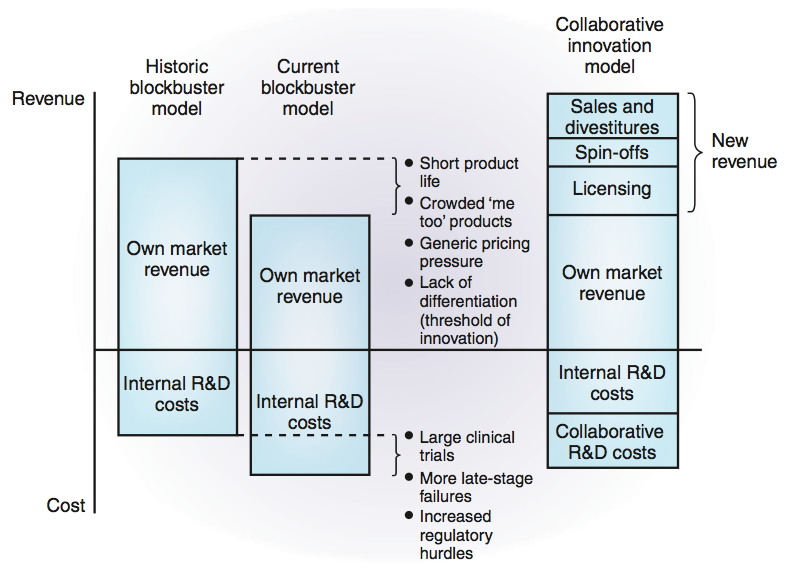

[](img-1-292962_485030584854611_1113610121_n-e1347386451152.jpg)

<span style="color:#888888">夏日週末炎熱的午後，筆者滿懷期待來到深藏在政大公企中心的小角落。熱情的工作人員及悠閒典雅的佈置，透露著今日演講活動的輕鬆氣息。主持人簡短地介紹後，面帶微笑的雷博士開始他的分享。</span>

## **<span style="color:#333399">個人簡歷</span>**

高中到博班都在美國深造的雷博士，大學時為了較高的收入(年收入五到七萬美金)選擇化工系，並於南加大研讀博士學位。博班專攻兩方面，一是利用病毒載體攻擊特定細胞發展基因療法，二是改造病毒載體來增加其針對目標基因的精確性。博班訓練讓雷博士在目前工作能以較廣的角度分析計畫，但他也坦承當時所學與目前所用並無太多雷同。

## **<span style="color:#333399">安成研發部門現況</span>**

目前雷博士在職的安成生物科技股份有限公司，是安成國際藥業2010年成立的子公司，屬於虛擬公司 (virtual company1)，不從事任何研究開發，採取與其他學術研究單位共同研發或購買外界研發潛力藥物 (licensing in) 的策略。公司通常負責美國食品藥物管理局 (Food and Drug Administration, FDA) 規定的繁複測試，因為那些通常是學研單位覺得無法發表好期刊而不願進行的實驗，如毒理學測試。待藥物測試至一定階段，再轉賣授權 (licensing out)給更大的藥廠 (big pharma) 或生技單位進行後期更大量的臨床測試，賺取權利金 (royalty) 及階段性付款 (里程金；milestone payment)。公司主要目標是針對市場尚未滿足醫療需求的新藥。目前共六個計畫正在進行，小分子和大分子藥物的計畫各三。

## **<span style="color:#333399">產學界差異及產業界趨勢</span>**

產學界最大的差異在於，學界只要專注自己的題目，完成單一題目並且對單一指導教授商討即可，但<span style="color:#800000">業界必須同時處理多個計畫，各個領域的知識不必深但要廣</span>，並對來自學術、商業及不同領域的教授、上司和老闆負責，需以多方角度分析及寬闊的視界才能處理得當。這些差異，可作為考量進入產學界的方針。若是想要專注於挑戰單一未知領域，可考慮學界；若想要同時挑戰多方面的難題，可考慮業界。

對此，身為過來人的雷博士奉勸大家想想「**你真的要知道你要的是什麼！**」同時也強調，「博士學位並不能保證找到一個好的工作！」此話怎說？雷博士針對美國生技產業工作中，不同學歷的年薪及得到學歷所花費的時間進行比較：大學生耗時四年，每個人皆可找到四萬五到五萬美金的工作；碩士多花一到兩年，可多賺一、兩萬；博士多花五到七年，但只有某部份人可以找到學界七、八萬的工作，大部份都無法找到業界工作而選擇從事博士後，但博士後薪資卻和大學畢業差不多。這也是雷博士選擇進入產業界工作的原因。

 <span style="color:#888888">圖一. 生醫藥業現今研發現況及未來趨勢。</span>

為何博士學歷會找不到工作呢？雷博士引用 *Nature* *Medicine* 的文章來解釋（圖一）2。以往美國藥廠本身有內部研發部門，藥劑單價高且競爭對手少。然而，近年越來越多人進入同個市場，許多 ”me too” 產品誕生，大藥廠與小藥廠彼此競爭，因產品類似而無法區隔，藥物的創新越來越難，營收因而減少。此外，晚期藥物測試失敗的案例漸增，美國法規審核新藥的條件日趨嚴格，導致藥廠需進行更多臨床實驗，被迫增加內部研發支出。淨利減少的慘況讓許多公司從 2008 年起對研發部門大量裁員，裁員導致人力市場上充滿了多年工作經驗的人才，剛畢業的學生因為要與這些人競爭，所以更難找到工作。藥廠面對這樣的嚴峻局勢，也紛紛轉型。除了利用資產銷售（Sales and divestitures3）、技轉授權（Licensing）和資產分割（Spin-offs4）的策略增加營收，同時也和學研單位或國外廠商合作研發來減少內部研發支出，由這個狀況也可看出，<span style="color:#800000">業界所提供的職缺只會越來越少</span>。

### 

## <span style="color:#333399">**業界工作需求及求職祕訣**</span>

從學界跨到業界的雷博士對於業界工作的需求提出見解：<span style="color:#800000">專業領域的背景知識是基本的，加上好的邏輯概念和多方角度的思考能力才可說服學界教授及業界老闆，以及流利的中英文溝通能力也很必要</span>。

此外，雷博士對仍在求學的聽眾提出三個建議。第一，不要害怕失敗，失敗是學習的契機。雷博士提到他在博班就常面臨失敗，比別人多花時間，但也因此嘗試不同的技術和領域方向，反倒讓現在檢視計畫時有更多面向去思考。第二，不要害怕問問題。不要只聽信教授的話，因為他不一定是完全正確的，有時可以多問問其他的學長姐，或參考借鑑其他間實驗室的意見。第三，要懂團隊合作。最好從學校中就開始嘗試跟不同領域的人合作，當面臨瓶頸時，可尋求其他的團隊合作解決。

最後，雷博士傳授幾個求職的祕訣 - <span style="color:#800000">最好能到業界實習</span>，因為剛畢業的學生不會懂公司想要什麼，但實際接觸過後就能理解如何在面試時說服公司。若教授不願讓學生去實習，可以考慮進入產學合作的實驗室，通常該教授會比較了解業界狀況，也能透過產學合作的經驗更瞭解業界所需。最後是，要把握任何機會。第一份工作不代表是最後一份工作，先求有，再找尋下份工作的機會。

## **<span style="color:#333399">引用文獻及註解</span>**

<span style="color:#333333">1. **Virtual company. 虛擬公司**。指日常工作利用各種通訊設備與員工或合作公司執行其業務的公司。本身掌握關鍵核心技術，其餘研發或生產工作採取外包的形式的公司。優點是可降低現金壓力，以較低營運成本創造更強競爭能力，亦可靈活運用整合需要的全球各種資源。</span>

<span style="color:#333333">2. Melese, T., Lin, S. M., Chang, J. L. & Cohen, N. H. Open innovation networks between academia and industry: an imperative for breakthrough therapies. *Nature Medicine* 15, 502–507 (2009).</span>

<span style="color:#333333">3. **Sales and divestitures. 資產銷售**（asset sales）為資產回溯性的一種方式， 提供公司經理人可以將表現不佳的投資資產予以處份變賣，改善資產流動性及投資效率。</span>

<span style="color:#333333">4. **Spin-offs. 資產分割**；分拆。公司將資源和某個部門分割出來，另行成立一家新公司，再將新公司股份按原有股東持股比例分配。優點是，主公司和新公司的股份可獨立買賣，若分出的新公司較有成長潛力，可吸引更多投資。新公司也可不受以往公司傳統窠臼限制，有可能實行較新穎的策略。</span>

## **<Q&A 節錄>**

**Q：生物資訊科系在美國就業市場的狀況如何？**

A：2009年生物資訊是美國工作的大熱門。原因是先前藥廠運用電腦程式預測模擬藥物設計不夠有效，導致許多新藥開發失敗。

**Q：聽聞加州經濟狀況不佳，是否影響國際學生人數？**

A：加州學校國際學生的人數逐年下降且補助很少。以南加大為例，學費全免，一年另外補助兩萬生活費，而 UCLA 則是可選擇只付學費或只付生活費。

**Q：美國和台灣的學生能力上有何差別？**

A：學識背景沒有差異，唯獨美國學生質疑問題能力較強。一開始看不出差異，但計畫進行一半之後就會發覺質疑問題能力的重要性。

**Q：博班訓練對業界工作最有幫助的是甚麼？**

A：邏輯能力的加強和分析事情的角度增廣。因為碩士看事情理解不夠深，角度不夠廣，沒有足夠學術背景能說服教授，變成只是公司和教授之間的傳話者，無法直接與教授平行溝通。因此，目前安成公司招募的都是博士人才。

**Q：台灣博士若想去美國工作，以病毒載體的背景來說，有何建議？**

A：有些小的生技公司正往病毒載體發展，前幾個月歐洲也有病毒的藥物通過審核。但現在美國公司工作空缺只有大學背景的實習生，但也無法確定藥廠工作空缺趨勢。2005 年時藥廠有許多空缺，因此即使沒有工作經驗也可以當管理計畫的角色，但到 2008 年時，大部份的人都無法找到工作。多少與大環境有關係。

**Q：即使基因療法個體療效變異很大，藥廠是否會願意開發？**

A：歐洲已有病毒的藥物上市，美國默克公司在 2000 年前後也有開發類似藥物，安成沒有做基因療法，但也有在做疫苗。即使療效變異大，但效果是持久的。目前仍有法規疑慮，因此生技公司比較保守，但也有往這方面發展。

**Q：博班該如何訓練自己，提高進入業界工作機率？**

A：時運一樣很重要。此外，可訓練第二專長，如：申請專利的經驗，或降低薪水要求。

**Q：博班進行產學合作計畫的可能性？**

A：可詢問有產學合作的教授能否加入計畫或否需要幫忙，進而從中學習。目前產學兩界代溝極大，若能在博班有產學合作的經驗，可對業界求職有很大幫助。美國有較多實習機會，因為很多公司會向教授索求實習學生，教授也會透過學生增加自己聲譽名氣。

**Q：若時光倒流，博班會多做什麼嘗試？**

A：了解自己未來的目標及方向，選擇一個與產業有連結的老闆對進入業界會有相當程度的加分。多學一些商業知識，因為將學術和產業結合是最終歸途。

**Q：剛提到公司收入主要是靠權利金及階段性付款，這樣狀況下如何確保公司營收？**

雷學長A: 簡而言之就是燒錢。同時手上有數個計畫，而每年預計一個計劃會賣出，只要有一個成功，該年就是穩定的。若沒有任何成功，則會倒閉。

黃學姐A：無法確保營收。穩定營收來源之一是政府的補助，一年幾百萬或一千萬甚至曾經上億元。雖少，但至少穩定，其他要仰賴老闆出資。一般公司一次只審核兩個案子，但安成比較特別，一次審六個案子，因為覺得成功率通常只有十分之一。其實，最有可能的結果就是倒閉，這就是新藥開發最有趣也最可怕的地方。但不要擔心公司倒閉，因為倒閉不是員工的問題。案子再漂亮，試驗再完美，真正的藥物效果都要等施用在人身上才能確定。而倒閉後，下間公司會更願意錄用你，因為已經了解整個程序，明白哪些細節該注意才不會失敗。

**Q：安成公司審核案子IP智財保護狀況時，有什麼標準？**

黃學姐A：以蛋白質或化合物來說，要有期限內的專利母案，才能繼續往下執行計畫。一般需要申請兩個國家的專利，強烈建議選擇 PCT (Patent Cooperation Treaty; 國際專利合作條約) 和美國。但因 PCT 較貴，學術計畫的專利補助很少，大部份的人都選美國和台灣，或是 PCT 加上台灣，因為 PCT 也包含美國。

<span style="color:#888888">- 本篇為雷佑甯學長在 Connectome 9月2日「生技人，工作藥不藥」職涯沙龍的分享整理 - </span>

<span style="color:#993300">分享者：雷佑甯博士，美國南加大化工所畢業。憑著一顆好奇心踏進生醫世界，專長為基因治療以及病毒工程，高度抗壓的特質是他能在新藥研發競爭中悠然自得的利器；電動漫畫則是他紓壓的絕佳工具！人生最大目標,是希望能在20年內擁有自己的事業！</span>

```
 
```
